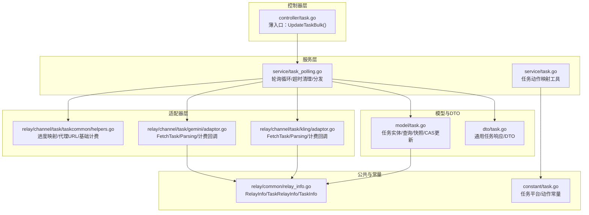
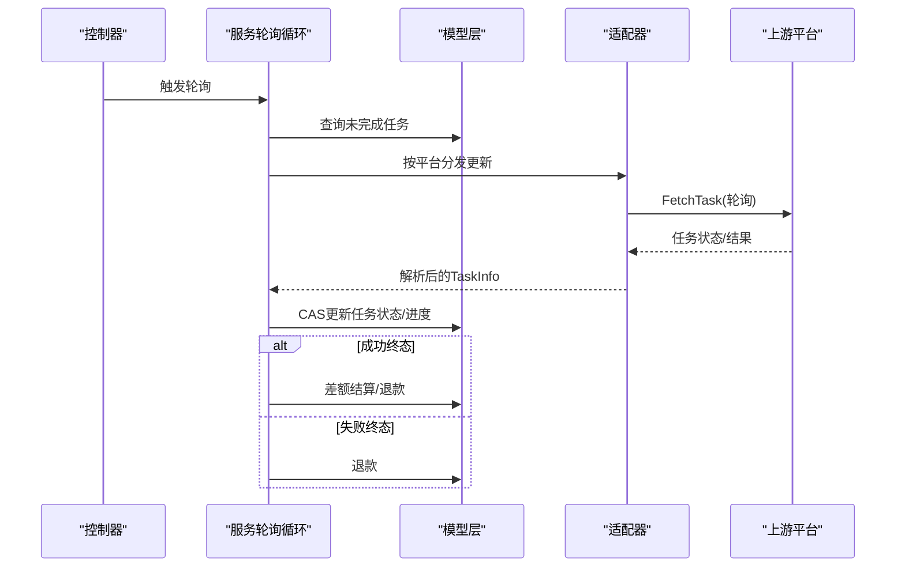
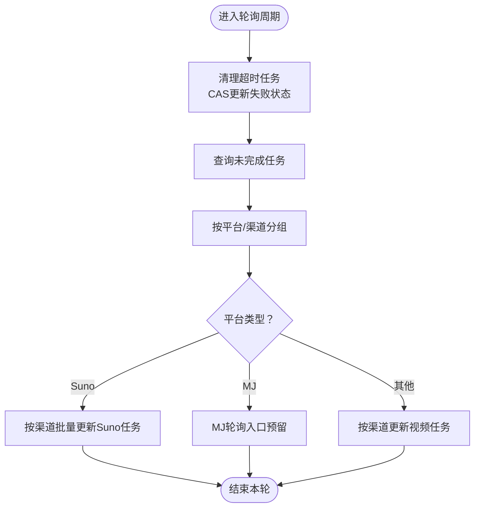
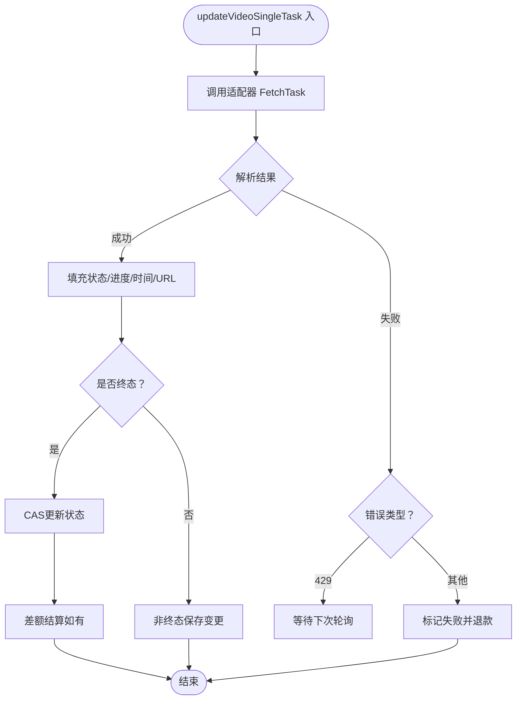
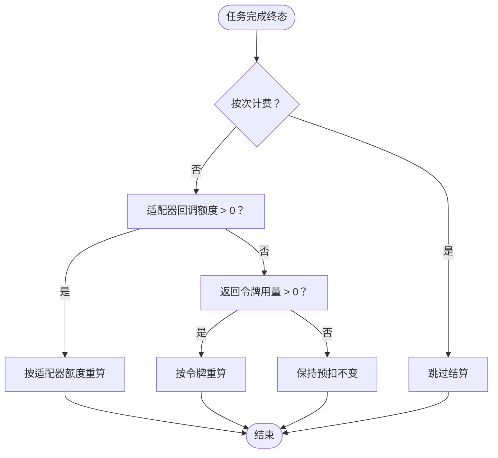
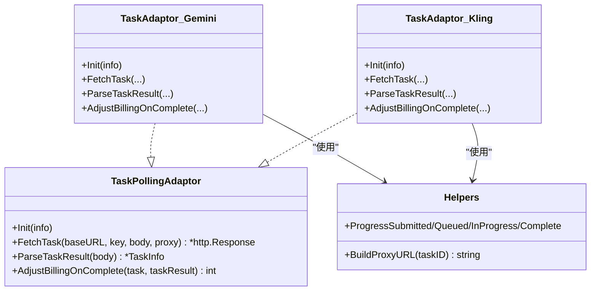
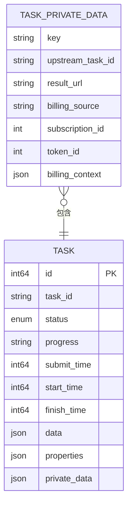
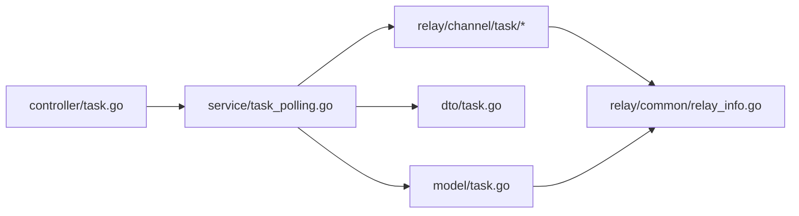

# 任务服务

<cite>
**本文引用的文件**
- [service/task_polling.go](file://service/task_polling.go)
- [service/task.go](file://service/task.go)
- [model/task.go](file://model/task.go)
- [constant/task.go](file://constant/task.go)
- [dto/task.go](file://dto/task.go)
- [controller/task.go](file://controller/task.go)
- [relay/channel/task/taskcommon/helpers.go](file://relay/channel/task/taskcommon/helpers.go)
- [relay/channel/task/gemini/adaptor.go](file://relay/channel/task/gemini/adaptor.go)
- [relay/channel/task/kling/adaptor.go](file://relay/channel/task/kling/adaptor.go)
- [relay/common/relay_info.go](file://relay/common/relay_info.go)
- [service/task_billing_test.go](file://service/task_billing_test.go)
</cite>

## 目录
1. [简介](#简介)
2. [项目结构](#项目结构)
3. [核心组件](#核心组件)
4. [架构总览](#架构总览)
5. [详细组件分析](#详细组件分析)
6. [依赖关系分析](#依赖关系分析)
7. [性能考量](#性能考量)
8. [故障排查指南](#故障排查指南)
9. [结论](#结论)
10. [附录](#附录)

## 简介
本文件面向开发者，系统化阐述任务服务模块的异步任务处理、状态管理与结果获取的完整实现。内容覆盖任务队列管理、状态轮询机制、超时处理与重试策略、任务生命周期管理、进度跟踪、结果缓存与代理访问、核心方法实现、并发控制与性能优化、任务类型分类与调度、资源分配算法、监控与异常恢复、清理机制以及扩展方法。目标是帮助读者快速理解并高效扩展任务服务。

## 项目结构
任务服务位于 service 层，围绕轮询循环、适配器接口、模型层与 DTO 展开，控制器提供薄入口对接轮询循环。不同上游平台通过适配器实现统一的 FetchTask/Parsing/计费回调接口，保证对 service 层的透明性。

图表来源
- [controller/task.go:17-20](file://controller/task.go#L17-L20)
- [service/task_polling.go:90-138](file://service/task_polling.go#L90-L138)
- [model/task.go:44-66](file://model/task.go#L44-L66)
- [dto/task.go:22-53](file://dto/task.go#L22-L53)
- [relay/channel/task/taskcommon/helpers.go:63-75](file://relay/channel/task/taskcommon/helpers.go#L63-L75)
- [relay/channel/task/gemini/adaptor.go:182-244](file://relay/channel/task/gemini/adaptor.go#L182-L244)
- [relay/channel/task/kling/adaptor.go:218-373](file://relay/channel/task/kling/adaptor.go#L218-L373)
- [relay/common/relay_info.go:655-762](file://relay/common/relay_info.go#L655-L762)
- [constant/task.go:5-24](file://constant/task.go#L5-L24)

章节来源
- [controller/task.go:17-20](file://controller/task.go#L17-L20)
- [service/task_polling.go:90-138](file://service/task_polling.go#L90-L138)
- [model/task.go:44-66](file://model/task.go#L44-L66)
- [dto/task.go:22-53](file://dto/task.go#L22-L53)
- [relay/channel/task/taskcommon/helpers.go:63-75](file://relay/channel/task/taskcommon/helpers.go#L63-L75)
- [relay/channel/task/gemini/adaptor.go:182-244](file://relay/channel/task/gemini/adaptor.go#L182-L244)
- [relay/channel/task/kling/adaptor.go:218-373](file://relay/channel/task/kling/adaptor.go#L218-L373)
- [relay/common/relay_info.go:655-762](file://relay/common/relay_info.go#L655-L762)
- [constant/task.go:5-24](file://constant/task.go#L5-L24)

## 核心组件
- 轮询循环与超时清理：定时扫描未完成任务，清理超时任务并执行平台分发更新。
- 适配器接口：抽象 FetchTask/FetchTaskResult/AdjustBillingOnComplete，屏蔽上游差异。
- 模型层：任务实体、查询、快照、CAS 更新、计费上下文与私有数据。
- DTO 与控制器：统一响应结构、分页查询、薄入口触发轮询。
- 进度映射与代理 URL：标准化进度字符串，构造代理访问路径。
- 计费结算：按适配器回调优先、其次按令牌重算、最后保持预扣不变。

章节来源
- [service/task_polling.go:24-36](file://service/task_polling.go#L24-L36)
- [model/task.go:44-118](file://model/task.go#L44-L118)
- [dto/task.go:22-53](file://dto/task.go#L22-L53)
- [relay/channel/task/taskcommon/helpers.go:63-75](file://relay/channel/task/taskcommon/helpers.go#L63-L75)
- [service/task_polling.go:538-561](file://service/task_polling.go#L538-L561)

## 架构总览
任务服务采用“控制器薄入口 + 服务轮询 + 适配器抽象 + 模型持久化”的分层设计。控制器仅负责触发轮询循环；服务层负责任务状态推进、计费结算与退款；适配器负责与上游交互与结果解析；模型层提供强一致的 CAS 更新与计费上下文快照。

图表来源
- [controller/task.go:17-20](file://controller/task.go#L17-L20)
- [service/task_polling.go:90-138](file://service/task_polling.go#L90-L138)
- [service/task_polling.go:290-342](file://service/task_polling.go#L290-L342)
- [service/task_polling.go:344-502](file://service/task_polling.go#L344-L502)
- [model/task.go:404-417](file://model/task.go#L404-L417)

## 详细组件分析

### 轮询循环与超时清理
- 轮询间隔：固定休眠 15 秒后执行一次。
- 超时清理：按配置的超时分钟数计算截止时间，批量拉取未完成任务，逐条执行 CAS 更新为失败并标记完成时间与原因；对非遗留任务且存在预扣额度时触发退款。
- 主循环：拉取所有未完成任务，按平台分组，再按渠道聚合上游任务 ID，调用对应平台更新函数；若上游任务 ID 为空则批量标记失败。
- 平台分发：默认视频类任务走统一更新流程，特定平台（如 Suno/MJ）预留入口。

图表来源
- [service/task_polling.go:90-138](file://service/task_polling.go#L90-L138)
- [service/task_polling.go:38-88](file://service/task_polling.go#L38-L88)

章节来源
- [service/task_polling.go:90-138](file://service/task_polling.go#L90-L138)
- [service/task_polling.go:38-88](file://service/task_polling.go#L38-L88)

### 任务状态推进与进度映射
- 单任务更新：根据适配器返回的 TaskInfo 设置状态、进度、开始/完成时间、失败原因与结果 URL；对 data 字段进行脱敏与裁剪，避免敏感信息泄露。
- 进度映射：根据状态映射到标准化进度字符串（提交/排队/处理中/完成）。
- 终态处理：成功时设置 100% 进度与代理 URL；失败时设置 100% 进度并触发退款。
- CAS 更新：仅在状态或关键字段发生变更时执行 CAS 更新，避免覆盖其他进程已推进的状态。

图表来源
- [service/task_polling.go:344-502](file://service/task_polling.go#L344-L502)
- [relay/channel/task/taskcommon/helpers.go:69-75](file://relay/channel/task/taskcommon/helpers.go#L69-L75)

章节来源
- [service/task_polling.go:344-502](file://service/task_polling.go#L344-L502)
- [relay/channel/task/taskcommon/helpers.go:69-75](file://relay/channel/task/taskcommon/helpers.go#L69-L75)

### 计费结算与退款
- 结算优先级：适配器回调返回正数额度则按该值重算；否则若返回令牌用量则按令牌重算；否则保持预扣不变。
- 按次计费：若任务为按次计费，则跳过结算。
- CAS 保护：终态变更采用 CAS，防止并发覆盖；若 CAS 失败则跳过计费，避免重复退款或重复结算。
- 退款触发：失败终态且存在预扣额度时触发退款。

图表来源
- [service/task_polling.go:538-561](file://service/task_polling.go#L538-L561)
- [model/task.go:110-118](file://model/task.go#L110-L118)

章节来源
- [service/task_polling.go:538-561](file://service/task_polling.go#L538-L561)
- [model/task.go:110-118](file://model/task.go#L110-L118)

### 适配器接口与实现
- 接口职责：Init、FetchTask、ParseTaskResult、AdjustBillingOnComplete。
- 通用辅助：进度映射、代理 URL 构造、基础计费空实现。
- 具体实现：
  - Gemini：通过操作名编码/解码作为任务 ID，GET 操作查询状态，解析 Done/Error/Progress。
  - Kling：GET 任务状态，解析 submitted/processing/succeed/failed，提取 URL 与令牌用量。

图表来源
- [service/task_polling.go:24-36](file://service/task_polling.go#L24-L36)
- [relay/channel/task/gemini/adaptor.go:29-40](file://relay/channel/task/gemini/adaptor.go#L29-L40)
- [relay/channel/task/kling/adaptor.go:114-127](file://relay/channel/task/kling/adaptor.go#L114-L127)
- [relay/channel/task/taskcommon/helpers.go:63-75](file://relay/channel/task/taskcommon/helpers.go#L63-L75)

章节来源
- [service/task_polling.go:24-36](file://service/task_polling.go#L24-L36)
- [relay/channel/task/gemini/adaptor.go:29-40](file://relay/channel/task/gemini/adaptor.go#L29-L40)
- [relay/channel/task/kling/adaptor.go:114-127](file://relay/channel/task/kling/adaptor.go#L114-L127)
- [relay/channel/task/taskcommon/helpers.go:63-75](file://relay/channel/task/taskcommon/helpers.go#L63-L75)

### 模型层与数据结构
- 任务状态：NOT_START/SUBMITTED/QUEUED/IN_PROGRESS/SUCCESS/FAILURE/UNKNOWN。
- 实体字段：公开任务 ID、平台、用户、渠道、状态、进度、时间戳、失败原因、属性与私有数据。
- 私有数据：包含上游任务 ID、结果 URL、计费来源与上下文快照。
- 计费上下文：模型价格、分组倍率、模型倍率、附加倍率、原始模型名、是否按次计费。
- 快照与 CAS：Snapshot/Equal 用于比较变更；UpdateWithStatus 使用 WHERE 状态守卫的 CAS 更新，避免并发覆盖。

图表来源
- [model/task.go:44-118](file://model/task.go#L44-L118)

章节来源
- [model/task.go:44-118](file://model/task.go#L44-L118)

### DTO 与控制器
- DTO：统一任务响应结构、任务错误、任务 DTO 字段。
- 控制器：薄入口 UpdateTaskBulk 调用服务层轮询；提供用户与全局任务列表查询与分页。

章节来源
- [dto/task.go:22-53](file://dto/task.go#L22-L53)
- [controller/task.go:22-67](file://controller/task.go#L22-L67)

### 任务类型分类与调度
- 平台与动作：平台包括 suno/mj；动作包括 generate、textGenerate、firstTailGenerate、referenceGenerate、remixGenerate 等。
- 动作到模型名映射：服务层提供将平台与动作组合为小写形式的工具方法，便于路由与日志。

章节来源
- [constant/task.go:5-24](file://constant/task.go#L5-L24)
- [service/task.go:9-11](file://service/task.go#L9-L11)

### 并发控制与性能优化
- 轮询频率：固定 15 秒一次，避免频繁轮询造成上游压力。
- 请求节流：视频类单任务轮询之间增加 1 秒延迟，降低上游限流风险。
- 批量更新：超时清理与失败修复使用批量更新，但注意批量更新无 CAS 保护，仅用于非计费关键路径。
- CAS 保护：状态终态变更采用 CAS，确保并发安全与一致性。
- 日志与监控：轮询前后记录系统日志，便于问题定位与性能观测。

章节来源
- [service/task_polling.go:90-138](file://service/task_polling.go#L90-L138)
- [service/task_polling.go:338-340](file://service/task_polling.go#L338-L340)
- [service/task_polling.go:420-431](file://service/task_polling.go#L420-L431)
- [model/task.go:404-417](file://model/task.go#L404-L417)

### 结果缓存与代理访问
- 代理 URL：通过 BuildProxyURL 将公开任务 ID 绑定到服务端代理路径，统一结果访问入口。
- 数据脱敏：对响应中的敏感字段（如 base64 编码视频）进行裁剪与删除，避免泄露。

章节来源
- [relay/channel/task/taskcommon/helpers.go:63-75](file://relay/channel/task/taskcommon/helpers.go#L63-L75)
- [service/task_polling.go:504-528](file://service/task_polling.go#L504-L528)

### 监控、异常恢复与清理
- 超时清理：独立清理流程，按批次处理，避免阻塞主轮询。
- 异常处理：对上游返回空状态或未知错误格式进行降级处理；429 限流错误不视为任务失败，等待后续轮询。
- 清理机制：对缺失上游任务 ID 的任务进行批量标记失败，保障数据一致性。

章节来源
- [service/task_polling.go:38-88](file://service/task_polling.go#L38-L88)
- [service/task_polling.go:400-420](file://service/task_polling.go#L400-L420)
- [service/task_polling.go:119-129](file://service/task_polling.go#L119-L129)

## 依赖关系分析
- 控制器依赖服务层触发轮询。
- 服务层依赖模型层进行查询与 CAS 更新，依赖 DTO 与适配器进行结果解析与计费。
- 适配器依赖公共 RelayInfo 传递渠道与任务相关信息。
- 模型层依赖计费上下文与私有数据结构支撑结算与退款。

图表来源
- [controller/task.go:17-20](file://controller/task.go#L17-L20)
- [service/task_polling.go:90-138](file://service/task_polling.go#L90-L138)
- [model/task.go:44-66](file://model/task.go#L44-L66)
- [dto/task.go:22-53](file://dto/task.go#L22-L53)
- [relay/common/relay_info.go:655-762](file://relay/common/relay_info.go#L655-L762)

章节来源
- [controller/task.go:17-20](file://controller/task.go#L17-L20)
- [service/task_polling.go:90-138](file://service/task_polling.go#L90-L138)
- [model/task.go:44-66](file://model/task.go#L44-L66)
- [dto/task.go:22-53](file://dto/task.go#L22-L53)
- [relay/common/relay_info.go:655-762](file://relay/common/relay_info.go#L655-L762)

## 性能考量
- 轮询频率与节流：固定周期与单任务间延迟平衡实时性与上游压力。
- 批量与 CAS：批量清理与修复提升吞吐，但仅用于非计费关键路径；终态变更必须 CAS。
- 数据脱敏：减少日志与传输中的敏感数据，降低存储与网络开销。
- 代理访问：集中代理路径便于缓存与限速策略落地。

## 故障排查指南
- 任务长时间未完成：检查上游 FetchTask 是否返回空状态或未知错误格式；确认 429 限流是否导致状态未推进。
- 任务失败但未退款：确认任务是否存在预扣额度；检查 CAS 是否失败（并发状态已改变）。
- 任务超时未清理：检查超时配置与清理批次上限；确认 CAS 更新是否被其他进程抢先。
- 结算异常：核对适配器回调额度与令牌用量是否正确；确认按次计费标志是否生效。

章节来源
- [service/task_polling.go:400-420](file://service/task_polling.go#L400-L420)
- [service/task_polling.go:474-484](file://service/task_polling.go#L474-L484)
- [service/task_polling.go:38-88](file://service/task_polling.go#L38-L88)
- [service/task_polling.go:538-561](file://service/task_polling.go#L538-L561)

## 结论
任务服务通过清晰的分层与接口抽象，实现了跨平台异步任务的统一管理。轮询循环、CAS 保护、计费结算与退款机制共同保障了高可用与一致性。开发者可在适配器层扩展新的上游平台，在服务层优化轮询策略与性能，并通过测试用例验证并发与边界场景下的正确性。

## 附录
- 测试用例要点：验证 CAS 保护下的退款与结算、按次计费跳过结算、适配器回调优先级与令牌重算分支。

章节来源
- [service/task_billing_test.go:492-714](file://service/task_billing_test.go#L492-L714)