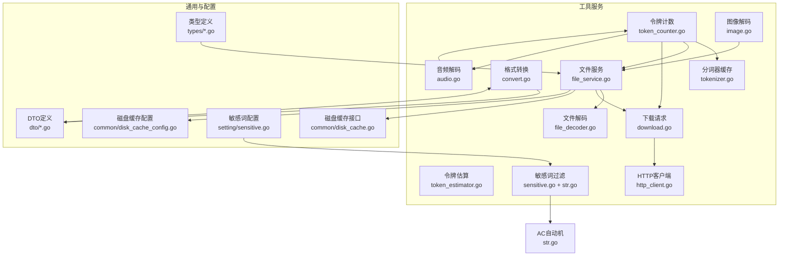
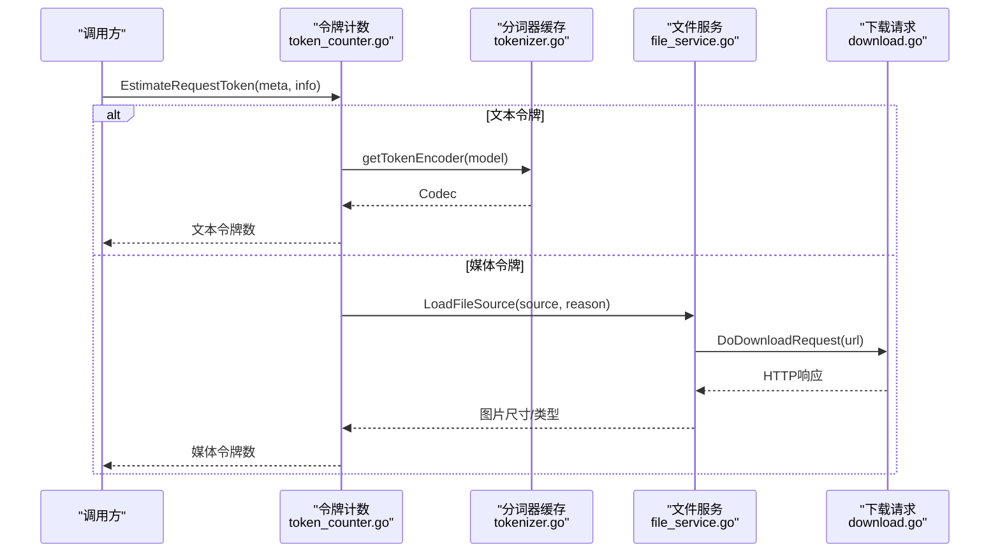
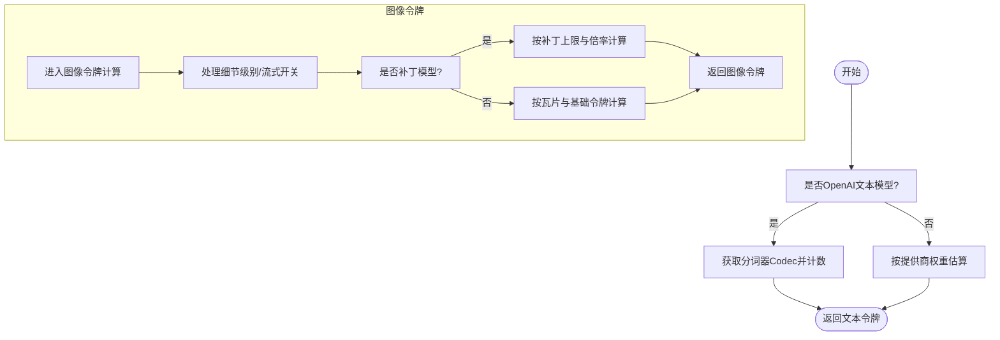
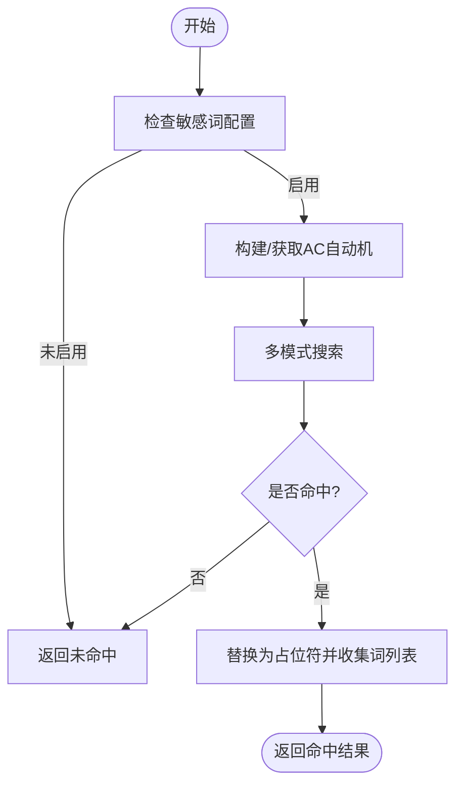
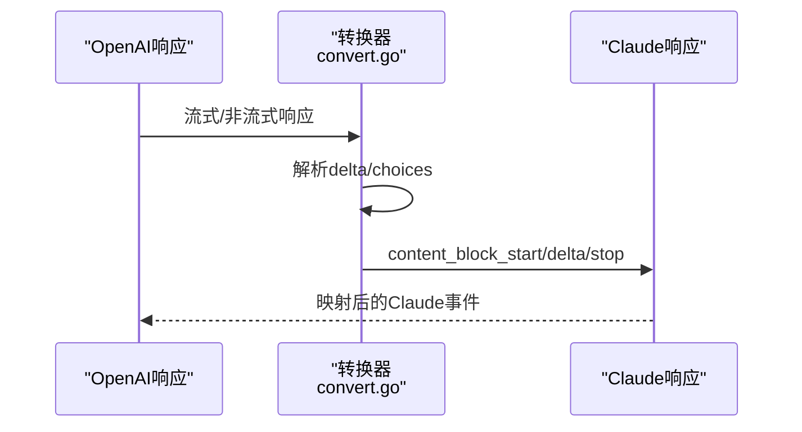
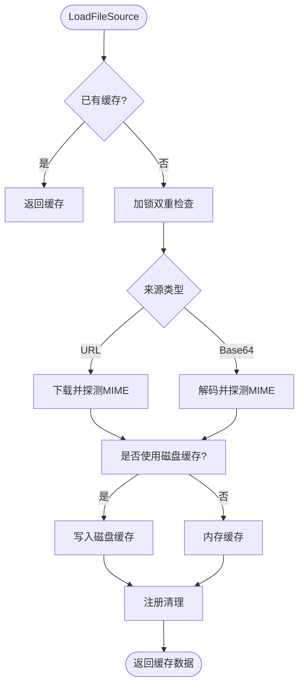
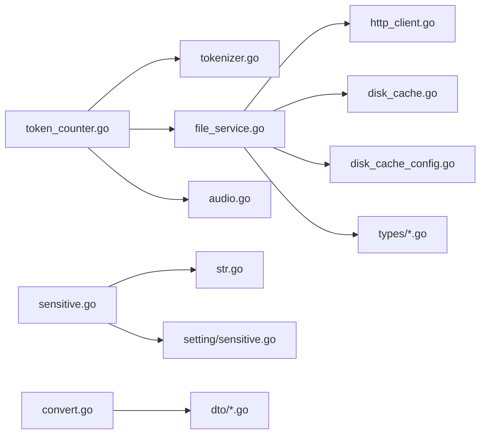

# 工具服务

<cite>
**本文引用的文件**
- [token_counter.go](file://service/token_counter.go)
- [tokenizer.go](file://service/tokenizer.go)
- [token_estimator.go](file://service/token_estimator.go)
- [sensitive.go](file://service/sensitive.go)
- [str.go](file://service/str.go)
- [convert.go](file://service/convert.go)
- [download.go](file://service/download.go)
- [file_service.go](file://service/file_service.go)
- [file_decoder.go](file://service/file_decoder.go)
- [http_client.go](file://service/http_client.go)
- [audio.go](file://service/audio.go)
- [image.go](file://service/image.go)
- [sensitive_setting.go](file://setting/sensitive.go)
- [disk_cache.go](file://common/disk_cache.go)
- [disk_cache_config.go](file://common/disk_cache_config.go)
- [file_source.go](file://types/file_source.go)
- [file_data.go](file://types/file_data.go)
- [dto_sensitive.go](file://dto/sensitive.go)
</cite>

## 目录
1. [简介](#简介)
2. [项目结构](#项目结构)
3. [核心组件](#核心组件)
4. [架构总览](#架构总览)
5. [详细组件分析](#详细组件分析)
6. [依赖分析](#依赖分析)
7. [性能考量](#性能考量)
8. [故障排查指南](#故障排查指南)
9. [结论](#结论)
10. [附录](#附录)

## 简介
本文件面向“工具服务模块”，系统性梳理文本令牌计数、敏感词过滤、数据转换与文件下载等辅助能力的实现与使用方式。重点覆盖：
- 令牌计算算法、分词器集成与估算策略
- 敏感词检测机制、过滤规则与替换策略
- 工具服务核心方法、缓存优化与并发安全
- 数据格式转换、编码处理与文件操作机制
- 扩展点与自定义配置项，帮助开发者快速理解与落地

## 项目结构
工具服务模块主要位于 service 与 common 目录，围绕以下关键职责组织：
- 令牌计数与估算：token_counter.go、tokenizer.go、token_estimator.go
- 敏感词过滤：sensitive.go、str.go、setting/sensitive.go
- 数据转换：convert.go（Claude/Gemini/OpenAI互转）
- 文件下载与解码：download.go、file_service.go、file_decoder.go、http_client.go、image.go、audio.go
- 缓存与磁盘管理：common/disk_cache*.go
- 类型与DTO：types/file_source.go、types/file_data.go、dto/sensitive.go

图示来源
- [token_counter.go:1-409](file://service/token_counter.go#L1-L409)
- [tokenizer.go:1-64](file://service/tokenizer.go#L1-L64)
- [token_estimator.go:1-231](file://service/token_estimator.go#L1-L231)
- [sensitive.go:1-78](file://service/sensitive.go#L1-L78)
- [str.go:1-153](file://service/str.go#L1-L153)
- [convert.go:1-1008](file://service/convert.go#L1-L1008)
- [download.go:1-71](file://service/download.go#L1-L71)
- [file_service.go:1-608](file://service/file_service.go#L1-L608)
- [file_decoder.go:1-213](file://service/file_decoder.go#L1-L213)
- [http_client.go:1-170](file://service/http_client.go#L1-L170)
- [image.go:43-159](file://service/image.go#L43-L159)
- [audio.go:1-48](file://service/audio.go#L1-L48)
- [disk_cache.go:1-177](file://common/disk_cache.go#L1-L177)
- [disk_cache_config.go:1-178](file://common/disk_cache_config.go#L1-L178)
- [file_source.go:74-132](file://types/file_source.go#L74-L132)
- [file_data.go:1-9](file://types/file_data.go#L1-L9)
- [dto_sensitive.go:1-6](file://dto/sensitive.go#L1-L6)
- [sensitive_setting.go:1-44](file://setting/sensitive.go#L1-L44)

章节来源
- [token_counter.go:1-409](file://service/token_counter.go#L1-L409)
- [file_service.go:1-608](file://service/file_service.go#L1-L608)

## 核心组件
- 令牌计数与估算
  - 文本令牌：OpenAI模型使用分词器精确计数；其他模型采用按提供商权重估算，兼顾性能与近似精度。
  - 媒体令牌：图像、音频、视频、文件分别按模型族与特性估算；支持低/高细节与补丁/瓦片两种计算路径。
  - 实时事件：根据实时协议事件类型分别统计文本、音频与工具调用令牌。
- 敏感词过滤
  - 支持检测与替换两类策略；基于AC自动机构建多模式匹配，支持大小写不敏感与命中立即返回。
  - 配置开关与替换标记可控制行为与输出。
- 数据转换
  - Claude/Gemini/OpenAI请求与响应互转，处理消息、工具调用、媒体内容、停止原因映射与流式状态机。
- 文件下载与解码
  - 统一入口 LoadFileSource，支持URL与Base64两种来源，自动缓存与清理；智能MIME探测、图片尺寸解码、HEIF/HEIC支持。
  - 下载请求支持Worker代理与SSRF防护，支持HTTP/HTTPS白名单与域名/IP过滤。

章节来源
- [token_counter.go:181-298](file://service/token_counter.go#L181-L298)
- [token_estimator.go:68-148](file://service/token_estimator.go#L68-L148)
- [sensitive.go:11-77](file://service/sensitive.go#L11-L77)
- [str.go:132-152](file://service/str.go#L132-L152)
- [convert.go:17-217](file://service/convert.go#L17-L217)
- [file_service.go:45-124](file://service/file_service.go#L45-L124)
- [file_decoder.go:21-134](file://service/file_decoder.go#L21-L134)
- [download.go:23-70](file://service/download.go#L23-L70)

## 架构总览
工具服务围绕“统一入口 + 分层处理 + 缓存与并发安全”的设计展开：
- 统一入口：LoadFileSource、DoDownloadRequest、InitTokenEncoders
- 分层处理：令牌计数（文本/媒体/实时）→ 敏感词过滤 → 数据转换 → 文件下载/解码
- 缓存与并发：分词器与AC自动机缓存、上下文级文件缓存、磁盘/内存双栈缓存、读写锁保护

图示来源
- [token_counter.go:181-298](file://service/token_counter.go#L181-L298)
- [tokenizer.go:26-55](file://service/tokenizer.go#L26-L55)
- [file_service.go:45-124](file://service/file_service.go#L45-L124)
- [download.go:52-70](file://service/download.go#L52-L70)

## 详细组件分析

### 令牌计数与估算
- 文本令牌
  - OpenAI模型：通过分词器获取精确token数；非OpenAI模型使用估算权重表，按字符类型累加并向上取整。
  - 并发安全：分词器Codec缓存使用读写锁保护，支持懒加载与失败回退至默认编码器。
- 媒体令牌
  - 图像：支持补丁（patch-based）与瓦片（tile-based）两类模型族；低细节优先、流式非流式开关、尺寸缩放与上限裁剪。
  - 音频：按格式解析采样率与样本数，换算时长后按分钟估算token。
  - 视频/文件：固定token估算。
- 实时事件
  - 根据事件类型分别统计文本、音频与工具调用令牌，支持多工具并行索引管理。

图示来源
- [token_counter.go:397-408](file://service/token_counter.go#L397-L408)
- [token_estimator.go:68-148](file://service/token_estimator.go#L68-L148)
- [tokenizer.go:26-55](file://service/tokenizer.go#L26-L55)

章节来源
- [token_counter.go:181-352](file://service/token_counter.go#L181-L352)
- [token_estimator.go:68-230](file://service/token_estimator.go#L68-L230)
- [tokenizer.go:20-64](file://service/tokenizer.go#L20-L64)

### 敏感词过滤
- 检测与替换
  - 检测：大小写不敏感，支持命中立即返回；返回是否命中与命中的敏感词列表。
  - 替换：命中后以占位符替换，返回是否命中、敏感词列表与替换后的文本。
- AC自动机构建与缓存
  - 词典归一化、哈希键生成、并发安全缓存；命中结果去重与顺序稳定。
- 配置与策略
  - 开关：是否启用敏感词检测、是否在提示阶段检测。
  - 行为：检测到敏感词时是否中断生成，或执行替换。

图示来源
- [sensitive.go:39-77](file://service/sensitive.go#L39-L77)
- [str.go:98-152](file://service/str.go#L98-L152)
- [sensitive_setting.go:5-43](file://setting/sensitive.go#L5-L43)

章节来源
- [sensitive.go:11-77](file://service/sensitive.go#L11-L77)
- [str.go:63-152](file://service/str.go#L63-L152)
- [sensitive_setting.go:1-44](file://setting/sensitive.go#L1-L44)
- [dto_sensitive.go:1-6](file://dto/sensitive.go#L1-L6)

### 数据转换（Claude/Gemini/OpenAI）
- 请求转换
  - Claude → OpenAI：系统消息、消息内容、工具调用、停止序列、推理参数映射；OpenRouter特殊处理。
  - Gemini → OpenAI：角色映射、媒体内容（文本/图片）、工具调用、生成参数映射。
- 响应转换
  - OpenAI流式/非流式 → Claude：内容块起止、工具调用索引、思考内容、停止原因映射。
  - OpenAI → Gemini：消息内容与工具调用还原。
- 流式状态机
  - 严格遵循Anthropic SSE状态机，处理文本/思考/工具三类内容块的开启、增量与关闭。

图示来源
- [convert.go:255-605](file://service/convert.go#L255-L605)

章节来源
- [convert.go:17-217](file://service/convert.go#L17-L217)
- [convert.go:255-605](file://service/convert.go#L255-L605)

### 文件下载与解码
- 统一入口
  - LoadFileSource：支持URL与Base64来源，双重检查、加锁、上下文缓存、自动清理。
- 下载与SSRF防护
  - DoDownloadRequest：支持Worker代理与直连；严格校验URL与域名/IP白名单、端口限制。
- MIME探测与图片解码
  - smartDetectMimeType：优先Header/Content-Disposition/URL扩展名，再内容嗅探与图片解码。
  - decodeImageConfig：JPEG/PNG/GIF/WebP/HEIF/HEIC多格式支持。
- 磁盘/内存缓存
  - ShouldUseDiskCache：阈值与可用空间判定；磁盘缓存失败回退内存；关闭时统计扣减。

图示来源
- [file_service.go:45-124](file://service/file_service.go#L45-L124)
- [file_service.go:156-236](file://service/file_service.go#L156-L236)
- [file_decoder.go:21-134](file://service/file_decoder.go#L21-L134)
- [download.go:23-70](file://service/download.go#L23-L70)
- [disk_cache.go:166-177](file://common/disk_cache.go#L166-L177)
- [disk_cache_config.go:169-177](file://common/disk_cache_config.go#L169-L177)

章节来源
- [file_service.go:45-236](file://service/file_service.go#L45-L236)
- [file_decoder.go:21-134](file://service/file_decoder.go#L21-L134)
- [download.go:23-70](file://service/download.go#L23-L70)
- [http_client.go:24-59](file://service/http_client.go#L24-L59)
- [image.go:43-159](file://service/image.go#L43-L159)
- [audio.go:9-32](file://service/audio.go#L9-L32)
- [disk_cache.go:1-177](file://common/disk_cache.go#L1-L177)
- [disk_cache_config.go:1-178](file://common/disk_cache_config.go#L1-L178)
- [file_source.go:74-132](file://types/file_source.go#L74-L132)
- [file_data.go:1-9](file://types/file_data.go#L1-L9)

## 依赖分析
- 组件耦合
  - 令牌计数依赖分词器缓存与文件服务；文件服务依赖HTTP客户端与磁盘缓存；敏感词过滤依赖AC自动机与配置。
- 并发与一致性
  - 分词器与AC自动机使用读写锁；文件服务使用互斥锁与上下文注册清理；磁盘缓存使用原子计数与阈值控制。
- 外部依赖
  - tiktoken-go用于OpenAI模型精确计数；golang.org/x/image/webp与HEIF解析；第三方HTTP代理与SOCKS5支持。

图示来源
- [token_counter.go:1-409](file://service/token_counter.go#L1-L409)
- [tokenizer.go:1-64](file://service/tokenizer.go#L1-L64)
- [sensitive.go:1-78](file://service/sensitive.go#L1-L78)
- [str.go:1-153](file://service/str.go#L1-L153)
- [file_service.go:1-608](file://service/file_service.go#L1-L608)
- [http_client.go:1-170](file://service/http_client.go#L1-L170)
- [disk_cache.go:1-177](file://common/disk_cache.go#L1-L177)
- [disk_cache_config.go:1-178](file://common/disk_cache_config.go#L1-L178)
- [convert.go:1-1008](file://service/convert.go#L1-L1008)
- [file_source.go:1-232](file://types/file_source.go#L1-L232)
- [dto_sensitive.go:1-6](file://dto/sensitive.go#L1-L6)

章节来源
- [token_counter.go:1-409](file://service/token_counter.go#L1-L409)
- [file_service.go:1-608](file://service/file_service.go#L1-L608)
- [sensitive.go:1-78](file://service/sensitive.go#L1-L78)
- [str.go:1-153](file://service/str.go#L1-L153)
- [convert.go:1-1008](file://service/convert.go#L1-L1008)
- [http_client.go:1-170](file://service/http_client.go#L1-L170)
- [disk_cache.go:1-177](file://common/disk_cache.go#L1-L177)
- [disk_cache_config.go:1-178](file://common/disk_cache_config.go#L1-L178)
- [file_source.go:1-232](file://types/file_source.go#L1-L232)
- [dto_sensitive.go:1-6](file://dto/sensitive.go#L1-L6)

## 性能考量
- 分词器缓存
  - 读写锁保护，首次缺失时写入；失败回退默认编码器，避免重复失败开销。
- AC自动机缓存
  - 词典归一化+哈希键，sync.Map并发安全；命中立即返回减少遍历成本。
- 文件缓存策略
  - 基于阈值与可用空间选择磁盘/内存；磁盘缓存失败回退内存；关闭时原子扣减统计。
- HTTP与代理
  - 连接池复用、超时控制、代理客户端缓存；SOCKS5/HTTP代理支持。
- 令牌估算
  - 非OpenAI模型采用权重表线性估算，避免昂贵的分词器调用。

章节来源
- [tokenizer.go:20-55](file://service/tokenizer.go#L20-L55)
- [str.go:73-118](file://service/str.go#L73-L118)
- [disk_cache.go:166-177](file://common/disk_cache.go#L166-L177)
- [disk_cache_config.go:169-177](file://common/disk_cache_config.go#L169-L177)
- [http_client.go:36-83](file://service/http_client.go#L36-L83)
- [token_estimator.go:68-148](file://service/token_estimator.go#L68-L148)

## 故障排查指南
- 令牌计数异常
  - 确认模型是否为OpenAI文本模型；若非OpenAI，将走估算逻辑；检查媒体令牌开关与流式模式。
  - 图像令牌失败：检查URL可访问性、MIME探测与图片解码；确认磁盘缓存阈值与可用空间。
- 敏感词检测
  - 检查配置开关与提示阶段检测开关；确认词典是否为空；替换策略是否启用。
- 文件下载
  - Worker模式需开启并校验密钥；非Worker模式需满足SSRF防护规则；检查代理配置与超时。
- 磁盘缓存
  - 确认阈值与最大容量；查看统计信息与清理任务；必要时同步磁盘状态。

章节来源
- [token_counter.go:181-298](file://service/token_counter.go#L181-L298)
- [sensitive.go:11-77](file://service/sensitive.go#L11-L77)
- [sensitive_setting.go:1-44](file://setting/sensitive.go#L1-L44)
- [download.go:23-70](file://service/download.go#L23-L70)
- [disk_cache_config.go:158-177](file://common/disk_cache_config.go#L158-L177)

## 结论
工具服务模块通过统一入口与分层设计，实现了高性能、可扩展的令牌计数、敏感词过滤、数据转换与文件下载能力。借助分词器与AC自动机缓存、磁盘/内存双栈缓存以及严格的并发与安全控制，能够在复杂场景下保持稳定与高效。开发者可通过配置项灵活定制行为，并利用扩展点适配更多模型与格式。

## 附录
- 关键配置项
  - 敏感词：开关、提示阶段检测、替换策略、词典导入导出
  - 磁盘缓存：启用、阈值、最大容量、目录
  - 下载：Worker开关与密钥、HTTP/HTTPS白名单、SSRF防护规则
- 常用方法
  - 令牌计数：EstimateRequestToken、CountTextToken、CountTokenInput、CountAudioTokenInput/Output
  - 敏感词：CheckSensitiveMessages、CheckSensitiveText、SensitiveWordContains、SensitiveWordReplace
  - 文件：LoadFileSource、GetBase64Data、GetMimeType、GetFileTypeFromUrl
  - 转换：ClaudeToOpenAIRequest、GeminiToOpenAIRequest、StreamResponseOpenAI2Claude、ResponseOpenAI2Claude

章节来源
- [token_counter.go:181-352](file://service/token_counter.go#L181-L352)
- [sensitive.go:11-77](file://service/sensitive.go#L11-L77)
- [file_service.go:418-448](file://service/file_service.go#L418-L448)
- [convert.go:17-217](file://service/convert.go#L17-L217)
- [sensitive_setting.go:16-35](file://setting/sensitive.go#L16-L35)
- [disk_cache_config.go:8-26](file://common/disk_cache_config.go#L8-L26)
- [download.go:23-70](file://service/download.go#L23-L70)