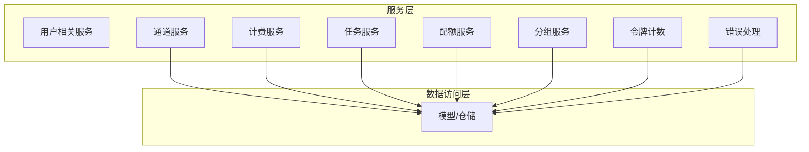
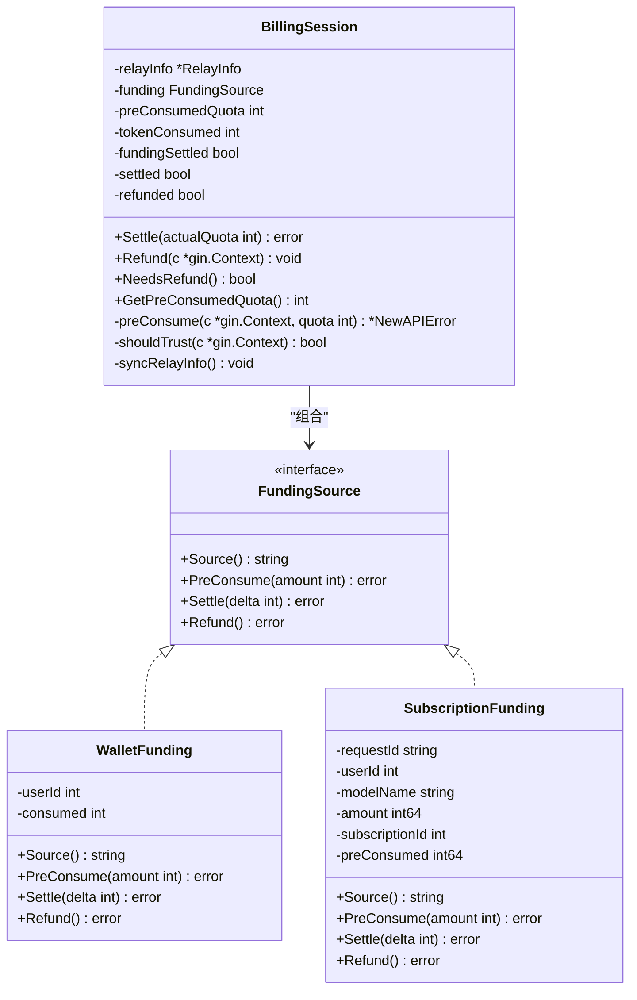
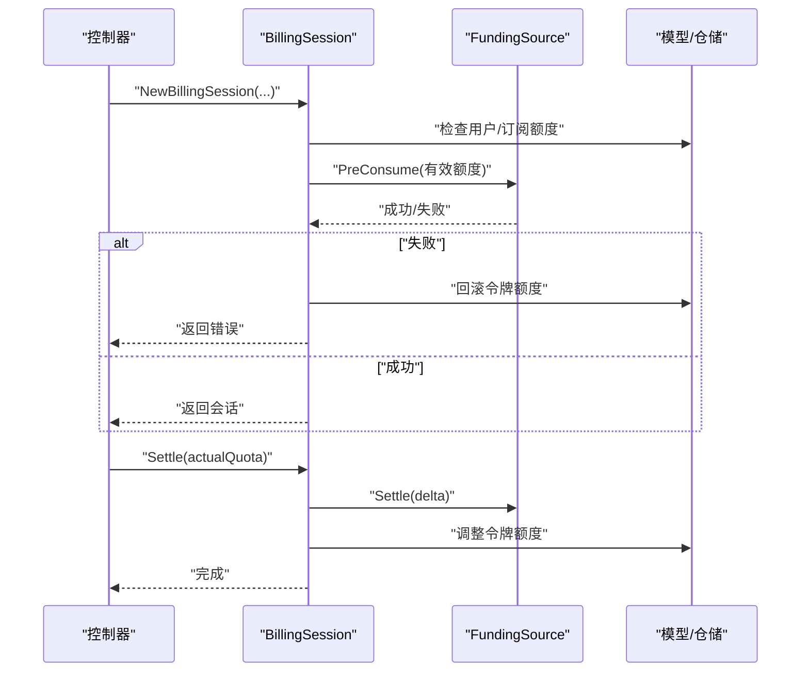
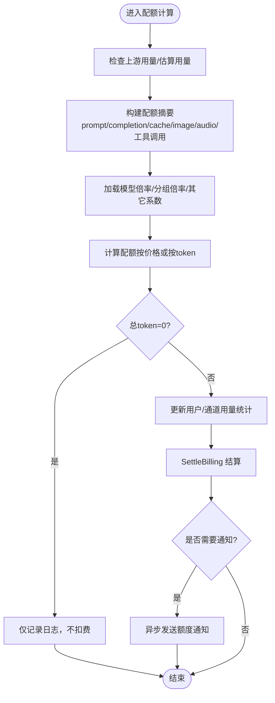
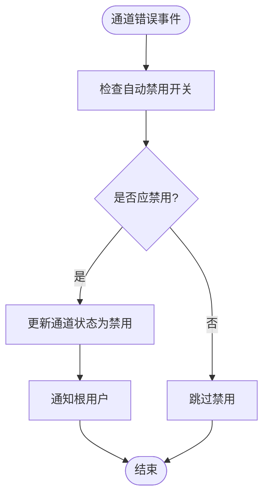
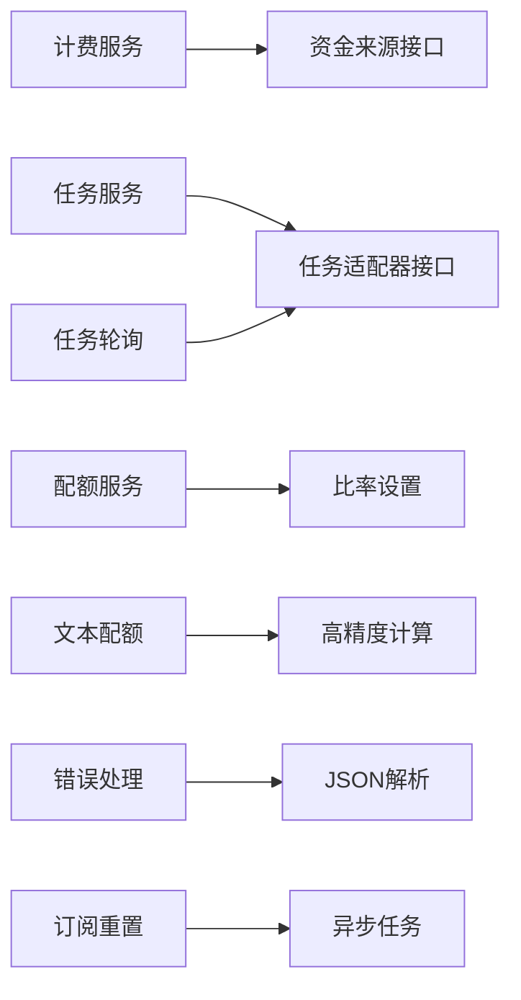

# 服务层

<cite>
**本文引用的文件**
- [service/channel.go](file://service/channel.go)
- [service/billing.go](file://service/billing.go)
- [service/billing_session.go](file://service/billing_session.go)
- [service/funding_source.go](file://service/funding_source.go)
- [service/quota.go](file://service/quota.go)
- [service/text_quota.go](file://service/text_quota.go)
- [service/token_counter.go](file://service/token_counter.go)
- [service/group.go](file://service/group.go)
- [service/error.go](file://service/error.go)
- [service/task.go](file://service/task.go)
- [service/task_billing.go](file://service/task_billing.go)
- [service/task_polling.go](file://service/task_polling.go)
- [service/subscription_reset_task.go](file://service/subscription_reset_task.go)
</cite>

## 目录
1. [简介](#简介)
2. [项目结构](#项目结构)
3. [核心组件](#核心组件)
4. [架构总览](#架构总览)
5. [详细组件分析](#详细组件分析)
6. [依赖分析](#依赖分析)
7. [性能考量](#性能考量)
8. [故障排查指南](#故障排查指南)
9. [结论](#结论)
10. [附录](#附录)

## 简介
本文件面向 New API 项目的业务服务层，系统性梳理服务层的业务逻辑封装、事务管理与异常处理机制。重点覆盖用户服务、通道服务、计费服务、任务服务与配额服务的实现细节，包括业务规则校验、数据一致性保障、并发控制策略、服务方法示例、事务边界管理、错误传播机制、与数据访问层的交互模式、缓存策略与性能优化、业务流程编排、异步处理与分布式事务处理等。目标是帮助开发者快速理解服务层的业务抽象与扩展方法。

## 项目结构
服务层位于仓库根目录下的 service 子目录，围绕“计费”“配额”“任务”“通道”“分组”“错误处理”“令牌计数”等模块组织，采用按职责分层的设计，避免与控制器、适配器、模型层产生循环依赖，并通过统一的会话与接口抽象实现跨模块协作。



图示来源
- [service/channel.go:1-79](file://service/channel.go#L1-L79)
- [service/billing.go:1-79](file://service/billing.go#L1-L79)
- [service/billing_session.go:1-348](file://service/billing_session.go#L1-L348)
- [service/funding_source.go:1-140](file://service/funding_source.go#L1-L140)
- [service/quota.go:1-508](file://service/quota.go#L1-L508)
- [service/text_quota.go:1-431](file://service/text_quota.go#L1-L431)
- [service/token_counter.go:1-409](file://service/token_counter.go#L1-L409)
- [service/group.go:1-66](file://service/group.go#L1-L66)
- [service/error.go:1-222](file://service/error.go#L1-L222)
- [service/task.go:1-12](file://service/task.go#L1-L12)
- [service/task_billing.go:1-302](file://service/task_billing.go#L1-L302)
- [service/task_polling.go:1-561](file://service/task_polling.go#L1-L561)
- [service/subscription_reset_task.go:1-94](file://service/subscription_reset_task.go#L1-L94)

章节来源
- [service/channel.go:1-79](file://service/channel.go#L1-L79)
- [service/billing.go:1-79](file://service/billing.go#L1-L79)
- [service/billing_session.go:1-348](file://service/billing_session.go#L1-L348)
- [service/funding_source.go:1-140](file://service/funding_source.go#L1-L140)
- [service/quota.go:1-508](file://service/quota.go#L1-L508)
- [service/text_quota.go:1-431](file://service/text_quota.go#L1-L431)
- [service/token_counter.go:1-409](file://service/token_counter.go#L1-L409)
- [service/group.go:1-66](file://service/group.go#L1-L66)
- [service/error.go:1-222](file://service/error.go#L1-L222)
- [service/task.go:1-12](file://service/task.go#L1-L12)
- [service/task_billing.go:1-302](file://service/task_billing.go#L1-L302)
- [service/task_polling.go:1-561](file://service/task_polling.go#L1-L561)
- [service/subscription_reset_task.go:1-94](file://service/subscription_reset_task.go#L1-L94)

## 核心组件
- 计费会话与资金来源抽象：统一预扣费、结算与退款的生命周期，支持钱包与订阅两种资金来源，提供幂等与回滚能力。
- 配额与计费计算：文本、音频、实时流等多形态用量的配额计算与结算，支持按次计费与按token计费混合模式。
- 任务服务：异步任务的轮询、状态推进、差额结算与退款，支持多平台适配器解耦。
- 通道服务：通道启停、自动禁用/启用策略与通知。
- 分组与比率：用户可用分组、自动分组与分组倍率计算。
- 错误处理：统一错误包装、状态码映射与本地化提示。
- 令牌计数：文本、图像、音频、视频等多模态输入的令牌估算与统计。

章节来源
- [service/billing_session.go:23-192](file://service/billing_session.go#L23-L192)
- [service/funding_source.go:14-118](file://service/funding_source.go#L14-L118)
- [service/quota.go:367-411](file://service/quota.go#L367-L411)
- [service/text_quota.go:294-430](file://service/text_quota.go#L294-L430)
- [service/task_polling.go:90-138](file://service/task_polling.go#L90-L138)
- [service/task_billing.go:150-245](file://service/task_billing.go#L150-L245)
- [service/channel.go:19-79](file://service/channel.go#L19-L79)
- [service/group.go:10-66](file://service/group.go#L10-L66)
- [service/error.go:86-129](file://service/error.go#L86-L129)
- [service/token_counter.go:181-298](file://service/token_counter.go#L181-L298)

## 架构总览
服务层通过“会话 + 接口”的方式实现跨模块协作，避免直接依赖具体实现，降低耦合度。计费会话封装预扣费、结算与退款，资金来源接口抽象钱包与订阅两类来源；任务轮询通过适配器接口对接不同平台；配额服务统一计算与结算逻辑；通道与分组服务提供业务规则与策略；错误处理模块提供统一的错误包装与状态码映射。



图示来源
- [service/funding_source.go:14-118](file://service/funding_source.go#L14-L118)
- [service/billing_session.go:25-192](file://service/billing_session.go#L25-L192)

## 详细组件分析

### 计费服务与会话（Billing Session）
- 统一预扣费入口：根据用户计费偏好选择钱包或订阅路径，支持“钱包优先/订阅优先/仅钱包/仅订阅”，并在额度不足时自动回退。
- 预扣费流程：令牌额度预扣（Playground除外）→ 资金来源预扣（钱包/订阅），任一步骤失败则原子回滚。
- 结算与退款：结算按实际消耗与预扣差额调整；退款幂等安全，异步执行；信任额度旁路在特定条件下跳过预扣。
- 事务边界：资金来源与令牌额度调整分两步提交，资金来源已提交后令牌调整失败仅记录日志，防止重复退款。



图示来源
- [service/billing_session.go:254-347](file://service/billing_session.go#L254-L347)
- [service/billing_session.go:39-77](file://service/billing_session.go#L39-L77)
- [service/billing_session.go:149-192](file://service/billing_session.go#L149-L192)
- [service/funding_source.go:36-64](file://service/funding_source.go#L36-L64)
- [service/funding_source.go:86-109](file://service/funding_source.go#L86-L109)

章节来源
- [service/billing_session.go:254-347](file://service/billing_session.go#L254-L347)
- [service/billing_session.go:39-77](file://service/billing_session.go#L39-L77)
- [service/billing_session.go:149-192](file://service/billing_session.go#L149-L192)
- [service/funding_source.go:36-64](file://service/funding_source.go#L36-L64)
- [service/funding_source.go:86-109](file://service/funding_source.go#L86-L109)

### 配额服务与计费计算
- 文本配额：综合prompt/completion、缓存写入/读取、图像、音频、工具调用、Web/File Search等维度，按模型倍率、分组倍率与其它系数计算配额。
- 音频/实时流配额：支持按价格或按token计算，结合分组倍率与音频/补全倍率，确保计费精确。
- 预扣与后结：预扣令牌额度（Playground除外）→ 后结算（SettleBilling）→ 记录消费日志与通知。
- 通知策略：当用户剩余额度低于阈值或订阅剩余额度低于阈值时，异步发送提醒通知。



图示来源
- [service/text_quota.go:80-282](file://service/text_quota.go#L80-L282)
- [service/quota.go:367-411](file://service/quota.go#L367-L411)
- [service/quota.go:413-507](file://service/quota.go#L413-L507)

章节来源
- [service/text_quota.go:80-282](file://service/text_quota.go#L80-L282)
- [service/quota.go:367-411](file://service/quota.go#L367-L411)
- [service/quota.go:413-507](file://service/quota.go#L413-L507)

### 任务服务与异步处理
- 轮询循环：每15秒扫描未完成任务，按平台分发更新；独立清理超时任务，CAS保证状态一致性。
- 平台适配：通过适配器接口 FetchTask/ParsedTaskResult/AdjustBillingOnComplete 解耦不同平台实现。
- 差额结算：优先由适配器决定最终额度，其次按token重算，最后保持预扣不变。
- 退款策略：任务失败且存在预扣时，统一退还资金来源与令牌额度，并记录退款日志。

```mermaid
sequenceDiagram
participant Loop as "轮询循环"
participant Adaptor as "任务适配器"
participant Model as "模型/仓储"
participant Task as "任务实体"
Loop->>Model : "查询未完成任务"
Loop->>Adaptor : "按平台分发更新"
Adaptor->>Adaptor : "FetchTask/ParseTaskResult"
Adaptor-->>Loop : "任务结果"
alt "完成"
Loop->>Adaptor : "AdjustBillingOnComplete"
Adaptor-->>Loop : "实际额度/0"
opt "返回正值"
Loop->>Model : "RecalculateTaskQuota"
end
else "失败"
Loop->>Model : "RefundTaskQuota"
end
Loop->>Model : "CAS更新任务状态"
```

图示来源
- [service/task_polling.go:90-138](file://service/task_polling.go#L90-L138)
- [service/task_polling.go:344-502](file://service/task_polling.go#L344-L502)
- [service/task_billing.go:150-245](file://service/task_billing.go#L150-L245)

章节来源
- [service/task_polling.go:90-138](file://service/task_polling.go#L90-L138)
- [service/task_polling.go:344-502](file://service/task_polling.go#L344-L502)
- [service/task_billing.go:150-245](file://service/task_billing.go#L150-L245)

### 通道服务与自动禁用/启用
- 自动禁用：根据错误类型、状态码、关键词匹配等策略判定是否自动禁用通道，并通知根用户。
- 自动启用：在通道处于自动禁用状态且无新错误时，自动启用通道。
- 通知机制：通过统一通知格式向根用户推送通道状态变更。



图示来源
- [service/channel.go:45-79](file://service/channel.go#L45-L79)
- [service/channel.go:19-43](file://service/channel.go#L19-L43)

章节来源
- [service/channel.go:45-79](file://service/channel.go#L45-L79)
- [service/channel.go:19-43](file://service/channel.go#L19-L43)

### 分组与比率服务
- 用户可用分组：合并全局可用分组与用户特殊设置（增删改），并保证用户分组始终可用。
- 自动分组：根据用户分组与系统配置筛选可选自动分组。
- 分组倍率：优先使用用户对分组的特殊倍率，否则使用默认分组倍率。

章节来源
- [service/group.go:10-66](file://service/group.go#L10-L66)

### 错误处理与状态码映射
- 统一错误包装：针对不同上游（如Claude、任务）提供错误包装器，屏蔽敏感信息。
- 上游响应错误：解析通用错误格式，转换为统一的 NewAPIError，支持按配置映射状态码。
- 本地错误：区分本地错误与上游错误，便于前端展示与日志追踪。

章节来源
- [service/error.go:61-84](file://service/error.go#L61-L84)
- [service/error.go:86-129](file://service/error.go#L86-L129)
- [service/error.go:131-183](file://service/error.go#L131-L183)
- [service/error.go:185-222](file://service/error.go#L185-L222)

### 令牌计数与多模态统计
- 文本计数：OpenAI模型使用tokenizer，其他模型使用估算，减少开销。
- 图像计数：按模型族与分辨率/瓦片/补丁规则估算，支持低/高细节与流式/非流式差异。
- 音频计数：按时长估算输入/输出token，与时长与格式相关。
- 文件计数：对图像/音频/视频/文件进行分类估算。

章节来源
- [service/token_counter.go:181-298](file://service/token_counter.go#L181-L298)
- [service/token_counter.go:300-352](file://service/token_counter.go#L300-L352)
- [service/token_counter.go:374-394](file://service/token_counter.go#L374-L394)
- [service/token_counter.go:396-409](file://service/token_counter.go#L396-L409)

### 订阅配额重置与清理
- 定时任务：每分钟扫描到期与需重置的订阅，批量处理并清理过期预扣记录。
- 幂等与并发：通过运行标志与原子布尔控制并发执行，避免重复任务。

章节来源
- [service/subscription_reset_task.go:29-94](file://service/subscription_reset_task.go#L29-L94)

## 依赖分析
- 服务层内部依赖：计费服务依赖资金来源接口与模型层；任务服务依赖适配器接口与模型层；配额服务依赖比率设置与模型层；通道/分组/错误处理相对独立。
- 循环依赖规避：通过接口抽象（FundingSource、TaskPollingAdaptor）与工厂方法（NewBillingSession）打破模块间循环依赖。
- 外部依赖：gopool用于异步通知与定时任务；decimal用于高精度计算；JSON解析与HTTP响应处理。



图示来源
- [service/billing_session.go:254-347](file://service/billing_session.go#L254-L347)
- [service/task_polling.go:34-36](file://service/task_polling.go#L34-L36)
- [service/quota.go:12-25](file://service/quota.go#L12-L25)
- [service/error.go:86-129](file://service/error.go#L86-L129)
- [service/subscription_reset_task.go:34-44](file://service/subscription_reset_task.go#L34-L44)

章节来源
- [service/billing_session.go:254-347](file://service/billing_session.go#L254-L347)
- [service/task_polling.go:34-36](file://service/task_polling.go#L34-L36)
- [service/quota.go:12-25](file://service/quota.go#L12-L25)
- [service/error.go:86-129](file://service/error.go#L86-L129)
- [service/subscription_reset_task.go:34-44](file://service/subscription_reset_task.go#L34-L44)

## 性能考量
- 异步通知与定时任务：通过 gopool 异步发送额度通知与执行订阅重置，避免阻塞主流程。
- 高精度计算：使用 decimal 进行倍率与价格计算，减少浮点误差。
- 令牌估算：非OpenAI模型使用估算而非tokenizer，降低CPU开销。
- 轮询节流：视频任务轮询按渠道聚合并增加间隔，避免上游限流。
- 信任额度旁路：在满足条件时跳过预扣，减少数据库写入次数。

## 故障排查指南
- 计费失败：检查预扣费返回的错误码与状态，确认是否因额度不足或订阅状态异常导致；查看回滚日志与资金来源幂等保护。
- 任务失败退款：确认任务预扣额度与资金来源类型，检查退款是否成功；核对适配器返回的实际额度与token重算结果。
- 通道自动禁用：检查错误类型、状态码与关键词匹配配置，确认通知是否正确推送。
- 配额不一致：核对模型倍率、分组倍率与其它系数，检查是否按价格或按token计算；关注上游无用量时的日志提示。
- 订阅重置异常：检查定时任务运行标志与批处理数量，确认清理过期记录是否成功。

章节来源
- [service/billing_session.go:149-192](file://service/billing_session.go#L149-L192)
- [service/task_polling.go:494-502](file://service/task_polling.go#L494-L502)
- [service/channel.go:45-79](file://service/channel.go#L45-L79)
- [service/quota.go:317-320](file://service/quota.go#L317-L320)
- [service/subscription_reset_task.go:47-94](file://service/subscription_reset_task.go#L47-L94)

## 结论
服务层通过会话与接口抽象实现了清晰的业务边界与强一致的事务管理，配合异步通知与定时任务提升了整体性能与可靠性。计费、配额、任务、通道与分组等模块相互解耦，既满足复杂业务规则，又便于扩展与维护。建议在新增功能时遵循现有接口设计与事务边界，确保一致性与可观测性。

## 附录
- 服务方法示例（路径引用）
  - 预扣费与结算：[service/billing.go:19-26](file://service/billing.go#L19-L26)、[service/billing.go:34-78](file://service/billing.go#L34-L78)
  - 任务差额结算：[service/task_billing.go:187-245](file://service/task_billing.go#L187-L245)
  - 通道自动禁用：[service/channel.go:45-65](file://service/channel.go#L45-L65)
  - 文本配额计算：[service/text_quota.go:294-430](file://service/text_quota.go#L294-L430)
  - 令牌计数：[service/token_counter.go:181-298](file://service/token_counter.go#L181-L298)
  - 订阅重置任务：[service/subscription_reset_task.go:29-94](file://service/subscription_reset_task.go#L29-L94)