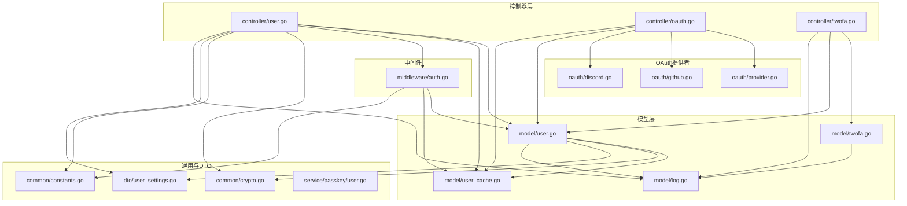
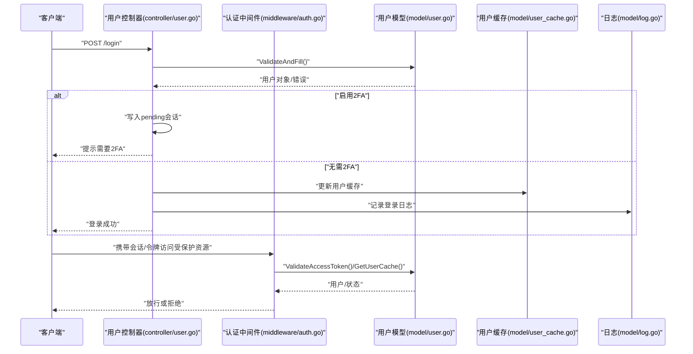
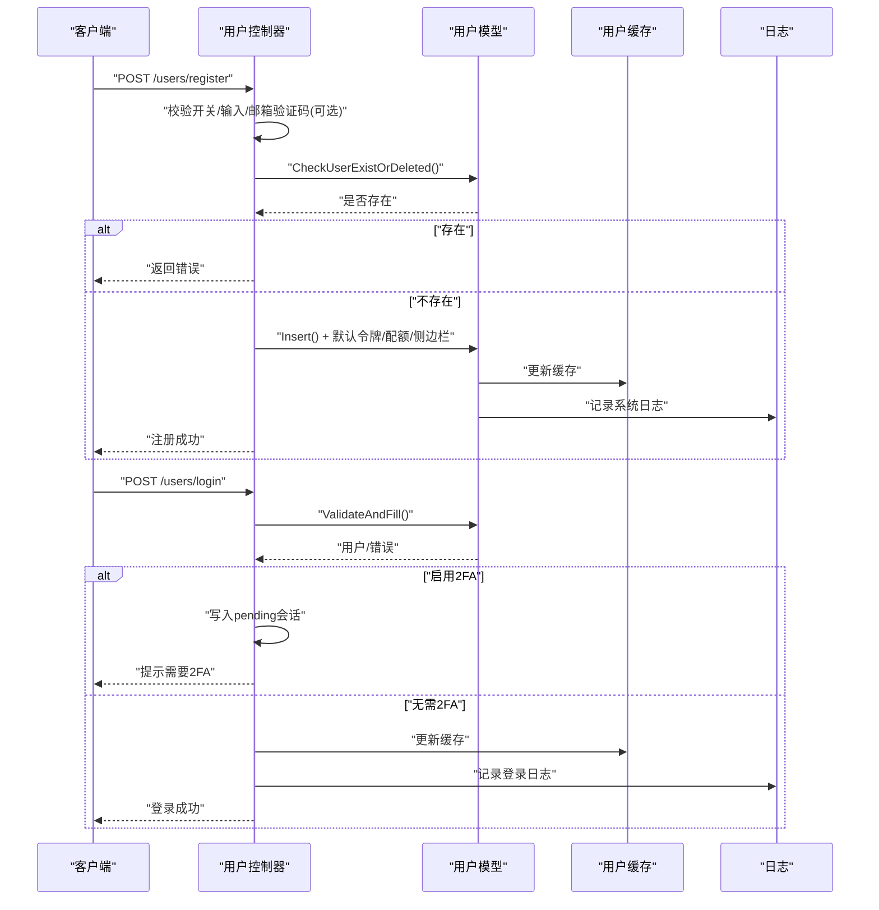
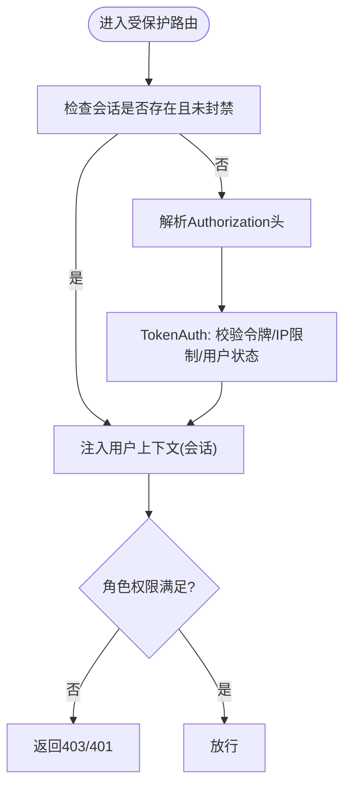
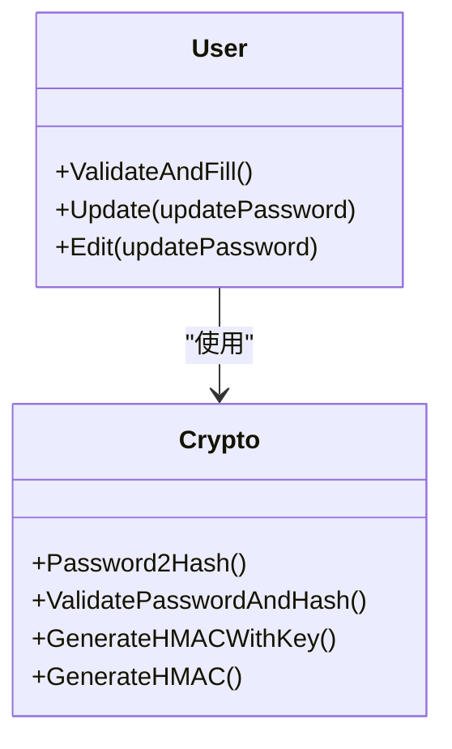
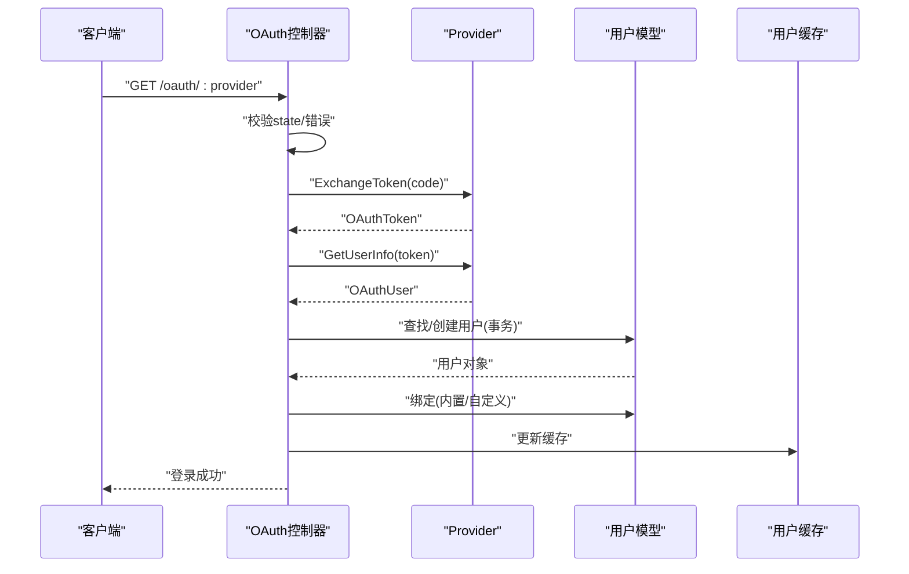
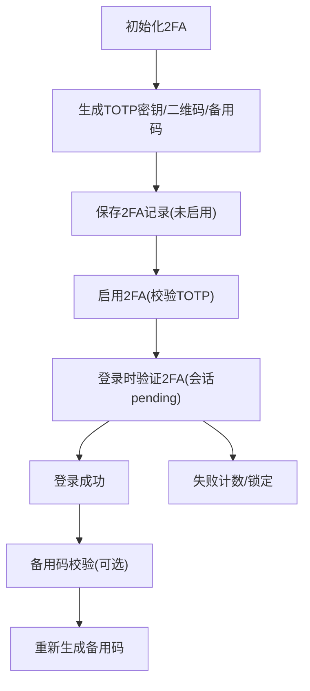
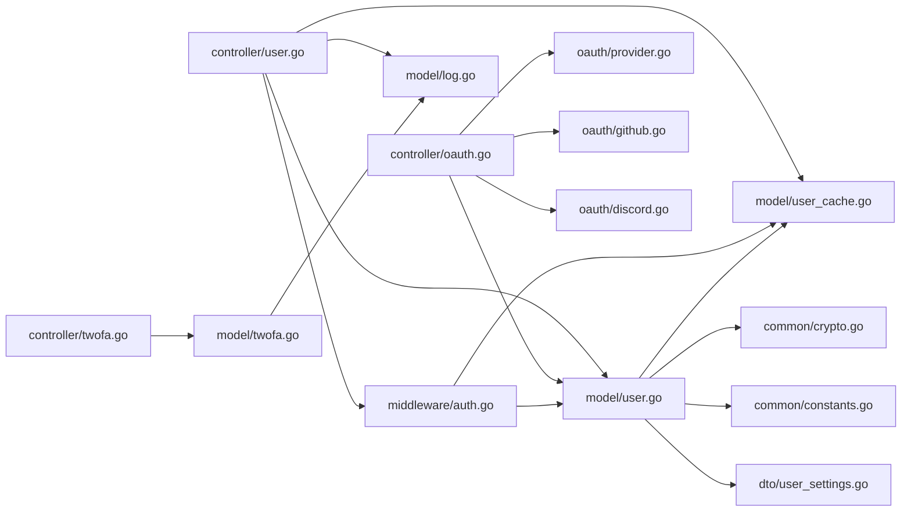

# 用户服务

<cite>
**本文引用的文件**
- [controller/user.go](file://controller/user.go)
- [model/user.go](file://model/user.go)
- [middleware/auth.go](file://middleware/auth.go)
- [controller/twofa.go](file://controller/twofa.go)
- [model/twofa.go](file://model/twofa.go)
- [model/user_cache.go](file://model/user_cache.go)
- [common/crypto.go](file://common/crypto.go)
- [dto/user_settings.go](file://dto/user_settings.go)
- [oauth/provider.go](file://oauth/provider.go)
- [oauth/github.go](file://oauth/github.go)
- [oauth/discord.go](file://oauth/discord.go)
- [controller/oauth.go](file://controller/oauth.go)
- [common/constants.go](file://common/constants.go)
- [model/log.go](file://model/log.go)
- [service/passkey/user.go](file://service/passkey/user.go)
</cite>

## 目录
1. [简介](#简介)
2. [项目结构](#项目结构)
3. [核心组件](#核心组件)
4. [架构总览](#架构总览)
5. [详细组件分析](#详细组件分析)
6. [依赖分析](#依赖分析)
7. [性能考虑](#性能考虑)
8. [故障排查指南](#故障排查指南)
9. [结论](#结论)
10. [附录](#附录)

## 简介
本技术文档围绕用户服务模块，系统阐述用户注册、登录、权限管理、会话管理、密码管理、OAuth集成与双因素认证（2FA）等关键业务逻辑与实现细节。文档同时覆盖用户数据模型设计、密码加密存储、会话生命周期管理、用户状态与账户安全验证、审计日志记录以及缓存策略与并发安全处理，帮助开发者快速理解并扩展用户服务。

## 项目结构
用户服务涉及控制器层、模型层、中间件、OAuth提供者、DTO与通用工具等模块，形成清晰的分层职责与交互关系。

图表来源
- [controller/user.go:1-1246](file://controller/user.go#L1-L1246)
- [model/user.go:1-1049](file://model/user.go#L1-L1049)
- [middleware/auth.go:1-440](file://middleware/auth.go#L1-L440)
- [controller/oauth.go:1-363](file://controller/oauth.go#L1-L363)
- [oauth/provider.go:1-37](file://oauth/provider.go#L1-L37)
- [oauth/github.go:1-179](file://oauth/github.go#L1-L179)
- [oauth/discord.go:1-173](file://oauth/discord.go#L1-L173)
- [controller/twofa.go:1-555](file://controller/twofa.go#L1-L555)
- [model/twofa.go:1-322](file://model/twofa.go#L1-L322)
- [model/user_cache.go:1-234](file://model/user_cache.go#L1-L234)
- [common/crypto.go:1-33](file://common/crypto.go#L1-L33)
- [dto/user_settings.go:1-27](file://dto/user_settings.go#L1-L27)
- [common/constants.go:1-219](file://common/constants.go#L1-L219)
- [model/log.go:1-482](file://model/log.go#L1-L482)
- [service/passkey/user.go:1-72](file://service/passkey/user.go#L1-L72)

章节来源
- [controller/user.go:1-1246](file://controller/user.go#L1-L1246)
- [model/user.go:1-1049](file://model/user.go#L1-L1049)
- [middleware/auth.go:1-440](file://middleware/auth.go#L1-L440)
- [controller/oauth.go:1-363](file://controller/oauth.go#L1-L363)
- [oauth/provider.go:1-37](file://oauth/provider.go#L1-L37)
- [oauth/github.go:1-179](file://oauth/github.go#L1-L179)
- [oauth/discord.go:1-173](file://oauth/discord.go#L1-L173)
- [controller/twofa.go:1-555](file://controller/twofa.go#L1-L555)
- [model/twofa.go:1-322](file://model/twofa.go#L1-L322)
- [model/user_cache.go:1-234](file://model/user_cache.go#L1-L234)
- [common/crypto.go:1-33](file://common/crypto.go#L1-L33)
- [dto/user_settings.go:1-27](file://dto/user_settings.go#L1-L27)
- [common/constants.go:1-219](file://common/constants.go#L1-L219)
- [model/log.go:1-482](file://model/log.go#L1-L482)
- [service/passkey/user.go:1-72](file://service/passkey/user.go#L1-L72)

## 核心组件
- 用户控制器：负责用户注册、登录、登出、信息查询与更新、配额转移、访问令牌生成、邀请码生成、权限计算与侧边栏配置等。
- 用户模型：封装用户数据结构、密码哈希、用户查找与更新、配额转移事务、OAuth绑定与迁移、访问令牌校验等。
- 会话与认证中间件：统一处理会话与令牌认证、用户态注入、权限校验、只读令牌认证、WebSocket与多协议适配。
- OAuth控制器与提供者：统一封装OAuth回调、CSRF保护、用户查找/创建、绑定流程、第三方用户信息拉取与迁移。
- 2FA控制器与模型：提供2FA初始化、启用、禁用、验证码验证、备用码生成与校验、失败锁定与统计。
- 缓存与并发：用户缓存（Redis Hash）、字段级缓存更新、异步刷新、并发安全与一致性保障。
- 密码与加密：bcrypt密码哈希、HMAC签名、TOTP与备份码生成与校验。
- 日志与审计：消费日志、错误日志、管理日志、系统日志、请求ID关联与IP可选记录。

章节来源
- [controller/user.go:1-1246](file://controller/user.go#L1-L1246)
- [model/user.go:1-1049](file://model/user.go#L1-L1049)
- [middleware/auth.go:1-440](file://middleware/auth.go#L1-L440)
- [controller/oauth.go:1-363](file://controller/oauth.go#L1-L363)
- [oauth/provider.go:1-37](file://oauth/provider.go#L1-L37)
- [oauth/github.go:1-179](file://oauth/github.go#L1-L179)
- [oauth/discord.go:1-173](file://oauth/discord.go#L1-L173)
- [controller/twofa.go:1-555](file://controller/twofa.go#L1-L555)
- [model/twofa.go:1-322](file://model/twofa.go#L1-L322)
- [model/user_cache.go:1-234](file://model/user_cache.go#L1-L234)
- [common/crypto.go:1-33](file://common/crypto.go#L1-L33)
- [dto/user_settings.go:1-27](file://dto/user_settings.go#L1-L27)
- [common/constants.go:1-219](file://common/constants.go#L1-L219)
- [model/log.go:1-482](file://model/log.go#L1-L482)

## 架构总览
用户服务采用“控制器-模型-中间件-提供者-缓存-日志”的分层架构，通过会话与令牌双重认证通道，结合Redis缓存与GORM事务，保证高可用与强一致性的用户体验。

图表来源
- [controller/user.go:32-117](file://controller/user.go#L32-L117)
- [middleware/auth.go:36-156](file://middleware/auth.go#L36-L156)
- [model/user.go:592-615](file://model/user.go#L592-L615)
- [model/user_cache.go:74-113](file://model/user_cache.go#L74-L113)
- [model/log.go:75-91](file://model/log.go#L75-L91)

## 详细组件分析

### 用户注册与登录流程
- 注册：校验开关与输入、邮箱验证码（可选）、去重检查、邀请人解析、默认配额与默认令牌生成、默认侧边栏配置初始化、邀请奖励与系统日志。
- 登录：校验开关与输入、用户名/邮箱查找、密码哈希校验、状态检查、2FA判断与会话pending、登录成功后写入会话并返回用户信息。

图表来源
- [controller/user.go:136-232](file://controller/user.go#L136-L232)
- [controller/user.go:32-90](file://controller/user.go#L32-L90)
- [model/user.go:161-183](file://model/user.go#L161-L183)
- [model/user.go:379-433](file://model/user.go#L379-L433)
- [model/user_cache.go:60-71](file://model/user_cache.go#L60-L71)
- [model/log.go:75-91](file://model/log.go#L75-L91)

章节来源
- [controller/user.go:136-232](file://controller/user.go#L136-L232)
- [controller/user.go:32-117](file://controller/user.go#L32-L117)
- [model/user.go:161-183](file://model/user.go#L161-L183)
- [model/user.go:379-433](file://model/user.go#L379-L433)
- [model/user_cache.go:60-71](file://model/user_cache.go#L60-L71)
- [model/log.go:75-91](file://model/log.go#L75-L91)

### 权限管理与会话管理
- 角色常量与权限边界：定义访客、普通用户、管理员、超级管理员等级别，权限校验在中间件中执行。
- 会话与令牌：支持会话态（session）与令牌态（access_token、API key），中间件统一注入用户上下文、组、配额、状态等。
- 只读令牌：宽松模式仅校验令牌存在性，不检查状态、过期与额度，但仍校验用户封禁状态。
- WebSocket与多协议：对特定协议头进行适配，统一走令牌认证路径。

图表来源
- [middleware/auth.go:170-208](file://middleware/auth.go#L170-L208)
- [middleware/auth.go:276-407](file://middleware/auth.go#L276-L407)
- [common/constants.go:141-150](file://common/constants.go#L141-L150)

章节来源
- [middleware/auth.go:36-156](file://middleware/auth.go#L36-L156)
- [middleware/auth.go:170-208](file://middleware/auth.go#L170-L208)
- [middleware/auth.go:276-407](file://middleware/auth.go#L276-L407)
- [common/constants.go:141-150](file://common/constants.go#L141-L150)

### 密码管理与加密
- 密码哈希：bcrypt生成与校验，注册与修改密码均进行哈希处理。
- HMAC签名：对敏感数据进行HMAC签名，增强完整性与抗篡改能力。
- 访问令牌：系统管理令牌（access_token）用于后台管理场景，不参与API调用。

图表来源
- [model/user.go:592-615](file://model/user.go#L592-L615)
- [model/user.go:494-539](file://model/user.go#L494-L539)
- [common/crypto.go:23-32](file://common/crypto.go#L23-L32)

章节来源
- [model/user.go:592-615](file://model/user.go#L592-L615)
- [model/user.go:494-539](file://model/user.go#L494-L539)
- [common/crypto.go:23-32](file://common/crypto.go#L23-L32)

### OAuth集成与账户绑定
- 统一接口：Provider接口抽象，内置GitHub、Discord等提供者，支持自定义提供者。
- 回调流程：CSRF状态校验、错误处理、用户查找/创建、绑定与迁移、登录态设置。
- 绑定策略：内置提供者直接更新用户字段；自定义提供者通过绑定表维护映射。

图表来源
- [controller/oauth.go:43-128](file://controller/oauth.go#L43-L128)
- [controller/oauth.go:198-331](file://controller/oauth.go#L198-L331)
- [oauth/provider.go:10-36](file://oauth/provider.go#L10-L36)
- [oauth/github.go:48-103](file://oauth/github.go#L48-L103)
- [oauth/discord.go:49-108](file://oauth/discord.go#L49-L108)
- [model/user.go:435-492](file://model/user.go#L435-L492)

章节来源
- [controller/oauth.go:43-128](file://controller/oauth.go#L43-L128)
- [controller/oauth.go:198-331](file://controller/oauth.go#L198-L331)
- [oauth/provider.go:10-36](file://oauth/provider.go#L10-L36)
- [oauth/github.go:48-103](file://oauth/github.go#L48-L103)
- [oauth/discord.go:49-108](file://oauth/discord.go#L49-L108)
- [model/user.go:435-492](file://model/user.go#L435-L492)

### 双因素认证（2FA）
- 初始化：生成TOTP密钥、二维码数据与备用码，创建未启用的2FA记录。
- 启用：校验TOTP验证码，启用2FA并记录日志。
- 登录验证：从会话读取pending用户，验证TOTP或备用码后完成登录。
- 禁用与统计：支持管理员强制禁用、统计启用率；失败次数过多自动锁定。
- 备用码：生成新备用码并替换旧集合，支持一次性使用。

图表来源
- [controller/twofa.go:33-135](file://controller/twofa.go#L33-L135)
- [controller/twofa.go:137-202](file://controller/twofa.go#L137-L202)
- [controller/twofa.go:398-487](file://controller/twofa.go#L398-L487)
- [controller/twofa.go:504-555](file://controller/twofa.go#L504-L555)
- [model/twofa.go:38-54](file://model/twofa.go#L38-L54)
- [model/twofa.go:226-232](file://model/twofa.go#L226-L232)
- [model/twofa.go:234-261](file://model/twofa.go#L234-L261)
- [model/twofa.go:263-295](file://model/twofa.go#L263-L295)
- [model/twofa.go:297-322](file://model/twofa.go#L297-L322)

章节来源
- [controller/twofa.go:33-135](file://controller/twofa.go#L33-L135)
- [controller/twofa.go:137-202](file://controller/twofa.go#L137-L202)
- [controller/twofa.go:398-487](file://controller/twofa.go#L398-L487)
- [controller/twofa.go:504-555](file://controller/twofa.go#L504-L555)
- [model/twofa.go:38-54](file://model/twofa.go#L38-L54)
- [model/twofa.go:226-232](file://model/twofa.go#L226-L232)
- [model/twofa.go:234-261](file://model/twofa.go#L234-L261)
- [model/twofa.go:263-295](file://model/twofa.go#L263-L295)
- [model/twofa.go:297-322](file://model/twofa.go#L297-L322)

### 用户信息验证与侧边栏权限
- 输入验证：注册与更新均使用结构体校验器，避免脏数据入库。
- 权限计算：根据用户角色动态生成侧边栏模块权限，管理员与超级管理员拥有不同权限集。
- 侧边栏配置：首次创建用户时按角色生成默认配置，支持用户自行更新侧边栏模块与语言偏好。

章节来源
- [controller/user.go:151-154](file://controller/user.go#L151-L154)
- [controller/user.go:544-584](file://controller/user.go#L544-L584)
- [controller/user.go:427-453](file://controller/user.go#L427-L453)
- [controller/user.go:517-542](file://controller/user.go#L517-L542)
- [controller/user.go:625-735](file://controller/user.go#L625-L735)
- [dto/user_settings.go:3-19](file://dto/user_settings.go#L3-L19)

### 缓存策略与并发安全
- 用户缓存：Redis Hash存储用户基础信息（组、配额、状态、用户名、设置），命中优先，未命中回源DB并异步写回。
- 字段级缓存：提供独立字段更新接口，如配额、状态、组、用户名、设置，保证原子性与一致性。
- 并发安全：缓存更新采用异步刷新与原子字段更新，避免热点竞争；事务内创建用户并绑定，确保一致性。

章节来源
- [model/user_cache.go:74-113](file://model/user_cache.go#L74-L113)
- [model/user_cache.go:128-138](file://model/user_cache.go#L128-L138)
- [model/user_cache.go:181-223](file://model/user_cache.go#L181-L223)
- [model/user.go:435-492](file://model/user.go#L435-L492)

### 会话生命周期管理
- 登录：写入会话键（id、username、role、status、group），保存成功后返回用户信息。
- 登出：清空会话并保存，确保客户端不再持有有效会话。
- 2FA登录：登录阶段若启用2FA，写入pending会话；二次验证通过后清理pending并完成登录。

章节来源
- [controller/user.go:92-117](file://controller/user.go#L92-L117)
- [controller/user.go:119-134](file://controller/user.go#L119-L134)
- [controller/twofa.go:398-487](file://controller/twofa.go#L398-L487)

### 审计日志与账户安全
- 日志类型：充值、消费、管理、系统、错误、退款等，支持按用户、模型、令牌、分组、请求ID检索。
- 错误日志：可选记录客户端IP，便于追踪异常行为。
- 账户安全：用户封禁状态拦截访问；2FA失败锁定与统计；只读令牌宽松校验但封禁用户仍拒绝。

章节来源
- [model/log.go:19-51](file://model/log.go#L19-L51)
- [model/log.go:93-135](file://model/log.go#L93-L135)
- [model/log.go:332-375](file://model/log.go#L332-L375)
- [middleware/auth.go:36-156](file://middleware/auth.go#L36-L156)
- [model/twofa.go:121-140](file://model/twofa.go#L121-L140)

### Passkey与WebAuthn集成
- 用户适配：将用户与Passkey凭据桥接，暴露WebAuthn所需ID、名称、显示名与凭据列表。
- 与登录流程协同：可在登录或绑定流程中引入Passkey认证，提升安全性。

章节来源
- [service/passkey/user.go:13-72](file://service/passkey/user.go#L13-L72)

## 依赖分析
- 控制器依赖模型与中间件，模型依赖缓存与日志，提供者依赖配置与外部API。
- 中间件横切认证与授权，贯穿所有受保护路由。
- 缓存与日志作为基础设施，被多处模块复用。

图表来源
- [controller/user.go:1-1246](file://controller/user.go#L1-L1246)
- [model/user.go:1-1049](file://model/user.go#L1-L1049)
- [middleware/auth.go:1-440](file://middleware/auth.go#L1-L440)
- [controller/oauth.go:1-363](file://controller/oauth.go#L1-L363)
- [oauth/provider.go:1-37](file://oauth/provider.go#L1-L37)
- [oauth/github.go:1-179](file://oauth/github.go#L1-L179)
- [oauth/discord.go:1-173](file://oauth/discord.go#L1-L173)
- [controller/twofa.go:1-555](file://controller/twofa.go#L1-L555)
- [model/twofa.go:1-322](file://model/twofa.go#L1-L322)
- [model/user_cache.go:1-234](file://model/user_cache.go#L1-L234)
- [common/crypto.go:1-33](file://common/crypto.go#L1-L33)
- [dto/user_settings.go:1-27](file://dto/user_settings.go#L1-L27)
- [common/constants.go:1-219](file://common/constants.go#L1-L219)
- [model/log.go:1-482](file://model/log.go#L1-L482)

章节来源
- [controller/user.go:1-1246](file://controller/user.go#L1-L1246)
- [model/user.go:1-1049](file://model/user.go#L1-L1049)
- [middleware/auth.go:1-440](file://middleware/auth.go#L1-L440)
- [controller/oauth.go:1-363](file://controller/oauth.go#L1-L363)
- [oauth/provider.go:1-37](file://oauth/provider.go#L1-L37)
- [oauth/github.go:1-179](file://oauth/github.go#L1-L179)
- [oauth/discord.go:1-173](file://oauth/discord.go#L1-L173)
- [controller/twofa.go:1-555](file://controller/twofa.go#L1-L555)
- [model/twofa.go:1-322](file://model/twofa.go#L1-L322)
- [model/user_cache.go:1-234](file://model/user_cache.go#L1-L234)
- [common/crypto.go:1-33](file://common/crypto.go#L1-L33)
- [dto/user_settings.go:1-27](file://dto/user_settings.go#L1-L27)
- [common/constants.go:1-219](file://common/constants.go#L1-L219)
- [model/log.go:1-482](file://model/log.go#L1-L482)

## 性能考虑
- 缓存优先：用户基础信息与设置通过Redis缓存，减少DB压力；字段级缓存更新降低写放大。
- 异步刷新：DB命中后异步写回缓存，避免阻塞主流程。
- 事务保障：注册与绑定、配额转移等关键路径使用事务，确保一致性。
- 只读令牌宽松校验：对查询类接口放宽限制，提升吞吐。
- IP限制与速率限制：令牌IP白名单与全局/用户级限流配合，平衡安全与性能。

## 故障排查指南
- 登录失败
  - 检查密码登录开关与输入参数，确认用户名/邮箱存在且状态为启用。
  - 若启用2FA，确认会话pending是否正确设置与清理。
- 2FA问题
  - 校验TOTP密钥生成与二维码数据；检查失败次数与锁定状态；确认备用码哈希与使用记录。
- OAuth绑定
  - 校验state与错误参数；确认Provider启用；检查用户是否已绑定；区分内置与自定义Provider的绑定方式。
- 会话与令牌
  - 确认Authorization头格式；WebSocket协议头适配；只读令牌模式下封禁用户仍会被拒绝。
- 日志定位
  - 使用用户ID、模型名、令牌名、请求ID、分组等维度检索日志，必要时开启IP记录辅助分析。

章节来源
- [controller/user.go:32-117](file://controller/user.go#L32-L117)
- [controller/twofa.go:398-487](file://controller/twofa.go#L398-L487)
- [model/twofa.go:121-140](file://model/twofa.go#L121-L140)
- [controller/oauth.go:43-128](file://controller/oauth.go#L43-L128)
- [middleware/auth.go:36-156](file://middleware/auth.go#L36-L156)
- [model/log.go:332-375](file://model/log.go#L332-L375)

## 结论
用户服务模块通过清晰的分层设计、完善的认证与授权机制、健壮的缓存与日志体系，以及可扩展的OAuth与2FA能力，构建了安全、稳定且易扩展的用户管理平台。开发者可在此基础上快速实现新功能与优化性能。

## 附录
- 关键实现路径参考
  - 用户注册：[controller/user.go:136-232](file://controller/user.go#L136-L232)
  - 用户登录：[controller/user.go:32-90](file://controller/user.go#L32-L90)
  - 会话与令牌认证：[middleware/auth.go:36-156](file://middleware/auth.go#L36-L156)
  - OAuth回调与绑定：[controller/oauth.go:43-128](file://controller/oauth.go#L43-L128)
  - 2FA初始化与启用：[controller/twofa.go:33-135](file://controller/twofa.go#L33-L135)
  - 用户缓存更新：[model/user_cache.go:60-71](file://model/user_cache.go#L60-L71)
  - 密码哈希与校验：[common/crypto.go:23-32](file://common/crypto.go#L23-L32)
  - 用户设置与侧边栏：[dto/user_settings.go:3-19](file://dto/user_settings.go#L3-L19)