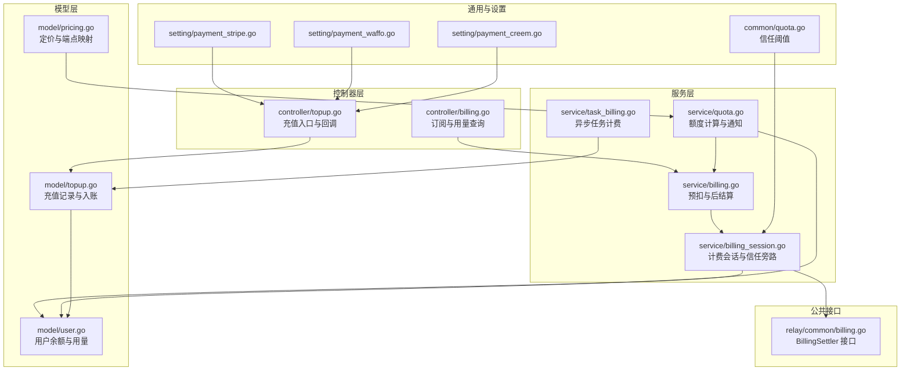
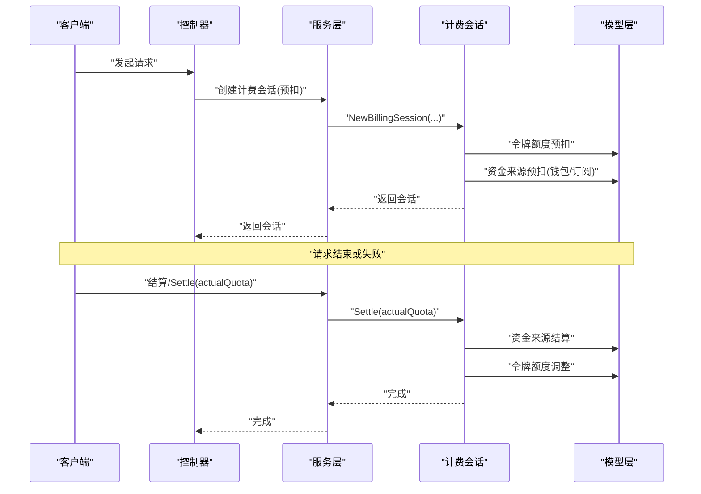
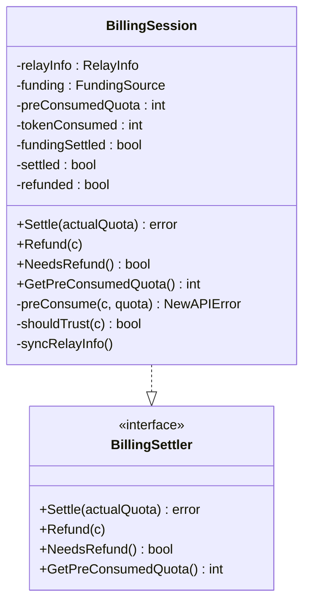
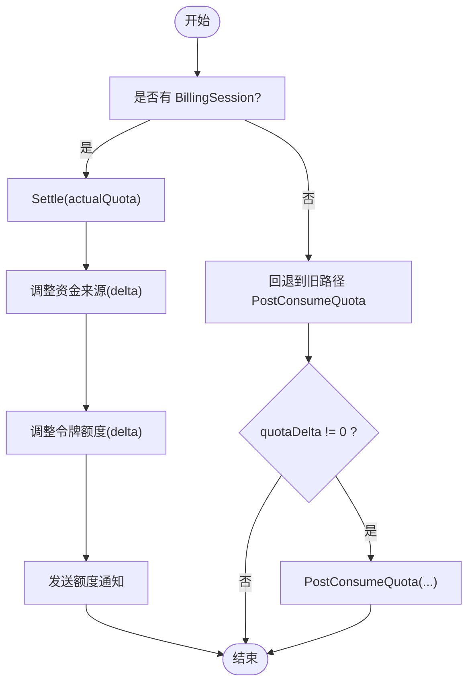
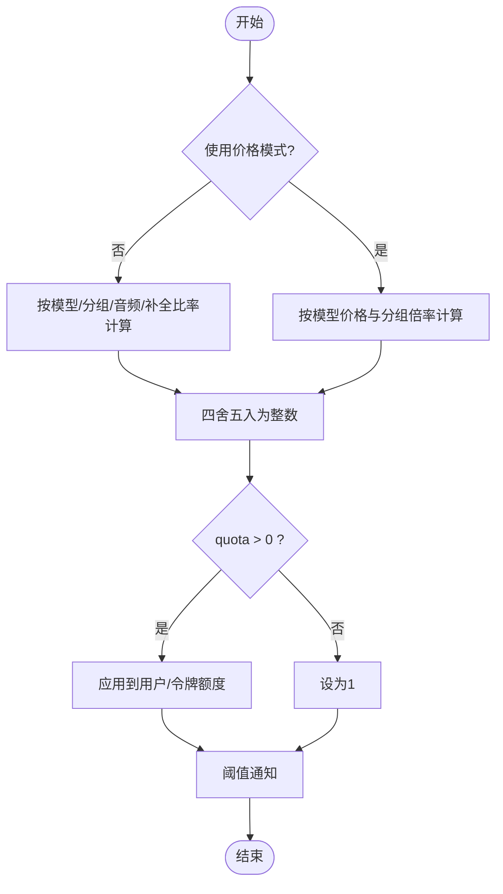
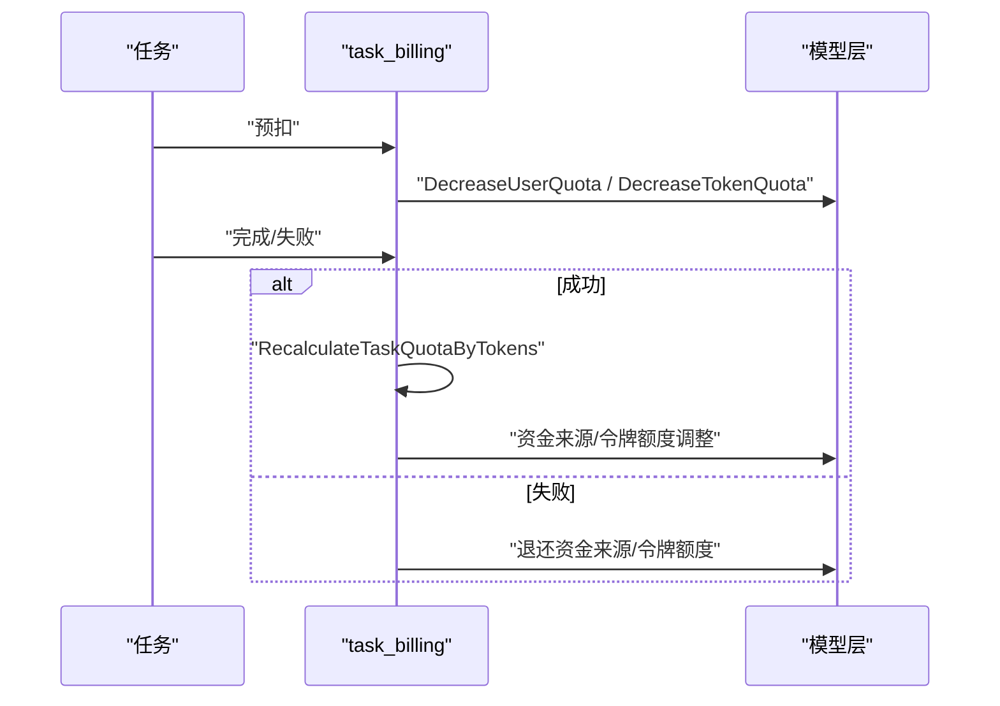
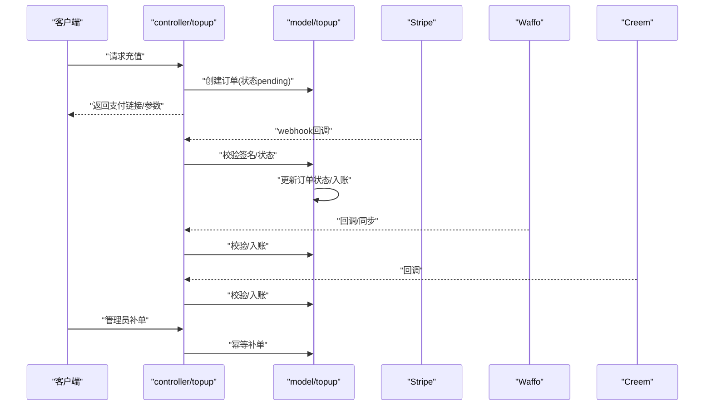
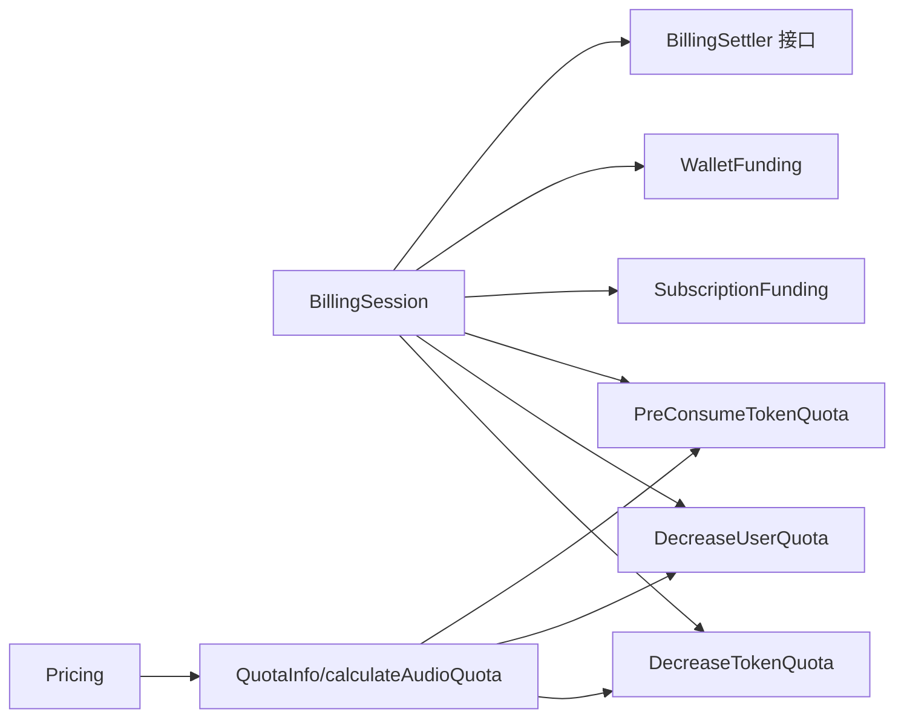

# 计费服务

<cite>
**本文引用的文件**
- [controller/billing.go](file://controller/billing.go)
- [service/billing.go](file://service/billing.go)
- [service/billing_session.go](file://service/billing_session.go)
- [relay/common/billing.go](file://relay/common/billing.go)
- [service/quota.go](file://service/quota.go)
- [service/task_billing.go](file://service/task_billing.go)
- [model/topup.go](file://model/topup.go)
- [controller/topup.go](file://controller/topup.go)
- [model/pricing.go](file://model/pricing.go)
- [model/user.go](file://model/user.go)
- [common/quota.go](file://common/quota.go)
- [setting/payment_stripe.go](file://setting/payment_stripe.go)
- [setting/payment_waffo.go](file://setting/payment_waffo.go)
- [setting/payment_creem.go](file://setting/payment_creem.go)
</cite>

## 目录
1. [简介](#简介)
2. [项目结构](#项目结构)
3. [核心组件](#核心组件)
4. [架构总览](#架构总览)
5. [详细组件分析](#详细组件分析)
6. [依赖分析](#依赖分析)
7. [性能考虑](#性能考虑)
8. [故障排查指南](#故障排查指南)
9. [结论](#结论)
10. [附录](#附录)

## 简介
本文件面向计费服务模块，系统性阐述余额管理、消费计费、充值管理与配额控制的业务逻辑与实现细节。重点覆盖：
- 计费规则计算、使用量统计、账单生成与退款处理机制
- 余额扣减、预充值与透支控制策略
- 计费会话管理、批量计费与实时扣费机制
- 充值渠道集成、支付状态同步与异常处理
- 事务边界管理与数据一致性保障
- 为开发者提供可扩展的计费流程与最佳实践

## 项目结构
计费服务横跨控制器层、服务层、模型层与设置层，围绕“会话驱动”的统一计费框架展开，结合令牌额度与资金来源（钱包/订阅）实现预扣、结算与退款。

图示来源
- [controller/billing.go:1-109](file://controller/billing.go#L1-L109)
- [controller/topup.go:1-471](file://controller/topup.go#L1-L471)
- [service/billing.go:1-79](file://service/billing.go#L1-L79)
- [service/billing_session.go:1-348](file://service/billing_session.go#L1-L348)
- [relay/common/billing.go:1-22](file://relay/common/billing.go#L1-L22)
- [service/quota.go:1-508](file://service/quota.go#L1-L508)
- [service/task_billing.go:1-302](file://service/task_billing.go#L1-L302)
- [model/topup.go:1-452](file://model/topup.go#L1-L452)
- [model/pricing.go:1-347](file://model/pricing.go#L1-L347)
- [model/user.go:1-800](file://model/user.go#L1-L800)
- [common/quota.go:1-6](file://common/quota.go#L1-L6)
- [setting/payment_stripe.go:1-9](file://setting/payment_stripe.go#L1-L9)
- [setting/payment_waffo.go:1-68](file://setting/payment_waffo.go#L1-L68)
- [setting/payment_creem.go:1-7](file://setting/payment_creem.go#L1-L7)

章节来源
- [controller/billing.go:1-109](file://controller/billing.go#L1-L109)
- [controller/topup.go:1-471](file://controller/topup.go#L1-L471)
- [service/billing.go:1-79](file://service/billing.go#L1-L79)
- [service/billing_session.go:1-348](file://service/billing_session.go#L1-L348)
- [relay/common/billing.go:1-22](file://relay/common/billing.go#L1-L22)
- [service/quota.go:1-508](file://service/quota.go#L1-L508)
- [service/task_billing.go:1-302](file://service/task_billing.go#L1-L302)
- [model/topup.go:1-452](file://model/topup.go#L1-L452)
- [model/pricing.go:1-347](file://model/pricing.go#L1-L347)
- [model/user.go:1-800](file://model/user.go#L1-L800)
- [common/quota.go:1-6](file://common/quota.go#L1-L6)
- [setting/payment_stripe.go:1-9](file://setting/payment_stripe.go#L1-L9)
- [setting/payment_waffo.go:1-68](file://setting/payment_waffo.go#L1-L68)
- [setting/payment_creem.go:1-7](file://setting/payment_creem.go#L1-L7)

## 核心组件
- 计费会话（BillingSession）：封装预扣、结算、退款的生命周期，支持信任额度旁路与资金来源（钱包/订阅）切换。
- 预扣与后结算（PreConsume/Settle）：统一入口创建会话并执行预扣，最终根据实际用量结算，支持旧路径兼容。
- 额度计算与通知（QuotaInfo/calculateAudioQuota）：按模型倍率、分组倍率、音频/补全比率计算应扣额度，并在阈值触发提醒。
- 异步任务计费（taskBilling）：对后台任务进行预扣、差额结算与退款，保障令牌与资金来源一致性。
- 充值管理（TopUp）：多渠道充值（Stripe、Waffo、Creem、易支付）入账与幂等处理，支持管理员补单。
- 定价与端点（Pricing）：构建前端可用的定价与端点映射，支撑计费规则与计费会话选择。

章节来源
- [service/billing_session.go:23-348](file://service/billing_session.go#L23-L348)
- [service/billing.go:17-79](file://service/billing.go#L17-L79)
- [service/quota.go:27-87](file://service/quota.go#L27-L87)
- [service/task_billing.go:17-302](file://service/task_billing.go#L17-L302)
- [model/topup.go:60-452](file://model/topup.go#L60-L452)
- [model/pricing.go:63-347](file://model/pricing.go#L63-L347)

## 架构总览
计费服务采用“会话驱动 + 多资金来源”的统一架构：
- 会话层（BillingSession）负责预扣、结算与退款，隔离令牌额度与资金来源的耦合。
- 服务层（quota、billing、task_billing）提供额度计算、预扣后结算与异步任务计费。
- 控制器层（billing、topup）暴露对外接口，接入充值与订阅查询。
- 模型层（user、topup、pricing）承载余额、充值记录与定价规则。
- 设置层（payment_*）提供第三方支付配置。

图示来源
- [service/billing.go:17-79](file://service/billing.go#L17-L79)
- [service/billing_session.go:36-192](file://service/billing_session.go#L36-L192)
- [model/user.go:780-800](file://model/user.go#L780-L800)

## 详细组件分析

### 计费会话（BillingSession）
- 预扣流程：令牌额度预扣 → 资金来源预扣（钱包/订阅）。任一步骤失败自动回滚已扣额度。
- 信任旁路：当用户满足“信任额度阈值”且非异步任务时，可跳过预扣，直接走资金来源预扣。
- 结算流程：计算差额 delta，先结算资金来源，再调整令牌额度；若资金来源已提交而令牌调整失败，记录系统日志并标记会话已结算，避免重复退款。
- 退款流程：异步执行，幂等安全；若资金来源已提交则不再退款，防止重复退款。

图示来源
- [service/billing_session.go:23-141](file://service/billing_session.go#L23-L141)
- [relay/common/billing.go:5-22](file://relay/common/billing.go#L5-L22)

章节来源
- [service/billing_session.go:36-192](file://service/billing_session.go#L36-L192)
- [service/billing_session.go:194-228](file://service/billing_session.go#L194-L228)
- [service/billing_session.go:230-248](file://service/billing_session.go#L230-L248)
- [relay/common/billing.go:5-22](file://relay/common/billing.go#L5-L22)

### 预扣与后结算（PreConsume/Settle）
- 预扣入口：PreConsumeBilling 创建会话并存储于 RelayInfo，供后续 Settle 使用。
- 后结算：SettleBilling 优先使用会话结算；若无会话则回退到旧路径 PostConsumeQuota。
- 差额处理：根据实际用量与预扣量的差额，调整资金来源与令牌额度，并发送额度通知。

图示来源
- [service/billing.go:34-78](file://service/billing.go#L34-L78)
- [service/quota.go:367-411](file://service/quota.go#L367-L411)

章节来源
- [service/billing.go:17-79](file://service/billing.go#L17-L79)
- [service/billing.go:34-78](file://service/billing.go#L34-L78)
- [service/quota.go:367-411](file://service/quota.go#L367-L411)

### 额度计算与通知
- 额度计算：支持按模型倍率、分组倍率、音频/补全比率计算；当比率配置缺失时按默认策略回退。
- 实时流式与音频计费：提供 PreWssConsumeQuota、PostWssConsumeQuota、PostAudioConsumeQuota，分别用于实时流与音频场景。
- 通知机制：当用户额度低于阈值时，按用户设置的通知方式（邮件/Bark/Gotify/Webhook）发送提醒。

图示来源
- [service/quota.go:50-87](file://service/quota.go#L50-L87)
- [service/quota.go:89-155](file://service/quota.go#L89-L155)
- [service/quota.go:259-341](file://service/quota.go#L259-L341)
- [service/quota.go:413-507](file://service/quota.go#L413-L507)

章节来源
- [service/quota.go:50-87](file://service/quota.go#L50-L87)
- [service/quota.go:89-155](file://service/quota.go#L89-L155)
- [service/quota.go:259-341](file://service/quota.go#L259-L341)
- [service/quota.go:413-507](file://service/quota.go#L413-L507)

### 异步任务计费
- 预扣：任务开始前进行预扣，记录任务私有数据（资金来源、订阅ID、令牌ID等）。
- 差额结算：根据实际 token 重新计算应扣额度，与预扣差额进行补扣或退还。
- 退款：任务失败时统一退还资金来源与令牌额度，并记录退款日志。

图示来源
- [service/task_billing.go:17-65](file://service/task_billing.go#L17-L65)
- [service/task_billing.go:150-182](file://service/task_billing.go#L150-L182)
- [service/task_billing.go:184-301](file://service/task_billing.go#L184-L301)

章节来源
- [service/task_billing.go:17-65](file://service/task_billing.go#L17-L65)
- [service/task_billing.go:150-182](file://service/task_billing.go#L150-L182)
- [service/task_billing.go:184-301](file://service/task_billing.go#L184-L301)

### 充值管理与渠道集成
- Stripe：在线充值，回调校验签名后幂等入账，支持 Stripe 最小充值限制。
- Waffo：全球支付，支持沙箱与正式环境，按金额换算额度。
- Creem：按产品配置充值，支持邮箱回填与幂等处理。
- 易支付：兼容回调，校验签名后入账并增加用户额度。
- 管理员补单：对异常订单进行手动补单，保证幂等与一致性。

图示来源
- [controller/topup.go:166-239](file://controller/topup.go#L166-L239)
- [controller/topup.go:283-370](file://controller/topup.go#L283-L370)
- [model/topup.go:60-111](file://model/topup.go#L60-L111)
- [model/topup.go:315-388](file://model/topup.go#L315-L388)
- [model/topup.go:390-451](file://model/topup.go#L390-L451)
- [model/topup.go:244-314](file://model/topup.go#L244-L314)

章节来源
- [controller/topup.go:166-239](file://controller/topup.go#L166-L239)
- [controller/topup.go:283-370](file://controller/topup.go#L283-L370)
- [model/topup.go:60-111](file://model/topup.go#L60-L111)
- [model/topup.go:315-388](file://model/topup.go#L315-L388)
- [model/topup.go:390-451](file://model/topup.go#L390-L451)
- [model/topup.go:244-314](file://model/topup.go#L244-L314)

### 订阅与余额管理
- 订阅计费：在创建会话时选择订阅资金来源，支持订阅额度不足与无有效订阅的降级策略。
- 余额与用量：用户余额、令牌余额与已用额度的查询与更新，支持事务与行级锁保证一致性。
- 信任额度：当用户余额超过信任阈值时，可启用信任旁路，减少预扣次数。

章节来源
- [service/billing_session.go:254-347](file://service/billing_session.go#L254-L347)
- [model/user.go:780-800](file://model/user.go#L780-L800)
- [common/quota.go:3-6](file://common/quota.go#L3-L6)

## 依赖分析
- 会话接口：BillingSettler 抽象了结算与退款行为，避免循环引用并统一生命周期管理。
- 会话与资金来源：WalletFunding 与 SubscriptionFunding 分别对接钱包与订阅，支持预扣与结算。
- 令牌与用户：PreConsumeTokenQuota 与 Decrease/IncreaseUserQuota/TokenQuota 保证令牌与用户余额的一致性。
- 定价与比率：Pricing 提供模型与端点映射，QuotaInfo 与 calculateAudioQuota 依据比率计算应扣额度。

图示来源
- [relay/common/billing.go:5-22](file://relay/common/billing.go#L5-L22)
- [service/billing_session.go:147-192](file://service/billing_session.go#L147-L192)
- [service/quota.go:343-411](file://service/quota.go#L343-L411)
- [model/pricing.go:63-347](file://model/pricing.go#L63-L347)

章节来源
- [relay/common/billing.go:5-22](file://relay/common/billing.go#L5-L22)
- [service/billing_session.go:147-192](file://service/billing_session.go#L147-L192)
- [service/quota.go:343-411](file://service/quota.go#L343-L411)
- [model/pricing.go:63-347](file://model/pricing.go#L63-L347)

## 性能考虑
- 信任额度旁路：在高并发下减少预扣与回滚开销，提升吞吐。
- 异步退款：退款通过协程池异步执行，避免阻塞主流程。
- 事务与行级锁：充值与补单使用 FOR UPDATE 与事务包裹，保证幂等与一致性。
- 缓存与批量更新：用户余额与用量更新采用批量与缓存策略，降低数据库压力。

## 故障排查指南
- 预扣失败：检查令牌额度与用户余额是否充足；若订阅预扣失败，确认订阅有效性与额度。
- 结算失败：关注资金来源结算成功但令牌调整失败的日志，系统会记录并标记会话已结算。
- 充值回调异常：核对签名验证、订单状态与支付方式匹配；Stripe/Waffo/Creem 需符合各自最小充值限制。
- 退款未到账：确认会话是否已结算或退款；若资金来源已提交，退款会被忽略以避免重复退款。
- 通知未送达：检查用户设置的通知方式与阈值配置。

章节来源
- [service/billing_session.go:168-184](file://service/billing_session.go#L168-L184)
- [service/billing_session.go:66-70](file://service/billing_session.go#L66-L70)
- [controller/topup.go:283-370](file://controller/topup.go#L283-L370)
- [service/billing.go:57-59](file://service/billing.go#L57-L59)

## 结论
计费服务通过“会话驱动 + 多资金来源”的设计，实现了预扣、结算与退款的统一管理；结合令牌额度与用户余额的严格控制，配合充值渠道与通知机制，形成完整的闭环。开发者可在此基础上扩展新的资金来源、计费规则与通知方式，同时遵循事务边界与一致性原则，确保系统稳定与可维护性。

## 附录
- 订阅查询与用量查询：OpenAI 兼容接口，支持按展示类型转换额度显示。
- 定价版本与端点映射：前端友好展示，支持自定义端点覆盖默认端点。

章节来源
- [controller/billing.go:11-109](file://controller/billing.go#L11-L109)
- [model/pricing.go:343-347](file://model/pricing.go#L343-L347)