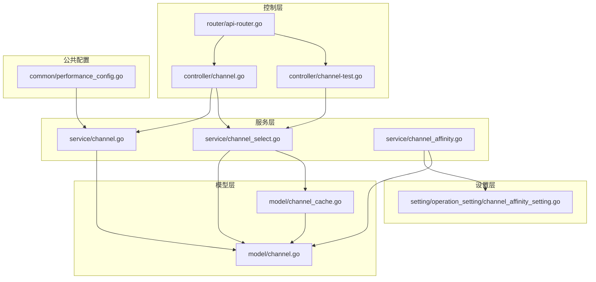
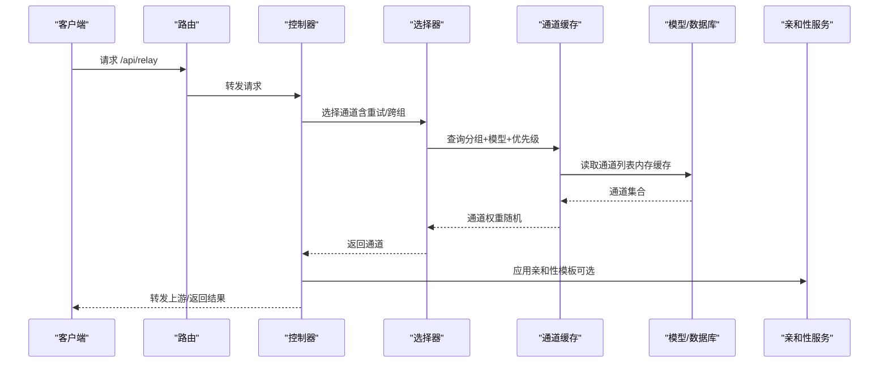
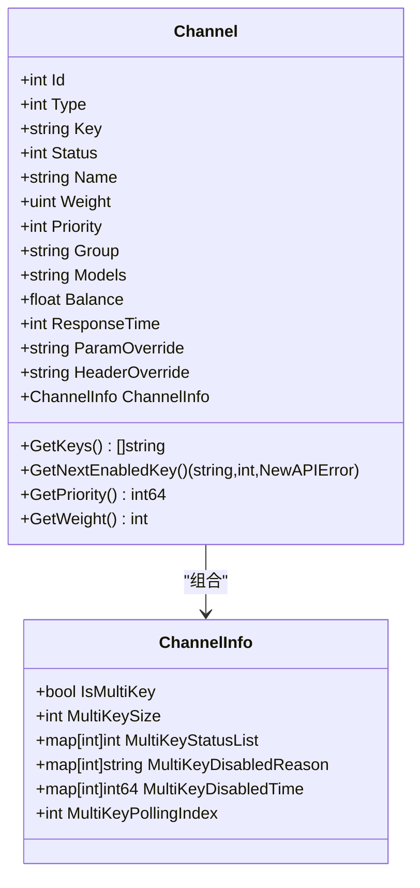
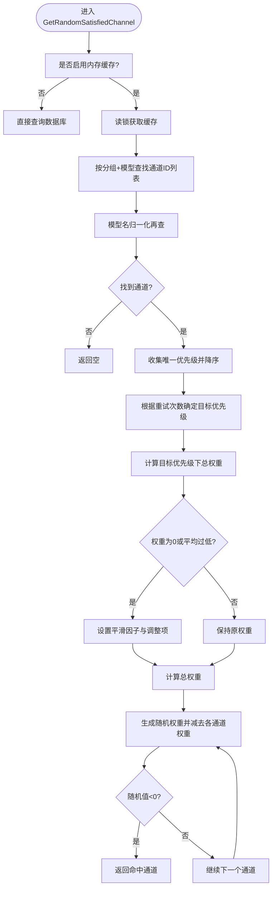
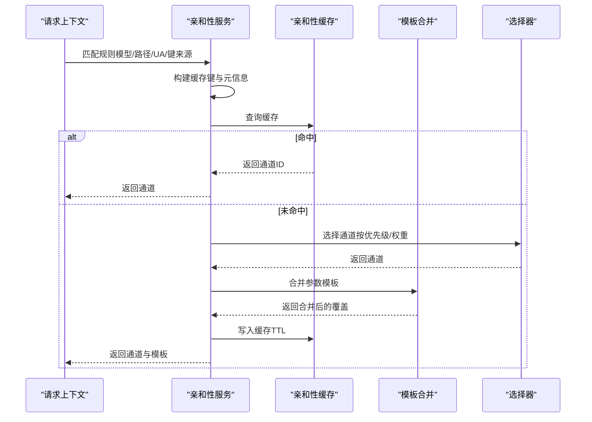
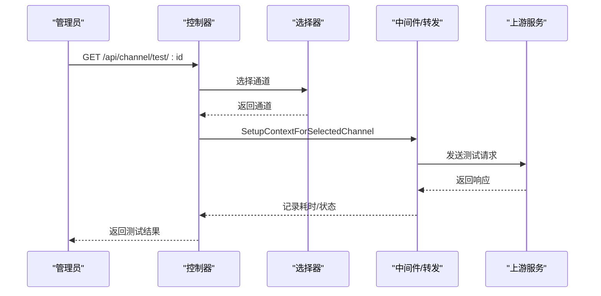
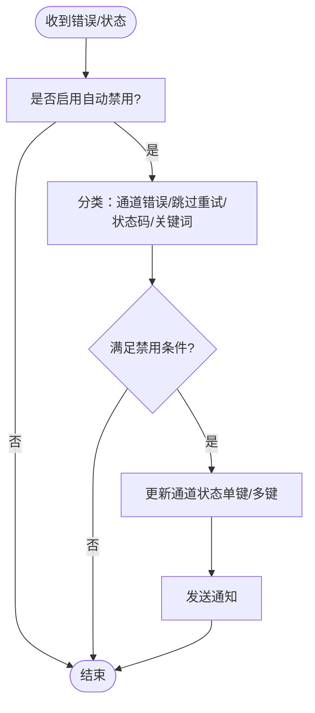
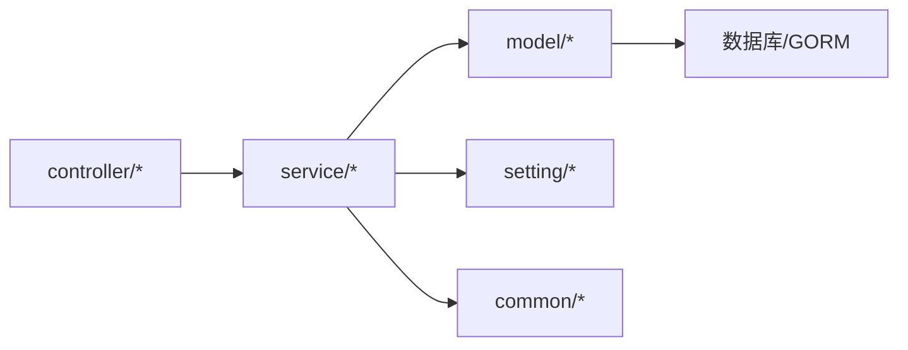

# 通道服务

<cite>
**本文引用的文件**
- [controller/channel.go](file://controller/channel.go)
- [controller/channel-test.go](file://controller/channel-test.go)
- [service/channel.go](file://service/channel.go)
- [service/channel_select.go](file://service/channel_select.go)
- [service/channel_affinity.go](file://service/channel_affinity.go)
- [model/channel.go](file://model/channel.go)
- [model/channel_cache.go](file://model/channel_cache.go)
- [setting/operation_setting/channel_affinity_setting.go](file://setting/operation_setting/channel_affinity_setting.go)
- [router/api-router.go](file://router/api-router.go)
- [common/performance_config.go](file://common/performance_config.go)
</cite>

## 目录
1. [简介](#简介)
2. [项目结构](#项目结构)
3. [核心组件](#核心组件)
4. [架构总览](#架构总览)
5. [详细组件分析](#详细组件分析)
6. [依赖分析](#依赖分析)
7. [性能考量](#性能考量)
8. [故障排查指南](#故障排查指南)
9. [结论](#结论)
10. [附录](#附录)

## 简介
本技术文档聚焦“通道服务模块”，系统化阐述AI服务通道的管理、选择与监控机制，包括：
- 通道健康检查与自动测试
- 权重计算与优先级调度
- 故障转移与跨分组重试
- 负载均衡算法与亲和性匹配
- 通道配置验证、API密钥管理与连接池优化建议
- 缓存策略与性能监控指标
- 通道状态管理、异常处理与降级策略
- 路由逻辑与扩展方法

目标是帮助开发者快速理解并高效扩展通道服务。

## 项目结构
通道服务涉及控制器、服务层、模型层与设置层的协同：
- 控制器负责API入口、密钥读取、通道测试与批量操作
- 服务层负责通道选择、亲和性匹配、状态变更与自动禁用/启用
- 模型层负责通道实体、能力映射、内存缓存与数据库交互
- 设置层提供亲和性规则、状态码重试策略等运行期配置

**图表来源**
- [controller/channel.go:1-800](file://controller/channel.go#L1-L800)
- [controller/channel-test.go:1-200](file://controller/channel-test.go#L1-L200)
- [service/channel.go:1-79](file://service/channel.go#L1-L79)
- [service/channel_select.go:1-163](file://service/channel_select.go#L1-L163)
- [service/channel_affinity.go:1-800](file://service/channel_affinity.go#L1-L800)
- [model/channel.go:1-1009](file://model/channel.go#L1-L1009)
- [model/channel_cache.go:1-266](file://model/channel_cache.go#L1-L266)
- [setting/operation_setting/channel_affinity_setting.go:1-122](file://setting/operation_setting/channel_affinity_setting.go#L1-L122)
- [router/api-router.go:205-228](file://router/api-router.go#L205-L228)
- [common/performance_config.go:1-34](file://common/performance_config.go#L1-L34)

**章节来源**
- [controller/channel.go:1-800](file://controller/channel.go#L1-L800)
- [router/api-router.go:205-228](file://router/api-router.go#L205-L228)

## 核心组件
- 通道实体与配置
  - 通道实体包含类型、密钥、权重、优先级、分组、模型集合、余额、响应时间等字段，并提供多键模式、轮询索引与状态管理能力
  - 通道设置与覆盖：支持参数覆盖、请求头覆盖、其他设置等
- 通道缓存与选择
  - 内存缓存：按分组与模型构建索引，支持优先级排序与权重随机选择
  - 选择策略：支持“auto”分组跨组重试、优先级递增、重试计数与状态持久化
- 亲和性匹配
  - 基于规则的键提取（上下文、JSON路径、UA等），构建缓存键并记录命中统计
- 健康检查与自动测试
  - 控制器提供单通道/全量测试接口，支持自动定时测试与结果回写
- 状态管理与自动禁用/启用
  - 基于状态码、关键词与错误类型自动禁用通道，支持自动启用条件

**章节来源**
- [model/channel.go:21-58](file://model/channel.go#L21-L58)
- [model/channel.go:844-919](file://model/channel.go#L844-L919)
- [model/channel_cache.go:17-86](file://model/channel_cache.go#L17-L86)
- [service/channel_select.go:14-163](file://service/channel_select.go#L14-L163)
- [service/channel_affinity.go:59-196](file://service/channel_affinity.go#L59-L196)
- [controller/channel-test.go:59-200](file://controller/channel-test.go#L59-L200)
- [service/channel.go:14-79](file://service/channel.go#L14-L79)

## 架构总览
通道服务的典型调用链路如下：

**图表来源**
- [router/api-router.go:205-228](file://router/api-router.go#L205-L228)
- [controller/channel.go:361-416](file://controller/channel.go#L361-L416)
- [service/channel_select.go:83-163](file://service/channel_select.go#L83-L163)
- [model/channel_cache.go:96-191](file://model/channel_cache.go#L96-L191)
- [service/channel_affinity.go:545-619](file://service/channel_affinity.go#L545-L619)

## 详细组件分析

### 通道实体与配置
- 关键字段
  - 类型、密钥、权重、优先级、分组、模型集合、余额、响应时间、状态、备注、标签、参数/请求头覆盖、其他设置
- 多键模式
  - 支持随机与轮询两种模式，维护每键状态、禁用原因与时间，以及轮询索引
- 设置与覆盖
  - 通道设置（ChannelSettings）、其他设置（ChannelOtherSettings）、参数覆盖（ParamOverride）、请求头覆盖（HeaderOverride）

**图表来源**
- [model/channel.go:21-58](file://model/channel.go#L21-L58)
- [model/channel.go:60-68](file://model/channel.go#L60-L68)
- [model/channel.go:105-190](file://model/channel.go#L105-L190)

**章节来源**
- [model/channel.go:21-58](file://model/channel.go#L21-L58)
- [model/channel.go:60-68](file://model/channel.go#L60-L68)
- [model/channel.go:844-919](file://model/channel.go#L844-L919)

### 通道缓存与选择
- 内存缓存
  - group2model2channels：按分组与模型索引通道ID列表，按优先级降序排列
  - channelsIDM：完整通道映射，用于一致性校验与读取
- 选择算法
  - 优先级过滤：按重试次数定位目标优先级
  - 权重重选：若sumWeight为0或平均权重过低，采用平滑因子与调整项
  - 随机权重选择：在总权重范围内生成随机值，命中对应通道
- “auto”分组与跨组重试
  - 通过上下文跟踪当前分组索引与起始重试索引，优先用尽当前分组优先级后再切换

**图表来源**
- [model/channel_cache.go:96-191](file://model/channel_cache.go#L96-L191)

**章节来源**
- [model/channel_cache.go:17-86](file://model/channel_cache.go#L17-L86)
- [model/channel_cache.go:96-191](file://model/channel_cache.go#L96-L191)
- [service/channel_select.go:83-163](file://service/channel_select.go#L83-L163)

### 通道亲和性匹配与模板应用
- 规则匹配
  - 基于模型正则、路径正则、UA包含、键来源（上下文/JSON路径）进行匹配
  - 支持值正则过滤、TTL秒、是否包含分组/模型名/规则名
- 缓存键与上下文
  - 构建带规则名/模型名/分组的缓存键，记录元信息（键来源、指纹、提示等）
- 模板合并
  - 将规则模板与通道参数覆盖合并，支持操作数组追加
- 成功记录与统计
  - 成功后写入缓存；统计窗口内命中/总次数、tokens等

**图表来源**
- [service/channel_affinity.go:545-703](file://service/channel_affinity.go#L545-L703)
- [setting/operation_setting/channel_affinity_setting.go:11-36](file://setting/operation_setting/channel_affinity_setting.go#L11-L36)

**章节来源**
- [service/channel_affinity.go:59-196](file://service/channel_affinity.go#L59-L196)
- [service/channel_affinity.go:545-703](file://service/channel_affinity.go#L545-L703)
- [setting/operation_setting/channel_affinity_setting.go:76-122](file://setting/operation_setting/channel_affinity_setting.go#L76-L122)

### 健康检查与自动测试
- 接口
  - 单通道测试：/api/channel/test/:id
  - 全量测试：/api/channel/test
  - 定时任务：后台周期性自动测试
- 测试流程
  - 选择测试模型与端点类型，构造测试请求，调用中间件设置上下文，转发到上游，记录响应时间与状态

**图表来源**
- [controller/channel-test.go:59-200](file://controller/channel-test.go#L59-L200)
- [router/api-router.go:215-216](file://router/api-router.go#L215-L216)

**章节来源**
- [controller/channel-test.go:59-200](file://controller/channel-test.go#L59-L200)
- [controller/channel.go:383-416](file://controller/channel.go#L383-L416)

### 状态管理、自动禁用与启用
- 自动禁用
  - 基于状态码范围、关键词匹配、跳过重试错误类型决定是否禁用
  - 多键通道按键粒度更新状态，全部禁用时整体禁用
- 自动启用
  - 成功且处于自动禁用状态时启用
- 通知
  - 禁用/启用事件通过通知主题上报

**图表来源**
- [service/channel.go:45-79](file://service/channel.go#L45-L79)
- [model/channel.go:611-680](file://model/channel.go#L611-L680)

**章节来源**
- [service/channel.go:14-79](file://service/channel.go#L14-L79)
- [model/channel.go:611-680](file://model/channel.go#L611-L680)

### API与密钥管理
- 密钥读取
  - /api/channel/:id/key 需要安全验证中间件，返回渠道密钥
- 配置校验
  - 通用校验函数对渠道设置、模型长度、特定渠道（如VertexAI）部署区域、Codex OAuth键等进行校验
- 批量与多键
  - 支持多键模式、批量添加、轮询与随机模式

**章节来源**
- [router/api-router.go:214](file://router/api-router.go#L214)
- [controller/channel.go:383-416](file://controller/channel.go#L383-L416)
- [controller/channel.go:435-493](file://controller/channel.go#L435-L493)
- [model/channel.go:105-190](file://model/channel.go#L105-L190)

## 依赖分析
- 控制器依赖服务层与模型层，暴露REST接口
- 服务层依赖模型层与设置层，实现业务逻辑
- 模型层依赖数据库与缓存，提供数据访问与缓存更新
- 设置层提供运行期配置，影响亲和性与重试策略

**图表来源**
- [controller/channel.go:1-800](file://controller/channel.go#L1-L800)
- [service/channel.go:1-79](file://service/channel.go#L1-L79)
- [model/channel.go:1-1009](file://model/channel.go#L1-L1009)
- [setting/operation_setting/channel_affinity_setting.go:1-122](file://setting/operation_setting/channel_affinity_setting.go#L1-L122)

**章节来源**
- [controller/channel.go:1-800](file://controller/channel.go#L1-L800)
- [service/channel.go:1-79](file://service/channel.go#L1-L79)
- [model/channel.go:1-1009](file://model/channel.go#L1-L1009)

## 性能考量
- 内存缓存
  - 通道缓存按分组+模型索引，优先级降序，减少数据库查询
  - 亲和性缓存采用混合缓存（内存LRU+Redis），支持容量与TTL配置
- 权重平滑
  - 当权重为0或平均权重过低时，引入平滑因子与调整项，保证随机选择稳定性
- 连接池优化建议
  - 上游HTTP客户端连接池参数应结合并发与超时策略配置，避免阻塞
  - 对上游限流/熔断策略进行统一管理，防止雪崩
- 监控与阈值
  - 性能监控配置支持CPU/Memory/Disk阈值，便于及时发现资源瓶颈

**章节来源**
- [model/channel_cache.go:162-174](file://model/channel_cache.go#L162-L174)
- [service/channel_affinity.go:81-109](file://service/channel_affinity.go#L81-L109)
- [common/performance_config.go:1-34](file://common/performance_config.go#L1-34)

## 故障排查指南
- 通道不可用
  - 检查通道状态与多键状态，确认是否存在全部禁用
  - 查看响应时间与余额，确认上游可用性
- 选择异常
  - 核对分组与模型映射，确认缓存是否同步
  - 检查优先级与权重，确认权重平滑是否生效
- 亲和性未命中
  - 检查规则匹配（模型/路径/UA/键来源），确认缓存键构建与TTL
  - 查看模板合并是否正确应用
- 自动禁用/启用
  - 检查状态码范围与关键词配置，确认是否误触发
  - 关注通知主题，核对禁用原因与时间

**章节来源**
- [model/channel.go:611-680](file://model/channel.go#L611-L680)
- [service/channel.go:45-79](file://service/channel.go#L45-L79)
- [service/channel_affinity.go:545-703](file://service/channel_affinity.go#L545-L703)

## 结论
通道服务通过“内存缓存+权重随机+亲和性模板”的组合，在保证高可用的同时提供了灵活的路由与扩展能力。配合健康检查、自动测试与状态管理，能够有效提升系统的稳定性与可观测性。建议在生产环境中结合性能监控与限流策略，持续优化通道权重与亲和性规则，以获得更优的吞吐与延迟表现。

## 附录
- API端点示例
  - 获取渠道密钥：/api/channel/:id/key（需安全验证）
  - 测试通道：/api/channel/test/:id
  - 全量测试：/api/channel/test
- 关键配置
  - 亲和性规则：规则名、模型正则、路径正则、UA包含、键来源、TTL、模板、是否包含分组/模型名/规则名
  - 自动测试开关与周期：monitor_setting.auto_test_channel_enabled/auto_test_channel_minutes

**章节来源**
- [router/api-router.go:214-216](file://router/api-router.go#L214-L216)
- [controller/channel-test.go:878-904](file://controller/channel-test.go#L878-L904)
- [setting/operation_setting/channel_affinity_setting.go:76-122](file://setting/operation_setting/channel_affinity_setting.go#L76-L122)