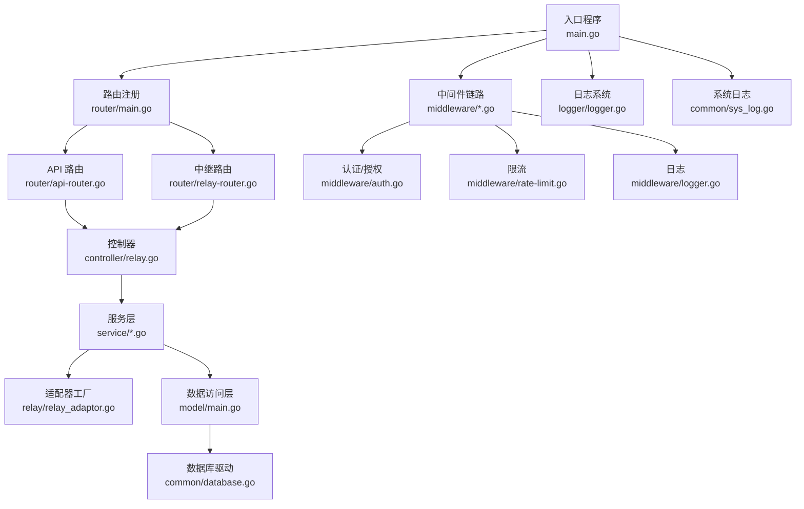
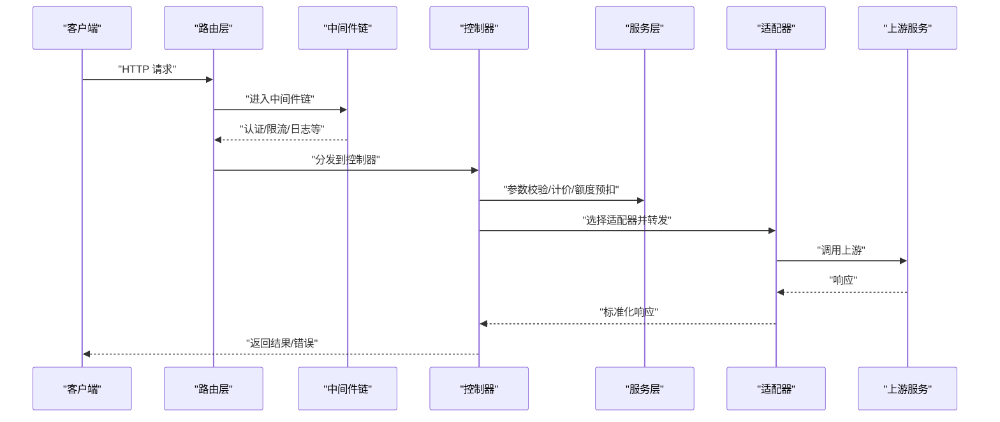
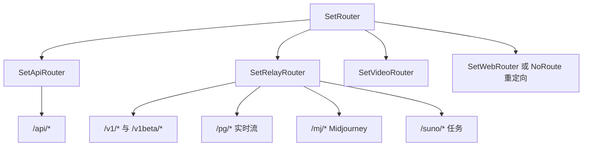
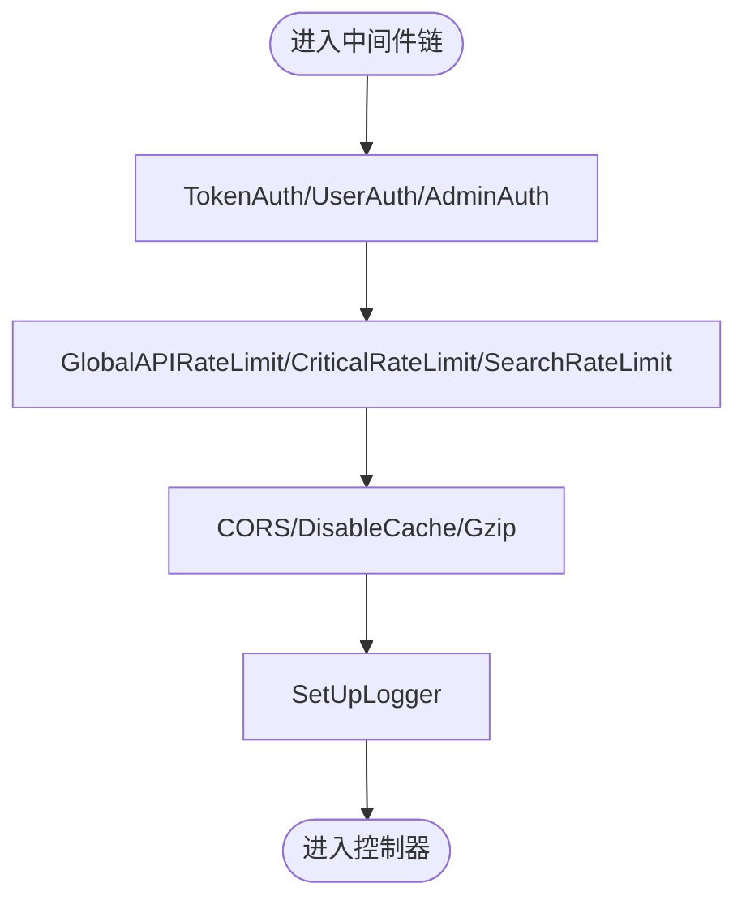
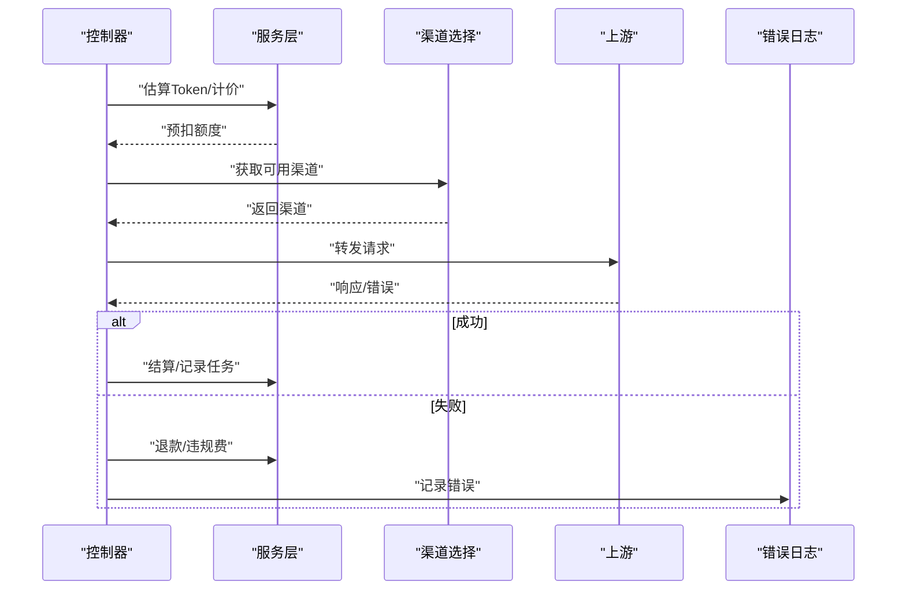
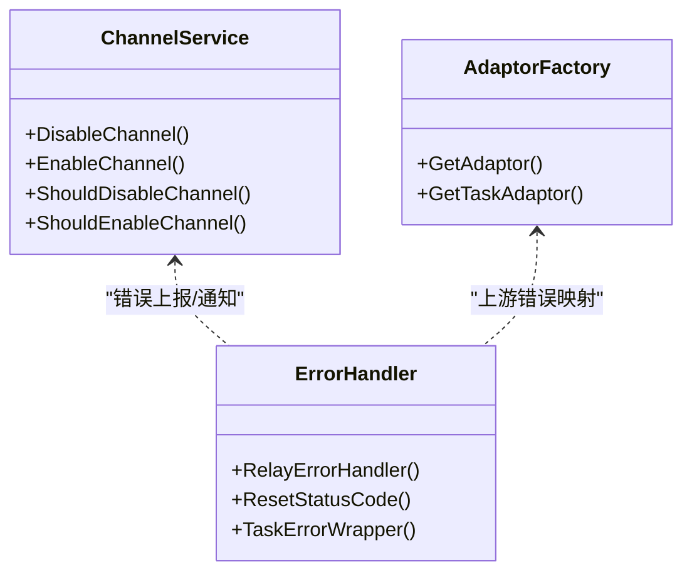
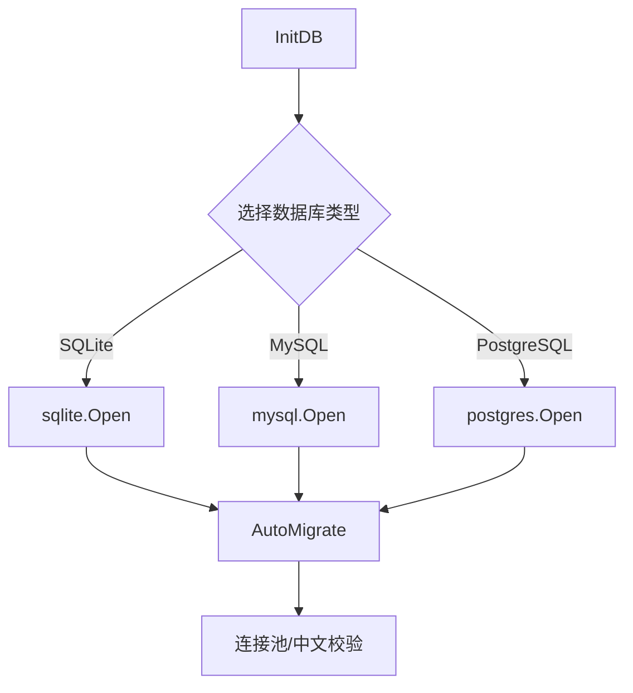
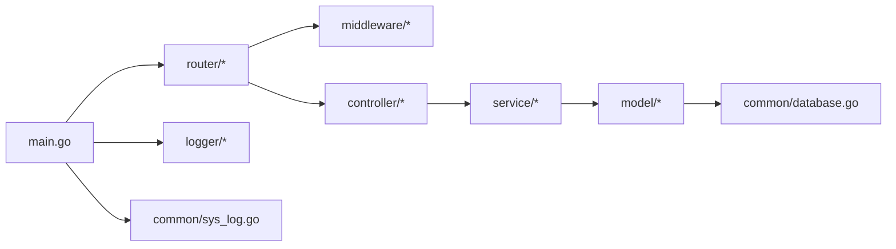

# 核心模块

<cite>
**本文引用的文件**
- [main.go](file://main.go)
- [router/main.go](file://router/main.go)
- [router/api-router.go](file://router/api-router.go)
- [router/relay-router.go](file://router/relay-router.go)
- [middleware/auth.go](file://middleware/auth.go)
- [middleware/rate-limit.go](file://middleware/rate-limit.go)
- [middleware/logger.go](file://middleware/logger.go)
- [controller/relay.go](file://controller/relay.go)
- [service/channel.go](file://service/channel.go)
- [service/error.go](file://service/error.go)
- [model/main.go](file://model/main.go)
- [common/database.go](file://common/database.go)
- [logger/logger.go](file://logger/logger.go)
- [common/sys_log.go](file://common/sys_log.go)
- [relay/relay_adaptor.go](file://relay/relay_adaptor.go)
</cite>

## 目录
1. [简介](#简介)
2. [项目结构](#项目结构)
3. [核心组件](#核心组件)
4. [架构总览](#架构总览)
5. [详细组件分析](#详细组件分析)
6. [依赖分析](#依赖分析)
7. [性能考量](#性能考量)
8. [故障排查指南](#故障排查指南)
9. [结论](#结论)
10. [附录](#附录)

## 简介
本文件面向 New API 项目的核心模块，系统性阐述路由系统、控制器层、服务层与数据访问层的设计与实现，覆盖中间件机制、认证授权流程、事务管理与异常处理策略，并提供可操作的最佳实践、扩展点与性能优化建议。读者无需深入 Go 语言背景即可理解各模块的协作方式与使用方法。

## 项目结构
项目采用“入口程序 → 路由注册 → 中间件链路 → 控制器 → 服务层 → 数据访问层”的分层架构。入口程序负责初始化资源、启动 HTTP 服务器与注册路由；路由层将请求分发至控制器；中间件贯穿于请求生命周期，完成认证、限流、日志等横切关注点；控制器协调服务层与适配器完成业务编排；服务层封装业务规则与外部调用；数据访问层通过 GORM 实现多数据库支持与迁移。

图表来源
- [main.go:43-199](file://main.go#L43-L199)
- [router/main.go:16-35](file://router/main.go#L16-L35)
- [router/api-router.go:14-380](file://router/api-router.go#L14-L380)
- [router/relay-router.go:13-225](file://router/relay-router.go#L13-L225)
- [controller/relay.go:67-242](file://controller/relay.go#L67-L242)
- [service/channel.go:18-79](file://service/channel.go#L18-L79)
- [relay/relay_adaptor.go:53-166](file://relay/relay_adaptor.go#L53-L166)
- [model/main.go:177-211](file://model/main.go#L177-L211)
- [common/database.go:3-16](file://common/database.go#L3-L16)
- [middleware/auth.go:36-440](file://middleware/auth.go#L36-L440)
- [middleware/rate-limit.go:21-206](file://middleware/rate-limit.go#L21-L206)
- [middleware/logger.go:19-41](file://middleware/logger.go#L19-L41)
- [logger/logger.go:42-74](file://logger/logger.go#L42-L74)
- [common/sys_log.go:17-37](file://common/sys_log.go#L17-L37)

章节来源
- [main.go:43-199](file://main.go#L43-L199)
- [router/main.go:16-35](file://router/main.go#L16-L35)

## 核心组件
- 路由系统：集中于 router 包，分别注册 API、中继、视频与 Web 前端路由，支持前端反向代理与静态资源托管。
- 中间件体系：认证授权、速率限制、CORS、gzip、请求日志、性能统计、分布式调度等，贯穿请求全生命周期。
- 控制器层：承接路由请求，进行参数校验、价格估算、额度预扣、渠道选择与重试、错误归并与上报。
- 服务层：封装业务规则、渠道禁用启用、错误映射与状态码重写、任务提交与结算、敏感词检测、计价与用量统计。
- 数据访问层：GORM 多数据库抽象，自动迁移、连接池配置、中文字符集校验、日志库分离与 Ping 探活。

章节来源
- [router/api-router.go:14-380](file://router/api-router.go#L14-L380)
- [router/relay-router.go:13-225](file://router/relay-router.go#L13-L225)
- [middleware/auth.go:36-440](file://middleware/auth.go#L36-L440)
- [middleware/rate-limit.go:21-206](file://middleware/rate-limit.go#L21-L206)
- [controller/relay.go:67-242](file://controller/relay.go#L67-L242)
- [service/channel.go:18-79](file://service/channel.go#L18-L79)
- [service/error.go:86-129](file://service/error.go#L86-L129)
- [model/main.go:177-211](file://model/main.go#L177-L211)

## 架构总览
New API 的请求处理路径遵循“路由 → 中间件 → 控制器 → 服务 → 适配器 → 上游”闭环，同时在控制器侧完成额度预扣、错误归并与渠道切换重试，确保高可用与可观测性。

图表来源
- [router/api-router.go:14-380](file://router/api-router.go#L14-L380)
- [router/relay-router.go:13-225](file://router/relay-router.go#L13-L225)
- [controller/relay.go:67-242](file://controller/relay.go#L67-L242)
- [relay/relay_adaptor.go:53-166](file://relay/relay_adaptor.go#L53-L166)

## 详细组件分析

### 路由系统
- API 路由：覆盖系统设置、OAuth、用户管理、订阅、频道、令牌、日志、数据看板、模型元数据、部署等完整后台能力。
- 中继路由：统一 OpenAI/Gemini/Claude 等多家上游的 API 兼容路径，支持 WebSocket 实时流与 HTTP 流式响应。
- Web 路由：在非主节点且未配置前端基地址时托管前端静态资源；否则对 404 进行永久重定向至外部前端。

图表来源
- [router/main.go:16-35](file://router/main.go#L16-L35)
- [router/api-router.go:14-380](file://router/api-router.go#L14-L380)
- [router/relay-router.go:13-225](file://router/relay-router.go#L13-L225)

章节来源
- [router/main.go:16-35](file://router/main.go#L16-L35)
- [router/api-router.go:14-380](file://router/api-router.go#L14-L380)
- [router/relay-router.go:13-225](file://router/relay-router.go#L13-L225)

### 认证授权与中间件
- 认证中间件：
  - 会话与访问令牌双轨验证，支持 New-Api-User 头部一致性校验。
  - 令牌级鉴权支持 WebSocket Sec-WebSocket-Protocol 与多平台密钥头兼容。
  - 用户组与令牌组优先级、IP 白名单限制、封禁状态拦截。
- 限流中间件：
  - 支持内存与 Redis 两种后端，按 IP 或用户维度限流，区分全局、关键操作、搜索等场景。
- 日志中间件：
  - 自定义 Gin 日志格式，携带路由标签与请求 ID，便于追踪。

图表来源
- [middleware/auth.go:36-440](file://middleware/auth.go#L36-L440)
- [middleware/rate-limit.go:21-206](file://middleware/rate-limit.go#L21-L206)
- [middleware/logger.go:19-41](file://middleware/logger.go#L19-L41)

章节来源
- [middleware/auth.go:36-440](file://middleware/auth.go#L36-L440)
- [middleware/rate-limit.go:21-206](file://middleware/rate-limit.go#L21-L206)
- [middleware/logger.go:19-41](file://middleware/logger.go#L19-L41)

### 控制器层：中继与任务编排
- 中继流程：
  - 参数校验与请求体存储复用。
  - 价格估算与额度预扣，失败即退款与违规费用收取。
  - 渠道选择与重试，自动禁用异常渠道，记录错误日志。
  - WebSocket 实时流与 HTTP 流式响应统一处理。
- 任务型中继：
  - 任务提交、轮询与错误重试策略，成功后结算、记录消费与插入任务。

图表来源
- [controller/relay.go:67-242](file://controller/relay.go#L67-L242)
- [service/error.go:86-129](file://service/error.go#L86-L129)
- [service/channel.go:18-79](file://service/channel.go#L18-L79)

章节来源
- [controller/relay.go:67-242](file://controller/relay.go#L67-L242)
- [service/error.go:86-129](file://service/error.go#L86-L129)
- [service/channel.go:18-79](file://service/channel.go#L18-L79)

### 服务层：业务规则与适配器
- 渠道管理：自动禁用/启用、关键词触发禁用、状态变更通知。
- 错误处理：统一错误包装、状态码映射与本地化消息，支持任务错误与实时错误。
- 适配器工厂：按上游类型动态选择适配器，支持 OpenAI、Gemini、Claude、阿里云、AWS 等多家厂商。

图表来源
- [service/channel.go:18-79](file://service/channel.go#L18-L79)
- [service/error.go:86-129](file://service/error.go#L86-L129)
- [relay/relay_adaptor.go:53-166](file://relay/relay_adaptor.go#L53-L166)

章节来源
- [service/channel.go:18-79](file://service/channel.go#L18-L79)
- [service/error.go:86-129](file://service/error.go#L86-L129)
- [relay/relay_adaptor.go:53-166](file://relay/relay_adaptor.go#L53-L166)

### 数据访问层：多数据库与迁移
- 数据库选择：支持 SQLite、MySQL、PostgreSQL，自动迁移与连接池配置，中文字符集校验。
- 日志库分离：独立日志数据库 DSN，避免主库压力。
- 探活与迁移：定时 Ping、快速迁移与并发迁移策略。

图表来源
- [model/main.go:177-211](file://model/main.go#L177-L211)
- [model/main.go:250-297](file://model/main.go#L250-L297)
- [common/database.go:3-16](file://common/database.go#L3-L16)

章节来源
- [model/main.go:177-211](file://model/main.go#L177-L211)
- [model/main.go:250-297](file://model/main.go#L250-L297)
- [common/database.go:3-16](file://common/database.go#L3-L16)

## 依赖分析
- 入口程序依赖路由、中间件、控制器、服务与模型包，负责初始化与启动。
- 路由依赖中间件与控制器，形成清晰的控制反转。
- 控制器依赖服务与适配器，解耦上游差异。
- 服务层依赖模型与工具包，封装业务规则。
- 数据访问层依赖 GORM 与数据库驱动，提供统一抽象。

图表来源
- [main.go:43-199](file://main.go#L43-L199)
- [router/main.go:16-35](file://router/main.go#L16-L35)
- [controller/relay.go:67-242](file://controller/relay.go#L67-L242)
- [service/channel.go:18-79](file://service/channel.go#L18-L79)
- [model/main.go:177-211](file://model/main.go#L177-L211)
- [common/database.go:3-16](file://common/database.go#L3-L16)
- [logger/logger.go:42-74](file://logger/logger.go#L42-L74)
- [common/sys_log.go:17-37](file://common/sys_log.go#L17-L37)

章节来源
- [main.go:43-199](file://main.go#L43-L199)
- [router/main.go:16-35](file://router/main.go#L16-L35)

## 性能考量
- 连接池与方言：根据数据库类型启用 PrepareStmt 与连接池上限，降低开销。
- 中文字符集：MySQL 自检确保默认字符集与排序规则支持中文，避免编码问题。
- 日志落盘：日志文件轮转与多写入器，减少阻塞。
- 限流策略：按场景与维度（IP/用户）差异化限流，避免雪崩。
- 并发迁移：多表并发迁移，缩短启动时间。
- 探活与健康：定时 Ping 数据库，保障可用性。

章节来源
- [model/main.go:177-211](file://model/main.go#L177-L211)
- [model/main.go:299-366](file://model/main.go#L299-L366)
- [logger/logger.go:42-74](file://logger/logger.go#L42-L74)
- [middleware/rate-limit.go:21-206](file://middleware/rate-limit.go#L21-L206)

## 故障排查指南
- 认证失败：
  - 检查 Authorization 头、New-Api-User 一致性与用户状态。
  - 关注 TokenAuth 对 WebSocket 与多平台头部的兼容处理。
- 速率限制：
  - 确认限流开关与阈值配置，区分 IP 与用户维度。
- 中继错误：
  - 查看错误日志与错误码映射，确认上游返回结构与状态码。
  - 检查渠道自动禁用策略与关键词匹配。
- 数据库问题：
  - 使用 Ping 探活与迁移日志定位连接与字符集问题。
- 日志与监控：
  - 系统日志与应用日志分离，结合请求 ID 快速定位。

章节来源
- [middleware/auth.go:36-440](file://middleware/auth.go#L36-L440)
- [middleware/rate-limit.go:21-206](file://middleware/rate-limit.go#L21-L206)
- [service/error.go:86-129](file://service/error.go#L86-L129)
- [service/channel.go:18-79](file://service/channel.go#L18-L79)
- [model/main.go:681-704](file://model/main.go#L681-L704)
- [common/sys_log.go:17-37](file://common/sys_log.go#L17-L37)
- [logger/logger.go:76-118](file://logger/logger.go#L76-L118)

## 结论
New API 的核心模块以清晰的分层与中间件机制实现了高内聚、低耦合的架构。通过统一的适配器工厂与服务层封装，系统在多上游、多场景下保持稳定与可扩展。完善的日志、限流与错误处理策略，配合数据库多方言与迁移能力，为生产环境提供了可靠的运行基础。

## 附录
- 配置要点
  - 数据库：SQL_DSN、LOG_SQL_DSN、连接池参数。
  - 限流：各类限流开关与阈值。
  - 日志：日志目录、轮转与输出目标。
  - 前端：FRONTEND_BASE_URL 与嵌入式静态资源。
- 最佳实践
  - 明确中间件顺序，将认证置于限流之前。
  - 为关键接口开启用户维度限流。
  - 使用适配器工厂按需扩展新上游。
  - 在服务层集中处理错误映射与状态码重写。
  - 启用探活与迁移，确保数据库健康与一致性。