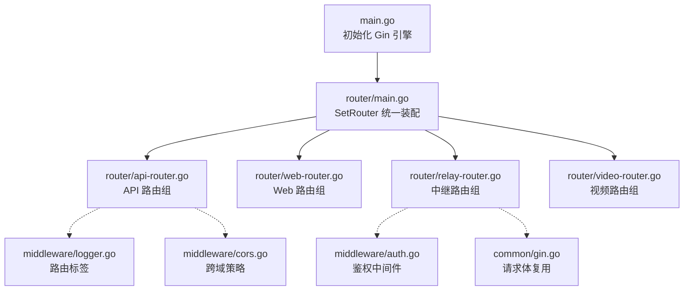
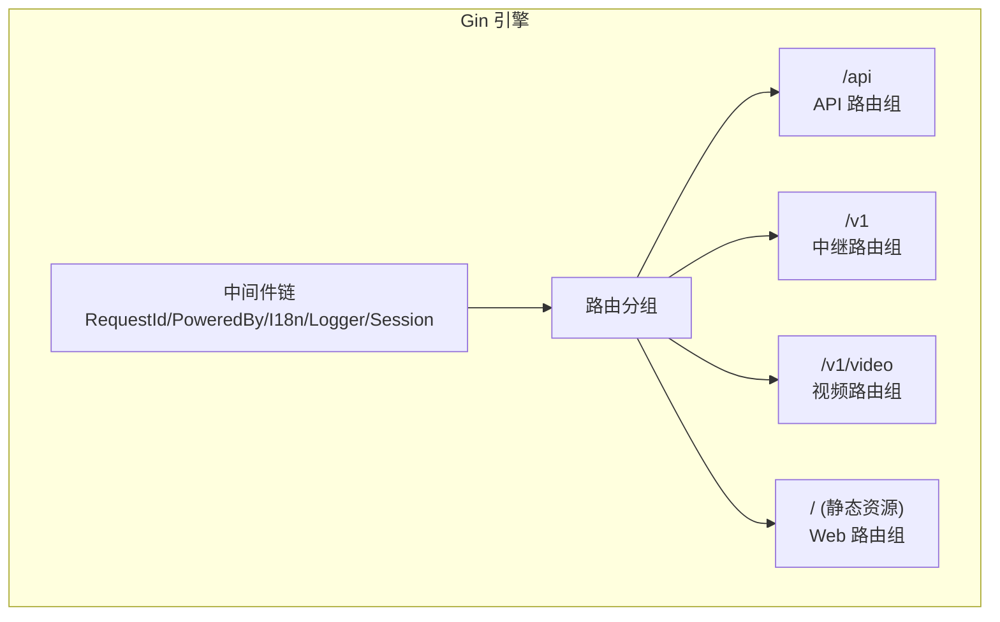
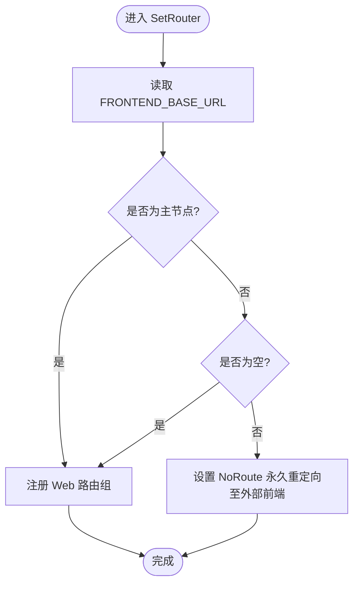
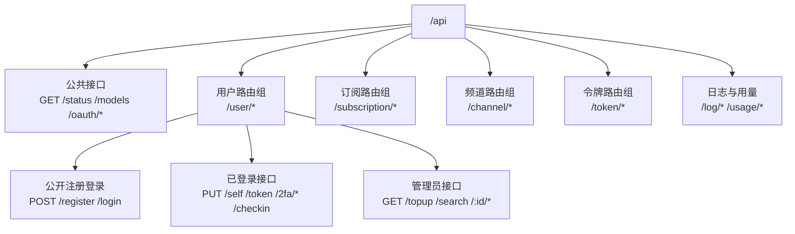
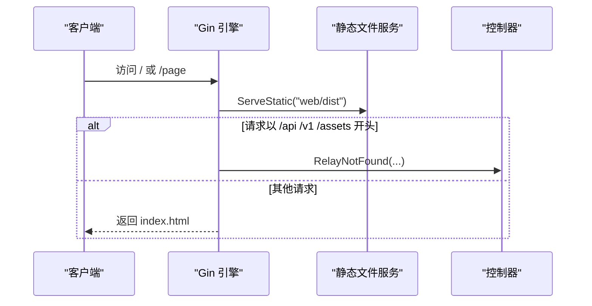
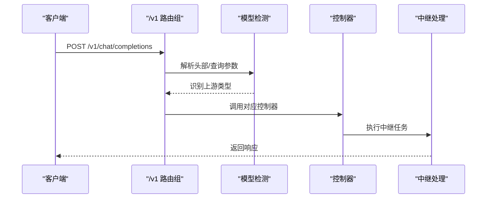
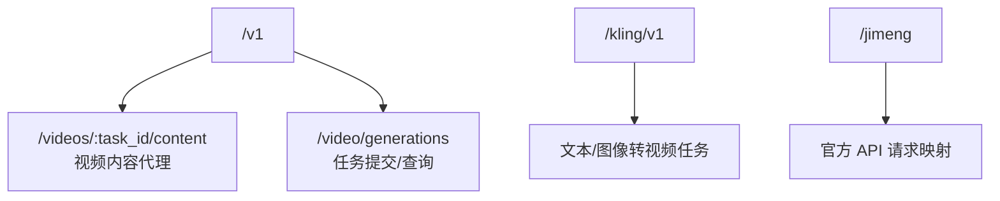
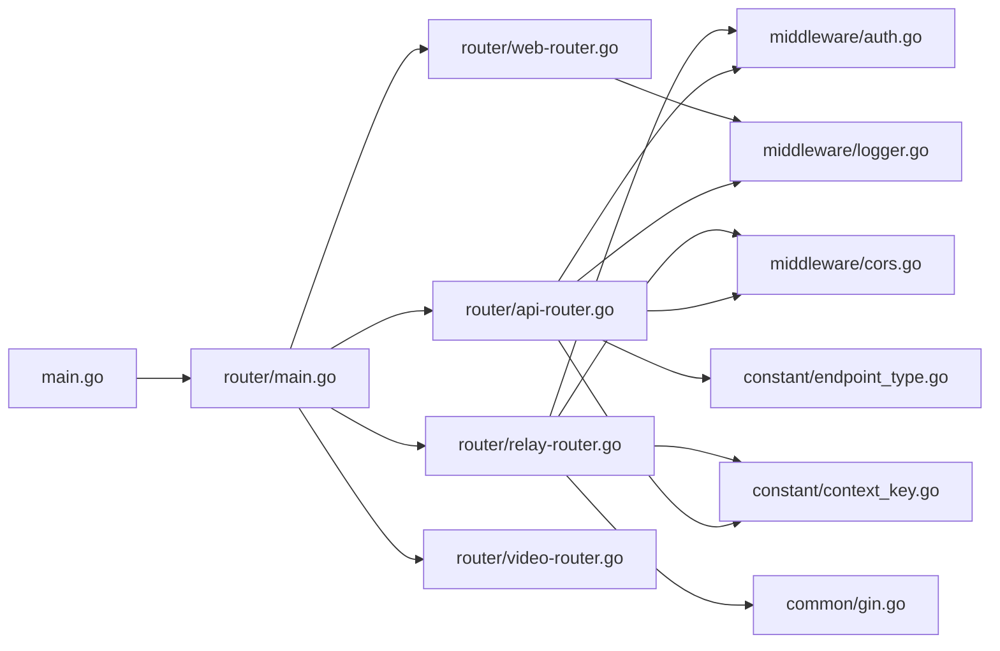

# 路由系统

<cite>
**本文引用的文件**
- [main.go](file://main.go)
- [router/main.go](file://router/main.go)
- [router/api-router.go](file://router/api-router.go)
- [router/web-router.go](file://router/web-router.go)
- [router/relay-router.go](file://router/relay-router.go)
- [router/video-router.go](file://router/video-router.go)
- [middleware/logger.go](file://middleware/logger.go)
- [middleware/cors.go](file://middleware/cors.go)
- [middleware/auth.go](file://middleware/auth.go)
- [common/gin.go](file://common/gin.go)
- [constant/context_key.go](file://constant/context_key.go)
- [constant/endpoint_type.go](file://constant/endpoint_type.go)
- [controller/misc.go](file://controller/misc.go)
- [service/log_info_generate.go](file://service/log_info_generate.go)
</cite>

## 目录
1. [简介](#简介)
2. [项目结构](#项目结构)
3. [核心组件](#核心组件)
4. [架构总览](#架构总览)
5. [详细组件分析](#详细组件分析)
6. [依赖分析](#依赖分析)
7. [性能考量](#性能考量)
8. [故障排查指南](#故障排查指南)
9. [结论](#结论)
10. [附录](#附录)

## 简介
本文件面向 New API 项目的路由系统，基于 Gin 框架实现，覆盖 API 路由、Web 路由、中继路由与视频路由的职责划分与实现细节。重点包括：
- 路由分组与中间件链设计
- 路由标签系统与日志输出
- 前端基础 URL 配置与 NoRoute 处理
- 跨域策略与压缩中间件
- 参数提取、路径变量处理与错误路由机制
- 动态路由与嵌套路由设计
- 性能优化、缓存策略与安全考虑

## 项目结构
路由系统位于 router 包，入口在 main.go 中初始化 Gin 引擎后调用 SetRouter 完成路由装配；各子路由通过独立文件组织，便于维护与扩展。

图表来源
- [main.go:185-186](file://main.go#L185-L186)
- [router/main.go:16-35](file://router/main.go#L16-L35)
- [router/api-router.go:14-379](file://router/api-router.go#L14-L379)
- [router/web-router.go:16-30](file://router/web-router.go#L16-L30)
- [router/relay-router.go:13-201](file://router/relay-router.go#L13-L201)
- [router/video-router.go:10-52](file://router/video-router.go#L10-L52)
- [middleware/logger.go:10-39](file://middleware/logger.go#L10-L39)
- [middleware/cors.go:9-23](file://middleware/cors.go#L9-L23)
- [middleware/auth.go:36-208](file://middleware/auth.go#L36-L208)
- [common/gin.go:36-137](file://common/gin.go#L36-L137)

章节来源
- [main.go:43-199](file://main.go#L43-L199)
- [router/main.go:16-35](file://router/main.go#L16-L35)

## 核心组件
- 路由装配器：在 router/main.go 的 SetRouter 中完成 API、仪表盘、中继与视频路由的注册，并根据环境变量决定是否启用 Web 路由或重定向至外部前端。
- 路由标签系统：通过 middleware/logger.go 的 RouteTag 中间件为每个路由组设置标签，配合 gin.LoggerWithFormatter 输出统一格式的日志。
- 跨域与压缩：全局启用 gzip 压缩与 CORS 策略，保障静态资源与跨域请求的兼容性。
- 请求体复用：common/gin.go 提供请求体存储与复用能力，支持多次读取与边界恢复，避免重复解析带来的性能损耗。
- 鉴权与权限：middleware/auth.go 提供用户会话、访问令牌、管理员与根权限等多层级鉴权，以及“会话或令牌”二选一的通用鉴权。
- 上下文键值：constant/context_key.go 定义了路由与中间件在上下文中传递的关键字，贯穿请求生命周期。

章节来源
- [router/main.go:16-35](file://router/main.go#L16-L35)
- [middleware/logger.go:10-39](file://middleware/logger.go#L10-L39)
- [middleware/cors.go:9-23](file://middleware/cors.go#L9-L23)
- [common/gin.go:36-137](file://common/gin.go#L36-L137)
- [middleware/auth.go:36-208](file://middleware/auth.go#L36-L208)
- [constant/context_key.go:5-69](file://constant/context_key.go#L5-L69)

## 架构总览
路由系统采用“主路由装配 + 子路由分组”的模式，所有路由均以中间件链包裹，形成统一的安全、限流与可观测性控制面。

图表来源
- [main.go:155-180](file://main.go#L155-L180)
- [router/main.go:16-35](file://router/main.go#L16-L35)
- [router/api-router.go:14-379](file://router/api-router.go#L14-L379)
- [router/relay-router.go:13-201](file://router/relay-router.go#L13-L201)
- [router/video-router.go:10-52](file://router/video-router.go#L10-L52)
- [router/web-router.go:16-30](file://router/web-router.go#L16-L30)

## 详细组件分析

### 主路由装配与前端基础 URL
- 在 router/main.go 的 SetRouter 中：
  - 注册 API、仪表盘、中继与视频路由
  - 读取环境变量 FRONTEND_BASE_URL 决定是否启用 Web 路由或 NoRoute 重定向
  - 主节点忽略 FRONTEND_BASE_URL，避免重复代理
- NoRoute 行为：
  - 若未配置外部前端，使用静态文件服务并回退到 index.html
  - 若配置外部前端，对非 /api、/v1、/assets 的请求进行永久重定向

图表来源
- [router/main.go:16-35](file://router/main.go#L16-L35)

章节来源
- [router/main.go:16-35](file://router/main.go#L16-L35)

### API 路由组（/api）
- 分组与中间件：
  - 使用路由标签“api”，启用 gzip 压缩、请求体清理、全局 API 速率限制
  - 用户相关路由按权限细分：公开接口、用户认证接口、管理员接口、根权限接口
- 关键路由示例（不含代码）：
  - GET /setup、POST /setup、GET /status、GET /models
  - OAuth 统一路由：GET /oauth/:provider，特定平台路由：/oauth/wechat、/oauth/telegram
  - 订阅与支付回调：/subscription/*、/stripe/webhook、/creem/webhook、/waffo/webhook
  - 频道管理、令牌管理、日志与用量统计等
- 嵌套路由与权限链：
  - userRoute 下再分 selfRoute（用户自用）与 adminRoute（管理员）

图表来源
- [router/api-router.go:14-379](file://router/api-router.go#L14-L379)

章节来源
- [router/api-router.go:14-379](file://router/api-router.go#L14-L379)

### Web 路由组（静态资源与 SPA 回退）
- 中间件：
  - 启用 gzip 压缩、全局 Web 速率限制、缓存中间件
  - 使用静态文件服务托管前端构建产物
- NoRoute 行为：
  - 对 /api、/v1、/assets 开头的请求交由中继层处理
  - 其他请求返回 index.html，实现 SPA 路由回退

图表来源
- [router/web-router.go:16-30](file://router/web-router.go#L16-L30)

章节来源
- [router/web-router.go:16-30](file://router/web-router.go#L16-L30)

### 中继路由组（/v1 与 /pg）
- 设计目标：
  - 对接 OpenAI、Anthropic、Gemini 等多家上游 API
  - 支持 HTTP 与 WebSocket（/realtime）
- 路由分组与选择逻辑：
  - /v1/models：根据请求头或查询参数自动识别上游类型并调用对应控制器
  - /v1：按动作区分路由（chat/completions、images/*、embeddings、audio/*、responses/* 等）
  - /pg：Playground 专用路由，前置系统性能检查与分发
- 中间件链：
  - 全局 CORS、请求解压、请求体清理、统计中间件
  - 每个分组设置“relay”标签，Token 鉴权、模型级速率限制、系统性能检查、通道分发

图表来源
- [router/relay-router.go:13-201](file://router/relay-router.go#L13-L201)

章节来源
- [router/relay-router.go:13-201](file://router/relay-router.go#L13-L201)

### 视频路由组（/v1/video 与 /kling/v1）
- 会话或令牌鉴权：支持仪表盘用户与 API 客户端两类身份
- 路由职责：
  - /v1/videos/:task_id/content：视频内容代理
  - /v1/video/generations：视频生成任务提交与查询
  - /kling/v1：Kling 平台专属请求转换与任务路由
  - /jimeng：直连官方 API 的请求转换与任务路由

图表来源
- [router/video-router.go:10-52](file://router/video-router.go#L10-L52)

章节来源
- [router/video-router.go:10-52](file://router/video-router.go#L10-L52)

### 路由标签系统与日志
- 路由标签：
  - middleware/logger.go 提供 RouteTag 中间件，为每个路由组设置标签键值
  - gin 日志格式化器读取该标签，统一输出“路由标签 | 请求ID | 状态码 | 耗时 | IP | 方法 | 路径”
- 应用范围：
  - API 路由组标签“api”
  - 中继与视频路由组标签“relay”
  - Web 路由组在 NoRoute 中显式设置“web”

章节来源
- [middleware/logger.go:10-39](file://middleware/logger.go#L10-L39)
- [router/web-router.go:21-29](file://router/web-router.go#L21-L29)
- [router/api-router.go:16](file://router/api-router.go#L16)
- [router/relay-router.go:20](file://router/relay-router.go#L20)
- [router/video-router.go:13](file://router/video-router.go#L13)

### 跨域与压缩策略
- 跨域（CORS）：
  - middleware/cors.go 提供全局 CORS 中间件，允许所有来源、凭证与常用方法/头
- 压缩：
  - API 与 Web 路由组启用 gzip 压缩，减少传输体积
- 生效范围：
  - Web 路由组：gzip + 全局 Web 速率限制 + 缓存 + 静态文件 + NoRoute
  - API 路由组：gzip + 全局 API 速率限制 + 请求体清理
  - 中继路由组：全局 CORS + 请求解压 + 请求体清理 + 统计中间件

章节来源
- [middleware/cors.go:9-23](file://middleware/cors.go#L9-L23)
- [router/web-router.go:17-19](file://router/web-router.go#L17-L19)
- [router/api-router.go:17](file://router/api-router.go#L17)
- [router/relay-router.go:14-17](file://router/relay-router.go#L14-L17)

### 参数提取、路径变量与错误路由
- 路径变量：
  - 中继路由广泛使用通配符与路径段变量（如 /v1/models、/v1beta/models/*path、/mj/* 等）
  - 视频路由使用 :task_id、:video_id 等变量
- 参数提取：
  - common/gin.go 提供请求体复用与多种内容类型的解析（JSON、表单、multipart），支持多次读取与边界恢复
- 错误路由：
  - Web 路由对 /api、/v1、/assets 开头的请求调用控制器的 Not Found 处理
  - 中继路由对未实现的路径返回“未实现”提示

章节来源
- [router/relay-router.go:196-200](file://router/relay-router.go#L196-L200)
- [router/video-router.go:16](file://router/video-router.go#L16)
- [common/gin.go:36-137](file://common/gin.go#L36-L137)
- [router/web-router.go:23-26](file://router/web-router.go#L23-L26)
- [router/relay-router.go:154-165](file://router/relay-router.go#L154-L165)

### 鉴权与权限链
- 多层级鉴权：
  - TryUserAuth：尝试从会话获取用户 ID（用于公开接口）
  - UserAuth/AdminAuth/RootAuth：分别要求普通用户、管理员与根权限
  - TokenOrUserAuth：优先会话鉴权，否则走令牌鉴权
- 令牌与会话：
  - 令牌验证通过后写入上下文关键字段（如 id、username、role 等）
  - 会话状态校验与用户禁用状态拦截
- 上下文键：
  - constant/context_key.go 定义了 token、channel、user 等上下文键，贯穿中间件与控制器

章节来源
- [middleware/auth.go:36-208](file://middleware/auth.go#L36-L208)
- [constant/context_key.go:5-69](file://constant/context_key.go#L5-L69)

### 前端基础 URL 与 SPA 回退
- 配置项：
  - FRONTEND_BASE_URL：当配置时，所有未匹配路由将被永久重定向到该地址
  - 主节点忽略该配置，避免重复代理
- SPA 回退：
  - Web 路由组在 NoRoute 中对非 /api、/v1、/assets 的请求返回 index.html

章节来源
- [router/main.go:21-34](file://router/main.go#L21-L34)
- [router/web-router.go:21-29](file://router/web-router.go#L21-L29)

## 依赖分析
- 路由装配依赖：
  - main.go 初始化 Gin 引擎并注册全局中间件，随后调用 router.SetRouter 完成子路由装配
- 路由组耦合：
  - API、中继与视频路由各自独立，共享鉴权与跨域中间件
  - Web 路由与 API/中继路由互不干扰，通过 NoRoute 实现 SPA 回退
- 上下文与常量：
  - 路由与中间件通过 constant/context_key.go 的键名在上下文中传递状态
  - endpoint_type.go 定义了中继端点类型，用于日志与统计

图表来源
- [main.go:155-186](file://main.go#L155-L186)
- [router/main.go:16-35](file://router/main.go#L16-L35)
- [router/api-router.go:14-379](file://router/api-router.go#L14-L379)
- [router/web-router.go:16-30](file://router/web-router.go#L16-L30)
- [router/relay-router.go:13-201](file://router/relay-router.go#L13-L201)
- [router/video-router.go:10-52](file://router/video-router.go#L10-L52)
- [middleware/auth.go:36-208](file://middleware/auth.go#L36-L208)
- [middleware/cors.go:9-23](file://middleware/cors.go#L9-L23)
- [middleware/logger.go:10-39](file://middleware/logger.go#L10-L39)
- [common/gin.go:36-137](file://common/gin.go#L36-L137)
- [constant/context_key.go:5-69](file://constant/context_key.go#L5-L69)
- [constant/endpoint_type.go:5-19](file://constant/endpoint_type.go#L5-L19)

章节来源
- [main.go:155-186](file://main.go#L155-L186)
- [router/main.go:16-35](file://router/main.go#L16-L35)

## 性能考量
- 请求体复用：
  - common/gin.go 的 GetBodyStorage/UnmarshalBodyReusable 支持多次读取，避免重复解析与内存拷贝
- 压缩与缓存：
  - gzip 压缩减少带宽占用；Web 路由启用缓存中间件提升静态资源命中率
- 中间件顺序：
  - 将统计、解压、清理等前置中间件放在路由组内，降低无效计算
- 速率限制：
  - 全局 API/Web 速率限制与模型级速率限制结合，防止热点路由过载
- 日志与可观测：
  - 路由标签统一日志输出，便于定位慢请求与异常路径

章节来源
- [common/gin.go:36-137](file://common/gin.go#L36-L137)
- [router/web-router.go:17-19](file://router/web-router.go#L17-L19)
- [router/api-router.go:17](file://router/api-router.go#L17)
- [router/relay-router.go:14-17](file://router/relay-router.go#L14-L17)
- [middleware/logger.go:19-39](file://middleware/logger.go#L19-L39)

## 故障排查指南
- 路由日志定位：
  - 查看路由标签与请求路径，确认请求进入正确的路由组
- 鉴权失败：
  - 检查 UserAuth/AdminAuth/RootAuth 是否满足权限；核对会话状态与令牌有效性
- 跨域问题：
  - 确认 CORS 中间件已启用且允许来源与方法
- 请求体过大或解析异常：
  - 使用 common/gin.go 的请求体复用与错误判断，定位 MaxBytesError 或内容类型不匹配
- SPA 回退异常：
  - 确认 NoRoute 逻辑仅对非 /api、/v1、/assets 的路径生效

章节来源
- [middleware/logger.go:19-39](file://middleware/logger.go#L19-L39)
- [middleware/auth.go:36-208](file://middleware/auth.go#L36-L208)
- [middleware/cors.go:9-23](file://middleware/cors.go#L9-L23)
- [common/gin.go:25-83](file://common/gin.go#L25-L83)
- [router/web-router.go:21-29](file://router/web-router.go#L21-L29)

## 结论
New API 的路由系统以清晰的分层与中间件链为核心，实现了 API、Web、中继与视频路由的职责分离与统一治理。通过路由标签、跨域与压缩策略、请求体复用与鉴权链路，系统在功能完整性与运行效率之间取得平衡。建议在扩展新路由时遵循现有中间件顺序与命名规范，确保一致的可观测性与安全性。

## 附录
- 常见路由前缀与用途
  - /api：后端管理与用户接口
  - /v1：OpenAI/Gemini 等上游 API 兼容层
  - /pg：Playground 专用路由
  - /mj 与 /:mode/mj：Midjourney 任务路由
  - /suno：Suno 音乐任务路由
  - /v1/video 与 /kling/v1：视频生成任务路由
- 上下文键参考
  - token、channel、user 相关键用于在中间件与控制器间传递状态

章节来源
- [router/api-router.go:14-379](file://router/api-router.go#L14-L379)
- [router/relay-router.go:13-201](file://router/relay-router.go#L13-L201)
- [router/video-router.go:10-52](file://router/video-router.go#L10-L52)
- [constant/context_key.go:5-69](file://constant/context_key.go#L5-L69)