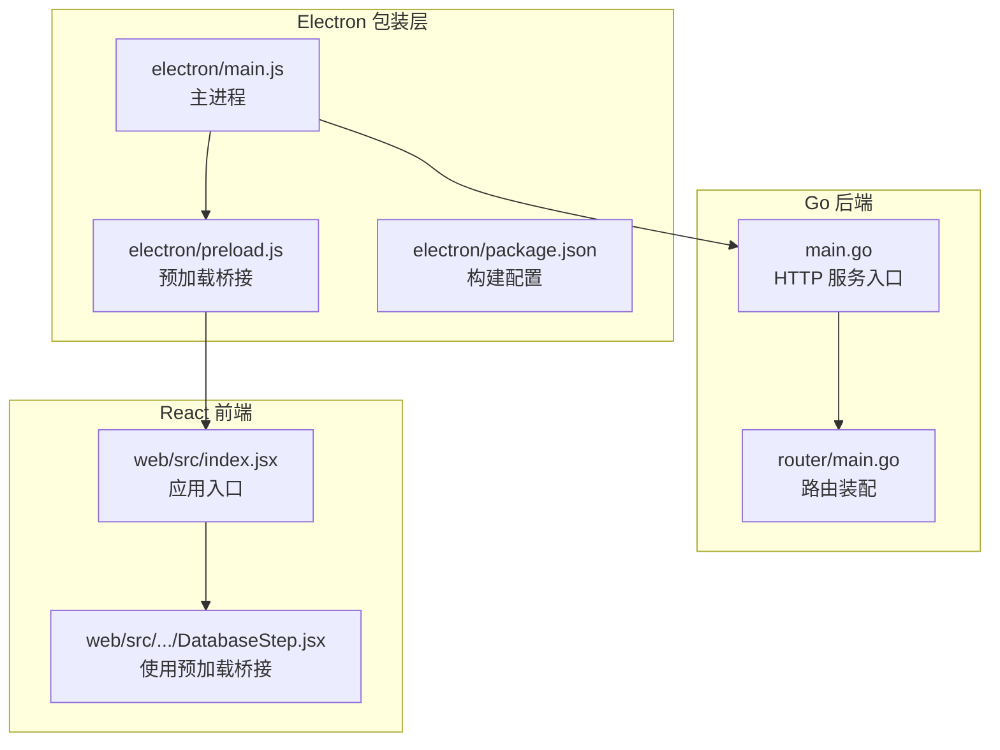
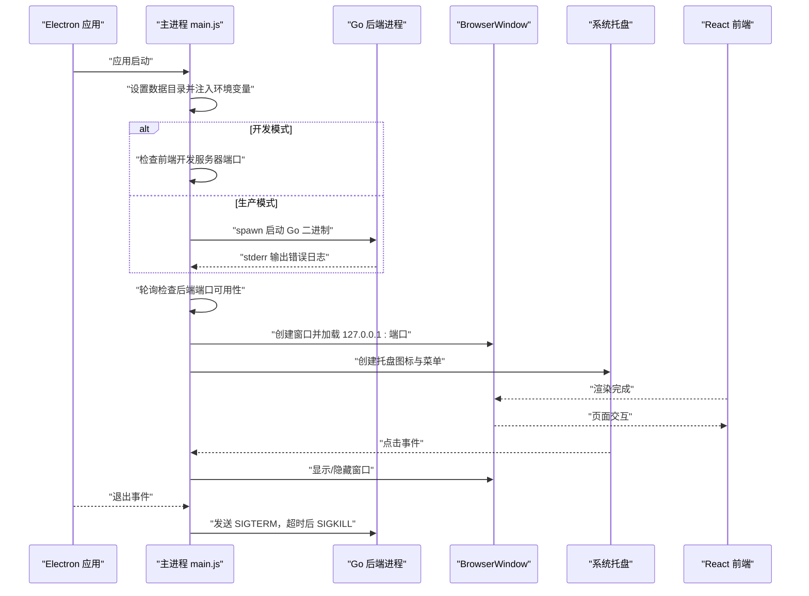
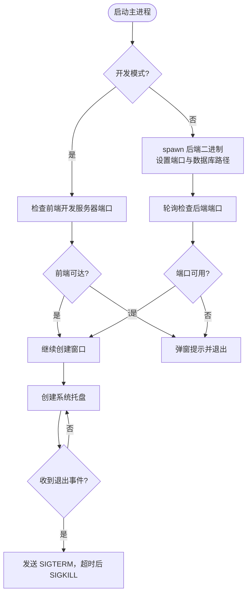
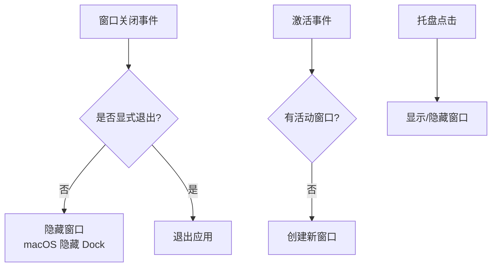
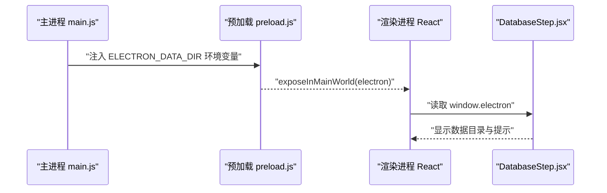
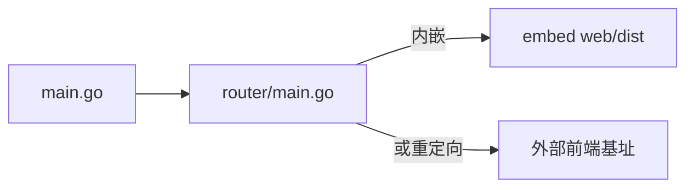
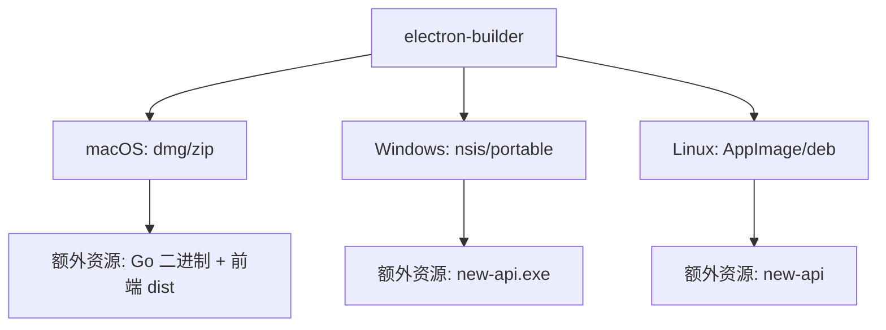
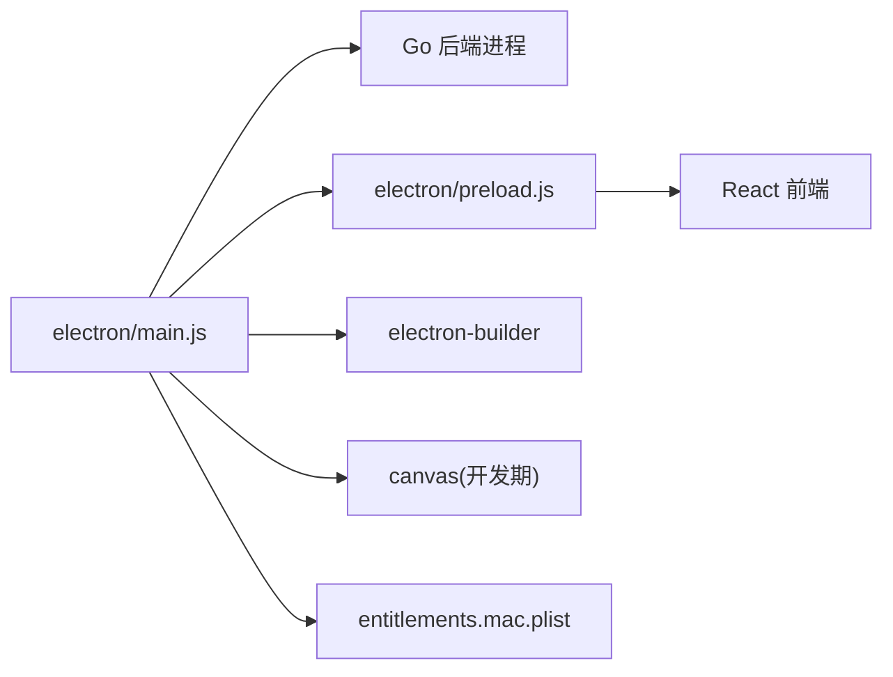

# 桌面应用

<cite>
**本文引用的文件**
- [electron/main.js](file://electron/main.js)
- [electron/preload.js](file://electron/preload.js)
- [electron/package.json](file://electron/package.json)
- [electron/README.md](file://electron/README.md)
- [electron/build.sh](file://electron/build.sh)
- [electron/create-tray-icon.js](file://electron/create-tray-icon.js)
- [electron/entitlements.mac.plist](file://electron/entitlements.mac.plist)
- [main.go](file://main.go)
- [router/main.go](file://router/main.go)
- [web/src/index.jsx](file://web/src/index.jsx)
- [web/src/components/setup/components/steps/DatabaseStep.jsx](file://web/src/components/setup/components/steps/DatabaseStep.jsx)
</cite>

## 目录
1. [简介](#简介)
2. [项目结构](#项目结构)
3. [核心组件](#核心组件)
4. [架构总览](#架构总览)
5. [详细组件分析](#详细组件分析)
6. [依赖分析](#依赖分析)
7. [性能考虑](#性能考虑)
8. [故障排查指南](#故障排查指南)
9. [结论](#结论)
10. [附录](#附录)

## 简介
本文件面向 New API 桌面应用的开发者与维护者，系统性解析基于 Electron 的桌面应用架构与实现细节，覆盖主进程配置、渲染进程管理、IPC 预加载桥接、系统托盘集成、窗口与菜单行为、自动更新能力现状与扩展建议、打包发布与签名策略、跨平台兼容性、本地存储与文件系统访问、以及调试与排障方法。文档同时给出关键流程图与时序图，帮助快速理解与扩展功能。

## 项目结构
New API 桌面应用采用“Electron 包装层 + Go 后端 + React 前端”的三层架构：
- Electron 包装层：负责应用生命周期、系统托盘、窗口管理、子进程（Go 后端）启动与监控。
- Go 后端：基于 Gin 提供 HTTP 服务，嵌入前端静态资源，统一路由与业务逻辑。
- React 前端：单页应用，通过预加载桥接暴露的 API 与桌面环境交互（例如数据目录路径）。

图表来源
- [electron/main.js:1-590](file://electron/main.js#L1-L590)
- [electron/preload.js:1-18](file://electron/preload.js#L1-L18)
- [electron/package.json:1-101](file://electron/package.json#L1-L101)
- [main.go:43-199](file://main.go#L43-L199)
- [router/main.go:16-35](file://router/main.go#L16-L35)
- [web/src/index.jsx:55-77](file://web/src/index.jsx#L55-L77)
- [web/src/components/setup/components/steps/DatabaseStep.jsx:27-60](file://web/src/components/setup/components/steps/DatabaseStep.jsx#L27-L60)

章节来源
- [electron/main.js:1-590](file://electron/main.js#L1-L590)
- [electron/preload.js:1-18](file://electron/preload.js#L1-L18)
- [electron/package.json:1-101](file://electron/package.json#L1-L101)
- [main.go:43-199](file://main.go#L43-L199)
- [router/main.go:16-35](file://router/main.go#L16-L35)
- [web/src/index.jsx:55-77](file://web/src/index.jsx#L55-L77)
- [web/src/components/setup/components/steps/DatabaseStep.jsx:27-60](file://web/src/components/setup/components/steps/DatabaseStep.jsx#L27-L60)

## 核心组件
- 主进程（electron/main.js）
  - 子进程管理：根据开发/生产模式启动 Go 后端二进制，并监控其标准输出与错误输出，收集最近 100 条错误日志。
  - 服务器可达性检测：轮询检查端口可用性，避免过早进入渲染阶段。
  - 错误分析与引导：对常见错误（端口占用、数据库文件占用、权限、网络、配置、内存、文件缺失）进行分类与友好提示。
  - 窗口与托盘：创建 BrowserWindow 并在关闭时隐藏至托盘；创建系统托盘菜单，支持点击切换显示/隐藏窗口。
  - 优雅退出：向子进程发送 SIGTERM，超时后强制 SIGKILL，确保资源释放。
- 预加载桥接（electron/preload.js）
  - 通过 contextBridge 暴露只读信息（是否 Electron 环境、Electron 版本、平台、数据目录路径等）到渲染进程。
- Go 后端（main.go）
  - 初始化资源、数据库、国际化、会话、分析注入等，装配路由并监听端口提供 HTTP 服务。
- 路由装配（router/main.go）
  - 统一注册 API、仪表盘、中继、视频等路由；在无外部前端基址时内嵌前端页面。
- React 前端（web/src/index.jsx）
  - 应用初始化、主题与国际化包装、根组件挂载。
- 数据库步骤（web/src/.../DatabaseStep.jsx）
  - 在 Electron 环境下展示本地数据目录路径与备份提示。

章节来源
- [electron/main.js:222-386](file://electron/main.js#L222-L386)
- [electron/main.js:388-426](file://electron/main.js#L388-L426)
- [electron/main.js:428-475](file://electron/main.js#L428-L475)
- [electron/main.js:571-590](file://electron/main.js#L571-L590)
- [electron/preload.js:1-18](file://electron/preload.js#L1-L18)
- [main.go:43-199](file://main.go#L43-L199)
- [router/main.go:16-35](file://router/main.go#L16-L35)
- [web/src/index.jsx:55-77](file://web/src/index.jsx#L55-L77)
- [web/src/components/setup/components/steps/DatabaseStep.jsx:27-60](file://web/src/components/setup/components/steps/DatabaseStep.jsx#L27-L60)

## 架构总览
桌面应用的运行时交互链路如下：

图表来源
- [electron/main.js:222-386](file://electron/main.js#L222-L386)
- [electron/main.js:388-426](file://electron/main.js#L388-L426)
- [electron/main.js:428-475](file://electron/main.js#L428-L475)
- [electron/main.js:571-590](file://electron/main.js#L571-L590)

## 详细组件分析

### 主进程与子进程管理
- 进程启动策略
  - 开发模式：仅校验前端开发服务器可达，跳过后端启动。
  - 生产模式：根据平台定位二进制路径，设置端口与 SQLite 文件路径，spawn 启动后端。
- 日志与错误分析
  - 收集 stderr 最近 100 条日志，按关键字匹配常见错误类型并生成用户可读的提示与解决建议。
- 服务器可达性
  - 使用 HTTP GET 请求轮询端口，带重试与超时控制，避免过早加载前端导致白屏。
- 优雅退出
  - 发送 SIGTERM，等待子进程 close；超时后强制 SIGKILL，确保资源释放。

图表来源
- [electron/main.js:222-386](file://electron/main.js#L222-L386)
- [electron/main.js:571-590](file://electron/main.js#L571-L590)

章节来源
- [electron/main.js:222-386](file://electron/main.js#L222-L386)
- [electron/main.js:571-590](file://electron/main.js#L571-L590)

### 窗口管理与系统托盘
- 窗口行为
  - 关闭事件：非显式退出时隐藏窗口，macOS 下同步隐藏 Dock。
  - 激活事件：当无活动窗口时重建窗口。
- 托盘行为
  - macOS 使用模板图标自适配主题；Windows 使用彩色图标。
  - 托盘菜单包含“显示应用”和“退出”项；点击托盘图标在显示/隐藏之间切换。

图表来源
- [electron/main.js:412-426](file://electron/main.js#L412-L426)
- [electron/main.js:565-569](file://electron/main.js#L565-L569)
- [electron/main.js:428-475](file://electron/main.js#L428-L475)

章节来源
- [electron/main.js:412-426](file://electron/main.js#L412-L426)
- [electron/main.js:565-569](file://electron/main.js#L565-L569)
- [electron/main.js:428-475](file://electron/main.js#L428-L475)

### 预加载桥接与 IPC
- 预加载桥接
  - 暴露只读对象，包含是否 Electron 环境、Electron 版本、平台、数据目录路径等。
  - 数据目录路径通过主进程注入的环境变量传递，便于前端在安装向导中展示与备份提示。
- 前端使用
  - 在安装向导的数据库步骤中，判断 Electron 环境并在成功检测到数据目录后展示路径与备份提示。

图表来源
- [electron/preload.js:1-18](file://electron/preload.js#L1-L18)
- [electron/main.js:226-230](file://electron/main.js#L226-L230)
- [web/src/components/setup/components/steps/DatabaseStep.jsx:27-60](file://web/src/components/setup/components/steps/DatabaseStep.jsx#L27-L60)

章节来源
- [electron/preload.js:1-18](file://electron/preload.js#L1-L18)
- [electron/main.js:226-230](file://electron/main.js#L226-L230)
- [web/src/components/setup/components/steps/DatabaseStep.jsx:27-60](file://web/src/components/setup/components/steps/DatabaseStep.jsx#L27-L60)

### 路由与前端嵌入
- 路由装配
  - 注册 API、仪表盘、中继、视频等路由；在主节点且未设置外部前端基址时，内嵌前端页面。
- 前端入口
  - React 应用初始化、主题与国际化包装、根组件挂载。

图表来源
- [main.go:185-186](file://main.go#L185-L186)
- [router/main.go:16-35](file://router/main.go#L16-L35)

章节来源
- [main.go:185-186](file://main.go#L185-L186)
- [router/main.go:16-35](file://router/main.go#L16-L35)

### 自动更新能力现状与扩展建议
- 现状
  - 当前 Electron 包装层未集成自动更新模块（如 @electron/asar、electron-updater）。主进程通过子进程管理后端，未见内置更新检查逻辑。
- 建议
  - 若需内置更新：引入 electron-updater，结合 GitHub Releases 或自建更新服务器，实现静默下载与重启安装。
  - 若依赖外置分发：保持现有打包产物，通过 CI/CD 产出安装包并发布。

章节来源
- [electron/main.js:1-590](file://electron/main.js#L1-L590)
- [electron/package.json:1-101](file://electron/package.json#L1-L101)

### 打包发布、签名与跨平台兼容
- 打包工具
  - electron-builder：统一配置 appId、产品名、输出目录与平台目标。
- 平台差异
  - macOS：硬编码 entitlements、目标 dmg/zip、额外资源包含 Go 二进制与前端 dist。
  - Windows：目标 nsis/portable、额外资源包含 .exe。
  - Linux：目标 AppImage/deb、额外资源包含二进制。
- 构建脚本
  - build.sh：自动化构建前端、Go 后端与 Electron 应用，按平台输出产物。
- 签名与公证
  - macOS entitlements 已启用网络客户端/服务器权限，便于应用联网；若需签名与公证，可在 electron-builder 中配置 identity 与 hardenedRuntime。
  - Windows：可配置证书签名；Linux：通常无需签名，但可生成 AppImage 签名（视发行渠道而定）。

图表来源
- [electron/package.json:31-100](file://electron/package.json#L31-L100)
- [electron/build.sh:7-39](file://electron/build.sh#L7-L39)
- [electron/entitlements.mac.plist:1-18](file://electron/entitlements.mac.plist#L1-L18)

章节来源
- [electron/package.json:31-100](file://electron/package.json#L31-L100)
- [electron/build.sh:7-39](file://electron/build.sh#L7-L39)
- [electron/entitlements.mac.plist:1-18](file://electron/entitlements.mac.plist#L1-L18)

### 本地存储、文件系统访问与系统通知
- 本地存储
  - SQLite 数据库存放于用户数据目录下的 data 子目录（开发模式：项目目录；生产模式：各平台用户目录），主进程在启动时设置 SQLITE_PATH 环境变量。
- 文件系统访问
  - 预加载桥接暴露数据目录路径，前端可在安装向导中展示与备份提示。
- 系统通知
  - 主进程使用 dialog 模块在错误或退出时弹窗提示；托盘提供最小化到系统托盘的能力，减少前台占用。

章节来源
- [electron/main.js:226-270](file://electron/main.js#L226-L270)
- [electron/preload.js:1-18](file://electron/preload.js#L1-L18)
- [web/src/components/setup/components/steps/DatabaseStep.jsx:47-60](file://web/src/components/setup/components/steps/DatabaseStep.jsx#L47-L60)
- [electron/main.js:301-374](file://electron/main.js#L301-L374)

## 依赖分析
- 组件耦合
  - 主进程与后端：通过子进程与本地端口通信，低耦合高隔离。
  - 预加载桥接：仅暴露必要只读信息，避免直接 IPC 调用，降低复杂度。
  - 前端：通过桥接读取数据目录路径，不直接依赖 Node/Electron API。
- 外部依赖
  - electron-builder：打包与分发。
  - Canvas（开发期图标生成）：用于生成托盘图标占位。
  - macOS Entitlements：网络访问与 JIT 允许等权限声明。

图表来源
- [electron/main.js:1-590](file://electron/main.js#L1-L590)
- [electron/preload.js:1-18](file://electron/preload.js#L1-L18)
- [electron/package.json:26-29](file://electron/package.json#L26-L29)
- [electron/create-tray-icon.js:1-60](file://electron/create-tray-icon.js#L1-L60)
- [electron/entitlements.mac.plist:1-18](file://electron/entitlements.mac.plist#L1-L18)

章节来源
- [electron/main.js:1-590](file://electron/main.js#L1-L590)
- [electron/preload.js:1-18](file://electron/preload.js#L1-L18)
- [electron/package.json:26-29](file://electron/package.json#L26-L29)
- [electron/create-tray-icon.js:1-60](file://electron/create-tray-icon.js#L1-L60)
- [electron/entitlements.mac.plist:1-18](file://electron/entitlements.mac.plist#L1-L18)

## 性能考虑
- 启动性能
  - 开发模式仅检查前端端口，缩短启动时间；生产模式通过端口轮询确保后端就绪再加载前端。
- 资源占用
  - 子进程退出时主动清理，避免僵尸进程；托盘最小化减少后台资源占用。
- I/O 优化
  - SQLite 默认 WAL/SHM 文件由 Go 层管理；Electron 侧仅负责数据目录路径与日志输出。

## 故障排查指南
- 常见错误与对策
  - 端口被占用：检查占用进程并释放端口；或修改端口。
  - 数据文件被占用：确认无其他实例运行；必要时删除 .db-shm 与 .db-wal。
  - 权限不足：以管理员/root 权限运行；检查数据目录与可执行文件权限。
  - 网络错误：检查网络连通性、防火墙与代理；确认目标地址正确。
  - 配置错误：恢复默认配置或删除配置文件后重启。
  - 内存不足：关闭其他程序、重启释放内存；检查是否存在内存泄漏。
  - 文件缺失：重新安装应用或修复安装目录。
- 日志与诊断
  - 主进程会收集最近 100 条后端错误日志，并在用户选择“查看完整日志”时生成并打开崩溃日志文件，包含平台、架构、应用版本、错误堆栈与日志位置。

章节来源
- [electron/main.js:64-148](file://electron/main.js#L64-L148)
- [electron/main.js:150-175](file://electron/main.js#L150-L175)
- [electron/main.js:310-374](file://electron/main.js#L310-L374)

## 结论
该桌面应用通过 Electron 将 Go 后端与 React 前端整合为一体，具备清晰的进程边界与良好的错误处理机制。主进程负责启动与监控后端、托盘与窗口管理，预加载桥接提供必要的只读信息，前端通过桥接实现数据目录展示与备份提示。打包方面已覆盖三大平台，签名与公证可根据需要进一步完善。自动更新能力尚未内置，建议按需引入 electron-updater 或采用外置分发方案。整体架构简洁、扩展性强，适合在此基础上迭代更多桌面特性（如系统通知、快捷键、自动更新等）。

## 附录
- 快速开始
  - 开发：确保 Go 后端与前端开发服务器均运行，启动 Electron 应用。
  - 生产：准备对应平台的 Go 二进制与前端 dist，执行 electron-builder 打包。
- 配置参考
  - 端口：默认 3000，可在主进程中调整。
  - 数据库：SQLite 路径由主进程注入环境变量，前端可读取显示。
  - 打包：平台目标与额外资源在 electron-builder 配置中定义。

章节来源
- [electron/README.md:25-74](file://electron/README.md#L25-L74)
- [electron/main.js:63-148](file://electron/main.js#L63-L148)
- [electron/package.json:31-100](file://electron/package.json#L31-L100)