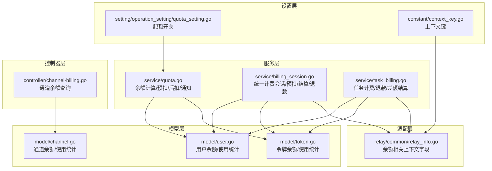
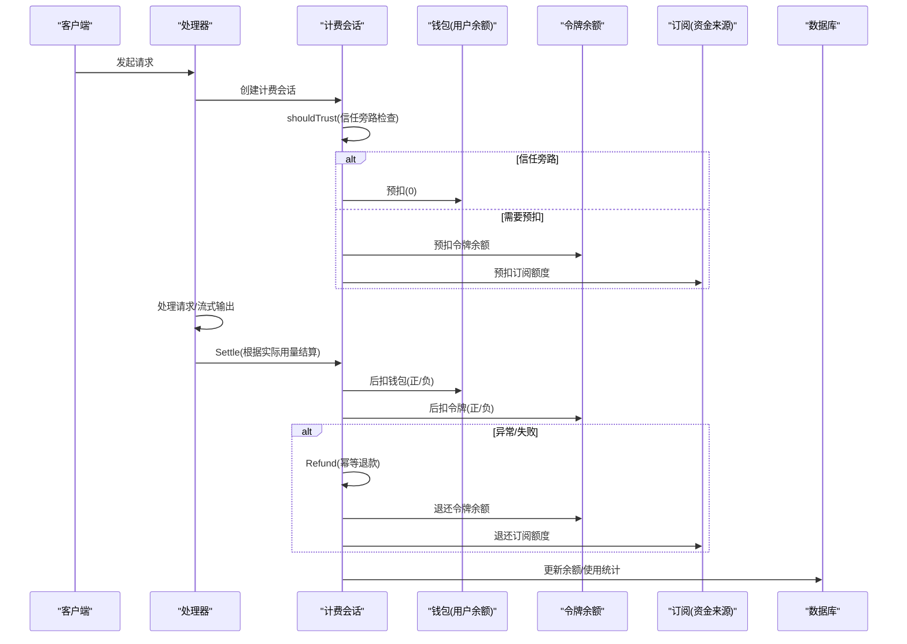
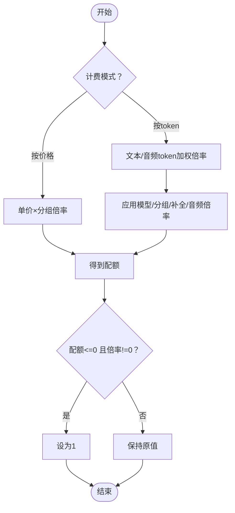
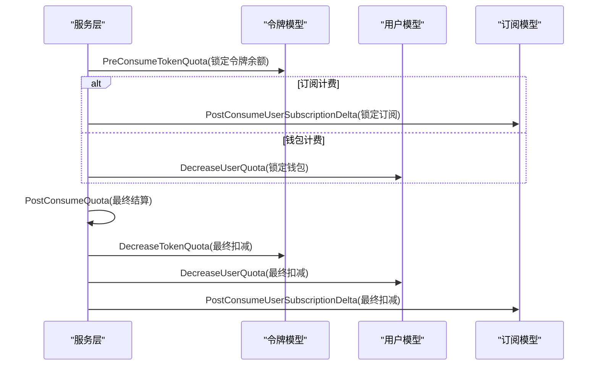
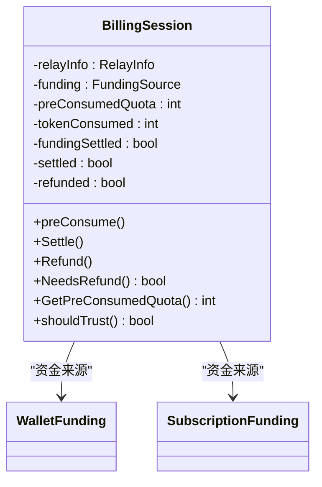
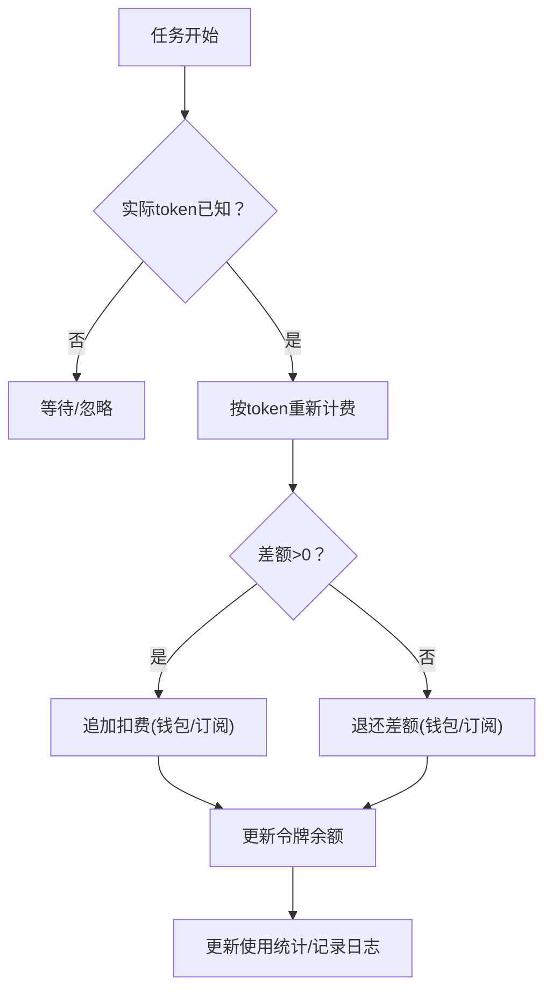
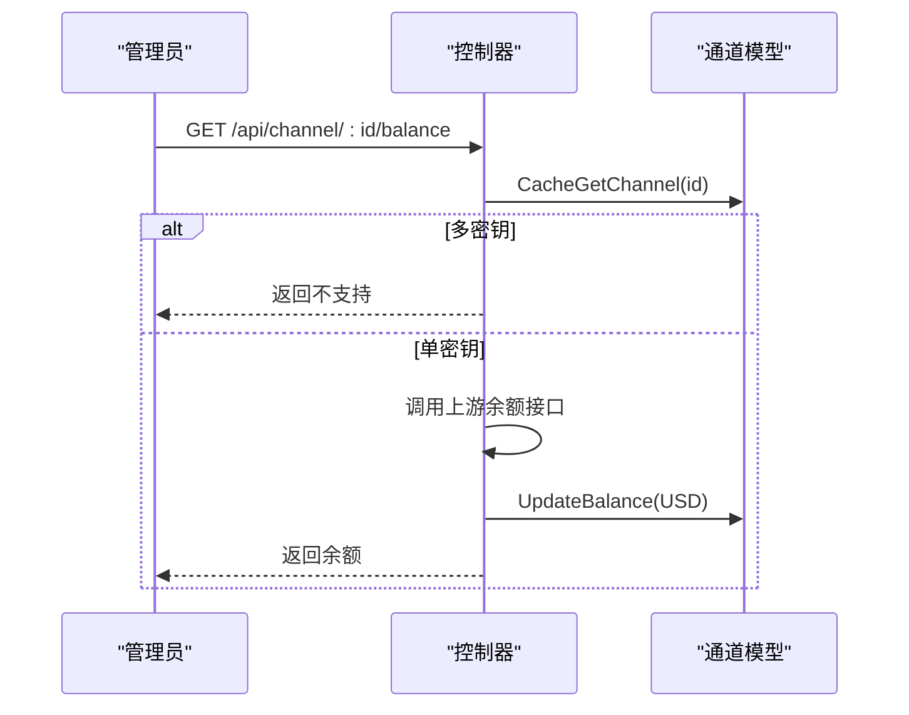
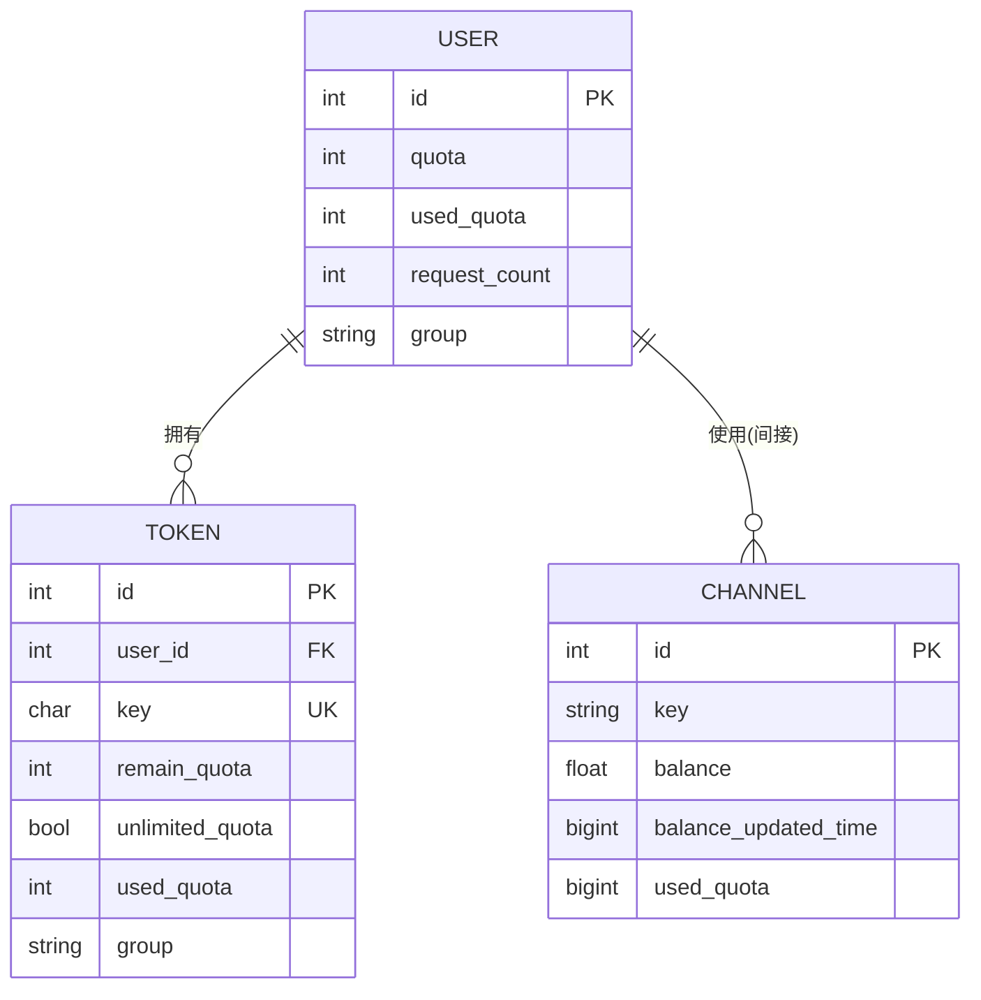
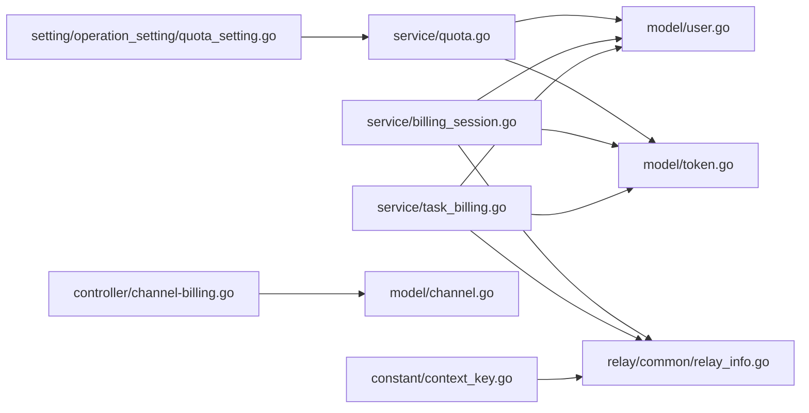

# 余额管理

<cite>
**本文引用的文件**
- [service/quota.go](file://service/quota.go)
- [service/billing_session.go](file://service/billing_session.go)
- [service/task_billing.go](file://service/task_billing.go)
- [model/user.go](file://model/user.go)
- [model/token.go](file://model/token.go)
- [model/channel.go](file://model/channel.go)
- [relay/common/relay_info.go](file://relay/common/relay_info.go)
- [controller/channel-billing.go](file://controller/channel-billing.go)
- [constant/context_key.go](file://constant/context_key.go)
- [setting/operation_setting/quota_setting.go](file://setting/operation_setting/quota_setting.go)
</cite>

## 目录
1. [简介](#简介)
2. [项目结构](#项目结构)
3. [核心组件](#核心组件)
4. [架构总览](#架构总览)
5. [详细组件分析](#详细组件分析)
6. [依赖分析](#依赖分析)
7. [性能考虑](#性能考虑)
8. [故障排查指南](#故障排查指南)
9. [结论](#结论)
10. [附录](#附录)

## 简介
本技术文档围绕 New API 的余额管理系统，系统性阐述余额计算算法、配额消耗机制与余额查询接口，深入解析 PreConsumeTokenQuota 与 PostConsumeQuota 的实现差异与适用场景，覆盖预扣费与后扣费流程、余额不足的错误处理、无限配额令牌的特殊处理以及余额回滚策略。文档同时介绍用户余额、令牌余额与通道余额的三层余额管理体系，并提供实时流式响应、批量消费与异常处理等业务场景示例，最后给出余额监控指标、预警机制与性能优化建议。

## 项目结构
余额管理相关代码主要分布在以下模块：
- 服务层：余额计算、预扣费/后扣费、会话结算与退款、任务计费与差额结算
- 模型层：用户、令牌、通道余额与使用统计的持久化与批量更新
- 适配层：请求上下文中的 RelayInfo 传递余额相关信息
- 控制器层：通道余额查询接口
- 设置层：配额相关开关与阈值配置

**图表来源**
- [service/quota.go:1-508](file://service/quota.go#L1-L508)
- [service/billing_session.go:1-348](file://service/billing_session.go#L1-L348)
- [service/task_billing.go:1-302](file://service/task_billing.go#L1-L302)
- [model/user.go:1-1049](file://model/user.go#L1-L1049)
- [model/token.go:1-483](file://model/token.go#L1-L483)
- [model/channel.go:1-1009](file://model/channel.go#L1-L1009)
- [relay/common/relay_info.go:1-891](file://relay/common/relay_info.go#L1-L891)
- [controller/channel-billing.go:394-452](file://controller/channel-billing.go#L394-L452)
- [setting/operation_setting/quota_setting.go:1-22](file://setting/operation_setting/quota_setting.go#L1-L22)
- [constant/context_key.go:1-70](file://constant/context_key.go#L1-L70)

**章节来源**
- [service/quota.go:1-508](file://service/quota.go#L1-L508)
- [service/billing_session.go:1-348](file://service/billing_session.go#L1-L348)
- [service/task_billing.go:1-302](file://service/task_billing.go#L1-L302)
- [model/user.go:1-1049](file://model/user.go#L1-L1049)
- [model/token.go:1-483](file://model/token.go#L1-L483)
- [model/channel.go:1-1009](file://model/channel.go#L1-L1009)
- [relay/common/relay_info.go:1-891](file://relay/common/relay_info.go#L1-L891)
- [controller/channel-billing.go:394-452](file://controller/channel-billing.go#L394-L452)
- [setting/operation_setting/quota_setting.go:1-22](file://setting/operation_setting/quota_setting.go#L1-L22)
- [constant/context_key.go:1-70](file://constant/context_key.go#L1-L70)

## 核心组件
- 余额计算与配额估算
  - 基于模型倍率、分组倍率、音频/文本补全倍率与价格模式的综合计算，支持按 token 与按价格两种计费模式。
  - 支持实时流式与音频场景的用量统计与扣费。
- 预扣费与后扣费
  - 预扣费：在请求开始前锁定额度，保障异步任务与高并发场景的稳定性。
  - 后扣费：根据实际用量进行最终结算，支持订阅与钱包两种资金来源。
- 统一计费会话
  - 封装预扣、结算与退款的生命周期，支持信任额度旁路、资金来源回退与幂等退款。
- 任务计费与差额结算
  - 针对异步任务提供退款与差额结算能力，支持按 token 重新计费。
- 三层余额体系
  - 用户余额（钱包）、令牌余额（独立配额卡）、通道余额（外部渠道余额，如 OpenAI 硬限额）

**章节来源**
- [service/quota.go:50-87](file://service/quota.go#L50-L87)
- [service/quota.go:89-155](file://service/quota.go#L89-L155)
- [service/quota.go:259-341](file://service/quota.go#L259-L341)
- [service/billing_session.go:147-192](file://service/billing_session.go#L147-L192)
- [service/billing_session.go:36-77](file://service/billing_session.go#L36-L77)
- [service/task_billing.go:150-182](file://service/task_billing.go#L150-L182)
- [service/task_billing.go:184-245](file://service/task_billing.go#L184-L245)

## 架构总览
余额管理贯穿请求生命周期：请求进入后，根据用户与令牌状态进行预扣费；在请求处理过程中按需进行后扣费与结算；在异常或任务完成后执行退款或差额结算；同时维护用户、令牌与通道的余额与使用统计。

**图表来源**
- [service/billing_session.go:147-192](file://service/billing_session.go#L147-L192)
- [service/billing_session.go:36-77](file://service/billing_session.go#L36-L77)
- [service/quota.go:367-411](file://service/quota.go#L367-L411)
- [model/user.go:883-942](file://model/user.go#L883-L942)
- [model/token.go:375-433](file://model/token.go#L375-L433)

**章节来源**
- [service/billing_session.go:147-192](file://service/billing_session.go#L147-L192)
- [service/billing_session.go:36-77](file://service/billing_session.go#L36-L77)
- [service/quota.go:367-411](file://service/quota.go#L367-L411)
- [model/user.go:883-942](file://model/user.go#L883-L942)
- [model/token.go:375-433](file://model/token.go#L375-L433)

## 详细组件分析

### 余额计算算法与配额估算
- 计算维度
  - 文本输入/输出、音频输入/输出 token 数量
  - 模型倍率、分组倍率、补全倍率、音频倍率与音频补全倍率
  - 价格模式下的模型单价与分组倍率
- 算法要点
  - 综合加权计算配额，若倍率非零而结果小于等于 0，则向上取整为 1
  - 支持按价格模式与按 token 模式的切换
- 实时流式与音频场景
  - 实时流式：在每次用量更新时进行后扣费
  - 音频场景：在请求结束时进行结算并记录日志

**图表来源**
- [service/quota.go:50-87](file://service/quota.go#L50-L87)
- [service/quota.go:89-155](file://service/quota.go#L89-L155)
- [service/quota.go:259-341](file://service/quota.go#L259-L341)

**章节来源**
- [service/quota.go:50-87](file://service/quota.go#L50-L87)
- [service/quota.go:89-155](file://service/quota.go#L89-L155)
- [service/quota.go:259-341](file://service/quota.go#L259-L341)

### 预扣费与后扣费：PreConsumeTokenQuota 与 PostConsumeQuota
- PreConsumeTokenQuota
  - 作用：在请求开始前锁定令牌余额，避免并发与异步任务导致的超额使用
  - 校验：禁止负数配额；跳过 Playground；校验令牌余额与无限配额标志
  - 结果：令牌余额减少，返回错误时立即终止
- PostConsumeQuota
  - 作用：根据实际用量进行最终结算，支持订阅与钱包两种资金来源
  - 订阅结算：增加/减少订阅已用额度
  - 钱包结算：增加/减少用户余额
  - 令牌结算：增加/减少令牌余额
  - 通知：根据阈值触发余额预警通知

**图表来源**
- [service/quota.go:343-365](file://service/quota.go#L343-L365)
- [service/quota.go:367-411](file://service/quota.go#L367-L411)
- [model/token.go:405-422](file://model/token.go#L405-L422)
- [model/user.go:908-923](file://model/user.go#L908-L923)

**章节来源**
- [service/quota.go:343-365](file://service/quota.go#L343-L365)
- [service/quota.go:367-411](file://service/quota.go#L367-L411)
- [model/token.go:405-422](file://model/token.go#L405-L422)
- [model/user.go:908-923](file://model/user.go#L908-L923)

### 统一计费会话：生命周期与信任旁路
- 生命周期
  - 预扣：令牌余额预扣 → 资金来源预扣（订阅/钱包）
  - 结算：根据实际用量调整资金来源与令牌余额
  - 退款：幂等退款，防止重复与已结算资金被误退
- 信任旁路
  - 当用户具备“信任额度”且非异步任务时，可绕过预扣，直接走后扣
  - 订阅计费不启用信任旁路，避免预扣与实际扣费不一致
- 回退策略
  - 钱包优先：余额不足时自动回退到订阅
  - 订阅优先：无活跃订阅时回退到钱包

**图表来源**
- [service/billing_session.go:23-34](file://service/billing_session.go#L23-L34)
- [service/billing_session.go:147-192](file://service/billing_session.go#L147-L192)
- [service/billing_session.go:36-77](file://service/billing_session.go#L36-L77)
- [service/billing_session.go:194-228](file://service/billing_session.go#L194-L228)

**章节来源**
- [service/billing_session.go:23-34](file://service/billing_session.go#L23-L34)
- [service/billing_session.go:147-192](file://service/billing_session.go#L147-L192)
- [service/billing_session.go:36-77](file://service/billing_session.go#L36-L77)
- [service/billing_session.go:194-228](file://service/billing_session.go#L194-L228)

### 任务计费与差额结算
- 退款
  - 任务失败时，退还预扣的配额至钱包或订阅，并退还令牌余额
- 差额结算
  - 根据任务完成后的实际 token 数量重新计费，支持正负差额
  - 更新用户与通道使用统计，记录日志

**图表来源**
- [service/task_billing.go:150-182](file://service/task_billing.go#L150-L182)
- [service/task_billing.go:184-245](file://service/task_billing.go#L184-L245)
- [service/task_billing.go:247-301](file://service/task_billing.go#L247-L301)

**章节来源**
- [service/task_billing.go:150-182](file://service/task_billing.go#L150-L182)
- [service/task_billing.go:184-245](file://service/task_billing.go#L184-L245)
- [service/task_billing.go:247-301](file://service/task_billing.go#L247-L301)

### 余额查询接口：通道余额
- 接口说明
  - 支持查询单个渠道的余额（美元）
  - 多密钥渠道不支持余额查询
- 实现要点
  - 调用上游渠道余额接口，解析并更新本地余额与更新时间

**图表来源**
- [controller/channel-billing.go:424-452](file://controller/channel-billing.go#L424-L452)
- [controller/channel-billing.go:394-422](file://controller/channel-billing.go#L394-L422)
- [model/channel.go:517-525](file://model/channel.go#L517-L525)

**章节来源**
- [controller/channel-billing.go:424-452](file://controller/channel-billing.go#L424-L452)
- [controller/channel-billing.go:394-422](file://controller/channel-billing.go#L394-L422)
- [model/channel.go:517-525](file://model/channel.go#L517-L525)

### 三层余额管理体系
- 用户余额（钱包）
  - 用户总配额与已用配额，支持批量更新与缓存
- 令牌余额
  - 独立令牌的剩余配额与已用配额，支持无限配额与模型限制
- 通道余额
  - 外部渠道的余额（如 OpenAI 硬限额），用于上游计费控制

**图表来源**
- [model/user.go:24-53](file://model/user.go#L24-L53)
- [model/token.go:14-32](file://model/token.go#L14-L32)
- [model/channel.go:21-58](file://model/channel.go#L21-L58)

**章节来源**
- [model/user.go:24-53](file://model/user.go#L24-L53)
- [model/token.go:14-32](file://model/token.go#L14-L32)
- [model/channel.go:21-58](file://model/channel.go#L21-L58)

### 业务场景示例
- 实时流式响应中的余额扣减
  - 流式过程中按用量逐步后扣，失败时记录日志并回滚
- 批量消费
  - 任务完成后根据实际 token 数量进行差额结算
- 异常情况处理
  - 预扣失败回滚令牌余额
  - 订阅额度不足时回退到钱包或提示

**章节来源**
- [service/quota.go:89-155](file://service/quota.go#L89-L155)
- [service/quota.go:259-341](file://service/quota.go#L259-L341)
- [service/billing_session.go:168-184](file://service/billing_session.go#L168-L184)
- [service/task_billing.go:150-182](file://service/task_billing.go#L150-L182)

## 依赖分析
- 服务层依赖
  - 余额计算依赖比率设置与价格数据
  - 预扣/后扣依赖用户与令牌模型的增减接口
  - 计费会话依赖资金来源接口（钱包/订阅）
- 模型层依赖
  - 用户/令牌/通道余额与使用统计的持久化与批量更新
- 上下文依赖
  - RelayInfo 传递用户、令牌、订阅与价格等关键信息
  - 上下文键定义了余额相关字段的来源

**图表来源**
- [service/quota.go:1-508](file://service/quota.go#L1-L508)
- [service/billing_session.go:1-348](file://service/billing_session.go#L1-L348)
- [service/task_billing.go:1-302](file://service/task_billing.go#L1-L302)
- [model/user.go:1-1049](file://model/user.go#L1-L1049)
- [model/token.go:1-483](file://model/token.go#L1-L483)
- [model/channel.go:1-1009](file://model/channel.go#L1-L1009)
- [relay/common/relay_info.go:1-891](file://relay/common/relay_info.go#L1-L891)
- [controller/channel-billing.go:394-452](file://controller/channel-billing.go#L394-L452)
- [setting/operation_setting/quota_setting.go:1-22](file://setting/operation_setting/quota_setting.go#L1-L22)
- [constant/context_key.go:1-70](file://constant/context_key.go#L1-L70)

**章节来源**
- [service/quota.go:1-508](file://service/quota.go#L1-L508)
- [service/billing_session.go:1-348](file://service/billing_session.go#L1-L348)
- [service/task_billing.go:1-302](file://service/task_billing.go#L1-L302)
- [model/user.go:1-1049](file://model/user.go#L1-L1049)
- [model/token.go:1-483](file://model/token.go#L1-L483)
- [model/channel.go:1-1009](file://model/channel.go#L1-L1009)
- [relay/common/relay_info.go:1-891](file://relay/common/relay_info.go#L1-L891)
- [controller/channel-billing.go:394-452](file://controller/channel-billing.go#L394-L452)
- [setting/operation_setting/quota_setting.go:1-22](file://setting/operation_setting/quota_setting.go#L1-L22)
- [constant/context_key.go:1-70](file://constant/context_key.go#L1-L70)

## 性能考虑
- 批量更新
  - 用户与令牌余额采用批量更新策略，降低数据库写放大
- 缓存与异步
  - 余额变更通过异步池更新缓存，减少阻塞
- 并发安全
  - 计费会话使用互斥锁保证结算与退款的幂等性
- 预扣与信任旁路
  - 在高并发与异步任务场景下，合理使用预扣与信任旁路平衡一致性与性能

**章节来源**
- [model/user.go:954-961](file://model/user.go#L954-L961)
- [model/token.go:375-403](file://model/token.go#L375-L403)
- [service/billing_session.go:79-114](file://service/billing_session.go#L79-L114)
- [service/billing_session.go:194-228](file://service/billing_session.go#L194-L228)

## 故障排查指南
- 余额不足
  - 预扣失败：检查令牌余额与无限配额标志；确认订阅是否激活
  - 后扣失败：检查资金来源与令牌余额变更是否成功
- 退款异常
  - 确认计费会话状态（已结算/已退款）；检查资金来源是否已提交
- 通知未触发
  - 检查用户设置中的预警阈值与通知方式；确认余额计算逻辑是否命中阈值

**章节来源**
- [service/billing_session.go:168-184](file://service/billing_session.go#L168-L184)
- [service/quota.go:413-459](file://service/quota.go#L413-L459)
- [service/quota.go:461-507](file://service/quota.go#L461-L507)

## 结论
New API 的余额管理系统通过“预扣+后扣”的双阶段机制与统一计费会话，实现了对用户余额、令牌余额与订阅/通道余额的精细化控制。配合实时流式与任务场景的差异化处理，系统在高并发与异步任务中保持稳定与一致。通过阈值预警与批量更新等机制，进一步提升了可观测性与性能表现。

## 附录
- 关键配置
  - 配额开关：是否对免费模型启用预扣
  - 预警阈值：用户设置中的余额预警阈值
- 上下文键
  - 用户、令牌、通道与请求相关的关键字段来源

**章节来源**
- [setting/operation_setting/quota_setting.go:1-22](file://setting/operation_setting/quota_setting.go#L1-L22)
- [constant/context_key.go:1-70](file://constant/context_key.go#L1-L70)
- [relay/common/relay_info.go:86-175](file://relay/common/relay_info.go#L86-L175)