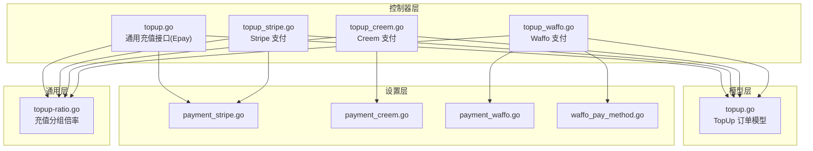
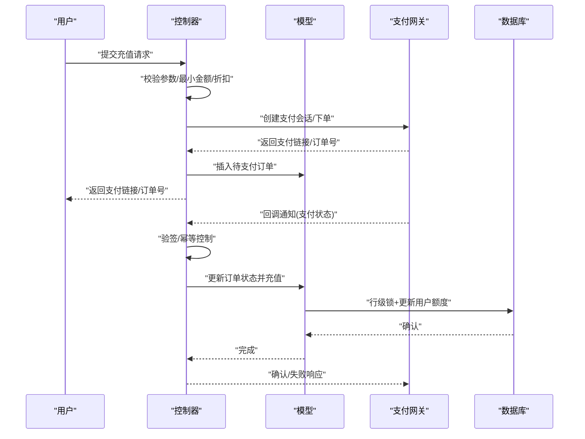
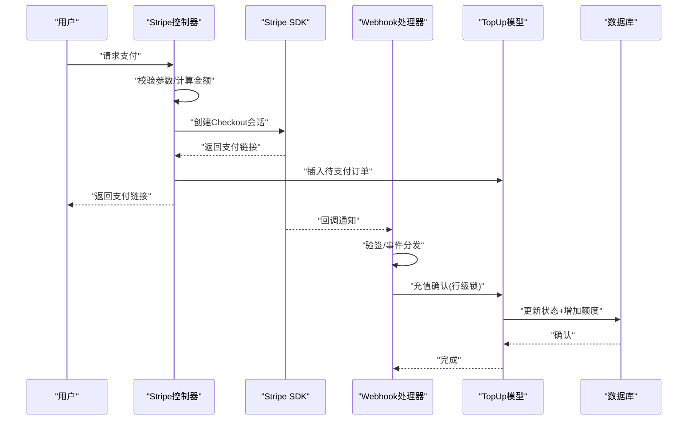
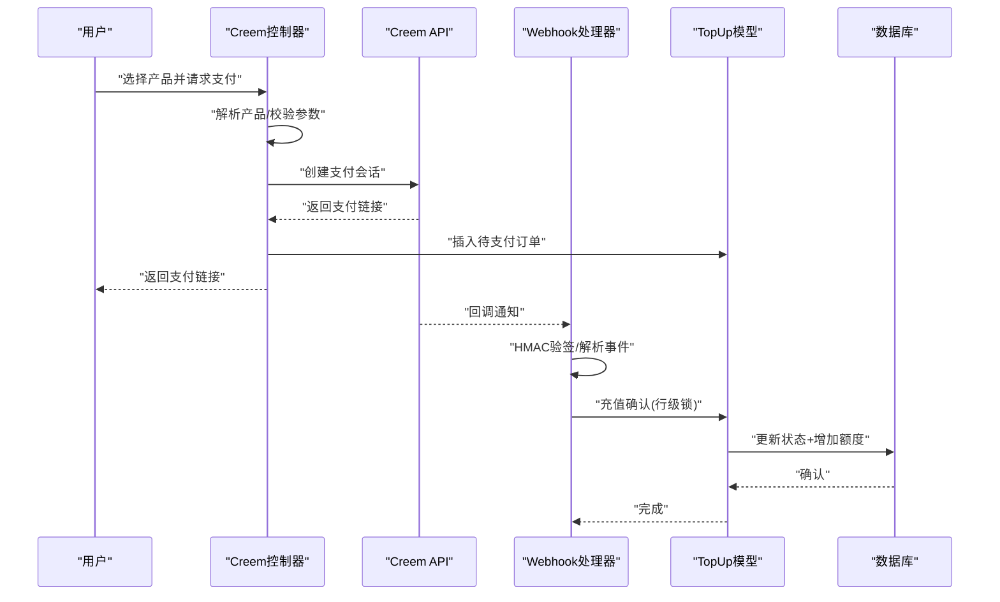
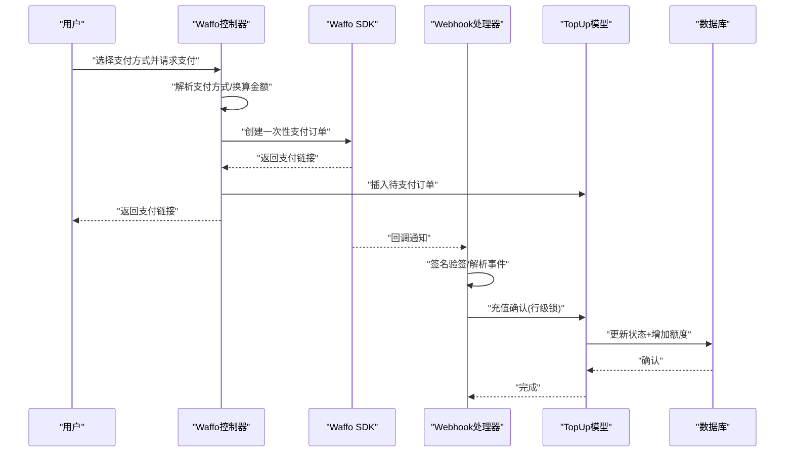
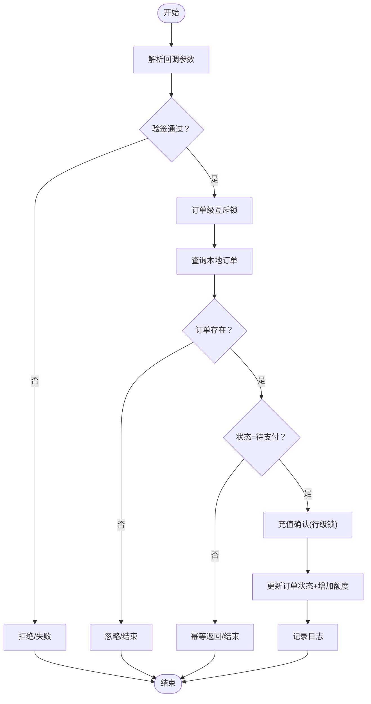
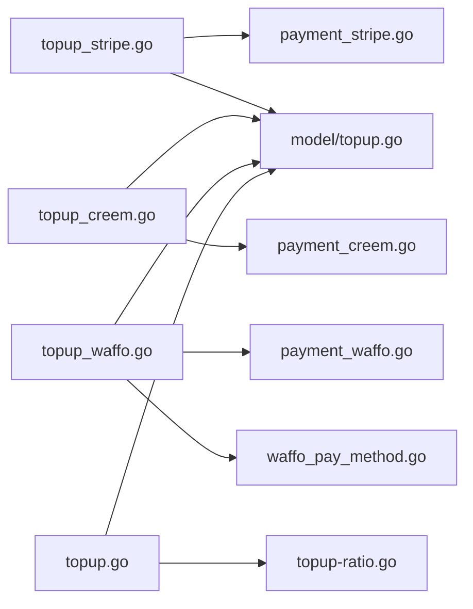

# 在线充值

<cite>
**本文档引用的文件**
- [controller/topup.go](file://controller/topup.go)
- [controller/topup_stripe.go](file://controller/topup_stripe.go)
- [controller/topup_creem.go](file://controller/topup_creem.go)
- [controller/topup_waffo.go](file://controller/topup_waffo.go)
- [model/topup.go](file://model/topup.go)
- [setting/payment_stripe.go](file://setting/payment_stripe.go)
- [setting/payment_creem.go](file://setting/payment_creem.go)
- [setting/payment_waffo.go](file://setting/payment_waffo.go)
- [constant/waffo_pay_method.go](file://constant/waffo_pay_method.go)
- [common/topup-ratio.go](file://common/topup-ratio.go)
</cite>

## 目录
1. [简介](#简介)
2. [项目结构](#项目结构)
3. [核心组件](#核心组件)
4. [架构总览](#架构总览)
5. [详细组件分析](#详细组件分析)
6. [依赖关系分析](#依赖关系分析)
7. [性能考虑](#性能考虑)
8. [故障排查指南](#故障排查指南)
9. [结论](#结论)
10. [附录](#附录)

## 简介
本文件面向 New API 的在线充值系统，系统支持多种支付方式：Stripe、Creem、Waffo 以及传统的易支付（Epay）。文档深入解释各支付网关的集成实现、充值订单创建、支付状态同步与充值确认流程，并覆盖充值金额配置、汇率换算与手续费处理机制、充值历史记录管理、退款处理与异常订单处理、支付回调的安全验证与风控机制，以及系统的扩展性设计与新支付方式集成指南。

## 项目结构
在线充值相关代码主要分布在以下模块：
- 控制器层：负责接收请求、组装参数、调用支付网关、处理回调与幂等控制
- 模型层：负责订单持久化、并发安全的充值确认、历史查询与管理员补单
- 设置层：负责支付网关配置、折扣与金额选项、Waffo 支付方式列表
- 常量层：定义 Waffo 默认支付方式结构
- 通用层：提供充值分组倍率、汇率与手续费计算的基础能力

**图表来源**
- [controller/topup.go:1-471](file://controller/topup.go#L1-L471)
- [controller/topup_stripe.go:1-427](file://controller/topup_stripe.go#L1-L427)
- [controller/topup_creem.go:1-466](file://controller/topup_creem.go#L1-L466)
- [controller/topup_waffo.go:1-381](file://controller/topup_waffo.go#L1-L381)
- [model/topup.go:1-452](file://model/topup.go#L1-L452)
- [setting/payment_stripe.go:1-9](file://setting/payment_stripe.go#L1-L9)
- [setting/payment_creem.go:1-7](file://setting/payment_creem.go#L1-L7)
- [setting/payment_waffo.go:1-68](file://setting/payment_waffo.go#L1-L68)
- [constant/waffo_pay_method.go:1-17](file://constant/waffo_pay_method.go#L1-L17)
- [common/topup-ratio.go:1-42](file://common/topup-ratio.go#L1-L42)

**章节来源**
- [controller/topup.go:1-471](file://controller/topup.go#L1-L471)
- [controller/topup_stripe.go:1-427](file://controller/topup_stripe.go#L1-L427)
- [controller/topup_creem.go:1-466](file://controller/topup_creem.go#L1-L466)
- [controller/topup_waffo.go:1-381](file://controller/topup_waffo.go#L1-L381)
- [model/topup.go:1-452](file://model/topup.go#L1-L452)
- [setting/payment_stripe.go:1-9](file://setting/payment_stripe.go#L1-L9)
- [setting/payment_creem.go:1-7](file://setting/payment_creem.go#L1-L7)
- [setting/payment_waffo.go:1-68](file://setting/payment_waffo.go#L1-L68)
- [constant/waffo_pay_method.go:1-17](file://constant/waffo_pay_method.go#L1-L17)
- [common/topup-ratio.go:1-42](file://common/topup-ratio.go#L1-L42)

## 核心组件
- 通用充值控制器（Epay）：提供充值金额计算、最小充值限制校验、订单创建与回调处理，支持多支付方式与折扣配置
- Stripe 支付控制器：基于 Stripe Checkout Session，支持 Webhook 验签与异步支付状态处理
- Creem 支付控制器：基于 Creem API 的一次性支付，支持签名验证与订单幂等处理
- Waffo 支付控制器：基于 Waffo SDK 的一次性支付，支持签名验证、零小数币种处理与支付方式选择
- 订单模型：统一的充值订单结构，支持并发安全的充值确认、历史查询与管理员补单
- 配置与常量：支付网关密钥、价格与最小充值额、折扣与金额选项、Waffo 支付方式列表

**章节来源**
- [controller/topup.go:25-101](file://controller/topup.go#L25-L101)
- [controller/topup_stripe.go:68-146](file://controller/topup_stripe.go#L68-L146)
- [controller/topup_creem.go:68-144](file://controller/topup_creem.go#L68-L144)
- [controller/topup_waffo.go:103-270](file://controller/topup_waffo.go#L103-L270)
- [model/topup.go:14-111](file://model/topup.go#L14-L111)
- [setting/payment_stripe.go:3-9](file://setting/payment_stripe.go#L3-L9)
- [setting/payment_creem.go:3-7](file://setting/payment_creem.go#L3-L7)
- [setting/payment_waffo.go:8-24](file://setting/payment_waffo.go#L8-L24)
- [constant/waffo_pay_method.go:3-17](file://constant/waffo_pay_method.go#L3-L17)

## 架构总览
系统采用“控制器-模型-设置-常量-通用”的分层架构，支付回调通过独立的 Webhook 接口进行安全验证与幂等处理，充值确认在数据库层面使用行级锁保证并发一致性。

**图表来源**
- [controller/topup_stripe.go:148-187](file://controller/topup_stripe.go#L148-L187)
- [controller/topup_creem.go:232-284](file://controller/topup_creem.go#L232-L284)
- [controller/topup_waffo.go:288-337](file://controller/topup_waffo.go#L288-L337)
- [model/topup.go:60-111](file://model/topup.go#L60-L111)

## 详细组件分析

### Stripe 支付集成
- 支付流程
  - 参数校验：最小充值额、成功/取消跳转 URL 白名单校验
  - 金额计算：根据用户分组倍率与可选折扣计算应付金额
  - 创建 Checkout 会话：支持促销码、客户自动创建或复用
  - 订单落库：记录待支付状态与参考 ID
  - 支付完成：Webhook 验签后触发充值确认
- 回调处理
  - 支持完成、过期、异步支付成功/失败事件
  - 幂等与行级锁保护，避免重复充值
  - 订阅与充值订单分流处理

**图表来源**
- [controller/topup_stripe.go:68-146](file://controller/topup_stripe.go#L68-L146)
- [controller/topup_stripe.go:148-187](file://controller/topup_stripe.go#L148-L187)
- [controller/topup_stripe.go:255-286](file://controller/topup_stripe.go#L255-L286)
- [model/topup.go:60-111](file://model/topup.go#L60-L111)

**章节来源**
- [controller/topup_stripe.go:68-146](file://controller/topup_stripe.go#L68-L146)
- [controller/topup_stripe.go:148-187](file://controller/topup_stripe.go#L148-L187)
- [controller/topup_stripe.go:255-286](file://controller/topup_stripe.go#L255-L286)
- [setting/payment_stripe.go:3-9](file://setting/payment_stripe.go#L3-L9)

### Creem 支付集成
- 支付流程
  - 产品校验：从配置中解析产品列表，按 productId 匹配
  - 订单创建：使用产品价格与额度，记录待支付状态
  - 创建支付链接：调用 Creem API，携带用户邮箱与元数据
- 回调处理
  - HMAC-SHA256 签名验证（测试模式可跳过）
  - 事件类型过滤：仅处理支付完成事件
  - 幂等与行级锁保护，按订单状态分流处理

**图表来源**
- [controller/topup_creem.go:68-144](file://controller/topup_creem.go#L68-L144)
- [controller/topup_creem.go:232-284](file://controller/topup_creem.go#L232-L284)
- [controller/topup_creem.go:286-366](file://controller/topup_creem.go#L286-L366)
- [model/topup.go:315-388](file://model/topup.go#L315-L388)

**章节来源**
- [controller/topup_creem.go:68-144](file://controller/topup_creem.go#L68-L144)
- [controller/topup_creem.go:232-284](file://controller/topup_creem.go#L232-L284)
- [controller/topup_creem.go:286-366](file://controller/topup_creem.go#L286-L366)
- [setting/payment_creem.go:3-7](file://setting/payment_creem.go#L3-L7)

### Waffo 支付集成
- 支付流程
  - 支付方式解析：支持按索引或兼容字段解析支付方式
  - 金额换算：统一换算为 USD（零小数币种需整数）
  - 订单创建：使用 Waffo SDK 创建一次性支付订单
  - 回调通知：签名验证后处理支付完成事件
- 特殊处理
  - 零小数位币种处理：自动去除小数
  - 幂等与行级锁保护，失败订单标记为失败

**图表来源**
- [controller/topup_waffo.go:103-270](file://controller/topup_waffo.go#L103-L270)
- [controller/topup_waffo.go:288-337](file://controller/topup_waffo.go#L288-L337)
- [controller/topup_waffo.go:339-368](file://controller/topup_waffo.go#L339-L368)
- [model/topup.go:390-451](file://model/topup.go#L390-L451)

**章节来源**
- [controller/topup_waffo.go:103-270](file://controller/topup_waffo.go#L103-L270)
- [controller/topup_waffo.go:288-337](file://controller/topup_waffo.go#L288-L337)
- [controller/topup_waffo.go:339-368](file://controller/topup_waffo.go#L339-L368)
- [setting/payment_waffo.go:8-24](file://setting/payment_waffo.go#L8-L24)
- [constant/waffo_pay_method.go:3-17](file://constant/waffo_pay_method.go#L3-L17)

### 通用充值与订单管理
- 订单创建
  - Epay：根据展示类型（USD/CNY/TOKENS）换算金额，应用分组倍率与折扣
  - Stripe/Creem/Waffo：各自独立创建订单，记录参考 ID 或订单号
- 回调处理
  - Epay：仅处理易支付通道的回调，其他支付方式不匹配时忽略
  - Stripe：事件类型分发，支持异步支付状态
  - Creem：HMAC 签名验证，仅处理支付完成事件
  - Waffo：签名验证，区分普通支付与订阅支付
- 并发与幂等
  - 订单级互斥锁：防止并发回调重复充值
  - 行级锁：充值确认时锁定订单，避免重复处理
- 历史与补单
  - 用户与管理员历史查询
  - 管理员补单接口：手动完成待支付订单并充值

**图表来源**
- [controller/topup.go:283-370](file://controller/topup.go#L283-L370)
- [controller/topup_stripe.go:148-187](file://controller/topup_stripe.go#L148-L187)
- [controller/topup_creem.go:232-284](file://controller/topup_creem.go#L232-L284)
- [controller/topup_waffo.go:288-337](file://controller/topup_waffo.go#L288-L337)
- [model/topup.go:60-111](file://model/topup.go#L60-L111)

**章节来源**
- [controller/topup.go:283-370](file://controller/topup.go#L283-L370)
- [controller/topup.go:398-446](file://controller/topup.go#L398-L446)
- [controller/topup.go:452-471](file://controller/topup.go#L452-L471)
- [model/topup.go:60-111](file://model/topup.go#L60-L111)
- [model/topup.go:244-314](file://model/topup.go#L244-L314)

## 依赖关系分析
- 控制器依赖设置层与常量层提供的配置与默认值
- 控制器依赖模型层进行订单持久化与充值确认
- 支付网关 SDK 仅在对应控制器内使用，降低耦合
- 通用层提供跨支付方式的共享能力（如分组倍率）

**图表来源**
- [controller/topup_stripe.go:1-427](file://controller/topup_stripe.go#L1-L427)
- [controller/topup_creem.go:1-466](file://controller/topup_creem.go#L1-L466)
- [controller/topup_waffo.go:1-381](file://controller/topup_waffo.go#L1-L381)
- [controller/topup.go:1-471](file://controller/topup.go#L1-L471)
- [model/topup.go:1-452](file://model/topup.go#L1-L452)
- [setting/payment_stripe.go:1-9](file://setting/payment_stripe.go#L1-L9)
- [setting/payment_creem.go:1-7](file://setting/payment_creem.go#L1-L7)
- [setting/payment_waffo.go:1-68](file://setting/payment_waffo.go#L1-L68)
- [constant/waffo_pay_method.go:1-17](file://constant/waffo_pay_method.go#L1-L17)
- [common/topup-ratio.go:1-42](file://common/topup-ratio.go#L1-L42)

**章节来源**
- [controller/topup_stripe.go:1-427](file://controller/topup_stripe.go#L1-L427)
- [controller/topup_creem.go:1-466](file://controller/topup_creem.go#L1-L466)
- [controller/topup_waffo.go:1-381](file://controller/topup_waffo.go#L1-L381)
- [controller/topup.go:1-471](file://controller/topup.go#L1-L471)
- [model/topup.go:1-452](file://model/topup.go#L1-L452)
- [setting/payment_stripe.go:1-9](file://setting/payment_stripe.go#L1-L9)
- [setting/payment_creem.go:1-7](file://setting/payment_creem.go#L1-L7)
- [setting/payment_waffo.go:1-68](file://setting/payment_waffo.go#L1-L68)
- [constant/waffo_pay_method.go:1-17](file://constant/waffo_pay_method.go#L1-L17)
- [common/topup-ratio.go:1-42](file://common/topup-ratio.go#L1-L42)

## 性能考虑
- 并发控制
  - 订单级互斥锁：避免同一订单的并发回调重复处理
  - 行级锁：充值确认时使用 FOR UPDATE，保证一致性
- 数据访问
  - 分页查询与事务封装，减少锁持有时间
  - 历史查询与补单均使用事务包裹，确保一致性
- 计算优化
  - 金额计算与折扣应用在控制器层完成，避免重复计算
  - 分组倍率使用读写锁保护，降低竞争

**章节来源**
- [controller/topup.go:241-281](file://controller/topup.go#L241-L281)
- [controller/topup_stripe.go:255-286](file://controller/topup_stripe.go#L255-L286)
- [controller/topup_creem.go:303-320](file://controller/topup_creem.go#L303-L320)
- [controller/topup_waffo.go:355-368](file://controller/topup_waffo.go#L355-L368)
- [model/topup.go:113-174](file://model/topup.go#L113-L174)
- [model/topup.go:244-314](file://model/topup.go#L244-L314)
- [common/topup-ratio.go:8-41](file://common/topup-ratio.go#L8-L41)

## 故障排查指南
- 支付回调验签失败
  - Stripe：检查 Webhook 密钥配置与签名头
  - Creem：检查 webhook secret 与签名头
  - Waffo：检查 X-SIGNATURE 头与 SDK 配置
- 订单状态异常
  - Epay：仅处理易支付通道回调，其他方式不匹配时忽略
  - Stripe：关注异步支付失败事件，及时标记失败
  - Waffo：非成功状态自动标记失败
- 金额与额度问题
  - 检查展示类型（TOKENS 需换算）、分组倍率与折扣配置
  - Waffo 零小数币种需整数金额
- 并发充值
  - 确认订单级互斥锁与行级锁生效
  - 管理员补单时注意幂等性

**章节来源**
- [controller/topup_stripe.go:148-187](file://controller/topup_stripe.go#L148-L187)
- [controller/topup_creem.go:232-284](file://controller/topup_creem.go#L232-L284)
- [controller/topup_waffo.go:288-337](file://controller/topup_waffo.go#L288-L337)
- [controller/topup.go:283-370](file://controller/topup.go#L283-L370)
- [model/topup.go:60-111](file://model/topup.go#L60-L111)

## 结论
该在线充值系统通过清晰的分层设计与严格的并发控制，实现了多支付网关的统一接入与可靠充值确认。Stripe、Creem、Waffo 与传统 Epay 各自具备独立的适配器与回调处理，配合订单级与行级锁保障了幂等与一致性。系统还提供了管理员补单、历史查询与配置化的折扣与金额选项，便于运营与扩展。

## 附录

### 充值金额配置与换算机制
- 展示类型
  - TOKENS：前端传入 tokens，服务端换算为美元单位
  - USD/CNY：直接使用传入金额
- 分组倍率
  - 不同用户分组可配置不同倍率，最终金额 = 金额 × 倍率
- 折扣
  - 支持按原请求金额设置折扣，叠加应用

**章节来源**
- [controller/topup.go:126-154](file://controller/topup.go#L126-L154)
- [controller/topup_stripe.go:399-418](file://controller/topup_stripe.go#L399-L418)
- [controller/topup_waffo.go:77-93](file://controller/topup_waffo.go#L77-L93)
- [common/topup-ratio.go:8-41](file://common/topup-ratio.go#L8-L41)

### 退款与异常订单处理
- Stripe：异步支付失败事件会将订单标记为失败
- Creem：仅处理支付完成事件，未支付订单由上游状态决定
- Waffo：非成功状态自动标记失败
- Epay：仅处理易支付通道回调，其他方式忽略

**章节来源**
- [controller/topup_stripe.go:217-253](file://controller/topup_stripe.go#L217-L253)
- [controller/topup_waffo.go:339-368](file://controller/topup_waffo.go#L339-L368)
- [controller/topup.go:334-370](file://controller/topup.go#L334-L370)

### 支付回调安全与风控
- Stripe：使用 Webhook 密钥验签，忽略 API 版本不匹配
- Creem：HMAC-SHA256 签名验证，测试模式可跳过
- Waffo：X-SIGNATURE 头验签，SDK 内置签名构建
- Epay：回调参数签名验证

**章节来源**
- [controller/topup_stripe.go:148-187](file://controller/topup_stripe.go#L148-L187)
- [controller/topup_creem.go:232-284](file://controller/topup_creem.go#L232-L284)
- [controller/topup_waffo.go:288-337](file://controller/topup_waffo.go#L288-L337)
- [controller/topup.go:283-370](file://controller/topup.go#L283-L370)

### 扩展性设计与新支付方式集成指南
- 新增支付方式步骤
  - 在设置层新增配置项（密钥、价格、最小充值额等）
  - 在控制器层新增请求与回调处理逻辑，遵循验签与幂等原则
  - 在模型层新增充值确认函数，使用行级锁与状态机
  - 在通用层提供必要的换算与倍率支持
  - 在前端或配置中暴露支付方式选项
- 设计要点
  - 回调验签必须严格
  - 幂等控制与订单状态机清晰
  - 金额换算与手续费处理在控制器层集中实现
  - 日志与监控覆盖关键路径

**章节来源**
- [setting/payment_waffo.go:8-24](file://setting/payment_waffo.go#L8-L24)
- [constant/waffo_pay_method.go:3-17](file://constant/waffo_pay_method.go#L3-L17)
- [model/topup.go:390-451](file://model/topup.go#L390-L451)