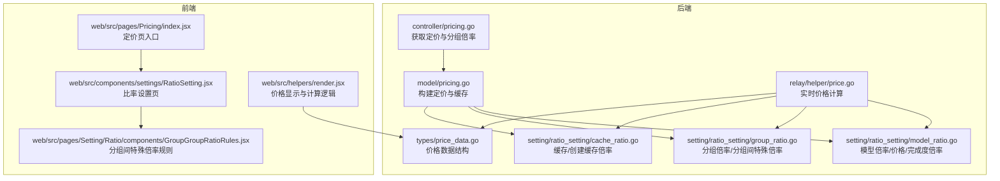
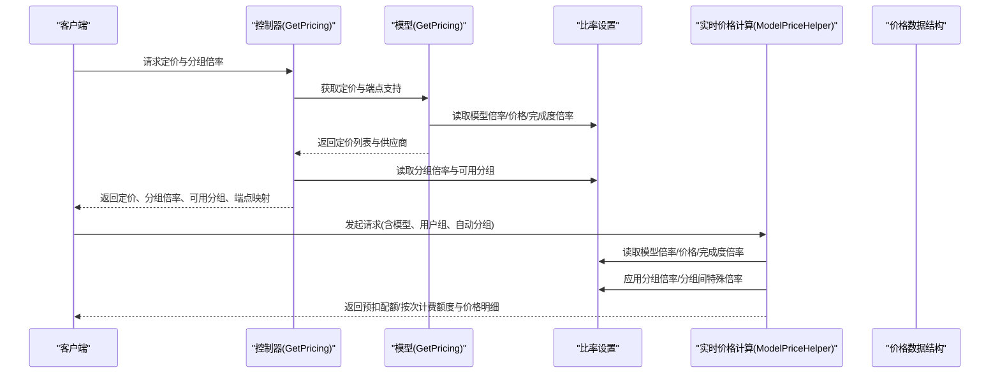
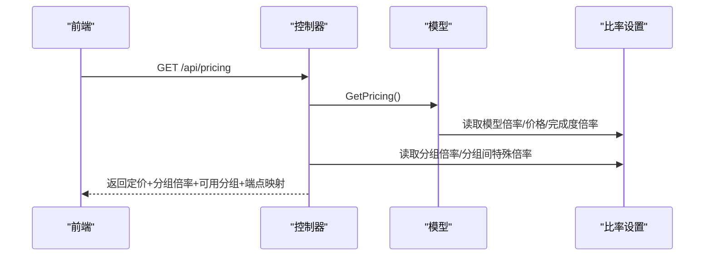
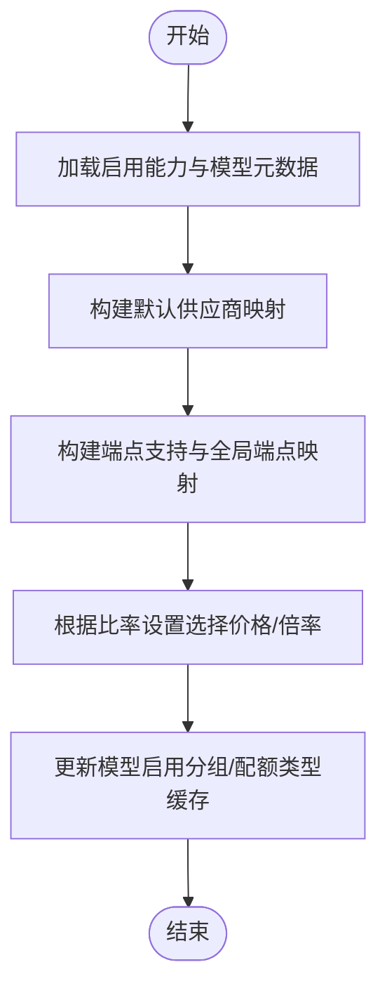
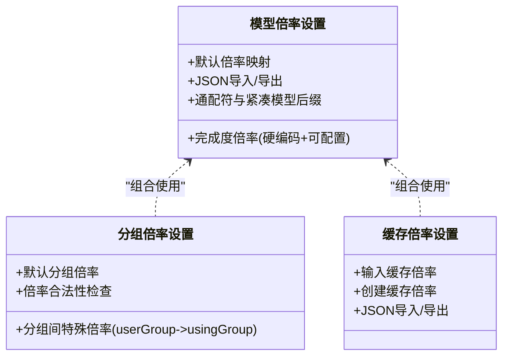
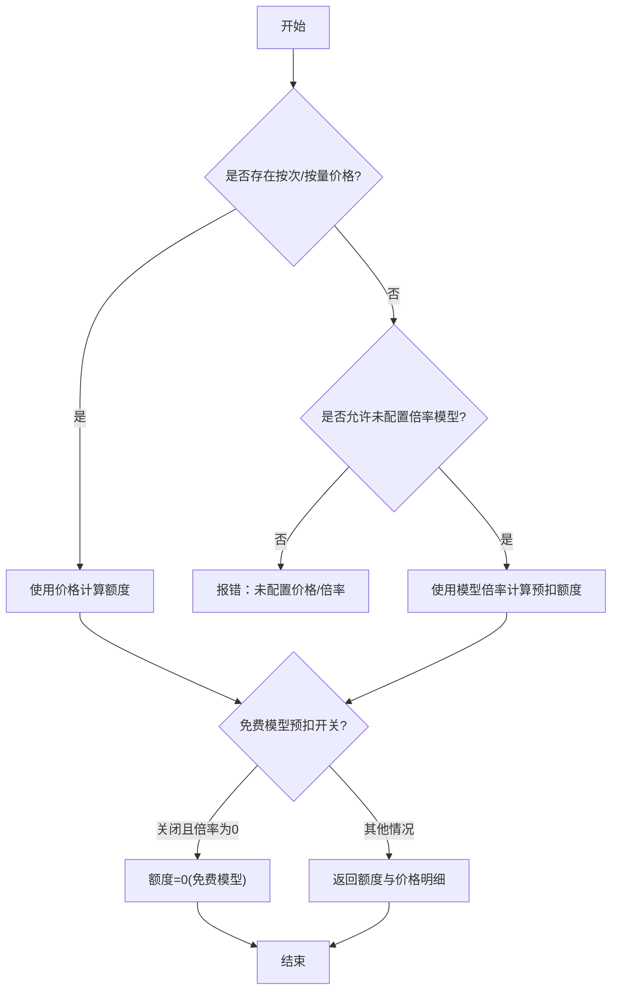
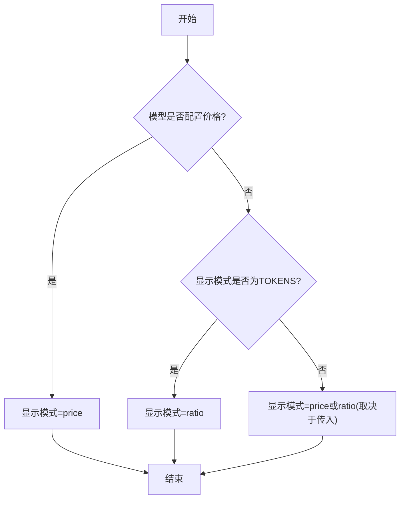
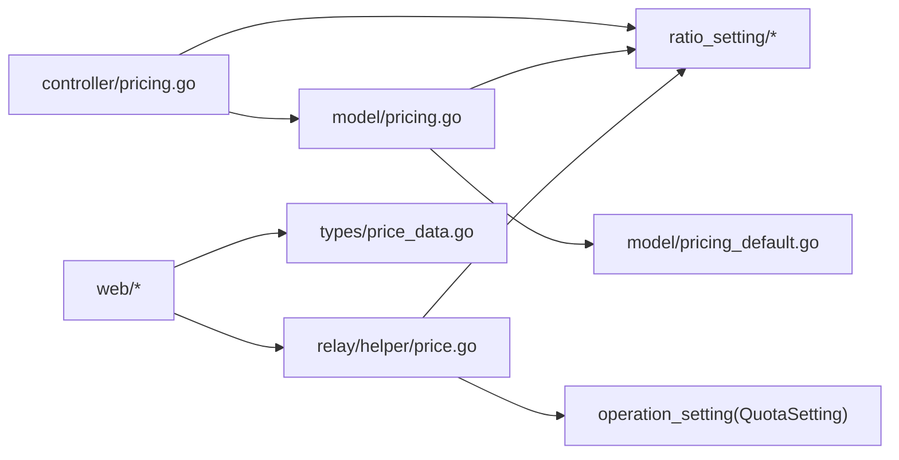

# 定价策略

<cite>
**本文引用的文件**
- [controller/pricing.go](file://controller/pricing.go)
- [model/pricing.go](file://model/pricing.go)
- [model/pricing_default.go](file://model/pricing_default.go)
- [model/pricing_refresh.go](file://model/pricing_refresh.go)
- [dto/pricing.go](file://dto/pricing.go)
- [setting/ratio_setting/model_ratio.go](file://setting/ratio_setting/model_ratio.go)
- [setting/ratio_setting/group_ratio.go](file://setting/ratio_setting/group_ratio.go)
- [setting/ratio_setting/cache_ratio.go](file://setting/ratio_setting/cache_ratio.go)
- [setting/ratio_setting/exposed_cache.go](file://setting/ratio_setting/exposed_cache.go)
- [setting/ratio_setting/expose_ratio.go](file://setting/ratio_setting/expose_ratio.go)
- [relay/helper/price.go](file://relay/helper/price.go)
- [types/price_data.go](file://types/price_data.go)
- [web/src/pages/Pricing/index.jsx](file://web/src/pages/Pricing/index.jsx)
- [web/src/helpers/render.jsx](file://web/src/helpers/render.jsx)
- [web/src/components/settings/RatioSetting.jsx](file://web/src/components/settings/RatioSetting.jsx)
- [web/src/pages/Setting/Ratio/components/GroupGroupRatioRules.jsx](file://web/src/pages/Setting/Ratio/components/GroupGroupRatioRules.jsx)
</cite>

## 目录
1. [简介](#简介)
2. [项目结构](#项目结构)
3. [核心组件](#核心组件)
4. [架构总览](#架构总览)
5. [详细组件分析](#详细组件分析)
6. [依赖分析](#依赖分析)
7. [性能考量](#性能考量)
8. [故障排查指南](#故障排查指南)
9. [结论](#结论)
10. [附录](#附录)

## 简介
本文件系统化阐述 New API 的定价策略体系，覆盖模型倍率、分组倍率与特殊倍率的配置机制，解释定价计算公式、倍率优先级与覆盖规则，梳理默认倍率、用户特定倍率与分组特殊倍率的层级关系，说明实时价格计算、缓存策略与倍率更新机制，并提供配置示例、价格调整影响分析、成本控制策略、扩展点与批量管理能力，以及性能优化建议。

## 项目结构
定价策略涉及后端控制器、模型层、比率设置模块、辅助计算工具与前端展示页面/组件。关键交互路径如下：
- 控制器负责拉取定价与分组倍率，过滤可用分组，返回前端所需数据。
- 模型层负责聚合模型能力、供应商、端点支持与定价映射，并维护缓存。
- 比率设置模块提供默认与可配置的模型倍率、价格、完成度倍率、缓存/创建缓存倍率、分组倍率与分组间特殊倍率。
- 辅助计算工具在请求处理时根据模型与分组倍率实时计算预扣配额与价格。
- 前端页面与组件负责展示定价、编辑分组倍率与特殊倍率规则，并支持批量配置与同步。

**图表来源**
- [controller/pricing.go:36-77](file://controller/pricing.go#L36-L77)
- [model/pricing.go:63-341](file://model/pricing.go#L63-L341)
- [setting/ratio_setting/model_ratio.go:26-427](file://setting/ratio_setting/model_ratio.go#L26-L427)
- [setting/ratio_setting/group_ratio.go:12-126](file://setting/ratio_setting/group_ratio.go#L12-L126)
- [setting/ratio_setting/cache_ratio.go:7-151](file://setting/ratio_setting/cache_ratio.go#L7-L151)
- [relay/helper/price.go:35-217](file://relay/helper/price.go#L35-L217)
- [types/price_data.go:5-43](file://types/price_data.go#L5-L43)
- [web/src/pages/Pricing/index.jsx:20-30](file://web/src/pages/Pricing/index.jsx#L20-L30)
- [web/src/components/settings/RatioSetting.jsx:79-117](file://web/src/components/settings/RatioSetting.jsx#L79-L117)
- [web/src/pages/Setting/Ratio/components/GroupGroupRatioRules.jsx:159-213](file://web/src/pages/Setting/Ratio/components/GroupGroupRatioRules.jsx#L159-L213)
- [web/src/helpers/render.jsx:1180-1224](file://web/src/helpers/render.jsx#L1180-L1224)

**章节来源**
- [controller/pricing.go:36-77](file://controller/pricing.go#L36-L77)
- [model/pricing.go:63-341](file://model/pricing.go#L63-L341)
- [setting/ratio_setting/model_ratio.go:26-427](file://setting/ratio_setting/model_ratio.go#L26-L427)
- [setting/ratio_setting/group_ratio.go:12-126](file://setting/ratio_setting/group_ratio.go#L12-L126)
- [setting/ratio_setting/cache_ratio.go:7-151](file://setting/ratio_setting/cache_ratio.go#L7-L151)
- [relay/helper/price.go:35-217](file://relay/helper/price.go#L35-L217)
- [types/price_data.go:5-43](file://types/price_data.go#L5-L43)
- [web/src/pages/Pricing/index.jsx:20-30](file://web/src/pages/Pricing/index.jsx#L20-L30)
- [web/src/components/settings/RatioSetting.jsx:79-117](file://web/src/components/settings/RatioSetting.jsx#L79-L117)
- [web/src/pages/Setting/Ratio/components/GroupGroupRatioRules.jsx:159-213](file://web/src/pages/Setting/Ratio/components/GroupGroupRatioRules.jsx#L159-L213)
- [web/src/helpers/render.jsx:1180-1224](file://web/src/helpers/render.jsx#L1180-L1224)

## 核心组件
- 定价控制器：拉取定价、分组倍率、可用分组、端点支持等，返回前端所需数据。
- 定价模型：聚合模型能力、供应商、端点支持、启用分组与定价映射，维护缓存与版本号。
- 比率设置模块：
  - 模型倍率/价格/完成度倍率：默认值与可配置项，支持 JSON 导入导出与通配符。
  - 分组倍率与分组间特殊倍率：支持用户组到使用分组的定向倍率覆盖。
  - 缓存/创建缓存倍率：针对不同模型的输入缓存与缓存创建成本倍率。
- 实时价格计算：根据模型与分组倍率计算预扣配额或按次计费额度，考虑免费模型与显示模式。
- 前端展示与配置：定价页、比率设置页、分组间特殊倍率规则编辑器与价格渲染逻辑。

**章节来源**
- [controller/pricing.go:36-77](file://controller/pricing.go#L36-L77)
- [model/pricing.go:17-341](file://model/pricing.go#L17-L341)
- [setting/ratio_setting/model_ratio.go:26-427](file://setting/ratio_setting/model_ratio.go#L26-L427)
- [setting/ratio_setting/group_ratio.go:12-126](file://setting/ratio_setting/group_ratio.go#L12-L126)
- [setting/ratio_setting/cache_ratio.go:7-151](file://setting/ratio_setting/cache_ratio.go#L7-L151)
- [relay/helper/price.go:35-217](file://relay/helper/price.go#L35-L217)
- [types/price_data.go:5-43](file://types/price_data.go#L5-L43)

## 架构总览
定价策略的运行流程从“获取定价”开始，经过“分组倍率应用”，再到“实时价格计算”，最终在前端呈现与配置。

**图表来源**
- [controller/pricing.go:36-77](file://controller/pricing.go#L36-L77)
- [model/pricing.go:63-341](file://model/pricing.go#L63-L341)
- [setting/ratio_setting/model_ratio.go:360-427](file://setting/ratio_setting/model_ratio.go#L360-L427)
- [setting/ratio_setting/group_ratio.go:84-111](file://setting/ratio_setting/group_ratio.go#L84-L111)
- [relay/helper/price.go:64-156](file://relay/helper/price.go#L64-L156)
- [types/price_data.go:11-28](file://types/price_data.go#L11-L28)

## 详细组件分析

### 定价控制器与前端交互
- 控制器负责：
  - 过滤仅对当前用户可用的分组；
  - 合并用户组到使用分组的特殊倍率；
  - 返回定价列表、供应商、分组倍率、可用分组、端点映射与自动分组。
- 前端：
  - 定价页入口组件；
  - 比率设置页包含“模型定价设置”“分组相关设置”“未设置价格模型”“上游倍率同步”等 Tab；
  - 分组间特殊倍率规则编辑器支持新增、删除、序列化/反序列化规则。

**图表来源**
- [controller/pricing.go:36-77](file://controller/pricing.go#L36-L77)
- [model/pricing.go:63-341](file://model/pricing.go#L63-L341)
- [setting/ratio_setting/group_ratio.go:67-111](file://setting/ratio_setting/group_ratio.go#L67-L111)
- [web/src/pages/Pricing/index.jsx:20-30](file://web/src/pages/Pricing/index.jsx#L20-L30)
- [web/src/components/settings/RatioSetting.jsx:79-117](file://web/src/components/settings/RatioSetting.jsx#L79-L117)
- [web/src/pages/Setting/Ratio/components/GroupGroupRatioRules.jsx:159-213](file://web/src/pages/Setting/Ratio/components/GroupGroupRatioRules.jsx#L159-L213)

**章节来源**
- [controller/pricing.go:36-77](file://controller/pricing.go#L36-L77)
- [web/src/pages/Pricing/index.jsx:20-30](file://web/src/pages/Pricing/index.jsx#L20-L30)
- [web/src/components/settings/RatioSetting.jsx:79-117](file://web/src/components/settings/RatioSetting.jsx#L79-L117)
- [web/src/pages/Setting/Ratio/components/GroupGroupRatioRules.jsx:159-213](file://web/src/pages/Setting/Ratio/components/GroupGroupRatioRules.jsx#L159-L213)

### 定价模型与缓存
- 定价模型负责：
  - 加载启用能力与模型元数据，构建模型到供应商、端点支持、启用分组的映射；
  - 根据比率设置模块决定使用“价格”还是“倍率”作为计费基础；
  - 维护模型支持端点类型与全局端点映射（默认 + 自定义覆盖）；
  - 缓存模型启用分组与配额类型，提升高并发查询效率；
  - 提供强制刷新接口以绕过 1 分钟缓存延迟。
- 默认供应商映射与图标：基于模型名规则自动推断供应商与图标，必要时创建供应商记录。

**图表来源**
- [model/pricing.go:98-341](file://model/pricing.go#L98-L341)
- [model/pricing_default.go:70-129](file://model/pricing_default.go#L70-L129)
- [model/pricing_refresh.go:3-14](file://model/pricing_refresh.go#L3-L14)

**章节来源**
- [model/pricing.go:63-341](file://model/pricing.go#L63-L341)
- [model/pricing_default.go:70-129](file://model/pricing_default.go#L70-L129)
- [model/pricing_refresh.go:3-14](file://model/pricing_refresh.go#L3-L14)

### 比率设置模块（模型倍率/价格/完成度倍率/缓存倍率）
- 模型倍率与价格：
  - 默认倍率与价格映射，支持 JSON 导入/导出；
  - 通配符键与紧凑模型后缀支持；
  - 完成度倍率存在硬编码与可配置两部分，优先级与锁定状态区分。
- 分组倍率与分组间特殊倍率：
  - 用户组到使用分组的定向倍率覆盖；
  - 支持检查倍率合法性（非负）。
- 缓存/创建缓存倍率：
  - 针对不同模型的输入缓存与缓存创建成本倍率；
  - 提供 JSON 导入/导出与默认值。

**图表来源**
- [setting/ratio_setting/model_ratio.go:26-427](file://setting/ratio_setting/model_ratio.go#L26-L427)
- [setting/ratio_setting/group_ratio.go:12-126](file://setting/ratio_setting/group_ratio.go#L12-L126)
- [setting/ratio_setting/cache_ratio.go:7-151](file://setting/ratio_setting/cache_ratio.go#L7-L151)

**章节来源**
- [setting/ratio_setting/model_ratio.go:26-427](file://setting/ratio_setting/model_ratio.go#L26-L427)
- [setting/ratio_setting/group_ratio.go:12-126](file://setting/ratio_setting/group_ratio.go#L12-L126)
- [setting/ratio_setting/cache_ratio.go:7-151](file://setting/ratio_setting/cache_ratio.go#L7-L151)

### 实时价格计算与倍率优先级
- 优先级与覆盖规则：
  - 分组间特殊倍率优先于默认分组倍率；
  - 当存在“按次/按量”计费时，优先使用价格；否则使用模型倍率；
  - 对于未配置价格的模型，可依据用户设置接受未配置倍率模型，否则报错；
  - 免费模型预扣开关控制是否按 0 倍率预扣。
- 计算公式要点：
  - 按量计费：预扣额度 = 预消费令牌数 × 模型倍率 × 分组倍率；
  - 按次计费：额度 = 模型价格 × 单位配额 × 分组倍率；
  - 完成度倍率、缓存倍率、音频/图像倍率参与最终价格计算；
  - 缓存创建成本存在 5 分钟与 1 小时两种粒度的倍率。

**图表来源**
- [relay/helper/price.go:64-156](file://relay/helper/price.go#L64-L156)
- [relay/helper/price.go:158-217](file://relay/helper/price.go#L158-L217)
- [types/price_data.go:11-28](file://types/price_data.go#L11-L28)

**章节来源**
- [relay/helper/price.go:64-156](file://relay/helper/price.go#L64-L156)
- [relay/helper/price.go:158-217](file://relay/helper/price.go#L158-L217)
- [types/price_data.go:11-28](file://types/price_data.go#L11-L28)

### 前端价格显示与配置
- 价格显示模式：
  - 当模型已配置价格时，显示“按次/按量”计费；
  - 当显示模式为“TOKENS”且模型未配置价格时，采用“倍率”计费；
  - 否则根据显示模式选择“价格”或“倍率”。
- 分组倍率标签：
  - 若存在用户组到使用分组的特殊倍率，则显示“专属倍率”，否则显示“分组倍率”。

**图表来源**
- [web/src/helpers/render.jsx:1208-1224](file://web/src/helpers/render.jsx#L1208-L1224)
- [web/src/helpers/render.jsx:1180-1202](file://web/src/helpers/render.jsx#L1180-L1202)

**章节来源**
- [web/src/helpers/render.jsx:1208-1224](file://web/src/helpers/render.jsx#L1208-L1224)
- [web/src/helpers/render.jsx:1180-1202](file://web/src/helpers/render.jsx#L1180-L1202)

## 依赖分析
- 控制器依赖模型与比率设置模块，用于组装返回数据。
- 模型依赖比率设置模块与默认供应商映射，用于构建定价与端点映射。
- 实时价格计算依赖比率设置模块与操作设置（免费模型预扣开关）。
- 前端组件依赖价格数据结构与渲染逻辑，用于展示与交互。

**图表来源**
- [controller/pricing.go:3-10](file://controller/pricing.go#L3-L10)
- [model/pricing.go:3-15](file://model/pricing.go#L3-L15)
- [model/pricing_default.go:3-6](file://model/pricing_default.go#L3-L6)
- [relay/helper/price.go:3-15](file://relay/helper/price.go#L3-L15)
- [types/price_data.go:3-4](file://types/price_data.go#L3-L4)

**章节来源**
- [controller/pricing.go:3-10](file://controller/pricing.go#L3-L10)
- [model/pricing.go:3-15](file://model/pricing.go#L3-L15)
- [model/pricing_default.go:3-6](file://model/pricing_default.go#L3-L6)
- [relay/helper/price.go:3-15](file://relay/helper/price.go#L3-L15)
- [types/price_data.go:3-4](file://types/price_data.go#L3-L4)

## 性能考量
- 定价缓存：
  - 定价与端点映射缓存每 1 分钟刷新一次，避免频繁数据库查询；
  - 强制刷新接口可绕过缓存延迟，适用于管理端即时生效场景。
- 暴露数据缓存：
  - 暴露给外部的比率数据缓存 TTL 为 30 秒，降低高频读取压力。
- 并发安全：
  - 更新定价与端点映射使用互斥锁保护，确保一致性。
- 前端渲染：
  - 通过本地存储控制显示模式（TOKENS/USD），减少重复计算。

**章节来源**
- [model/pricing.go:63-84](file://model/pricing.go#L63-L84)
- [model/pricing_refresh.go:3-14](file://model/pricing_refresh.go#L3-L14)
- [setting/ratio_setting/exposed_cache.go:11-56](file://setting/ratio_setting/exposed_cache.go#L11-L56)

## 故障排查指南
- 未配置价格/倍率导致的错误：
  - 当模型既未配置价格也未配置倍率，且用户未允许未配置倍率模型时，会返回“未配置价格”的错误提示。
- 分组倍率异常：
  - 分组间特殊倍率不存在时回退到默认分组倍率；若默认分组倍率缺失，日志会记录告警。
- 免费模型预扣：
  - 当免费模型预扣开关关闭且倍率为 0 或价格为 0 时，额度将被置为 0，视为免费模型。
- 前端显示问题：
  - 若显示模式为 TOKENS 且模型未配置价格，前端将采用倍率计费；若显示模式为 price，前端将直接显示价格。

**章节来源**
- [relay/helper/price.go:17-30](file://relay/helper/price.go#L17-L30)
- [relay/helper/price.go:50-62](file://relay/helper/price.go#L50-L62)
- [relay/helper/price.go:116-132](file://relay/helper/price.go#L116-L132)
- [web/src/helpers/render.jsx:1208-1224](file://web/src/helpers/render.jsx#L1208-L1224)

## 结论
New API 的定价策略通过“模型倍率/价格 + 分组倍率/分组间特殊倍率 + 缓存/创建缓存倍率”的多维组合，实现了灵活的成本控制与差异化定价。控制器与模型层负责静态与动态数据的整合与缓存，实时价格计算模块在请求阶段完成倍率应用与额度计算，前端提供直观的配置与展示界面。整体设计兼顾易用性、可扩展性与性能。

## 附录

### 倍率优先级与覆盖规则清单
- 分组间特殊倍率 > 默认分组倍率
- 按次/按量价格 > 模型倍率
- 未配置价格时，若允许未配置倍率模型则使用倍率，否则报错
- 免费模型预扣开关关闭且倍率/价格为 0 时，额度为 0

**章节来源**
- [relay/helper/price.go:64-156](file://relay/helper/price.go#L64-L156)
- [relay/helper/price.go:158-217](file://relay/helper/price.go#L158-L217)

### 默认倍率与价格参考
- 模型倍率与价格默认映射位于比率设置模块，默认值覆盖主流模型与供应商。
- 完成度倍率存在硬编码与可配置两部分，部分模型倍率具有“锁定”属性，不可被用户修改。

**章节来源**
- [setting/ratio_setting/model_ratio.go:26-427](file://setting/ratio_setting/model_ratio.go#L26-L427)

### 扩展点与批量管理
- 扩展点：
  - 新增模型时可在默认供应商映射中添加规则；
  - 新增分组或分组间特殊倍率规则；
  - 新增缓存/创建缓存倍率规则。
- 批量管理：
  - 支持 JSON 导入/导出模型倍率、价格、完成度倍率、缓存/创建缓存倍率；
  - 支持重置模型倍率为默认值；
  - 分组倍率与分组间特殊倍率规则支持表格化编辑与序列化保存。

**章节来源**
- [setting/ratio_setting/model_ratio.go:352-427](file://setting/ratio_setting/model_ratio.go#L352-L427)
- [setting/ratio_setting/group_ratio.go:67-126](file://setting/ratio_setting/group_ratio.go#L67-L126)
- [setting/ratio_setting/cache_ratio.go:107-151](file://setting/ratio_setting/cache_ratio.go#L107-L151)
- [controller/pricing.go:79-101](file://controller/pricing.go#L79-L101)
- [web/src/pages/Setting/Ratio/components/GroupGroupRatioRules.jsx:159-213](file://web/src/pages/Setting/Ratio/components/GroupGroupRatioRules.jsx#L159-L213)

### 成本控制策略建议
- 使用分组间特殊倍率对 VIP/SVIP 等高级分组实施折扣或加价；
- 对高成本模型启用“按次/按量”价格，避免倍率波动带来的不确定性；
- 在免费模型预扣开关关闭时，结合倍率/价格为 0 的策略实现完全免费；
- 定期审查未设置价格模型，及时配置价格以避免服务中断。

**章节来源**
- [setting/ratio_setting/group_ratio.go:84-111](file://setting/ratio_setting/group_ratio.go#L84-L111)
- [relay/helper/price.go:116-132](file://relay/helper/price.go#L116-L132)