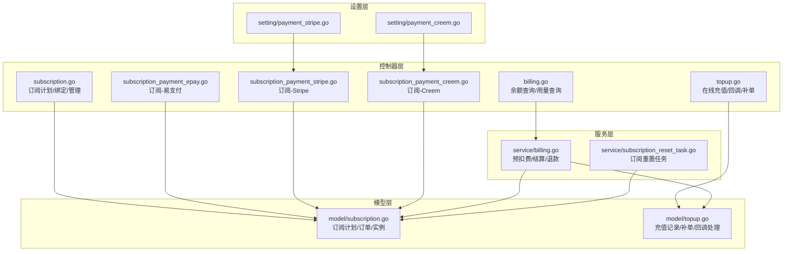
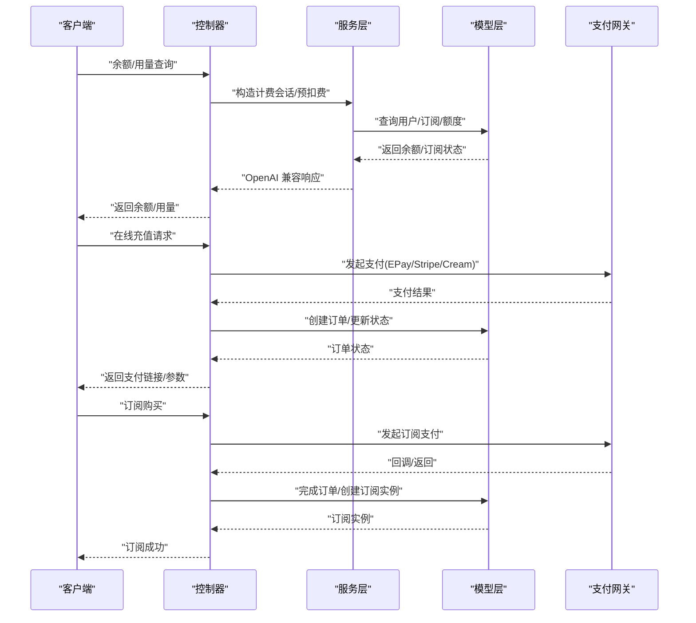
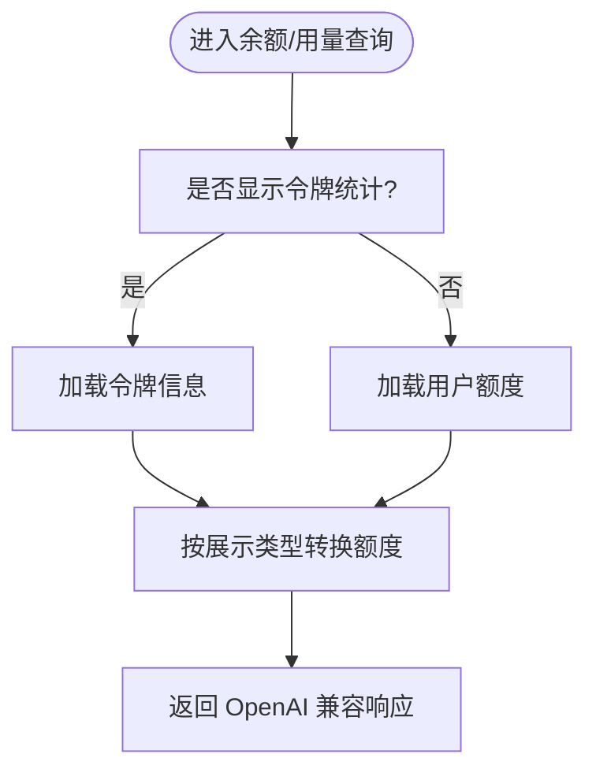
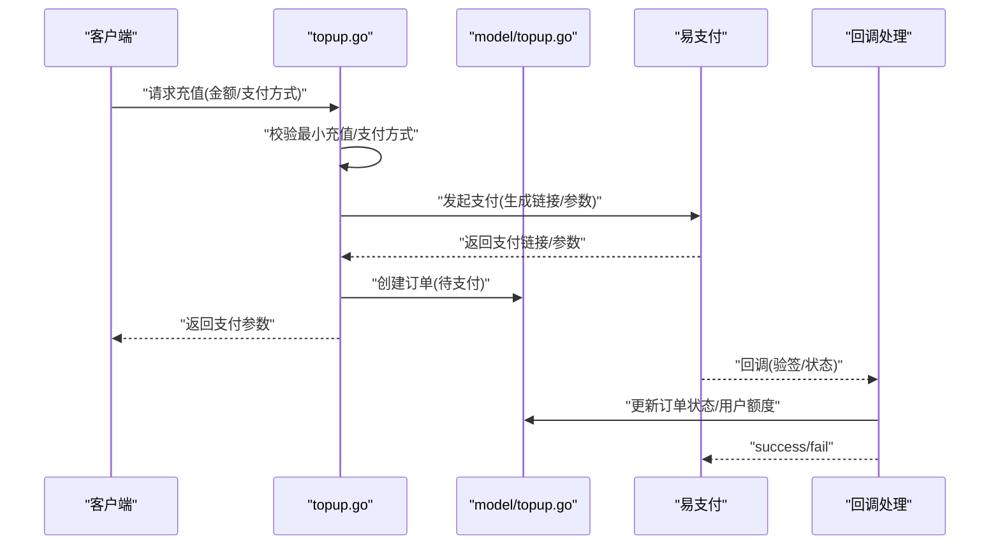
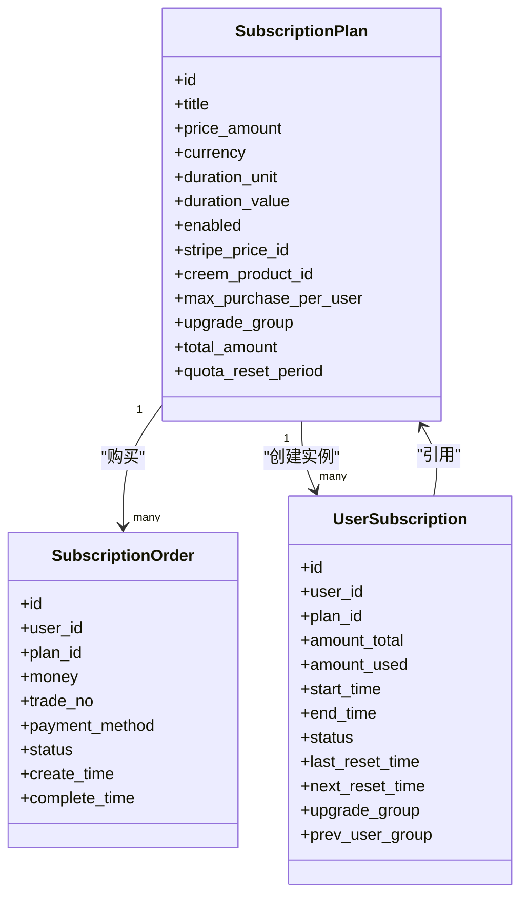
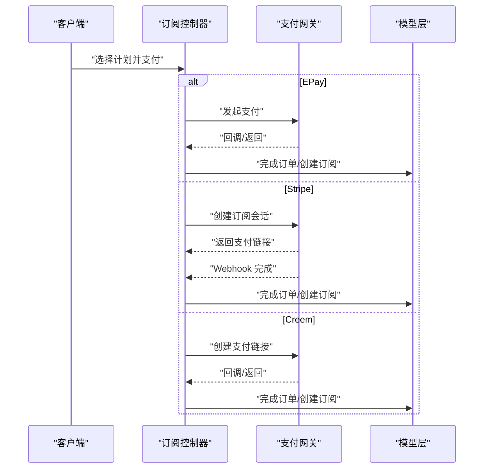
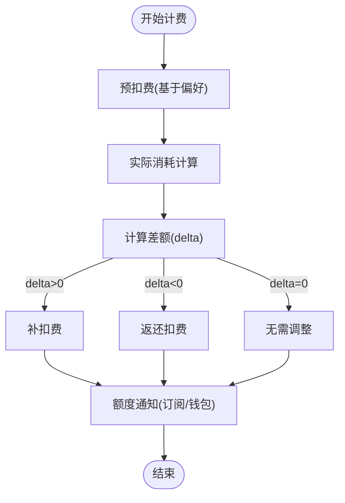
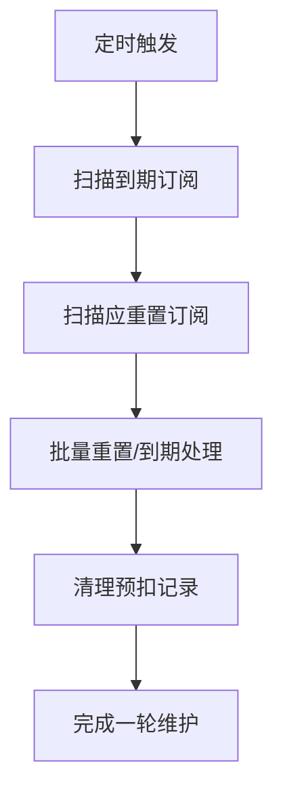
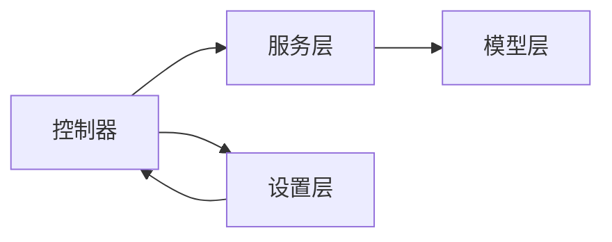

# 计费与配额

<cite>
**本文引用的文件**
- [controller/billing.go](file://controller/billing.go)
- [controller/topup.go](file://controller/topup.go)
- [controller/subscription.go](file://controller/subscription.go)
- [controller/subscription_payment_epay.go](file://controller/subscription_payment_epay.go)
- [controller/subscription_payment_stripe.go](file://controller/subscription_payment_stripe.go)
- [controller/subscription_payment_creem.go](file://controller/subscription_payment_creem.go)
- [service/billing.go](file://service/billing.go)
- [relay/common/billing.go](file://relay/common/billing.go)
- [model/subscription.go](file://model/subscription.go)
- [model/topup.go](file://model/topup.go)
- [service/subscription_reset_task.go](file://service/subscription_reset_task.go)
- [setting/payment_stripe.go](file://setting/payment_stripe.go)
- [setting/payment_creem.go](file://setting/payment_creem.go)
</cite>

## 目录
1. [简介](#简介)
2. [项目结构](#项目结构)
3. [核心组件](#核心组件)
4. [架构总览](#架构总览)
5. [详细组件分析](#详细组件分析)
6. [依赖分析](#依赖分析)
7. [性能考虑](#性能考虑)
8. [故障排查指南](#故障排查指南)
9. [结论](#结论)
10. [附录](#附录)

## 简介
本技术文档面向 New API 的计费与配额系统，覆盖余额管理、订阅服务机制、在线充值流程、计费策略与配额计算算法、消费记录管理、多支付方式集成（EPay、Stripe、Creem），以及订阅计划配置、自动续费处理、配额重置策略、超支处理与退款流程。文档同时提供业务逻辑代码示例路径、配置参数与监控指标说明，并解释实时计费、缓存计费支持与成本优化策略，帮助开发者理解并扩展系统以满足不同商业需求。

## 项目结构
计费与配额相关模块主要分布在以下层次：
- 控制器层：负责对外 API、支付回调与订阅下单流程
- 服务层：封装计费会话、结算与退款、额度通知
- 模型层：持久化用户额度、充值记录、订阅计划与实例
- 设置层：支付渠道配置（Stripe、Creem 等）
- 任务层：定时重置订阅配额与清理预扣记录

**图表来源**
- [controller/billing.go:1-109](file://controller/billing.go#L1-L109)
- [controller/topup.go:1-471](file://controller/topup.go#L1-L471)
- [controller/subscription.go:1-384](file://controller/subscription.go#L1-L384)
- [controller/subscription_payment_epay.go:1-217](file://controller/subscription_payment_epay.go#L1-L217)
- [controller/subscription_payment_stripe.go:1-139](file://controller/subscription_payment_stripe.go#L1-L139)
- [controller/subscription_payment_creem.go:1-130](file://controller/subscription_payment_creem.go#L1-L130)
- [service/billing.go:1-79](file://service/billing.go#L1-L79)
- [service/subscription_reset_task.go:1-94](file://service/subscription_reset_task.go#L1-L94)
- [model/subscription.go:1-1193](file://model/subscription.go#L1-L1193)
- [model/topup.go:1-452](file://model/topup.go#L1-L452)
- [setting/payment_stripe.go:1-9](file://setting/payment_stripe.go#L1-L9)
- [setting/payment_creem.go:1-7](file://setting/payment_creem.go#L1-L7)

**章节来源**
- [controller/billing.go:1-109](file://controller/billing.go#L1-L109)
- [controller/topup.go:1-471](file://controller/topup.go#L1-L471)
- [controller/subscription.go:1-384](file://controller/subscription.go#L1-L384)
- [controller/subscription_payment_epay.go:1-217](file://controller/subscription_payment_epay.go#L1-L217)
- [controller/subscription_payment_stripe.go:1-139](file://controller/subscription_payment_stripe.go#L1-L139)
- [controller/subscription_payment_creem.go:1-130](file://controller/subscription_payment_creem.go#L1-L130)
- [service/billing.go:1-79](file://service/billing.go#L1-L79)
- [service/subscription_reset_task.go:1-94](file://service/subscription_reset_task.go#L1-L94)
- [model/subscription.go:1-1193](file://model/subscription.go#L1-L1193)
- [model/topup.go:1-452](file://model/topup.go#L1-L452)
- [setting/payment_stripe.go:1-9](file://setting/payment_stripe.go#L1-L9)
- [setting/payment_creem.go:1-7](file://setting/payment_creem.go#L1-L7)

## 核心组件
- 余额与用量查询：统一返回 OpenAI 兼容格式，支持按展示类型转换（USD/CNY/TOKENS）
- 在线充值：支持 EPay、Stripe、Creem、Waffo 多种支付方式，含最小充值限制、折扣配置、订单幂等与并发控制
- 订阅服务：订阅计划配置、购买下单、自动续费、额度重置与到期处理、管理员绑定/取消/删除
- 计费会话：预扣费、后结算、退款、额度通知
- 配额重置任务：定时扫描到期与重置条件，批量处理并清理预扣记录

**章节来源**
- [controller/billing.go:11-108](file://controller/billing.go#L11-L108)
- [controller/topup.go:25-101](file://controller/topup.go#L25-L101)
- [controller/subscription.go:26-384](file://controller/subscription.go#L26-L384)
- [service/billing.go:17-79](file://service/billing.go#L17-L79)
- [service/subscription_reset_task.go:29-94](file://service/subscription_reset_task.go#L29-L94)

## 架构总览
下图展示了计费与配额系统的整体交互：前端调用控制器 API，控制器协调服务层与模型层，服务层封装计费会话与结算，模型层持久化数据并提供查询与更新能力。

**图表来源**
- [controller/billing.go:11-108](file://controller/billing.go#L11-L108)
- [controller/topup.go:166-239](file://controller/topup.go#L166-L239)
- [controller/subscription.go:41-63](file://controller/subscription.go#L41-L63)
- [controller/subscription_payment_epay.go:25-112](file://controller/subscription_payment_epay.go#L25-L112)
- [controller/subscription_payment_stripe.go:24-106](file://controller/subscription_payment_stripe.go#L24-L106)
- [controller/subscription_payment_creem.go:21-129](file://controller/subscription_payment_creem.go#L21-L129)
- [service/billing.go:17-79](file://service/billing.go#L17-L79)
- [model/subscription.go:507-572](file://model/subscription.go#L507-L572)
- [model/topup.go:244-314](file://model/topup.go#L244-L314)

## 详细组件分析

### 余额与用量查询
- 余额查询：根据展示类型将“额度单位”转换为 USD/CNY/TOKENS，支持无限额度标记
- 用量查询：返回累计使用额度，按展示类型转换
- 错误处理：上游错误包装为标准错误对象

**图表来源**
- [controller/billing.go:11-108](file://controller/billing.go#L11-L108)

**章节来源**
- [controller/billing.go:11-108](file://controller/billing.go#L11-L108)

### 在线充值（EPay）
- 支付方式检测：动态合并配置启用的支付方式
- 金额计算：根据展示类型与分组倍率、折扣计算应付金额
- 最小充值：按展示类型换算最小充值额度
- 订单创建：生成唯一交易号、保存订单状态为“待支付”
- 回调处理：验签、幂等、并发锁、更新订单与用户额度、记录日志
- 管理员补单：行级锁保证并发安全，按支付方式计算应充值额度

**图表来源**
- [controller/topup.go:166-239](file://controller/topup.go#L166-L239)
- [controller/topup.go:283-370](file://controller/topup.go#L283-L370)
- [model/topup.go:244-314](file://model/topup.go#L244-L314)

**章节来源**
- [controller/topup.go:25-101](file://controller/topup.go#L25-L101)
- [controller/topup.go:166-239](file://controller/topup.go#L166-L239)
- [controller/topup.go:283-370](file://controller/topup.go#L283-L370)
- [controller/topup.go:448-471](file://controller/topup.go#L448-L471)
- [model/topup.go:14-452](file://model/topup.go#L14-L452)

### 订阅服务（计划/购买/重置）
- 订阅计划：支持排序、启用状态、Stripe/Creem 产品 ID、购买上限、升级分组、配额重置周期
- 购买流程：校验计划状态与购买上限、生成订单、支付完成后创建订阅实例、写入充值记录
- 自动续费：通过支付网关订阅模式实现
- 配额重置：按日/周/月/自定义周期重置订阅配额，到期后标记并清理预扣记录
- 管理员操作：绑定订阅、取消（即时结束）、删除（硬删除）

**图表来源**
- [model/subscription.go:144-180](file://model/subscription.go#L144-L180)
- [model/subscription.go:194-208](file://model/subscription.go#L194-L208)
- [model/subscription.go:232-255](file://model/subscription.go#L232-L255)

**章节来源**
- [controller/subscription.go:26-87](file://controller/subscription.go#L26-L87)
- [controller/subscription.go:91-166](file://controller/subscription.go#L91-L166)
- [controller/subscription.go:168-278](file://controller/subscription.go#L168-L278)
- [controller/subscription.go:280-384](file://controller/subscription.go#L280-L384)
- [model/subscription.go:144-180](file://model/subscription.go#L144-L180)
- [model/subscription.go:194-208](file://model/subscription.go#L194-L208)
- [model/subscription.go:232-255](file://model/subscription.go#L232-L255)
- [model/subscription.go:507-572](file://model/subscription.go#L507-L572)

### 多支付方式集成
- EPay：通用在线支付，支持多种支付方式，回调中严格校验支付方式与状态
- Stripe：订阅模式，自动续费，支持客户 ID/邮箱，Webhook 完成订单
- Creem：按产品配置，支持测试模式与 Webhook，回调中幂等处理

**图表来源**
- [controller/subscription_payment_epay.go:25-112](file://controller/subscription_payment_epay.go#L25-L112)
- [controller/subscription_payment_stripe.go:24-106](file://controller/subscription_payment_stripe.go#L24-L106)
- [controller/subscription_payment_creem.go:21-129](file://controller/subscription_payment_creem.go#L21-L129)

**章节来源**
- [controller/subscription_payment_epay.go:25-112](file://controller/subscription_payment_epay.go#L25-L112)
- [controller/subscription_payment_epay.go:114-165](file://controller/subscription_payment_epay.go#L114-L165)
- [controller/subscription_payment_stripe.go:24-106](file://controller/subscription_payment_stripe.go#L24-L106)
- [controller/subscription_payment_creem.go:21-129](file://controller/subscription_payment_creem.go#L21-L129)

### 计费会话与结算
- 预扣费：根据用户计费偏好创建会话，存储于请求上下文，供后续结算
- 后结算：比较预扣与实际消耗，补扣/返还差额，发送额度通知
- 退款：幂等安全，异步执行，支持未结算/未退款状态的预扣退还

**图表来源**
- [service/billing.go:17-79](file://service/billing.go#L17-L79)
- [relay/common/billing.go:5-22](file://relay/common/billing.go#L5-L22)

**章节来源**
- [service/billing.go:17-79](file://service/billing.go#L17-L79)
- [relay/common/billing.go:5-22](file://relay/common/billing.go#L5-L22)

### 配额重置策略与到期处理
- 重置周期：每日、每周、每月、自定义周期，到期后停止使用并清理预扣记录
- 批量任务：定时扫描到期与重置条件，批量处理并定期清理预扣记录
- 管理员干预：可取消（即时结束）或删除订阅实例

**图表来源**
- [service/subscription_reset_task.go:29-94](file://service/subscription_reset_task.go#L29-L94)
- [model/subscription.go:299-347](file://model/subscription.go#L299-L347)

**章节来源**
- [service/subscription_reset_task.go:29-94](file://service/subscription_reset_task.go#L29-L94)
- [model/subscription.go:299-347](file://model/subscription.go#L299-L347)

## 依赖分析
- 控制器依赖服务层与模型层，向上提供 API，向下协调支付网关
- 服务层依赖模型层的数据访问与事务控制，封装计费会话生命周期
- 模型层提供订阅计划、订单、实例与充值记录的持久化与查询
- 设置层提供支付渠道配置，影响控制器行为

**图表来源**
- [controller/topup.go:1-471](file://controller/topup.go#L1-L471)
- [controller/subscription.go:1-384](file://controller/subscription.go#L1-L384)
- [service/billing.go:1-79](file://service/billing.go#L1-L79)
- [model/subscription.go:1-1193](file://model/subscription.go#L1-L1193)
- [model/topup.go:1-452](file://model/topup.go#L1-L452)
- [setting/payment_stripe.go:1-9](file://setting/payment_stripe.go#L1-L9)
- [setting/payment_creem.go:1-7](file://setting/payment_creem.go#L1-L7)

**章节来源**
- [controller/topup.go:1-471](file://controller/topup.go#L1-L471)
- [controller/subscription.go:1-384](file://controller/subscription.go#L1-L384)
- [service/billing.go:1-79](file://service/billing.go#L1-L79)
- [model/subscription.go:1-1193](file://model/subscription.go#L1-L1193)
- [model/topup.go:1-452](file://model/topup.go#L1-L452)
- [setting/payment_stripe.go:1-9](file://setting/payment_stripe.go#L1-L9)
- [setting/payment_creem.go:1-7](file://setting/payment_creem.go#L1-L7)

## 性能考虑
- 缓存计费：订阅计划与计划信息采用混合缓存（内存+Redis），降低数据库压力
- 批量重置：定时任务分批处理到期与重置，避免长事务阻塞
- 并发控制：订单级互斥锁（带引用计数）保障回调与补单的幂等与一致性
- 数据库索引：订单号、用户 ID、订阅状态与到期时间建立索引，提升查询效率
- 成本优化：最小充值限制与折扣配置减少小额高频交易带来的手续费成本

**章节来源**
- [model/subscription.go:40-125](file://model/subscription.go#L40-L125)
- [controller/topup.go:241-282](file://controller/topup.go#L241-L282)
- [service/subscription_reset_task.go:17-27](file://service/subscription_reset_task.go#L17-L27)

## 故障排查指南
- 在线充值回调失败
  - 检查支付网关回调参数与验签
  - 确认订单状态与支付方式匹配
  - 查看并发锁与幂等处理日志
  - 参考：[controller/topup.go:283-370](file://controller/topup.go#L283-L370)
- 管理员补单异常
  - 确认订单状态为“待支付”，避免重复补单
  - 校验支付方式与应充值额度计算
  - 参考：[model/topup.go:244-314](file://model/topup.go#L244-L314)
- 订阅购买未生效
  - 检查支付网关回调/返回地址配置
  - 确认计划启用状态与购买上限
  - 参考：[controller/subscription_payment_stripe.go:24-106](file://controller/subscription_payment_stripe.go#L24-L106)
- 配额未重置
  - 检查重置周期与定时任务运行状态
  - 确认到期订阅与应重置订阅扫描结果
  - 参考：[service/subscription_reset_task.go:29-94](file://service/subscription_reset_task.go#L29-L94)

**章节来源**
- [controller/topup.go:283-370](file://controller/topup.go#L283-L370)
- [model/topup.go:244-314](file://model/topup.go#L244-L314)
- [controller/subscription_payment_stripe.go:24-106](file://controller/subscription_payment_stripe.go#L24-L106)
- [service/subscription_reset_task.go:29-94](file://service/subscription_reset_task.go#L29-L94)

## 结论
New API 的计费与配额系统通过清晰的分层设计与完善的支付集成，实现了灵活的余额管理、订阅服务与在线充值流程。系统支持多种支付方式、自动续费、配额重置与到期处理，并通过缓存与批量任务优化性能。开发者可依据本文档快速理解并扩展系统，满足多样化的商业需求。

## 附录
- 配置参数（节选）
  - Stripe：密钥、Webhook 密钥、价格 ID、单价、最小充值、促销码开关
  - Creem：API Key、产品配置、测试模式、Webhook 密钥
  - 在线充值：展示类型、最小充值、支付方式列表、折扣配置
- 监控指标建议
  - 订单成功率/失败率、回调验签失败次数、补单次数与耗时
  - 订阅到期/重置批次大小与耗时、预扣记录清理频率
  - 用户额度变更速率与异常波动

**章节来源**
- [setting/payment_stripe.go:1-9](file://setting/payment_stripe.go#L1-L9)
- [setting/payment_creem.go:1-7](file://setting/payment_creem.go#L1-L7)
- [controller/topup.go:25-101](file://controller/topup.go#L25-L101)
- [service/subscription_reset_task.go:17-27](file://service/subscription_reset_task.go#L17-L27)