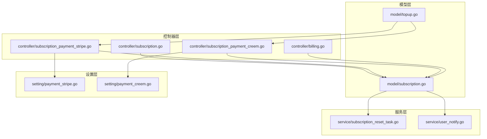
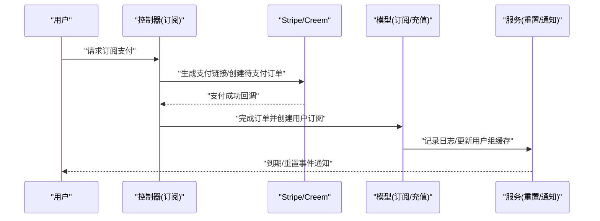
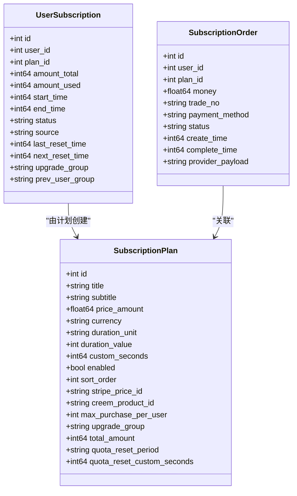
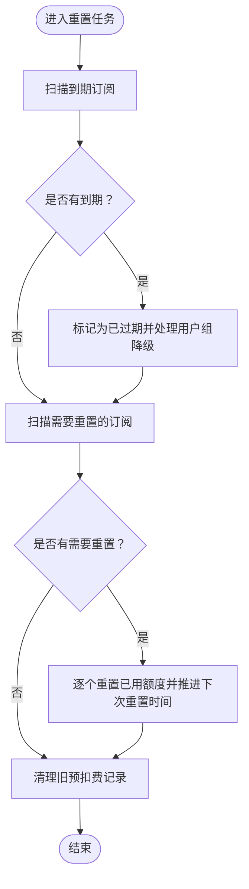
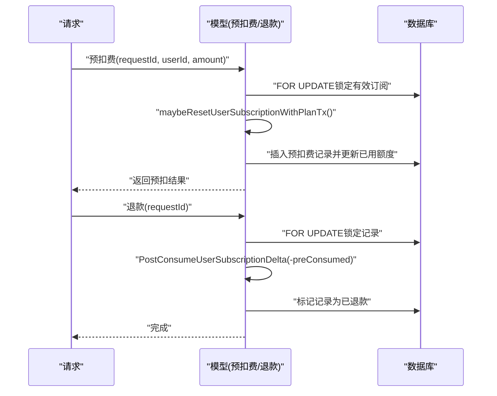
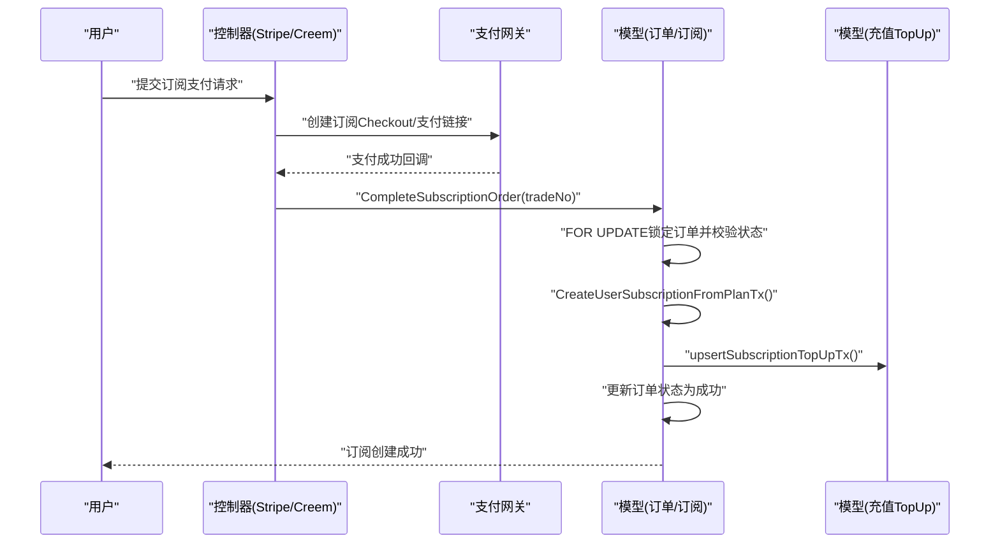
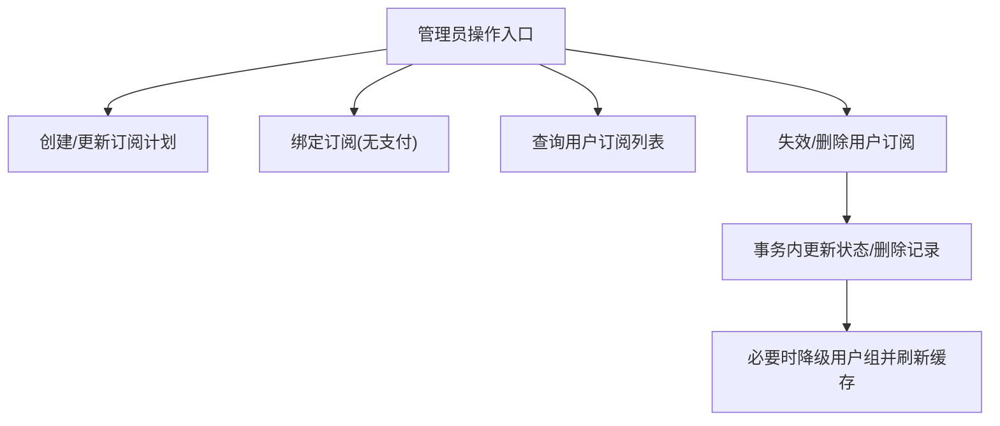
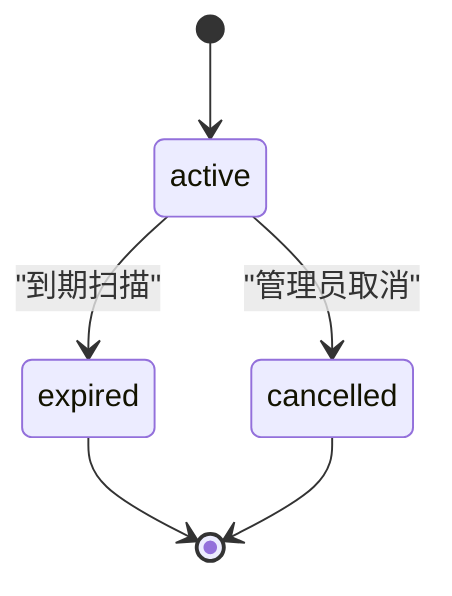
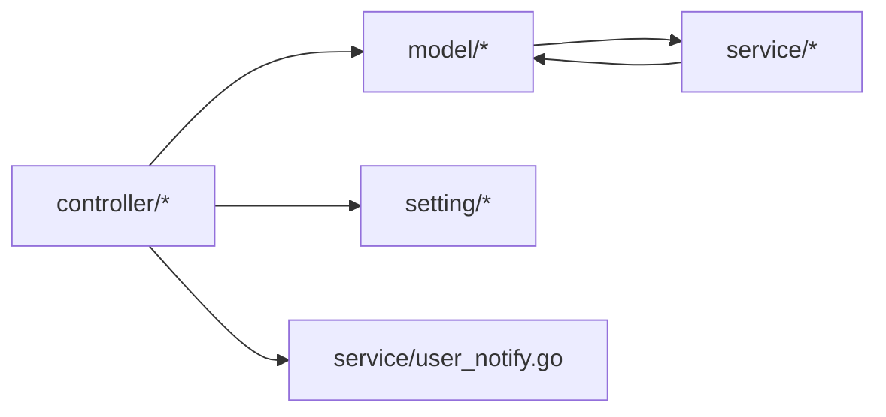

# 订阅服务

<cite>
**本文引用的文件**
- [controller/subscription.go](file://controller/subscription.go)
- [model/subscription.go](file://model/subscription.go)
- [service/subscription_reset_task.go](file://service/subscription_reset_task.go)
- [controller/subscription_payment_stripe.go](file://controller/subscription_payment_stripe.go)
- [controller/subscription_payment_creem.go](file://controller/subscription_payment_creem.go)
- [setting/payment_stripe.go](file://setting/payment_stripe.go)
- [setting/payment_creem.go](file://setting/payment_creem.go)
- [controller/billing.go](file://controller/billing.go)
- [model/topup.go](file://model/topup.go)
- [service/user_notify.go](file://service/user_notify.go)
</cite>

## 目录
1. [简介](#简介)
2. [项目结构](#项目结构)
3. [核心组件](#核心组件)
4. [架构总览](#架构总览)
5. [详细组件分析](#详细组件分析)
6. [依赖分析](#依赖分析)
7. [性能考虑](#性能考虑)
8. [故障排查指南](#故障排查指南)
9. [结论](#结论)
10. [附录](#附录)

## 简介
本文件面向 New API 的订阅服务系统，提供从订阅计划创建与管理、额度计算与预扣费/后结算、到期处理与续费提醒，到管理员操作与扩展点的完整技术说明。文档覆盖以下关键主题：
- 订阅计划的创建、启用/禁用与缓存
- 用户订阅生命周期：创建、到期、取消、删除
- 额度重置策略：按日/周/月/自定义周期
- 预扣费与后结算：幂等性保障与退款
- 支付对接：Stripe 与 Creem 订阅支付流程
- 管理员能力：计划管理、用户绑定、强制失效/删除
- 扩展点：自定义订阅类型、企业级订阅管理

## 项目结构
订阅服务相关代码主要分布在以下模块：
- 控制器层：对外暴露订阅计划查询、用户订阅查询与偏好设置；提供 Stripe/Creem 订阅支付入口
- 模型层：定义订阅计划、订单、用户订阅实体及业务逻辑（创建、到期、重置、预扣费/退款）
- 服务层：定时任务驱动的额度重置与到期处理
- 设置层：支付相关配置（Stripe/Creem）
- 通知层：用于到期/重置等事件的通知通道

**图表来源**
- [controller/subscription.go:1-384](file://controller/subscription.go#L1-L384)
- [model/subscription.go:1-1193](file://model/subscription.go#L1-L1193)
- [service/subscription_reset_task.go:1-94](file://service/subscription_reset_task.go#L1-L94)
- [controller/subscription_payment_stripe.go:1-139](file://controller/subscription_payment_stripe.go#L1-L139)
- [controller/subscription_payment_creem.go:1-130](file://controller/subscription_payment_creem.go#L1-L130)
- [setting/payment_stripe.go:1-9](file://setting/payment_stripe.go#L1-L9)
- [setting/payment_creem.go:1-7](file://setting/payment_creem.go#L1-L7)
- [controller/billing.go:1-109](file://controller/billing.go#L1-L109)
- [model/topup.go:1-452](file://model/topup.go#L1-L452)
- [service/user_notify.go:1-282](file://service/user_notify.go#L1-L282)

**章节来源**
- [controller/subscription.go:1-384](file://controller/subscription.go#L1-L384)
- [model/subscription.go:1-1193](file://model/subscription.go#L1-L1193)
- [service/subscription_reset_task.go:1-94](file://service/subscription_reset_task.go#L1-L94)
- [controller/subscription_payment_stripe.go:1-139](file://controller/subscription_payment_stripe.go#L1-L139)
- [controller/subscription_payment_creem.go:1-130](file://controller/subscription_payment_creem.go#L1-L130)
- [setting/payment_stripe.go:1-9](file://setting/payment_stripe.go#L1-L9)
- [setting/payment_creem.go:1-7](file://setting/payment_creem.go#L1-L7)
- [controller/billing.go:1-109](file://controller/billing.go#L1-L109)
- [model/topup.go:1-452](file://model/topup.go#L1-L452)
- [service/user_notify.go:1-282](file://service/user_notify.go#L1-L282)

## 核心组件
- 订阅计划（SubscriptionPlan）：描述套餐标题、价格、货币、有效期单位与数值、最大购买次数、升级用户组、总额度、额度重置周期等
- 订阅订单（SubscriptionOrder）：记录支付单据、交易号、支付方式、状态、创建/完成时间
- 用户订阅（UserSubscription）：用户持有的订阅快照，包含开始/结束时间、状态、已用/总额度、下次/上次重置时间、升级组与前一用户组
- 预扣费记录（SubscriptionPreConsumeRecord）：请求级幂等记录，防止重复扣减
- 定时任务（subscription_reset_task）：到期标记与额度重置
- 支付控制器（Stripe/Creem）：生成支付链接、创建待支付订单、回调完成后创建用户订阅

**章节来源**
- [model/subscription.go:144-255](file://model/subscription.go#L144-L255)
- [model/subscription.go:194-219](file://model/subscription.go#L194-L219)
- [model/subscription.go:895-905](file://model/subscription.go#L895-L905)
- [service/subscription_reset_task.go:17-27](file://service/subscription_reset_task.go#L17-L27)

## 架构总览
订阅服务采用“控制器-模型-服务-设置”的分层设计。支付通过外部网关完成，回调触发模型层创建用户订阅；服务层定时扫描到期与需要重置的订阅；通知层负责向用户推送到期/重置等消息。

**图表来源**
- [controller/subscription_payment_stripe.go:24-106](file://controller/subscription_payment_stripe.go#L24-L106)
- [controller/subscription_payment_creem.go:21-129](file://controller/subscription_payment_creem.go#L21-L129)
- [model/subscription.go:507-572](file://model/subscription.go#L507-L572)
- [service/user_notify.go:51-106](file://service/user_notify.go#L51-L106)

## 详细组件分析

### 订阅计划与用户订阅实体
- 订阅计划（SubscriptionPlan）：包含标题、副标题、价格、货币、有效期单位与数值、排序、Stripe/Creem 对应标识、最大购买次数、升级用户组、总额度、额度重置周期与自定义重置秒数
- 用户订阅（UserSubscription）：基于计划创建的快照，包含开始/结束时间、状态、总额度/已用额度、下次/上次重置时间、升级组与前一用户组
- 订阅订单（SubscriptionOrder）：记录支付单据与状态，完成回调后创建用户订阅并同步充值记录

**图表来源**
- [model/subscription.go:144-255](file://model/subscription.go#L144-L255)
- [model/subscription.go:194-219](file://model/subscription.go#L194-L219)

**章节来源**
- [model/subscription.go:144-255](file://model/subscription.go#L144-L255)
- [model/subscription.go:194-219](file://model/subscription.go#L194-L219)

### 额度计算与重置机制
- 额度重置周期：支持 never/daily/weekly/monthly/custom，按计划配置决定下次重置时间
- 重置策略：若当前时间已超过 next_reset_time，则将已用额度清零，并推进到下一次重置时间
- 自动重置任务：每分钟扫描到期与需要重置的订阅，批量处理并清理旧的预扣费记录

**图表来源**
- [service/subscription_reset_task.go:47-93](file://service/subscription_reset_task.go#L47-L93)
- [model/subscription.go:808-893](file://model/subscription.go#L808-L893)
- [model/subscription.go:1085-1126](file://model/subscription.go#L1085-L1126)
- [model/subscription.go:1128-1136](file://model/subscription.go#L1128-L1136)

**章节来源**
- [service/subscription_reset_task.go:17-27](file://service/subscription_reset_task.go#L17-L27)
- [service/subscription_reset_task.go:47-93](file://service/subscription_reset_task.go#L47-L93)
- [model/subscription.go:299-347](file://model/subscription.go#L299-L347)
- [model/subscription.go:919-953](file://model/subscription.go#L919-L953)
- [model/subscription.go:1085-1126](file://model/subscription.go#L1085-L1126)
- [model/subscription.go:1128-1136](file://model/subscription.go#L1128-L1136)

### 预扣费与后结算（幂等）
- 预扣费（PreConsume）：在 FOR UPDATE 锁下查找有效订阅，按计划重置后判断可用额度，创建幂等记录并增加已用额度
- 后结算（PostConsumeDelta）：根据 delta 更新已用额度，支持负值退款
- 退款（Refund）：按 requestId 查找记录，若未退款则调用后结算回滚并标记为已退款

**图表来源**
- [model/subscription.go:955-1057](file://model/subscription.go#L955-L1057)
- [model/subscription.go:1059-1083](file://model/subscription.go#L1059-L1083)
- [model/subscription.go:1167-1192](file://model/subscription.go#L1167-L1192)

**章节来源**
- [model/subscription.go:955-1057](file://model/subscription.go#L955-L1057)
- [model/subscription.go:1059-1083](file://model/subscription.go#L1059-L1083)
- [model/subscription.go:1167-1192](file://model/subscription.go#L1167-L1192)

### 支付与订单完成
- Stripe 支付：校验计划启用状态与 StripePriceId，生成 Checkout 订阅会话，创建待支付订单，回调完成后创建用户订阅并同步充值记录
- Creem 支付：校验 CreemProductId 与 Webhook 配置，创建待支付订单，生成支付链接，回调完成后创建用户订阅并同步充值记录
- 订单完成（CompleteSubscriptionOrder）：事务内锁定订单、校验状态、创建用户订阅、同步充值记录、更新订单状态

**图表来源**
- [controller/subscription_payment_stripe.go:24-106](file://controller/subscription_payment_stripe.go#L24-L106)
- [controller/subscription_payment_creem.go:21-129](file://controller/subscription_payment_creem.go#L21-L129)
- [model/subscription.go:507-572](file://model/subscription.go#L507-L572)
- [model/subscription.go:574-606](file://model/subscription.go#L574-L606)

**章节来源**
- [controller/subscription_payment_stripe.go:24-106](file://controller/subscription_payment_stripe.go#L24-L106)
- [controller/subscription_payment_creem.go:21-129](file://controller/subscription_payment_creem.go#L21-L129)
- [model/subscription.go:507-572](file://model/subscription.go#L507-L572)
- [model/subscription.go:574-606](file://model/subscription.go#L574-L606)

### 管理员操作与用户订阅管理
- 列表订阅计划、创建/更新/启用/禁用订阅计划、绑定订阅（管理员）
- 查询用户所有订阅（含历史）、查询用户有效订阅
- 强制失效（立即取消并结束）、硬删除（彻底删除记录），同时处理用户组降级与缓存更新

**图表来源**
- [controller/subscription.go:91-384](file://controller/subscription.go#L91-L384)
- [model/subscription.go:630-798](file://model/subscription.go#L630-L798)

**章节来源**
- [controller/subscription.go:91-384](file://controller/subscription.go#L91-L384)
- [model/subscription.go:630-798](file://model/subscription.go#L630-L798)

### 订阅状态管理与到期处理
- 状态：active/expired/cancelled
- 到期处理：扫描 end_time 已到且状态为 active 的订阅，标记为 expired，并在无其他活跃升级订阅时回退用户组
- 取消：管理员可立即使订阅状态变为 cancelled 并结束

**图表来源**
- [model/subscription.go:808-893](file://model/subscription.go#L808-L893)
- [model/subscription.go:714-757](file://model/subscription.go#L714-L757)

**章节来源**
- [model/subscription.go:808-893](file://model/subscription.go#L808-L893)
- [model/subscription.go:714-757](file://model/subscription.go#L714-L757)

### 通知与监控
- 通知：支持邮件、Webhook、Bark、Gotify 等多种通道，按用户设置选择
- 监控：重置任务在调试模式下输出统计日志；Billing 接口兼容 OpenAI 订阅响应字段

**章节来源**
- [service/user_notify.go:51-106](file://service/user_notify.go#L51-L106)
- [controller/billing.go:11-69](file://controller/billing.go#L11-L69)

## 依赖分析
- 控制器依赖模型层进行数据访问与业务处理
- 支付控制器依赖外部支付网关 SDK 与设置层配置
- 模型层依赖服务层的定时任务与通知层
- 服务层依赖模型层的实体与工具函数

**图表来源**
- [controller/subscription.go:1-384](file://controller/subscription.go#L1-L384)
- [controller/subscription_payment_stripe.go:1-139](file://controller/subscription_payment_stripe.go#L1-L139)
- [controller/subscription_payment_creem.go:1-130](file://controller/subscription_payment_creem.go#L1-L130)
- [model/subscription.go:1-1193](file://model/subscription.go#L1-L1193)
- [service/subscription_reset_task.go:1-94](file://service/subscription_reset_task.go#L1-L94)
- [service/user_notify.go:1-282](file://service/user_notify.go#L1-L282)
- [setting/payment_stripe.go:1-9](file://setting/payment_stripe.go#L1-L9)
- [setting/payment_creem.go:1-7](file://setting/payment_creem.go#L1-L7)

**章节来源**
- [controller/subscription.go:1-384](file://controller/subscription.go#L1-L384)
- [model/subscription.go:1-1193](file://model/subscription.go#L1-L1193)
- [service/subscription_reset_task.go:1-94](file://service/subscription_reset_task.go#L1-L94)
- [controller/subscription_payment_stripe.go:1-139](file://controller/subscription_payment_stripe.go#L1-L139)
- [controller/subscription_payment_creem.go:1-130](file://controller/subscription_payment_creem.go#L1-L130)
- [setting/payment_stripe.go:1-9](file://setting/payment_stripe.go#L1-L9)
- [setting/payment_creem.go:1-7](file://setting/payment_creem.go#L1-L7)
- [service/user_notify.go:1-282](file://service/user_notify.go#L1-L282)

## 性能考虑
- 缓存：订阅计划与计划信息使用混合缓存（内存+Redis），可通过环境变量控制 TTL 与容量
- 批处理：重置任务按批次处理到期与重置，避免长时间锁持有
- 幂等：预扣费/退款通过 requestId 保证幂等，减少重复消费
- 事务：关键路径（创建订阅、更新状态、额度变更）均在事务中执行，确保一致性

**章节来源**
- [model/subscription.go:45-125](file://model/subscription.go#L45-L125)
- [service/subscription_reset_task.go:17-27](file://service/subscription_reset_task.go#L17-L27)
- [model/subscription.go:955-1057](file://model/subscription.go#L955-L1057)
- [model/subscription.go:1059-1083](file://model/subscription.go#L1059-L1083)

## 故障排查指南
- 支付失败
  - 检查支付网关密钥与 Webhook 配置是否正确
  - 确认订单状态为 pending，回调后是否成功创建用户订阅
- 额度不足
  - 确认用户存在有效订阅且剩余额度足够
  - 检查是否已发生预扣费但未结算
- 到期/重置异常
  - 查看重置任务日志，确认定时任务运行正常
  - 检查用户组降级逻辑是否被其他活跃订阅阻止
- 退款问题
  - 确认预扣费记录状态为 consumed，且未被二次退款
  - 检查后结算 delta 是否导致已用额度小于 0 或超过总额度

**章节来源**
- [controller/subscription_payment_stripe.go:44-51](file://controller/subscription_payment_stripe.go#L44-L51)
- [controller/subscription_payment_creem.go:51-54](file://controller/subscription_payment_creem.go#L51-L54)
- [model/subscription.go:1059-1083](file://model/subscription.go#L1059-L1083)
- [service/subscription_reset_task.go:47-93](file://service/subscription_reset_task.go#L47-L93)

## 结论
New API 的订阅服务通过清晰的分层设计与完善的事务/幂等机制，实现了从计划管理、支付完成、额度重置到到期处理的全链路闭环。结合定时任务与通知能力，系统具备良好的可运维性与扩展性。建议在生产环境中合理配置缓存与重置任务频率，并完善监控告警与审计日志。

## 附录

### 订阅计划配置示例（字段说明）
- 标题与副标题：用于前端展示
- 价格与货币：价格为显示金额，货币固定为 USD
- 有效期：单位（year/month/day/hour/custom），数值与自定义秒数
- 最大购买次数：0 表示无限制
- 升级用户组：购买后提升用户组，空表示不变更
- 总额度：0 表示无限额
- 额度重置周期：never/daily/weekly/monthly/custom

**章节来源**
- [model/subscription.go:144-180](file://model/subscription.go#L144-L180)

### 额度重置规则
- never：不重置
- daily：按自然日重置至次日 00:00
- weekly：按周一 00:00 重置
- monthly：按次月首日 00:00 重置
- custom：按自定义秒数推进

**章节来源**
- [model/subscription.go:299-347](file://model/subscription.go#L299-L347)
- [model/subscription.go:919-953](file://model/subscription.go#L919-L953)

### 订阅监控指标（建议）
- 订阅创建/完成/取消/删除数量
- 额度重置/到期任务执行耗时与成功率
- 预扣费/退款请求成功率与延迟
- 支付回调处理时延与失败率

[本节为概念性内容，无需列出来源]