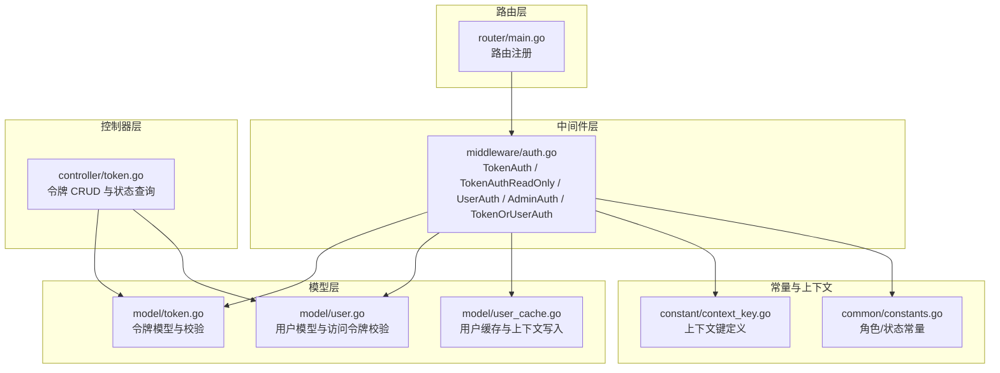
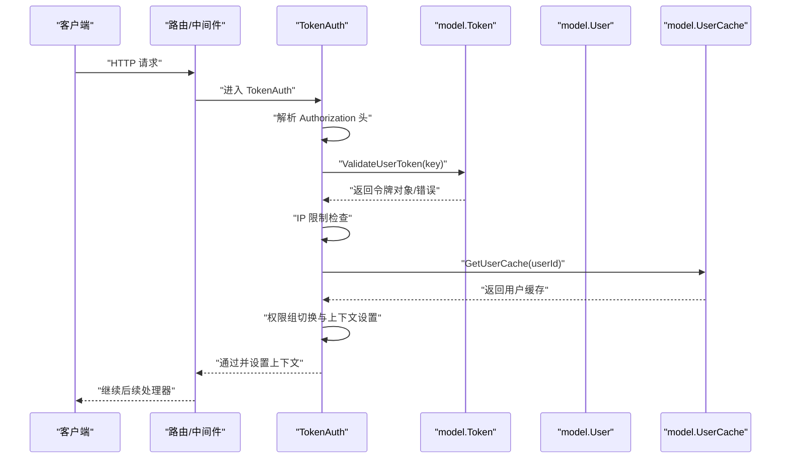
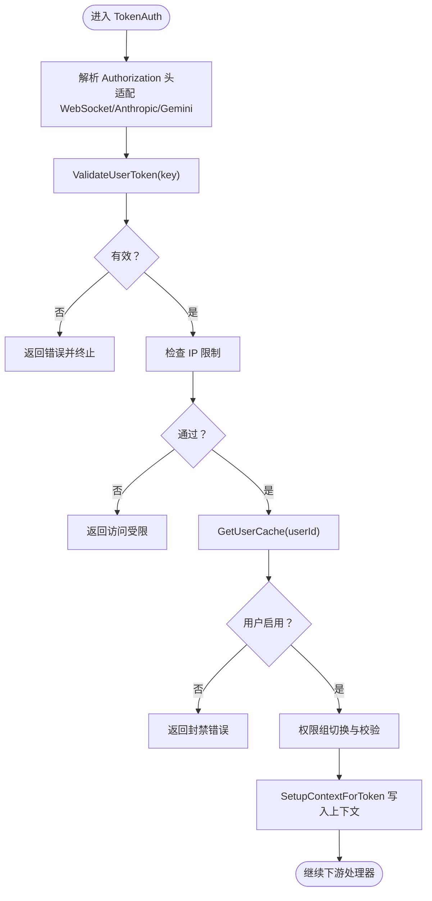
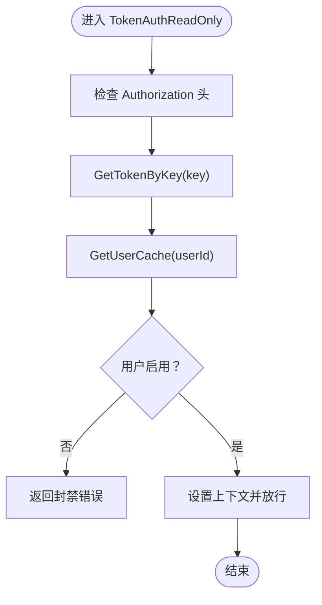
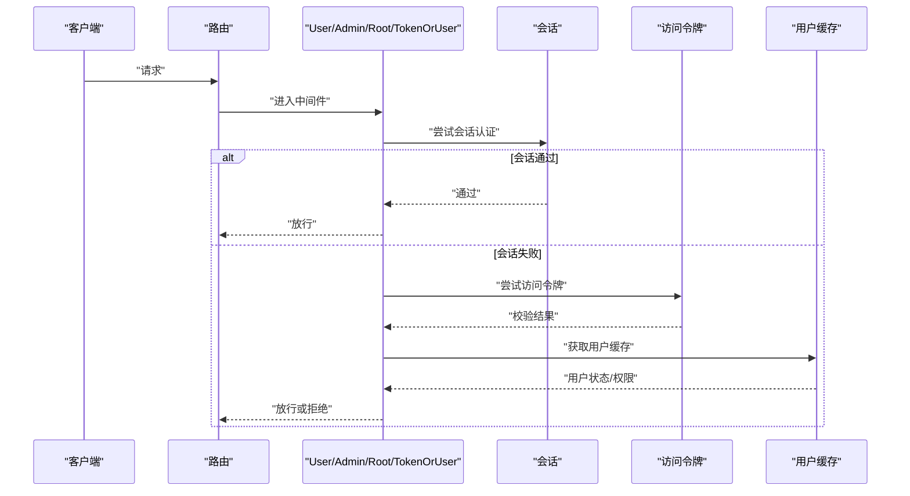
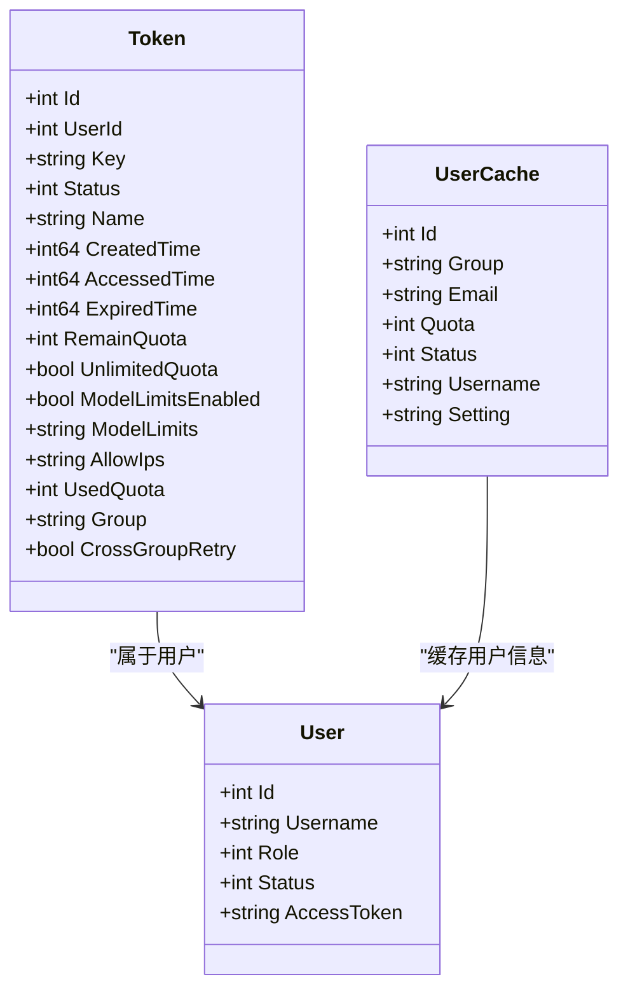
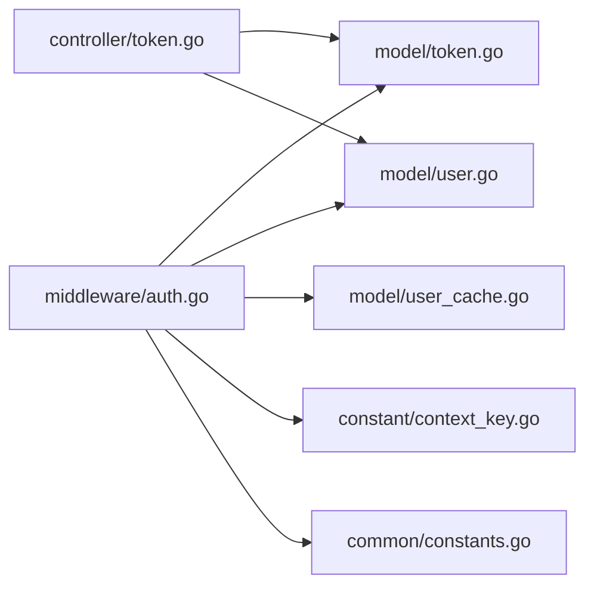

# JWT 令牌认证

<cite>
**本文引用的文件**
- [middleware/auth.go](file://middleware/auth.go)
- [controller/token.go](file://controller/token.go)
- [model/token.go](file://model/token.go)
- [model/user.go](file://model/user.go)
- [model/user_cache.go](file://model/user_cache.go)
- [constant/context_key.go](file://constant/context_key.go)
- [common/constants.go](file://common/constants.go)
- [router/main.go](file://router/main.go)
</cite>

## 目录
1. [简介](#简介)
2. [项目结构](#项目结构)
3. [核心组件](#核心组件)
4. [架构总览](#架构总览)
5. [详细组件分析](#详细组件分析)
6. [依赖关系分析](#依赖关系分析)
7. [性能考量](#性能考量)
8. [故障排查指南](#故障排查指南)
9. [结论](#结论)
10. [附录](#附录)

## 简介
本文件面向 New API 的 JWT 令牌认证系统，聚焦于令牌生成与验证机制、会话管理策略、用户身份验证流程与权限控制。文档详细解析 TokenAuth、TokenAuthReadOnly、UserAuth、AdminAuth 等中间件的实现原理与使用场景；覆盖令牌格式解析、IP 限制检查、用户状态验证、权限组切换机制；提供令牌配置项、过期时间管理与刷新策略建议；阐述令牌与用户缓存的关系、上下文设置与错误处理机制，并给出安全最佳实践与扩展指引。

## 项目结构
围绕认证与令牌的关键模块分布如下：
- 中间件层：统一处理请求认证与授权，位于 middleware/auth.go
- 控制器层：令牌的增删改查与状态查询，位于 controller/token.go
- 模型层：令牌与用户的数据结构、校验与缓存，位于 model/token.go、model/user.go、model/user_cache.go
- 常量与上下文键：定义角色、状态、上下文键等，位于 common/constants.go、constant/context_key.go
- 路由层：注册路由与中间件，位于 router/main.go

图表来源
- [middleware/auth.go:1-440](file://middleware/auth.go#L1-L440)
- [controller/token.go:1-360](file://controller/token.go#L1-L360)
- [model/token.go:1-483](file://model/token.go#L1-L483)
- [model/user.go:1-1049](file://model/user.go#L1-L1049)
- [model/user_cache.go:1-234](file://model/user_cache.go#L1-L234)
- [constant/context_key.go:1-70](file://constant/context_key.go#L1-L70)
- [common/constants.go:1-219](file://common/constants.go#L1-L219)
- [router/main.go:1-36](file://router/main.go#L1-L36)

章节来源
- [middleware/auth.go:1-440](file://middleware/auth.go#L1-L440)
- [controller/token.go:1-360](file://controller/token.go#L1-L360)
- [model/token.go:1-483](file://model/token.go#L1-L483)
- [model/user.go:1-1049](file://model/user.go#L1-L1049)
- [model/user_cache.go:1-234](file://model/user_cache.go#L1-L234)
- [constant/context_key.go:1-70](file://constant/context_key.go#L1-L70)
- [common/constants.go:1-219](file://common/constants.go#L1-L219)
- [router/main.go:1-36](file://router/main.go#L1-L36)

## 核心组件
- TokenAuth：严格令牌认证中间件，负责解析 Authorization 头、校验令牌有效性、IP 限制、用户状态、权限组切换与上下文设置。
- TokenAuthReadOnly：宽松令牌认证，仅校验令牌存在性与用户封禁状态，不检查额度与过期。
- UserAuth / AdminAuth / RootAuth：基于会话或访问令牌的身份验证与角色校验。
- TokenOrUserAuth：优先会话认证，否则回退到令牌认证。
- 令牌模型与校验：令牌结构、IP 限制解析、令牌有效性判断、额度与过期检查。
- 用户与缓存：用户访问令牌校验、用户缓存写入上下文、用户状态与配额缓存。

章节来源
- [middleware/auth.go:170-407](file://middleware/auth.go#L170-L407)
- [model/token.go:14-483](file://model/token.go#L14-L483)
- [model/user.go:763-777](file://model/user.go#L763-L777)
- [model/user_cache.go:27-34](file://model/user_cache.go#L27-L34)

## 架构总览
下图展示了从请求进入至令牌校验与上下文设置的整体流程，以及与用户缓存的交互。

图表来源
- [middleware/auth.go:276-407](file://middleware/auth.go#L276-L407)
- [model/token.go:188-226](file://model/token.go#L188-L226)
- [model/user_cache.go:74-113](file://model/user_cache.go#L74-L113)

## 详细组件分析

### TokenAuth 中间件
- 功能要点
  - 解析 Authorization 头，兼容多种来源（WebSocket、Anthropic、Gemini 等）。
  - 调用 ValidateUserToken 校验令牌有效性（状态、过期、额度）。
  - IP 限制检查：解析 allowIps 并与客户端 IP 匹配。
  - 用户状态检查：通过 GetUserCache 获取用户状态，封禁直接拒绝。
  - 权限组切换：若令牌指定分组且在可用范围内，则切换到该分组。
  - 上下文设置：写入用户与令牌相关信息，供后续处理器使用。
- 关键路径
  - 令牌解析与来源适配：[middleware/auth.go:276-313](file://middleware/auth.go#L276-L313)
  - 令牌有效性校验：[middleware/auth.go:314-349](file://middleware/auth.go#L314-L349)
  - IP 限制检查：[middleware/auth.go:351-365](file://middleware/auth.go#L351-L365)
  - 用户状态与上下文写入：[middleware/auth.go:367-404](file://middleware/auth.go#L367-L404)
  - 上下文设置工具：SetupContextForToken：[middleware/auth.go:409-439](file://middleware/auth.go#L409-L439)

图表来源
- [middleware/auth.go:276-407](file://middleware/auth.go#L276-L407)
- [model/token.go:188-226](file://model/token.go#L188-L226)
- [model/user_cache.go:74-113](file://model/user_cache.go#L74-L113)

章节来源
- [middleware/auth.go:276-407](file://middleware/auth.go#L276-L407)
- [model/token.go:188-226](file://model/token.go#L188-L226)
- [model/user_cache.go:74-113](file://model/user_cache.go#L74-L113)

### TokenAuthReadOnly 中间件
- 功能要点
  - 仅校验 Authorization 头是否存在与格式正确。
  - 从数据库加载令牌并检查用户状态（封禁则拒绝）。
  - 设置基本上下文（用户 ID、令牌 ID、密钥）。
- 关键路径
  - 令牌解析与来源适配：[middleware/auth.go:214-231](file://middleware/auth.go#L214-L231)
  - 令牌加载与用户状态检查：[middleware/auth.go:232-273](file://middleware/auth.go#L232-L273)

图表来源
- [middleware/auth.go:214-273](file://middleware/auth.go#L214-L273)
- [model/token.go:255-277](file://model/token.go#L255-L277)
- [model/user_cache.go:74-113](file://model/user_cache.go#L74-L113)

章节来源
- [middleware/auth.go:214-273](file://middleware/auth.go#L214-L273)
- [model/token.go:255-277](file://model/token.go#L255-L277)

### UserAuth / AdminAuth / RootAuth / TokenOrUserAuth
- UserAuth：要求会话或访问令牌，且角色不低于普通用户。
- AdminAuth：要求会话或访问令牌，且角色不低于管理员。
- RootAuth：要求会话或访问令牌，且角色为超级管理员。
- TokenOrUserAuth：优先会话认证（启用状态），否则回退到 TokenAuth。
- 关键路径
  - 通用辅助：authHelper 与会话/访问令牌校验：[middleware/auth.go:36-157](file://middleware/auth.go#L36-L157)
  - 三种角色中间件：[middleware/auth.go:170-186](file://middleware/auth.go#L170-L186)
  - TokenOrUserAuth：[middleware/auth.go:194-208](file://middleware/auth.go#L194-L208)

图表来源
- [middleware/auth.go:36-208](file://middleware/auth.go#L36-L208)
- [model/user.go:763-777](file://model/user.go#L763-L777)
- [model/user_cache.go:74-113](file://model/user_cache.go#L74-L113)

章节来源
- [middleware/auth.go:36-208](file://middleware/auth.go#L36-L208)
- [model/user.go:763-777](file://model/user.go#L763-L777)

### 令牌模型与校验
- 数据结构
  - 令牌字段：用户 ID、密钥、状态、名称、创建/访问时间、过期时间、剩余额度、是否无限额度、模型限制开关与列表、允许 IP 列表、使用额度、分组、跨组重试等。
  - 用户字段：用户名、角色、状态、访问令牌等。
- 校验逻辑
  - ValidateUserToken：检查状态、过期、额度；必要时更新状态为过期/耗尽。
  - GetTokenByKey：优先 Redis 缓存，失败回退数据库。
  - GetIpLimits：解析允许多行 IP/CIDR。
- 关键路径
  - 令牌结构与限制解析：[model/token.go:14-79](file://model/token.go#L14-L79)
  - 令牌有效性校验：[model/token.go:188-226](file://model/token.go#L188-L226)
  - 令牌缓存与异步更新：[model/token.go:255-277](file://model/token.go#L255-L277)

图表来源
- [model/token.go:14-32](file://model/token.go#L14-L32)
- [model/user.go:23-53](file://model/user.go#L23-L53)
- [model/user_cache.go:17-25](file://model/user_cache.go#L17-L25)

章节来源
- [model/token.go:14-483](file://model/token.go#L14-L483)
- [model/user.go:1-1049](file://model/user.go#L1-1049)
- [model/user_cache.go:1-234](file://model/user_cache.go#L1-L234)

### 上下文与权限组切换
- 上下文键定义：用户 ID、令牌 ID、令牌密钥、令牌名称、额度、模型限制、分组、跨组重试等。
- 权限组切换：当令牌显式指定分组且在可用范围内时，切换到该分组；同时校验分组是否仍在有效期内。
- 关键路径
  - 上下文键定义：[constant/context_key.go:13-22](file://constant/context_key.go#L13-L22)
  - 权限组切换与上下文设置：[middleware/auth.go:380-404](file://middleware/auth.go#L380-L404)
  - 用户缓存写入上下文：[model/user_cache.go:27-34](file://model/user_cache.go#L27-L34)

章节来源
- [constant/context_key.go:1-70](file://constant/context_key.go#L1-L70)
- [middleware/auth.go:380-404](file://middleware/auth.go#L380-L404)
- [model/user_cache.go:27-34](file://model/user_cache.go#L27-L34)

### 令牌配置与过期管理
- 配置项
  - 令牌名称长度限制、额度范围、最大令牌数量、IP 限制列表、模型限制开关与列表、分组与跨组重试。
- 过期与额度
  - 过期时间 -1 表示永不过期；到期自动更新状态为过期；额度为 0 且非无限额度时自动更新状态为耗尽。
- 刷新策略
  - 当前实现未提供自动刷新；建议通过前端轮询或服务端定时任务触发额度恢复与状态更新。
- 关键路径
  - 令牌创建与更新：[controller/token.go:167-313](file://controller/token.go#L167-L313)
  - 令牌有效性与状态更新：[model/token.go:188-226](file://model/token.go#L188-L226)

章节来源
- [controller/token.go:167-313](file://controller/token.go#L167-L313)
- [model/token.go:188-226](file://model/token.go#L188-L226)

### 令牌与用户缓存的关系
- 令牌校验后，通过 GetUserCache 获取用户缓存并写入上下文，减少重复查询。
- 用户缓存包含用户组、配额、状态、邮箱、用户名与设置，便于快速访问。
- 关键路径
  - 用户缓存写入上下文：[model/user_cache.go:27-34](file://model/user_cache.go#L27-L34)
  - 用户缓存获取与异步更新：[model/user_cache.go:74-113](file://model/user_cache.go#L74-L113)

章节来源
- [model/user_cache.go:27-34](file://model/user_cache.go#L27-L34)
- [model/user_cache.go:74-113](file://model/user_cache.go#L74-L113)

## 依赖关系分析
- 中间件依赖模型层进行令牌与用户校验，依赖用户缓存进行上下文写入。
- 控制器依赖模型层进行令牌 CRUD 与状态查询。
- 常量与上下文键为中间件与控制器提供统一的键名与角色/状态定义。

图表来源
- [middleware/auth.go:1-440](file://middleware/auth.go#L1-L440)
- [controller/token.go:1-360](file://controller/token.go#L1-L360)
- [model/token.go:1-483](file://model/token.go#L1-L483)
- [model/user.go:1-1049](file://model/user.go#L1-L1049)
- [model/user_cache.go:1-234](file://model/user_cache.go#L1-L234)
- [constant/context_key.go:1-70](file://constant/context_key.go#L1-L70)
- [common/constants.go:1-219](file://common/constants.go#L1-L219)

章节来源
- [middleware/auth.go:1-440](file://middleware/auth.go#L1-L440)
- [controller/token.go:1-360](file://controller/token.go#L1-L360)
- [model/token.go:1-483](file://model/token.go#L1-L483)
- [model/user.go:1-1049](file://model/user.go#L1-L1049)
- [model/user_cache.go:1-234](file://model/user_cache.go#L1-L234)
- [constant/context_key.go:1-70](file://constant/context_key.go#L1-L70)
- [common/constants.go:1-219](file://common/constants.go#L1-L219)

## 性能考量
- 缓存优先：令牌与用户信息优先从缓存读取，失败回退数据库，减少数据库压力。
- 异步更新：缓存更新采用异步 goroutine，避免阻塞主流程。
- 批量更新：支持批量额度调整，降低频繁写入开销。
- IP 限制：CIDR 列表解析与匹配在内存完成，建议控制每令牌允许 IP 数量。

## 故障排查指南
- 常见错误与处理
  - 令牌无效：检查 Authorization 头格式、是否带 Bearer 前缀、是否包含 sk- 前缀与分段标识。
  - IP 不在允许列表：确认 allowIps 配置与客户端真实 IP。
  - 用户封禁：GetUserCache 返回状态非启用时拒绝访问。
  - 角色不足：UserAuth/AdminAuth/RootAuth 对应角色阈值不满足。
- 错误处理路径
  - 令牌校验错误：返回统一 OpenAI 风格错误消息。
  - 数据库错误：记录系统日志并返回内部错误。
  - 关键路径参考：[middleware/auth.go:314-349](file://middleware/auth.go#L314-L349)、[middleware/auth.go:351-365](file://middleware/auth.go#L351-L365)

章节来源
- [middleware/auth.go:314-349](file://middleware/auth.go#L314-L349)
- [middleware/auth.go:351-365](file://middleware/auth.go#L351-L365)

## 结论
New API 的 JWT 令牌认证体系通过中间件统一处理令牌解析、校验与上下文设置，结合用户缓存与权限组切换，实现了灵活而高效的身份验证与授权控制。TokenAuth 与 TokenAuthReadOnly 分别覆盖严格与宽松场景，配合 UserAuth/AdminAuth/RootAuth 实现多层级权限管理。建议在生产环境中强化令牌生命周期管理与额度刷新策略，并持续优化缓存命中率与 IP 限制性能。

## 附录
- API 接口说明（节选）
  - 获取令牌列表：[controller/token.go:34-46](file://controller/token.go#L34-L46)
  - 搜索令牌：[controller/token.go:48-63](file://controller/token.go#L48-L63)
  - 获取令牌详情：[controller/token.go:65-78](file://controller/token.go#L65-L78)
  - 获取令牌密钥：[controller/token.go:80-95](file://controller/token.go#L80-L95)
  - 获取令牌状态：[controller/token.go:97-116](file://controller/token.go#L97-L116)
  - 获取令牌用量：[controller/token.go:118-165](file://controller/token.go#L118-L165)
  - 新增令牌：[controller/token.go:167-234](file://controller/token.go#L167-L234)
  - 删除令牌：[controller/token.go:236-248](file://controller/token.go#L236-L248)
  - 更新令牌：[controller/token.go:250-313](file://controller/token.go#L250-L313)
  - 批量删除令牌：[controller/token.go:319-336](file://controller/token.go#L319-L336)
  - 批量获取密钥：[controller/token.go:338-359](file://controller/token.go#L338-L359)

章节来源
- [controller/token.go:34-359](file://controller/token.go#L34-L359)