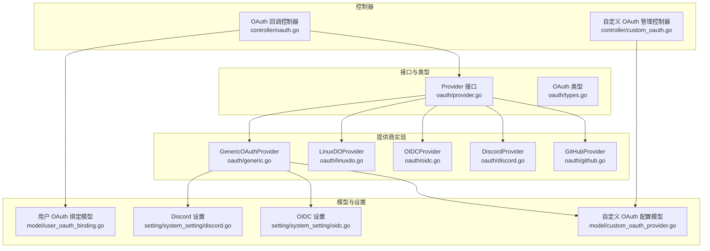
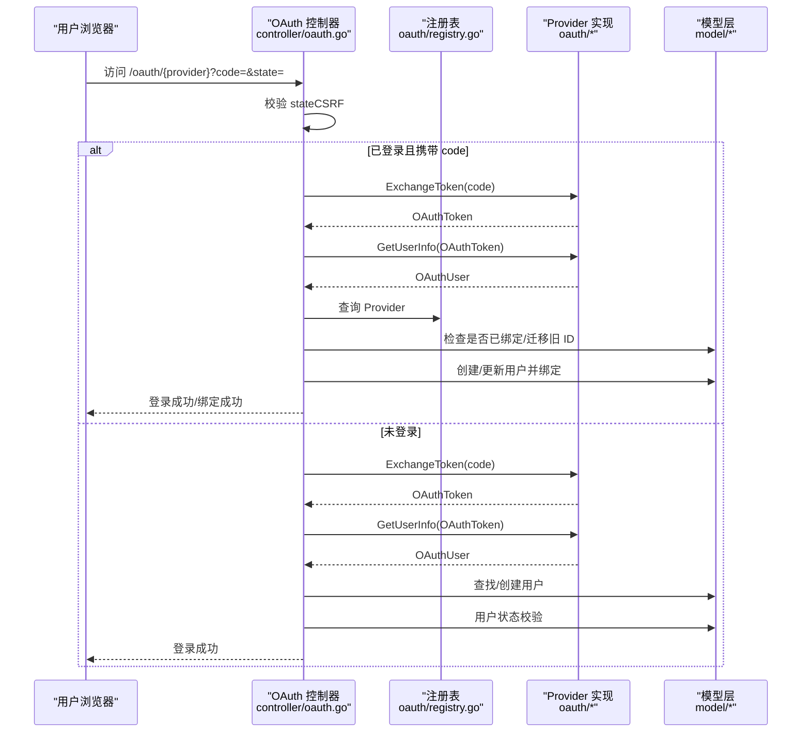
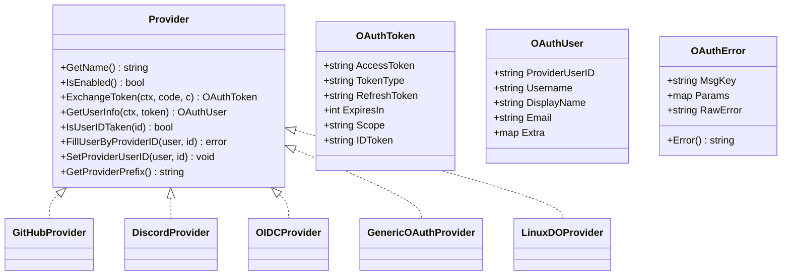
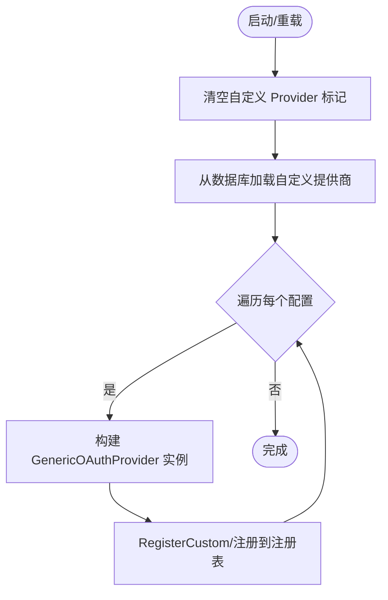
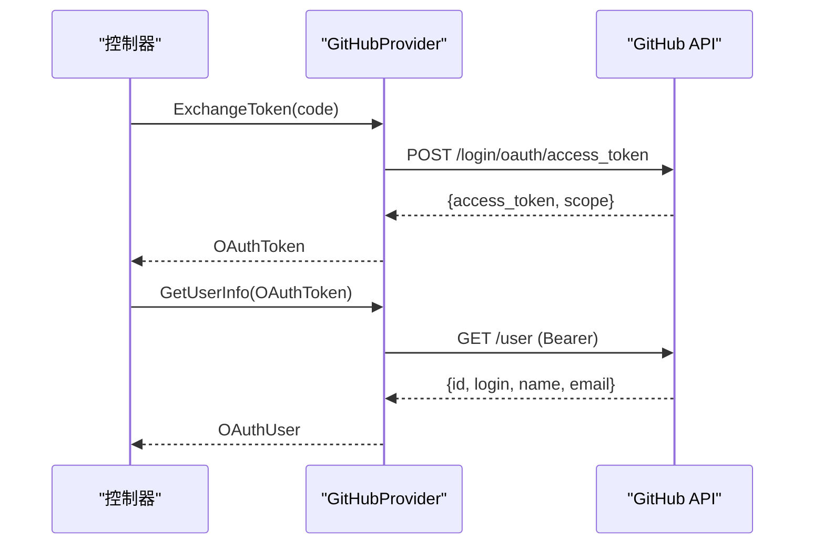
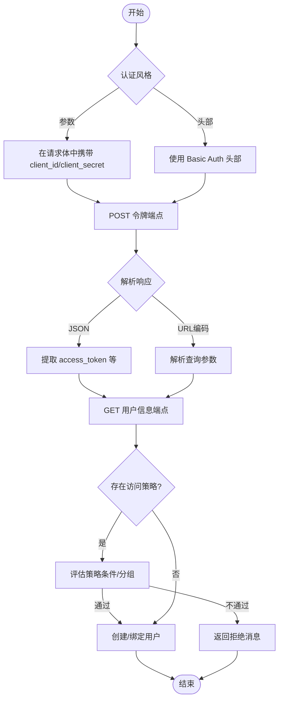
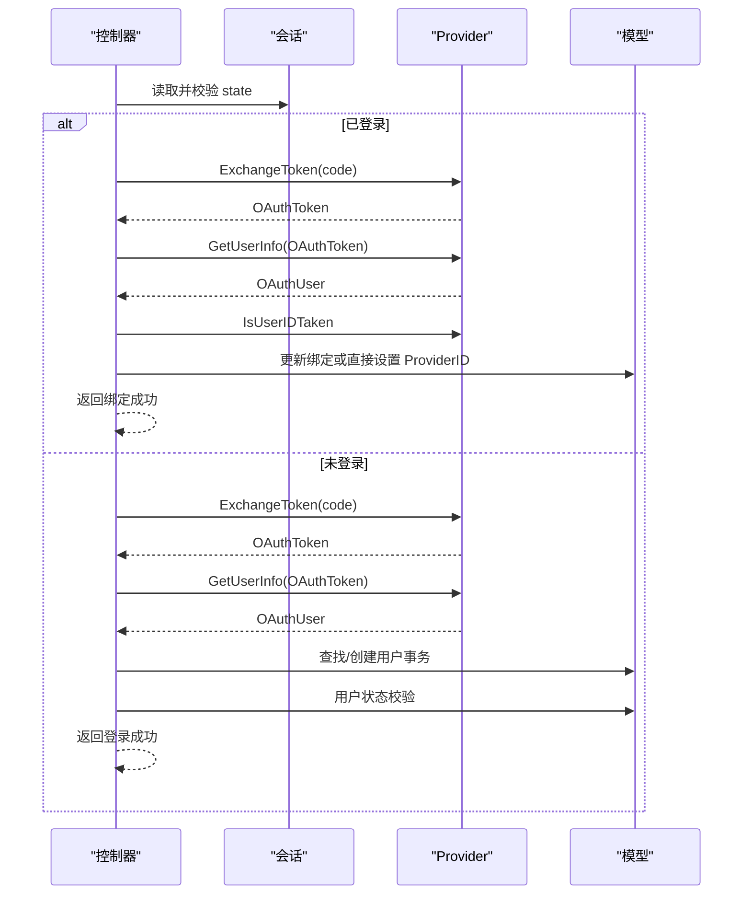
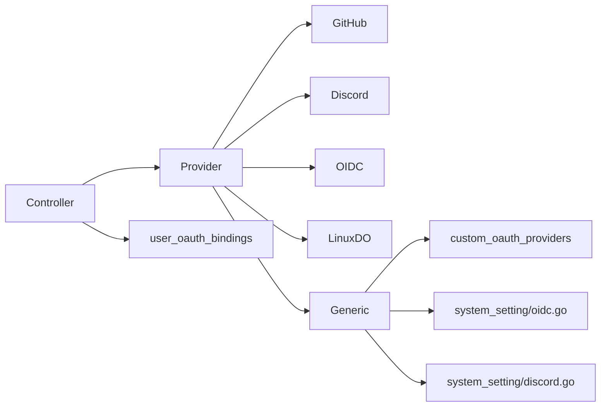

# OAuth 第三方登录

<cite>
**本文引用的文件**
- [oauth/provider.go](file://oauth/provider.go)
- [oauth/types.go](file://oauth/types.go)
- [oauth/registry.go](file://oauth/registry.go)
- [oauth/github.go](file://oauth/github.go)
- [oauth/discord.go](file://oauth/discord.go)
- [oauth/oidc.go](file://oauth/oidc.go)
- [oauth/generic.go](file://oauth/generic.go)
- [oauth/linuxdo.go](file://oauth/linuxdo.go)
- [controller/oauth.go](file://controller/oauth.go)
- [controller/custom_oauth.go](file://controller/custom_oauth.go)
- [model/custom_oauth_provider.go](file://model/custom_oauth_provider.go)
- [model/user_oauth_binding.go](file://model/user_oauth_binding.go)
- [setting/system_setting/oidc.go](file://setting/system_setting/oidc.go)
- [setting/system_setting/discord.go](file://setting/system_setting/discord.go)
</cite>

## 目录
1. [简介](#简介)
2. [项目结构](#项目结构)
3. [核心组件](#核心组件)
4. [架构总览](#架构总览)
5. [详细组件分析](#详细组件分析)
6. [依赖关系分析](#依赖关系分析)
7. [性能考量](#性能考量)
8. [故障排除指南](#故障排除指南)
9. [结论](#结论)
10. [附录](#附录)

## 简介
本技术文档面向 New API 的 OAuth 第三方登录系统，覆盖 GitHub、Discord、Telegram（通过通用 OAuth）、OIDC 等多种提供商的集成实现。文档深入解析 OAuth 流程、回调处理、用户信息获取与绑定机制，提供自定义 OAuth 提供商的注册与配置方法、令牌交换过程与用户数据同步策略，并给出 OAuth 配置参数、回调 URL 设置与安全注意事项，以及状态管理、CSRF 防护与用户绑定策略。目标是帮助开发者正确集成与扩展 OAuth 登录功能。

## 项目结构
New API 的 OAuth 子系统主要由以下模块组成：
- 接口与类型：定义 Provider 接口、OAuthToken/OAuthUser 数据结构与错误类型
- 提供商实现：GitHub、Discord、OIDC、Linux DO、通用 OAuth（Generic）
- 控制器：统一处理 OAuth 回调、状态校验、用户查找/创建、绑定流程
- 模型：自定义 OAuth 提供商配置、用户与自定义提供商的绑定关系
- 系统设置：Discord、OIDC 的运行时配置

**图表来源**
- [oauth/provider.go:10-36](file://oauth/provider.go#L10-L36)
- [oauth/types.go:3-25](file://oauth/types.go#L3-L25)
- [oauth/github.go:24-179](file://oauth/github.go#L24-L179)
- [oauth/discord.go:23-173](file://oauth/discord.go#L23-L173)
- [oauth/oidc.go:23-178](file://oauth/oidc.go#L23-L178)
- [oauth/generic.go:34-331](file://oauth/generic.go#L34-L331)
- [controller/oauth.go:43-128](file://controller/oauth.go#L43-L128)
- [controller/custom_oauth.go:72-90](file://controller/custom_oauth.go#L72-L90)
- [model/custom_oauth_provider.go:39-67](file://model/custom_oauth_provider.go#L39-L67)
- [model/user_oauth_binding.go:10-21](file://model/user_oauth_binding.go#L10-L21)
- [setting/system_setting/oidc.go:5-13](file://setting/system_setting/oidc.go#L5-L13)
- [setting/system_setting/discord.go:5-9](file://setting/system_setting/discord.go#L5-L9)

**章节来源**
- [oauth/provider.go:10-36](file://oauth/provider.go#L10-L36)
- [oauth/types.go:3-25](file://oauth/types.go#L3-L25)
- [oauth/registry.go:18-46](file://oauth/registry.go#L18-L46)
- [controller/oauth.go:43-128](file://controller/oauth.go#L43-L128)
- [controller/custom_oauth.go:72-90](file://controller/custom_oauth.go#L72-L90)
- [model/custom_oauth_provider.go:39-67](file://model/custom_oauth_provider.go#L39-L67)
- [model/user_oauth_binding.go:10-21](file://model/user_oauth_binding.go#L10-L21)
- [setting/system_setting/oidc.go:5-13](file://setting/system_setting/oidc.go#L5-L13)
- [setting/system_setting/discord.go:5-9](file://setting/system_setting/discord.go#L5-L9)

## 核心组件
- Provider 接口：定义提供商名称、启用状态、令牌交换、用户信息获取、用户 ID 占用检测、按 ProviderID 填充/设置用户 ID、用户名前缀等能力
- OAuth 类型：OAuthToken、OAuthUser、OAuthError、AccessDeniedError 等
- 注册表：Provider 注册、查询、自定义提供商加载与热更新
- 内置提供商：GitHub、Discord、OIDC、Linux DO
- 通用提供商：基于配置的可插拔 OAuth 实现，支持字段映射、访问策略与认证风格
- 控制器：统一的 OAuth 回调处理、状态校验、用户查找/创建、绑定与登录流程
- 模型：自定义 OAuth 提供商配置、用户与自定义提供商的绑定关系

**章节来源**
- [oauth/provider.go:10-36](file://oauth/provider.go#L10-L36)
- [oauth/types.go:3-69](file://oauth/types.go#L3-L69)
- [oauth/registry.go:18-135](file://oauth/registry.go#L18-L135)
- [oauth/github.go:24-179](file://oauth/github.go#L24-L179)
- [oauth/discord.go:23-173](file://oauth/discord.go#L23-L173)
- [oauth/oidc.go:23-178](file://oauth/oidc.go#L23-L178)
- [oauth/generic.go:34-331](file://oauth/generic.go#L34-L331)
- [controller/oauth.go:43-128](file://controller/oauth.go#L43-L128)
- [model/custom_oauth_provider.go:39-67](file://model/custom_oauth_provider.go#L39-L67)
- [model/user_oauth_binding.go:10-21](file://model/user_oauth_binding.go#L10-L21)

## 架构总览
OAuth 登录的整体流程如下：
- 客户端发起授权请求，跳转至提供商授权页
- 用户授权后，提供商回调应用的 OAuth 回调地址
- 控制器读取并校验 state（CSRF 防护），区分首次登录与账户绑定场景
- 调用对应 Provider 的 ExchangeToken 获取访问令牌
- 调用 GetUserInfo 获取用户信息
- 查找或创建用户，执行用户状态校验与登录
- 对于自定义提供商，使用 user_oauth_bindings 表进行绑定；对于内置提供商，直接更新用户记录中的对应 ProviderID 字段

**图表来源**
- [controller/oauth.go:43-128](file://controller/oauth.go#L43-L128)
- [oauth/registry.go:41-46](file://oauth/registry.go#L41-L46)
- [oauth/github.go:48-103](file://oauth/github.go#L48-L103)
- [oauth/discord.go:49-108](file://oauth/discord.go#L49-L108)
- [oauth/oidc.go:51-110](file://oauth/oidc.go#L51-L110)
- [oauth/generic.go:90-200](file://oauth/generic.go#L90-L200)
- [model/user_oauth_binding.go:40-54](file://model/user_oauth_binding.go#L40-L54)

## 详细组件分析

### Provider 接口与类型
- Provider 接口：提供 GetName、IsEnabled、ExchangeToken、GetUserInfo、IsUserIDTaken、FillUserByProviderID、SetProviderUserID、GetProviderPrefix 等方法
- OAuthToken/OAuthUser：标准化令牌与用户信息结构，便于不同提供商统一处理
- OAuthError/AccessDeniedError：提供可本地化的错误封装与直接消息返回

**图表来源**
- [oauth/provider.go:10-36](file://oauth/provider.go#L10-L36)
- [oauth/types.go:3-69](file://oauth/types.go#L3-L69)

**章节来源**
- [oauth/provider.go:10-36](file://oauth/provider.go#L10-L36)
- [oauth/types.go:3-69](file://oauth/types.go#L3-L69)

### 注册表与自定义提供商加载
- 注册表负责 Provider 的注册、查询、自定义提供商标记与动态加载
- 支持从数据库加载自定义提供商，注册为可卸载的 Provider
- 支持单个提供商的注册/更新与卸载

**图表来源**
- [oauth/registry.go:89-115](file://oauth/registry.go#L89-L115)
- [oauth/registry.go:122-134](file://oauth/registry.go#L122-L134)

**章节来源**
- [oauth/registry.go:18-135](file://oauth/registry.go#L18-L135)

### GitHub OAuth
- ExchangeToken：向 GitHub 授权服务器交换访问令牌，支持错误包装与日志
- GetUserInfo：调用 GitHub API 获取用户信息，提取 numeric ID、username、name、email
- 用户 ID 使用 numeric ID 作为主键，同时保留旧的 login 用于迁移兼容
- 绑定策略：通过 IsUserIDTaken/FillUserByProviderID/SetProviderUserID 更新用户记录

**图表来源**
- [oauth/github.go:48-103](file://oauth/github.go#L48-L103)
- [oauth/github.go:105-161](file://oauth/github.go#L105-L161)

**章节来源**
- [oauth/github.go:24-179](file://oauth/github.go#L24-L179)

### Discord OAuth
- ExchangeToken：使用系统设置中的 ClientId/ClientSecret 与 redirect_uri 交换令牌
- GetUserInfo：调用 Discord API 获取用户信息，提取 UID、username、global_name
- 绑定策略：通过 DiscordId 字段直接更新用户记录

**章节来源**
- [oauth/discord.go:23-173](file://oauth/discord.go#L23-L173)
- [setting/system_setting/discord.go:5-9](file://setting/system_setting/discord.go#L5-L9)

### OIDC OAuth
- ExchangeToken：使用系统设置中的 TokenEndpoint、ClientId/ClientSecret 与 redirect_uri 交换令牌
- GetUserInfo：调用 UserInfoEndpoint 获取用户信息，提取 sub、email、preferred_username、name
- 绑定策略：通过 OidcId 字段直接更新用户记录

**章节来源**
- [oauth/oidc.go:23-178](file://oauth/oidc.go#L23-L178)
- [setting/system_setting/oidc.go:5-13](file://setting/system_setting/oidc.go#L5-L13)

### Linux DO OAuth
- ExchangeToken：使用 Basic Auth 交换令牌
- GetUserInfo：获取用户信息并校验信任等级（Trust Level）阈值
- 绑定策略：通过 LinuxDOId 字段直接更新用户记录

**章节来源**
- [oauth/linuxdo.go:25-196](file://oauth/linuxdo.go#L25-L196)

### 通用 OAuth（Generic）
- 配置驱动：通过 CustomOAuthProvider 配置授权端点、令牌端点、用户信息端点、字段映射、作用域、认证风格、访问策略与拒绝消息
- ExchangeToken：支持自动检测、参数传递与 Basic Auth 三种认证风格；兼容 JSON 与 URL 编码响应
- GetUserInfo：使用 gjson 解析用户信息，支持 JSONPath；可选访问策略（逻辑与条件组）控制准入
- 绑定策略：使用 user_oauth_bindings 表存储绑定关系，避免污染用户主表字段

**图表来源**
- [oauth/generic.go:90-200](file://oauth/generic.go#L90-L200)
- [oauth/generic.go:202-291](file://oauth/generic.go#L202-L291)
- [oauth/generic.go:333-452](file://oauth/generic.go#L333-L452)

**章节来源**
- [oauth/generic.go:34-331](file://oauth/generic.go#L34-L331)
- [model/custom_oauth_provider.go:39-67](file://model/custom_oauth_provider.go#L39-L67)
- [model/user_oauth_binding.go:10-21](file://model/user_oauth_binding.go#L10-L21)

### 控制器：OAuth 回调与绑定
- GenerateOAuthCode：生成并保存 state 到会话，用于 CSRF 防护
- HandleOAuth：统一处理回调，包括 state 校验、错误处理、令牌交换、用户信息获取、查找/创建用户、状态校验与登录
- handleOAuthBind：处理已登录用户绑定第三方账号，区分内置与自定义提供商的绑定方式
- findOrCreateOAuthUser：查找/创建用户，支持旧 ID 迁移、注册开关、邀请人奖励等

**图表来源**
- [controller/oauth.go:22-41](file://controller/oauth.go#L22-L41)
- [controller/oauth.go:43-128](file://controller/oauth.go#L43-L128)
- [controller/oauth.go:130-196](file://controller/oauth.go#L130-L196)
- [controller/oauth.go:198-331](file://controller/oauth.go#L198-L331)

**章节来源**
- [controller/oauth.go:22-363](file://controller/oauth.go#L22-L363)

### 自定义 OAuth 管理
- 获取列表与详情：返回去除敏感字段的配置视图
- 发现配置：通过后端拉取 OIDC 发现文档（well-known）
- 创建/更新/删除：校验 slug 冲突、字段有效性与访问策略合法性；支持热更新注册表
- 用户绑定管理：列出当前用户绑定、管理员查看其他用户绑定、解绑操作

**章节来源**
- [controller/custom_oauth.go:72-585](file://controller/custom_oauth.go#L72-L585)
- [model/custom_oauth_provider.go:107-130](file://model/custom_oauth_provider.go#L107-L130)
- [model/user_oauth_binding.go:23-147](file://model/user_oauth_binding.go#L23-L147)

## 依赖关系分析
- Provider 与具体实现：各内置与通用 Provider 实现 Provider 接口
- 控制器依赖 Provider 注册表与模型层
- 通用 Provider 依赖系统设置（OIDC/Discord）与数据库配置
- 用户绑定：自定义提供商使用 user_oauth_bindings 表，内置提供商直接更新用户表字段

**图表来源**
- [oauth/provider.go:10-36](file://oauth/provider.go#L10-L36)
- [oauth/github.go:24-179](file://oauth/github.go#L24-L179)
- [oauth/discord.go:23-173](file://oauth/discord.go#L23-L173)
- [oauth/oidc.go:23-178](file://oauth/oidc.go#L23-L178)
- [oauth/generic.go:34-331](file://oauth/generic.go#L34-L331)
- [controller/oauth.go:43-128](file://controller/oauth.go#L43-L128)
- [model/user_oauth_binding.go:10-21](file://model/user_oauth_binding.go#L10-L21)
- [model/custom_oauth_provider.go:39-67](file://model/custom_oauth_provider.go#L39-L67)
- [setting/system_setting/oidc.go:5-13](file://setting/system_setting/oidc.go#L5-L13)
- [setting/system_setting/discord.go:5-9](file://setting/system_setting/discord.go#L5-L9)

**章节来源**
- [oauth/registry.go:18-46](file://oauth/registry.go#L18-L46)
- [controller/custom_oauth.go:213-400](file://controller/custom_oauth.go#L213-L400)

## 性能考量
- 超时控制：各 Provider 在 HTTP 交互中设置了合理的超时时间，避免阻塞
- 并发安全：注册表使用读写锁保护并发访问
- 事务一致性：用户创建与绑定在事务中执行，保证原子性
- 日志与可观测性：对关键步骤进行调试/错误日志记录，便于问题定位

[本节为通用指导，无需特定文件来源]

## 故障排除指南
- 状态校验失败：确认前端正确生成并保存 state，回调时与会话一致
- 令牌交换失败：检查 ClientId/ClientSecret、redirect_uri 与端点配置；查看 Provider 层错误包装
- 用户信息为空：确认 scopes 正确、用户信息端点可用；检查字段映射配置
- 访问被拒：通用 Provider 的访问策略不满足条件，检查策略表达式与拒绝消息模板
- 绑定冲突：同一 OAuth 账号已被其他用户绑定，需先解绑再重新绑定
- 自定义提供商删除失败：存在用户绑定，需先清理绑定

**章节来源**
- [controller/oauth.go:57-65](file://controller/oauth.go#L57-L65)
- [oauth/github.go:77-94](file://oauth/github.go#L77-L94)
- [oauth/generic.go:179-188](file://oauth/generic.go#L179-L188)
- [controller/custom_oauth.go:418-428](file://controller/custom_oauth.go#L418-L428)

## 结论
New API 的 OAuth 系统以 Provider 接口为核心，结合注册表与控制器，实现了对 GitHub、Discord、OIDC、Linux DO 以及通用 OAuth 的统一接入。通过会话状态校验、令牌交换、用户信息获取与绑定策略，系统既保证了安全性，又提供了灵活的扩展能力。自定义 OAuth 提供商通过配置即可快速接入，并支持访问策略与发现配置，满足多样化的业务需求。

## 附录

### OAuth 配置参数与回调 URL
- 回调 URL 规则：/{server_address}/oauth/{provider}
- 内置提供商：通过系统设置（如 DiscordSettings、OIDCSettings）注入客户端凭据与端点
- 通用提供商：通过 CustomOAuthProvider 配置授权端点、令牌端点、用户信息端点、字段映射、作用域、认证风格、访问策略与拒绝消息

**章节来源**
- [oauth/discord.go:56-63](file://oauth/discord.go#L56-L63)
- [oauth/oidc.go:58-65](file://oauth/oidc.go#L58-L65)
- [oauth/generic.go:97-101](file://oauth/generic.go#L97-L101)
- [model/custom_oauth_provider.go:39-67](file://model/custom_oauth_provider.go#L39-L67)

### 安全考虑
- CSRF 防护：通过 state 与会话校验防止跨站请求伪造
- 认证风格：支持参数与头部两种方式，必要时使用 Basic Auth
- 访问策略：通用 Provider 支持基于用户信息的细粒度访问控制
- 错误处理：统一错误封装，避免泄露底层细节

**章节来源**
- [controller/oauth.go:22-41](file://controller/oauth.go#L22-L41)
- [oauth/generic.go:103-129](file://oauth/generic.go#L103-L129)
- [oauth/generic.go:266-280](file://oauth/generic.go#L266-L280)