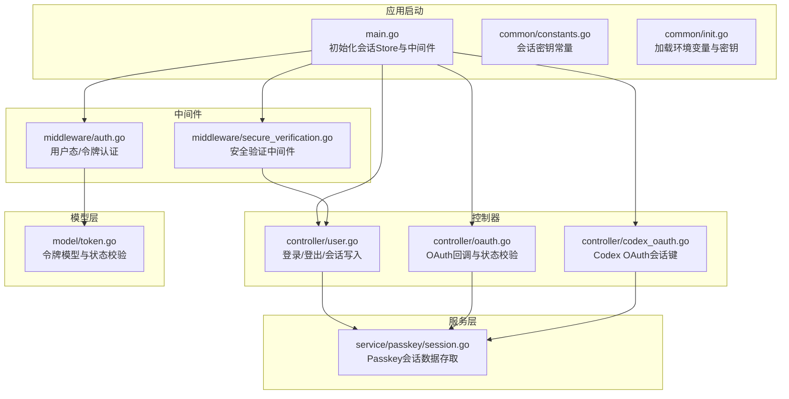
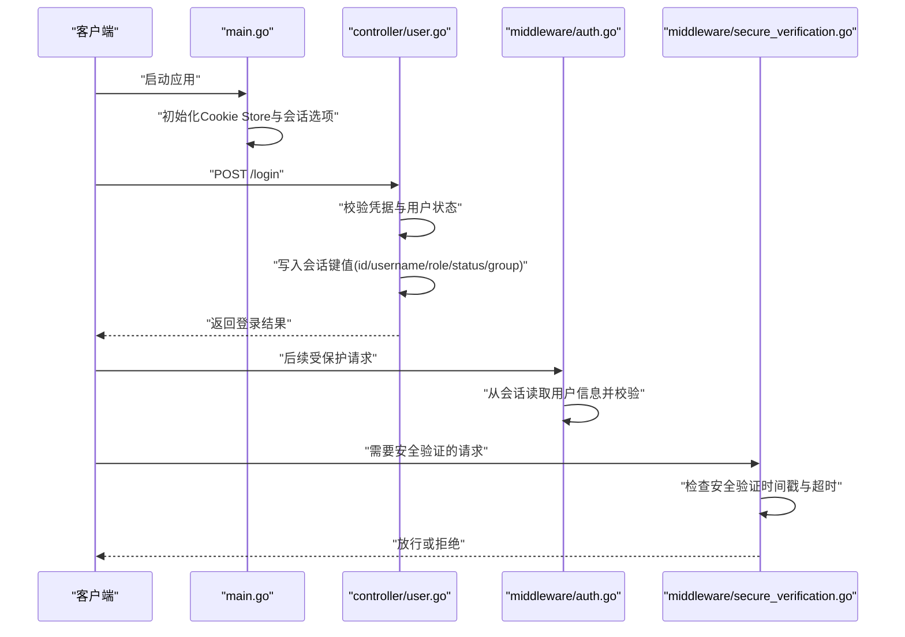
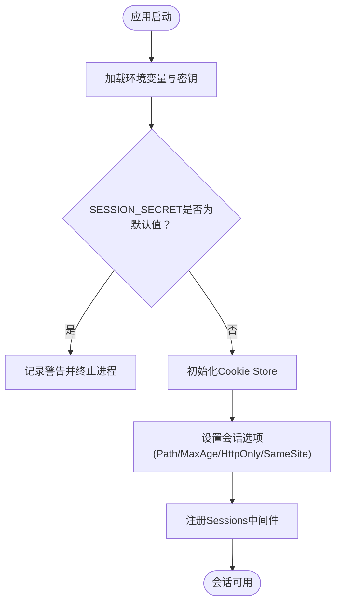
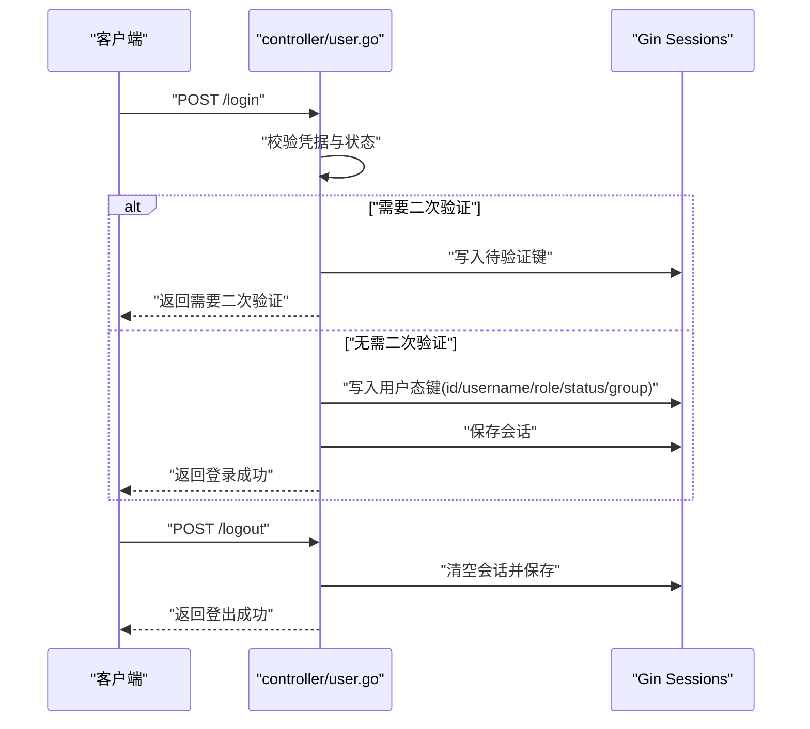
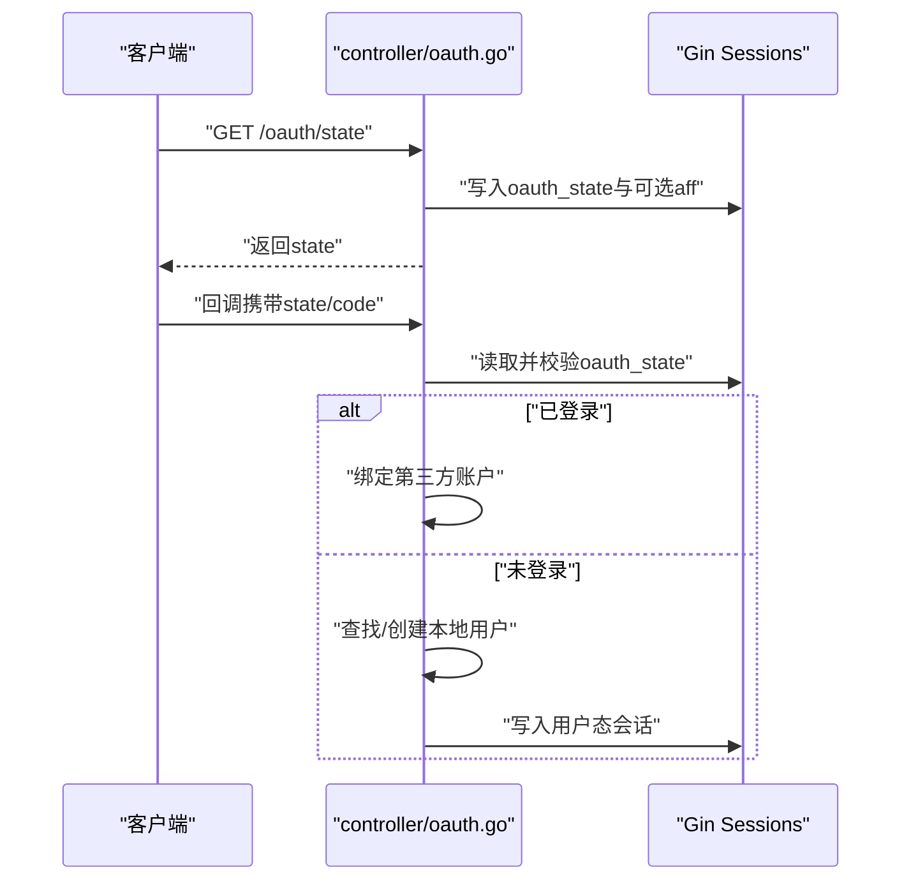
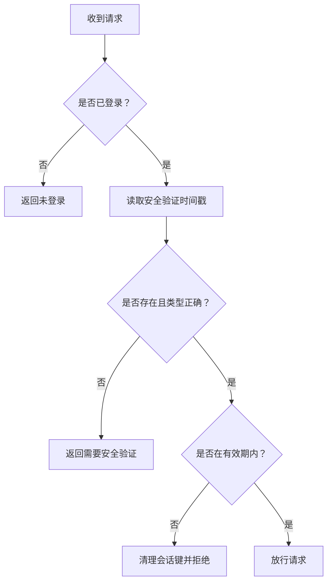
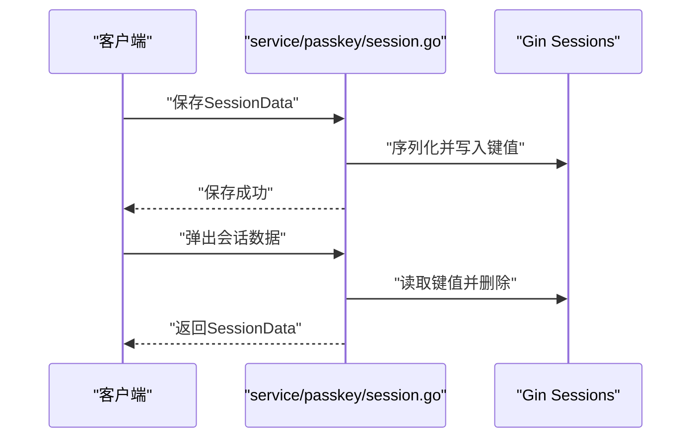
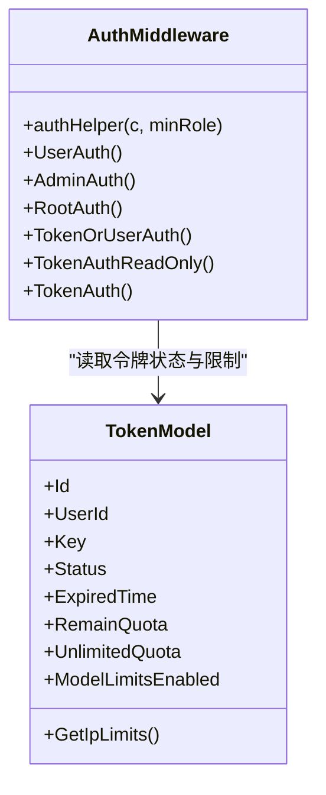
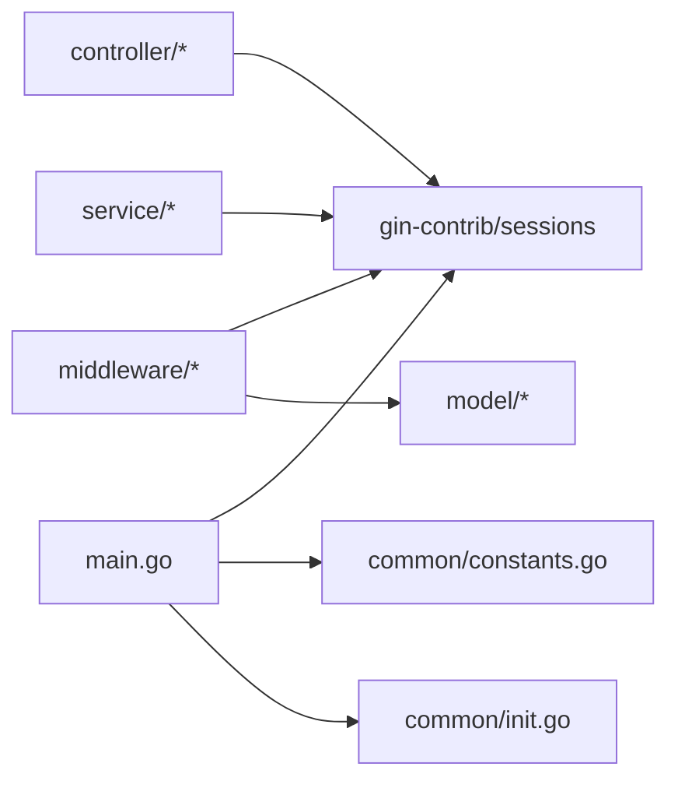

# 会话管理

<cite>
**本文档引用的文件**
- [main.go](file://main.go)
- [constants.go](file://common/constants.go)
- [init.go](file://common/init.go)
- [user.go](file://controller/user.go)
- [auth.go](file://middleware/auth.go)
- [secure_verification.go](file://middleware/secure_verification.go)
- [oauth.go](file://controller/oauth.go)
- [codex_oauth.go](file://controller/codex_oauth.go)
- [session.go](file://service/passkey/session.go)
- [token.go](file://model/token.go)
</cite>

## 目录
1. [简介](#简介)
2. [项目结构](#项目结构)
3. [核心组件](#核心组件)
4. [架构总览](#架构总览)
5. [详细组件分析](#详细组件分析)
6. [依赖关系分析](#依赖关系分析)
7. [性能考虑](#性能考虑)
8. [故障排查指南](#故障排查指南)
9. [结论](#结论)

## 简介
本文件面向 New API 的会话管理系统，围绕基于 Gin Sessions 的 Cookie 会话存储机制，系统性阐述会话生命周期管理、用户状态维护、安全机制与超时处理，并提供配置选项、存储后端选择建议、数据加密方法、示例接口与状态检查流程。目标是帮助开发者正确实现与扩展会话管理功能。

## 项目结构
会话管理涉及以下关键模块：
- 应用启动与会话初始化：在主程序中配置 Cookie Store 并设置全局会话中间件
- 业务控制器：登录、登出、OAuth 回调等会话写入与清理
- 中间件：用户态认证、访问令牌认证、安全验证中间件
- 服务层：Passkey 会话数据的序列化与弹出
- 模型层：令牌模型与用户状态校验

**图表来源**
- [main.go:170-180](file://main.go#L170-L180)
- [constants.go:35-36](file://common/constants.go#L35-L36)
- [init.go:49-63](file://common/init.go#L49-L63)
- [user.go:93-117](file://controller/user.go#L93-L117)
- [auth.go:36-157](file://middleware/auth.go#L36-L157)
- [secure_verification.go:21-80](file://middleware/secure_verification.go#L21-L80)
- [oauth.go:24-41](file://controller/oauth.go#L24-L41)
- [codex_oauth.go:27-29](file://controller/codex_oauth.go#L27-L29)
- [session.go:14-26](file://service/passkey/session.go#L14-L26)
- [token.go:188-200](file://model/token.go#L188-L200)

**章节来源**
- [main.go:170-180](file://main.go#L170-L180)
- [constants.go:35-36](file://common/constants.go#L35-L36)
- [init.go:49-63](file://common/init.go#L49-L63)

## 核心组件
- 会话存储与初始化
  - 在应用启动阶段创建 Cookie Store，并设置会话选项（路径、最大存活时间、HttpOnly、SameSite 等），随后注册到全局中间件链
  - 会话密钥来源于环境变量或运行时生成的随机字符串，确保强随机性
- 用户态会话写入与清理
  - 登录成功后将用户标识写入会话并持久化；登出时清空会话并保存
  - 对于需要二次验证的场景，先写入“待验证”状态，后续完成验证后再写入最终用户态
- 安全验证中间件
  - 提供强制安全验证与可选安全验证两种中间件，支持超时自动失效与状态清理
- OAuth 与第三方会话
  - 生成并校验 state，防止 CSRF；在回调阶段根据用户状态决定登录或绑定
- Passkey 会话数据
  - 将 WebAuthn 的 SessionData 结构进行序列化后存入会话，取回时反序列化并删除键，避免重复使用

**章节来源**
- [user.go:93-117](file://controller/user.go#L93-L117)
- [user.go:119-134](file://controller/user.go#L119-L134)
- [secure_verification.go:21-80](file://middleware/secure_verification.go#L21-L80)
- [oauth.go:24-41](file://controller/oauth.go#L24-L41)
- [oauth.go:57-65](file://controller/oauth.go#L57-L65)
- [session.go:14-26](file://service/passkey/session.go#L14-L26)
- [session.go:28-50](file://service/passkey/session.go#L28-L50)

## 架构总览
下图展示了会话在请求生命周期中的流转：从应用启动初始化会话存储，到控制器写入用户态，再到中间件读取会话进行认证与安全验证。

**图表来源**
- [main.go:170-180](file://main.go#L170-L180)
- [user.go:93-117](file://controller/user.go#L93-L117)
- [auth.go:36-157](file://middleware/auth.go#L36-L157)
- [secure_verification.go:21-80](file://middleware/secure_verification.go#L21-L80)

## 详细组件分析

### 会话存储与初始化
- Cookie Store 创建与选项
  - 使用统一的会话密钥初始化 Cookie Store
  - 会话选项包括根路径、最长存活时间、HttpOnly、SameSite 严格模式等
- 会话密钥来源
  - 默认运行时生成随机字符串；可通过环境变量覆盖
  - 若环境变量为默认占位值，将触发致命错误提示，要求设置为强随机字符串

**图表来源**
- [main.go:170-180](file://main.go#L170-L180)
- [constants.go:35](file://common/constants.go#L35)
- [init.go:49-63](file://common/init.go#L49-L63)

**章节来源**
- [main.go:170-180](file://main.go#L170-L180)
- [constants.go:35](file://common/constants.go#L35)
- [init.go:49-63](file://common/init.go#L49-L63)

### 用户登录与会话写入
- 登录流程
  - 校验用户名/密码与用户状态
  - 若启用二次验证，先写入“待验证”会话键，返回前端提示
  - 二次验证完成后，调用统一的会话写入函数，写入用户标识并保存
- 会话内容
  - 包含用户标识、用户名、角色、状态、分组等关键字段
- 登出流程
  - 清空会话并保存，返回登出结果

**图表来源**
- [user.go:32-90](file://controller/user.go#L32-L90)
- [user.go:93-117](file://controller/user.go#L93-L117)
- [user.go:119-134](file://controller/user.go#L119-L134)

**章节来源**
- [user.go:32-90](file://controller/user.go#L32-L90)
- [user.go:93-117](file://controller/user.go#L93-L117)
- [user.go:119-134](file://controller/user.go#L119-L134)

### OAuth 与第三方会话
- 状态校验与 CSRF 防护
  - 生成随机 state 并写入会话
  - 回调时对比 state，防止 CSRF 攻击
- 用户绑定与登录
  - 若用户已登录，走“绑定”流程；否则根据第三方用户信息查找或创建本地用户，再写入会话
- Codex OAuth 专用会话键
  - 使用通道 ID 与字段组合的键空间，分别存储 state、verifier、创建时间等

**图表来源**
- [oauth.go:24-41](file://controller/oauth.go#L24-L41)
- [oauth.go:57-65](file://controller/oauth.go#L57-L65)
- [oauth.go:126-128](file://controller/oauth.go#L126-L128)

**章节来源**
- [oauth.go:24-41](file://controller/oauth.go#L24-L41)
- [oauth.go:57-65](file://controller/oauth.go#L57-L65)
- [codex_oauth.go:27-29](file://controller/codex_oauth.go#L27-L29)
- [codex_oauth.go:97-102](file://controller/codex_oauth.go#L97-L102)
- [codex_oauth.go:166-176](file://controller/codex_oauth.go#L166-L176)
- [codex_oauth.go:210-213](file://controller/codex_oauth.go#L210-L213)

### 安全验证中间件
- 强制安全验证
  - 若会话中无有效的时间戳或已超时，直接拒绝请求
- 可选安全验证
  - 仅在上下文中设置标记，不中断请求，便于上层业务判断
- 超时与清理
  - 默认超时窗口为 5 分钟；超时后自动清理会话键

**图表来源**
- [secure_verification.go:21-80](file://middleware/secure_verification.go#L21-L80)
- [secure_verification.go:82-123](file://middleware/secure_verification.go#L82-L123)

**章节来源**
- [secure_verification.go:21-80](file://middleware/secure_verification.go#L21-L80)
- [secure_verification.go:82-123](file://middleware/secure_verification.go#L82-L123)

### Passkey 会话数据
- 存储策略
  - 将 WebAuthn 的 SessionData 序列化为字符串后写入会话
  - 弹出时反序列化并删除对应键，避免重复使用
- 错误处理
  - 会话不存在或已过期、格式无效等情况均返回明确错误

**图表来源**
- [session.go:14-26](file://service/passkey/session.go#L14-L26)
- [session.go:28-50](file://service/passkey/session.go#L28-L50)

**章节来源**
- [session.go:14-26](file://service/passkey/session.go#L14-L26)
- [session.go:28-50](file://service/passkey/session.go#L28-L50)

### 会话与用户认证的关系
- 用户态认证中间件
  - 优先从会话读取用户信息；若无会话则尝试访问令牌认证
  - 校验用户状态、角色权限与用户信息有效性
- 令牌认证中间件
  - 解析多种头部与查询参数形式的令牌
  - 校验令牌状态、过期时间、IP 白名单与用户状态
- 令牌模型
  - 包含状态、过期时间、剩余配额、模型限制、跨分组重试等字段，用于运行时策略控制

**图表来源**
- [auth.go:36-157](file://middleware/auth.go#L36-L157)
- [auth.go:276-407](file://middleware/auth.go#L276-L407)
- [token.go:14-32](file://model/token.go#L14-L32)
- [token.go:59-79](file://model/token.go#L59-L79)

**章节来源**
- [auth.go:36-157](file://middleware/auth.go#L36-L157)
- [auth.go:276-407](file://middleware/auth.go#L276-L407)
- [token.go:14-32](file://model/token.go#L14-L32)
- [token.go:59-79](file://model/token.go#L59-L79)

## 依赖关系分析
- 组件耦合
  - 控制器依赖会话库进行读写；中间件依赖控制器写入的会话键进行认证
  - 安全验证中间件依赖会话键进行状态检查
  - 令牌认证中间件依赖模型层的令牌状态与用户状态
- 外部依赖
  - 会话存储依赖 Cookie；密钥来自环境变量或运行时生成
  - Passkey 会话数据依赖 WebAuthn 的 SessionData 结构

**图表来源**
- [main.go:170-180](file://main.go#L170-L180)
- [constants.go:35](file://common/constants.go#L35)
- [init.go:49-63](file://common/init.go#L49-L63)

**章节来源**
- [main.go:170-180](file://main.go#L170-L180)
- [constants.go:35](file://common/constants.go#L35)
- [init.go:49-63](file://common/init.go#L49-L63)

## 性能考虑
- 会话存储
  - 使用内存 Cookie Store，适合单实例部署；如需集群共享，建议迁移到 Redis 等分布式存储
- 会话选项
  - MaxAge 设为 30 天，结合 HttpOnly 与 SameSite 严格模式提升安全性
- 中间件开销
  - 认证与安全验证中间件在每次请求都会读取会话与执行校验，应避免在高频接口中引入额外复杂逻辑
- 并发访问
  - Gin Sessions 默认线程安全；在高并发场景下建议评估存储后端的并发能力

## 故障排查指南
- 会话密钥问题
  - 若环境变量为默认占位值，应用将终止并提示更换为强随机字符串
- 会话保存失败
  - 登录或写入会话时保存失败会返回国际化错误消息
- 安全验证超时
  - 返回“需要安全验证/验证已过期/验证状态异常”等错误，需重新完成安全验证流程
- OAuth 回调失败
  - state 不匹配或会话过期会导致回调被拒绝；检查会话键是否正确写入与读取

**章节来源**
- [init.go:49-63](file://common/init.go#L49-L63)
- [user.go:101-104](file://controller/user.go#L101-L104)
- [secure_verification.go:38-75](file://middleware/secure_verification.go#L38-L75)
- [oauth.go:57-65](file://controller/oauth.go#L57-L65)

## 结论
本会话管理体系以 Gin Sessions 为核心，结合 Cookie Store 与严格的会话选项，在保障安全的前提下实现了用户态会话、OAuth 流程、Passkey 数据与安全验证的协同工作。通过明确的生命周期管理与中间件约束，开发者可在保证安全性的前提下快速扩展会话相关功能。对于生产环境，建议将会话存储迁移至分布式后端，并对会话密钥与安全策略进行持续审计与加固。