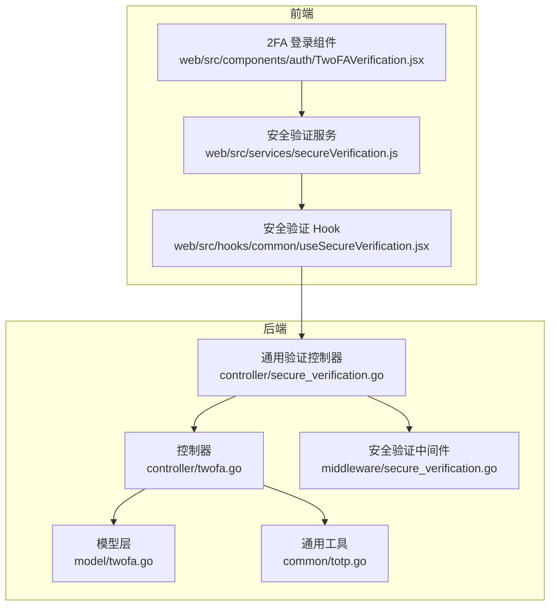
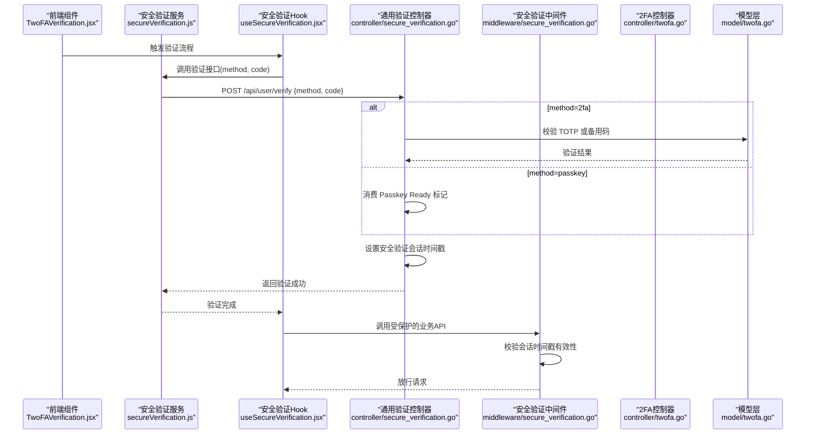
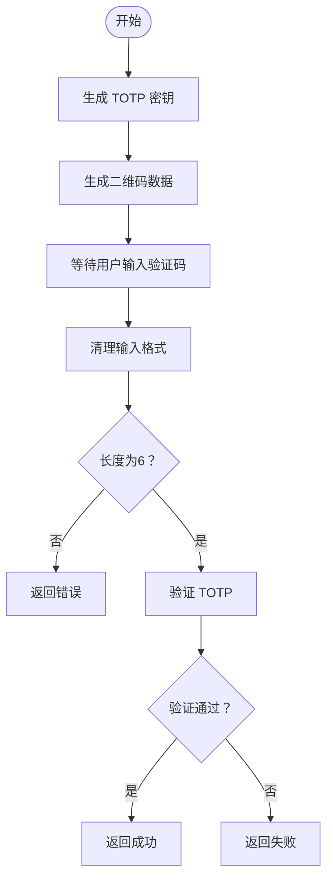
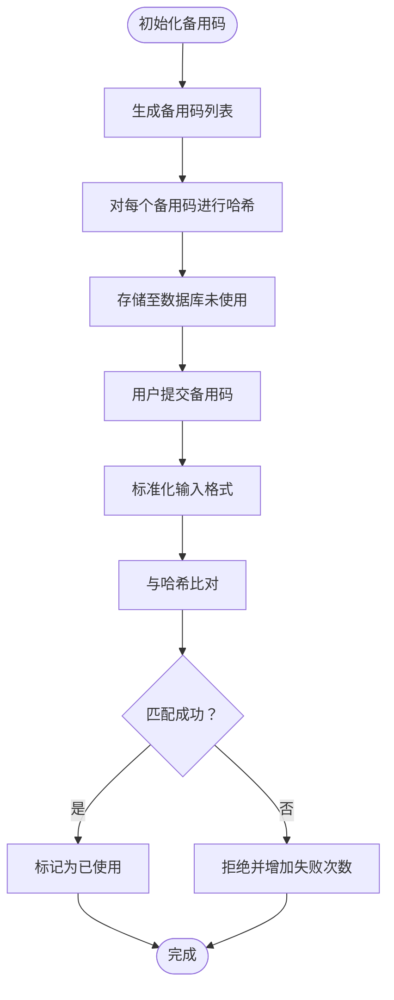
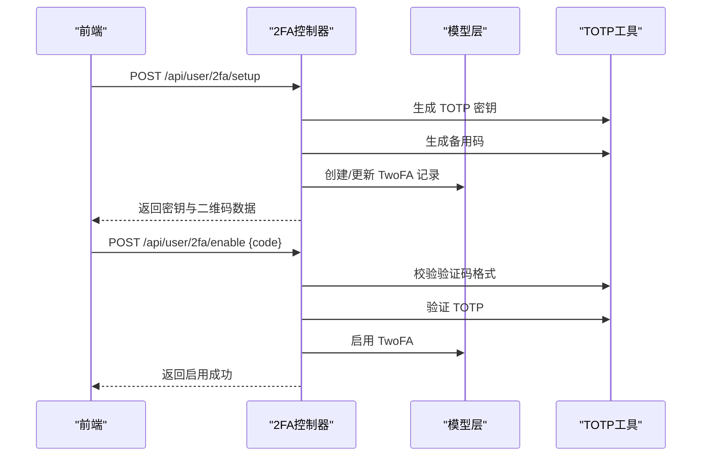
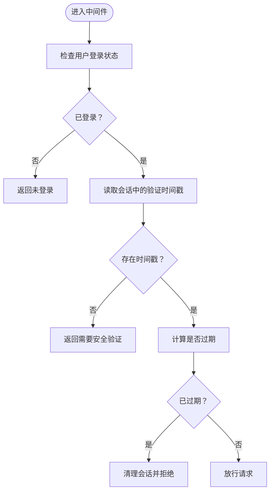
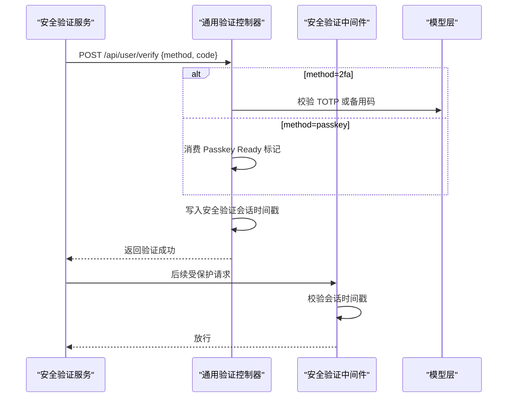
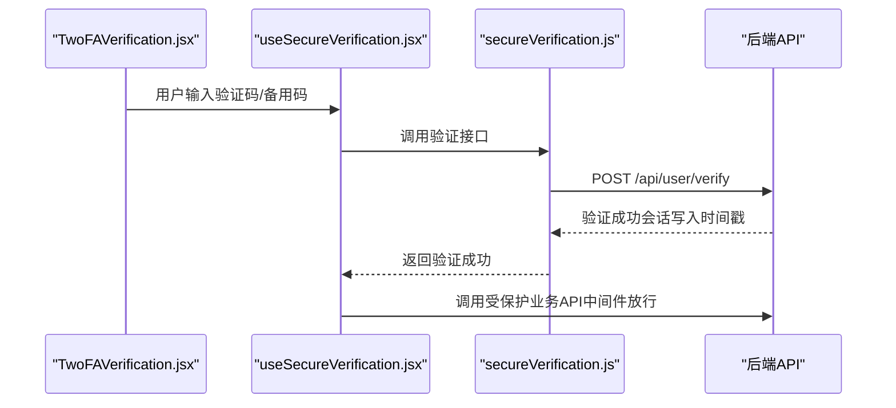
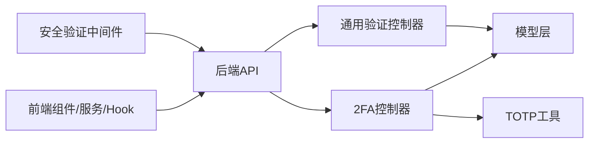

# 双因素认证

<cite>
**本文档引用的文件**
- [common/totp.go](file://common/totp.go)
- [controller/twofa.go](file://controller/twofa.go)
- [model/twofa.go](file://model/twofa.go)
- [middleware/secure_verification.go](file://middleware/secure_verification.go)
- [controller/secure_verification.go](file://controller/secure_verification.go)
- [router/api-router.go](file://router/api-router.go)
- [web/src/components/auth/TwoFAVerification.jsx](file://web/src/components/auth/TwoFAVerification.jsx)
- [web/src/hooks/common/useSecureVerification.jsx](file://web/src/hooks/common/useSecureVerification.jsx)
- [web/src/services/secureVerification.js](file://web/src/services/secureVerification.js)
</cite>

## 目录
1. [简介](#简介)
2. [项目结构](#项目结构)
3. [核心组件](#核心组件)
4. [架构总览](#架构总览)
5. [详细组件分析](#详细组件分析)
6. [依赖关系分析](#依赖关系分析)
7. [性能考量](#性能考量)
8. [故障排查指南](#故障排查指南)
9. [结论](#结论)
10. [附录](#附录)

## 简介
本文件面向开发者，系统性阐述 New API 的双因素认证（2FA）体系，重点覆盖基于时间的一次性密码（TOTP）实现、安全验证流程、用户绑定与会话保护机制。内容包括：
- TOTP 算法原理与实现要点（密钥生成、验证码校验、时间窗口管理）
- 双因素认证的启用、验证与管理（二维码生成、密钥管理、备用码机制）
- 安全验证中间件与通用验证接口的工作原理
- 验证码验证与会话保护策略
- 配置项、备用码管理与设备绑定策略
- API 接口说明、实现示例路径与安全最佳实践

## 项目结构
New API 的双因素认证涉及后端控制器、模型层、通用工具、中间件以及前端组件与服务的协同：
- 后端：控制器负责业务流程编排；模型层负责数据持久化与状态管理；通用工具提供 TOTP 与二维码生成等能力；中间件提供会话级安全验证保护。
- 前端：提供 2FA 登录界面与通用安全验证 Hook，统一处理 2FA 与 Passkey 的验证流程。

**图表来源**
- [controller/twofa.go:1-555](file://controller/twofa.go#L1-L555)
- [model/twofa.go:1-322](file://model/twofa.go#L1-L322)
- [common/totp.go:1-151](file://common/totp.go#L1-L151)
- [middleware/secure_verification.go:1-132](file://middleware/secure_verification.go#L1-L132)
- [controller/secure_verification.go:1-176](file://controller/secure_verification.go#L1-L176)
- [web/src/components/auth/TwoFAVerification.jsx:1-245](file://web/src/components/auth/TwoFAVerification.jsx#L1-L245)
- [web/src/hooks/common/useSecureVerification.jsx:1-275](file://web/src/hooks/common/useSecureVerification.jsx#L1-L275)
- [web/src/services/secureVerification.js:1-88](file://web/src/services/secureVerification.js#L1-L88)

**章节来源**
- [controller/twofa.go:1-555](file://controller/twofa.go#L1-L555)
- [model/twofa.go:1-322](file://model/twofa.go#L1-L322)
- [common/totp.go:1-151](file://common/totp.go#L1-L151)
- [middleware/secure_verification.go:1-132](file://middleware/secure_verification.go#L1-L132)
- [controller/secure_verification.go:1-176](file://controller/secure_verification.go#L1-L176)
- [web/src/components/auth/TwoFAVerification.jsx:1-245](file://web/src/components/auth/TwoFAVerification.jsx#L1-L245)
- [web/src/hooks/common/useSecureVerification.jsx:1-275](file://web/src/hooks/common/useSecureVerification.jsx#L1-L275)
- [web/src/services/secureVerification.js:1-88](file://web/src/services/secureVerification.js#L1-L88)

## 核心组件
- TOTP 工具模块（common/totp.go）
  - 提供 TOTP 密钥生成、验证码校验、备用码生成与校验、二维码数据生成等能力。
  - 关键常量：备用码长度与数量、最大失败次数与锁定时长、时间窗口周期等。
- 双因素认证控制器（controller/twofa.go）
  - 实现 2FA 初始化、启用、禁用、状态查询、备用码重新生成与登录验证等接口。
  - 与模型层交互，维护用户 2FA 设置与备用码使用状态。
- 模型层（model/twofa.go）
  - 定义 TwoFA 与 TwoFABackupCode 数据结构，提供数据库操作、失败次数与锁定逻辑、备用码验证与计数等。
- 安全验证中间件（middleware/secure_verification.go）
  - 基于会话的时间戳校验，提供“必需验证”和“可选验证”两种模式，控制后续敏感操作的访问。
- 通用验证控制器（controller/secure_verification.go）
  - 支持 2FA 与 Passkey 的统一验证入口，验证成功后在会话中记录时间戳，作为后续中间件放行依据。
- 前端组件与服务
  - 2FA 登录界面组件、安全验证 Hook 与服务，负责与后端交互并驱动验证流程。

**章节来源**
- [common/totp.go:14-151](file://common/totp.go#L14-L151)
- [controller/twofa.go:16-555](file://controller/twofa.go#L16-L555)
- [model/twofa.go:13-322](file://model/twofa.go#L13-L322)
- [middleware/secure_verification.go:11-132](file://middleware/secure_verification.go#L11-L132)
- [controller/secure_verification.go:14-176](file://controller/secure_verification.go#L14-L176)
- [web/src/components/auth/TwoFAVerification.jsx:32-245](file://web/src/components/auth/TwoFAVerification.jsx#L32-L245)
- [web/src/hooks/common/useSecureVerification.jsx:34-275](file://web/src/hooks/common/useSecureVerification.jsx#L34-L275)
- [web/src/services/secureVerification.js:31-88](file://web/src/services/secureVerification.js#L31-L88)

## 架构总览
下图展示 2FA 登录与通用安全验证的整体流程，包括前端交互、后端控制器、模型层与中间件的协作。

**图表来源**
- [web/src/components/auth/TwoFAVerification.jsx:37-72](file://web/src/components/auth/TwoFAVerification.jsx#L37-L72)
- [web/src/services/secureVerification.js:36-88](file://web/src/services/secureVerification.js#L36-L88)
- [web/src/hooks/common/useSecureVerification.jsx:124-171](file://web/src/hooks/common/useSecureVerification.jsx#L124-L171)
- [controller/secure_verification.go:35-140](file://controller/secure_verification.go#L35-L140)
- [middleware/secure_verification.go:21-80](file://middleware/secure_verification.go#L21-L80)
- [controller/twofa.go:398-487](file://controller/twofa.go#L398-L487)
- [model/twofa.go:234-295](file://model/twofa.go#L234-L295)

## 详细组件分析

### TOTP 实现与算法原理
- 密钥生成
  - 使用发行者名称与账户名生成 TOTP 密钥，周期为 30 秒，验证码为 6 位十进制数，算法为 SHA1。
- 验证码校验
  - 清理输入格式（去除空格），校验长度与字符类型，随后调用底层库进行验证。
- 时间窗口管理
  - TOTP 基于时间片（默认 30 秒）滚动，同一时间窗口内允许一次性验证通过。
- 二维码生成
  - 生成 otpauth:// 协议字符串，供认证器应用扫描导入。

**图表来源**
- [common/totp.go:24-46](file://common/totp.go#L24-L46)
- [common/totp.go:144-150](file://common/totp.go#L144-L150)

**章节来源**
- [common/totp.go:14-151](file://common/totp.go#L14-L151)

### 备用码管理机制
- 生成策略
  - 生成固定数量的备用码，每个备用码具有固定长度，并以特定格式呈现，便于用户备份与离线使用。
- 存储与校验
  - 备用码以哈希形式存储，验证时对用户输入进行标准化与哈希比对，一旦使用即标记为已用。
- 使用限制
  - 每个备用码仅可使用一次，且与用户绑定，防止重复消费。

**图表来源**
- [common/totp.go:48-112](file://common/totp.go#L48-L112)
- [model/twofa.go:142-203](file://model/twofa.go#L142-L203)

**章节来源**
- [common/totp.go:48-112](file://common/totp.go#L48-L112)
- [model/twofa.go:142-203](file://model/twofa.go#L142-L203)

### 双因素认证启用与登录验证流程
- 启用流程
  - 初始化：生成密钥与二维码数据，同时生成备用码并持久化。
  - 启用：前端输入验证码，后端验证通过后启用 2FA 并重置失败计数与锁定状态。
- 登录验证
  - 登录阶段若用户启用 2FA，需在会话中完成 2FA 验证后方可继续。
  - 支持 TOTP 与备用码两种验证方式，任一通过即视为登录验证成功。

**图表来源**
- [controller/twofa.go:33-202](file://controller/twofa.go#L33-L202)
- [common/totp.go:24-46](file://common/totp.go#L24-L46)
- [model/twofa.go:65-94](file://model/twofa.go#L65-L94)

**章节来源**
- [controller/twofa.go:33-202](file://controller/twofa.go#L33-L202)
- [model/twofa.go:65-94](file://model/twofa.go#L65-L94)

### 安全验证中间件与会话保护
- 必需验证中间件
  - 在会话中查找安全验证时间戳，若缺失或过期则拒绝请求。
- 可选验证中间件
  - 仅设置上下文标记，不阻断请求，用于区分是否已验证的场景。
- 会话清理
  - 提供清理函数，用于登出或强制重新验证的场景。

**图表来源**
- [middleware/secure_verification.go:21-80](file://middleware/secure_verification.go#L21-L80)

**章节来源**
- [middleware/secure_verification.go:11-132](file://middleware/secure_verification.go#L11-L132)

### 通用验证接口与 Passkey 协作
- 通用验证接口
  - 支持 2FA 与 Passkey 两种验证方式，验证成功后在会话中记录时间戳，有效期为固定秒数。
- Passkey 协作
  - 通过短期标记确认 Passkey 验证已完成，再由通用验证接口完成“提升验证”。

**图表来源**
- [controller/secure_verification.go:35-140](file://controller/secure_verification.go#L35-L140)
- [middleware/secure_verification.go:21-80](file://middleware/secure_verification.go#L21-L80)

**章节来源**
- [controller/secure_verification.go:14-176](file://controller/secure_verification.go#L14-L176)
- [middleware/secure_verification.go:11-132](file://middleware/secure_verification.go#L11-L132)

### 前端集成与用户体验
- 2FA 登录界面
  - 支持切换验证码与备用码输入，提供输入校验与错误提示。
- 安全验证 Hook
  - 自动检测可用验证方式（2FA/Passkey），封装验证流程，支持自动弹窗与回调。
- 安全验证服务
  - 统一调用后端验证接口，处理验证状态与后续业务请求。

**图表来源**
- [web/src/components/auth/TwoFAVerification.jsx:37-72](file://web/src/components/auth/TwoFAVerification.jsx#L37-L72)
- [web/src/hooks/common/useSecureVerification.jsx:124-171](file://web/src/hooks/common/useSecureVerification.jsx#L124-L171)
- [web/src/services/secureVerification.js:36-88](file://web/src/services/secureVerification.js#L36-L88)

**章节来源**
- [web/src/components/auth/TwoFAVerification.jsx:32-245](file://web/src/components/auth/TwoFAVerification.jsx#L32-L245)
- [web/src/hooks/common/useSecureVerification.jsx:34-275](file://web/src/hooks/common/useSecureVerification.jsx#L34-L275)
- [web/src/services/secureVerification.js:31-88](file://web/src/services/secureVerification.js#L31-L88)

## 依赖关系分析
- 控制器依赖
  - 2FA 控制器依赖通用 TOTP 工具与模型层，用于密钥生成、验证码校验与数据持久化。
  - 通用验证控制器依赖模型层以获取用户 2FA/PK 状态，并与会话交互。
- 中间件依赖
  - 安全验证中间件依赖会话存储以判断验证状态。
- 前端依赖
  - 安全验证 Hook 与服务依赖后端接口，实现统一的验证体验。

**图表来源**
- [controller/twofa.go:1-555](file://controller/twofa.go#L1-L555)
- [controller/secure_verification.go:1-176](file://controller/secure_verification.go#L1-L176)
- [model/twofa.go:1-322](file://model/twofa.go#L1-L322)
- [common/totp.go:1-151](file://common/totp.go#L1-L151)
- [middleware/secure_verification.go:1-132](file://middleware/secure_verification.go#L1-L132)

**章节来源**
- [controller/twofa.go:1-555](file://controller/twofa.go#L1-L555)
- [controller/secure_verification.go:1-176](file://controller/secure_verification.go#L1-L176)
- [model/twofa.go:1-322](file://model/twofa.go#L1-L322)
- [common/totp.go:1-151](file://common/totp.go#L1-L151)
- [middleware/secure_verification.go:1-132](file://middleware/secure_verification.go#L1-L132)

## 性能考量
- 验证开销
  - TOTP 验证为轻量级计算，主要成本在于数据库查询与会话读写。
- 失败次数与锁定
  - 连续失败达到阈值后进行临时锁定，降低暴力破解风险，同时避免对正常用户造成影响。
- 备用码哈希
  - 备用码以哈希存储，验证时进行哈希比对，兼顾安全性与性能。
- 会话时间戳
  - 中间件仅进行时间戳比较与会话读取，开销极低。

[本节为通用指导，无需具体文件分析]

## 故障排查指南
- 常见问题与定位
  - 会话过期：中间件返回“验证已过期”，需重新触发安全验证。
  - 参数错误：前端输入格式不符或后端参数绑定失败，检查验证码长度与字符类型。
  - 2FA 未启用：登录阶段若用户未启用 2FA，需先完成启用流程。
  - 账户锁定：连续失败导致锁定，需等待锁定时间结束或重置失败次数。
- 日志与调试
  - 后端在关键路径记录系统日志，便于定位异常。
  - 前端 Hook 提供错误提示与自动弹窗，辅助用户完成验证。

**章节来源**
- [middleware/secure_verification.go:34-79](file://middleware/secure_verification.go#L34-L79)
- [controller/twofa.go:171-187](file://controller/twofa.go#L171-L187)
- [model/twofa.go:121-140](file://model/twofa.go#L121-L140)

## 结论
New API 的双因素认证体系以 TOTP 为核心，结合备用码与会话级安全验证中间件，提供了完整的启用、验证与管理能力。通过前后端协同与统一的通用验证接口，系统在保障安全性的同时，提升了用户体验与可维护性。建议在生产环境中合理配置失败次数与锁定策略，并定期评估备用码使用情况，确保安全与可用性的平衡。

[本节为总结性内容，无需具体文件分析]

## 附录

### API 接口说明
- 获取 2FA 状态
  - 方法：GET
  - 路径：/api/user/2fa/status
  - 功能：返回用户 2FA 是否启用、是否锁定及剩余备用码数量
- 初始化 2FA 设置
  - 方法：POST
  - 路径：/api/user/2fa/setup
  - 功能：生成密钥与二维码数据，返回备用码列表
- 启用 2FA
  - 方法：POST
  - 路径：/api/user/2fa/enable
  - 功能：验证验证码后启用 2FA
- 禁用 2FA
  - 方法：POST
  - 路径：/api/user/2fa/disable
  - 功能：验证验证码或备用码后禁用 2FA
- 重新生成备用码
  - 方法：POST
  - 路径：/api/user/2fa/backup_codes
  - 功能：验证验证码后生成新的备用码并替换旧码
- 登录时 2FA 验证
  - 方法：POST
  - 路径：/api/user/login/2fa
  - 功能：在登录会话中完成 2FA 验证，完成后清理会话并完成登录
- 通用安全验证
  - 方法：POST
  - 路径：/api/user/verify
  - 功能：支持 2FA 与 Passkey 的统一验证，成功后在会话中记录时间戳

**章节来源**
- [router/api-router.go:97-134](file://router/api-router.go#L97-L134)
- [controller/twofa.go:276-555](file://controller/twofa.go#L276-L555)
- [controller/secure_verification.go:35-140](file://controller/secure_verification.go#L35-L140)

### 配置选项与安全最佳实践
- 配置项
  - 备用码长度与数量：影响用户备份与使用体验
  - 最大失败次数与锁定时长：平衡安全与可用性
  - TOTP 周期与验证码位数：默认 30 秒与 6 位，满足大多数场景
- 最佳实践
  - 强制启用 2FA：对高风险操作要求二次验证
  - 会话保护：对敏感操作使用安全验证中间件
  - 备用码管理：定期轮换备用码，限制其暴露范围
  - 日志审计：记录 2FA 启用、禁用、验证与失败事件
  - 输入校验：严格校验验证码格式，防止越界与注入

**章节来源**
- [common/totp.go:14-22](file://common/totp.go#L14-L22)
- [middleware/secure_verification.go:11-16](file://middleware/secure_verification.go#L11-L16)
- [controller/twofa.go:137-202](file://controller/twofa.go#L137-L202)