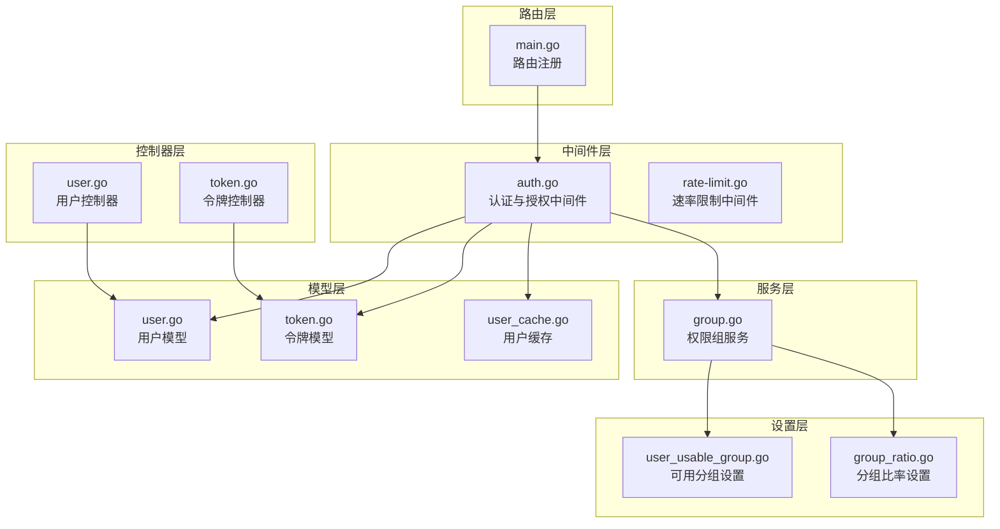
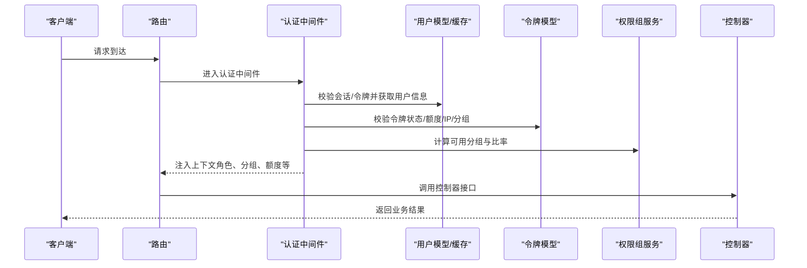
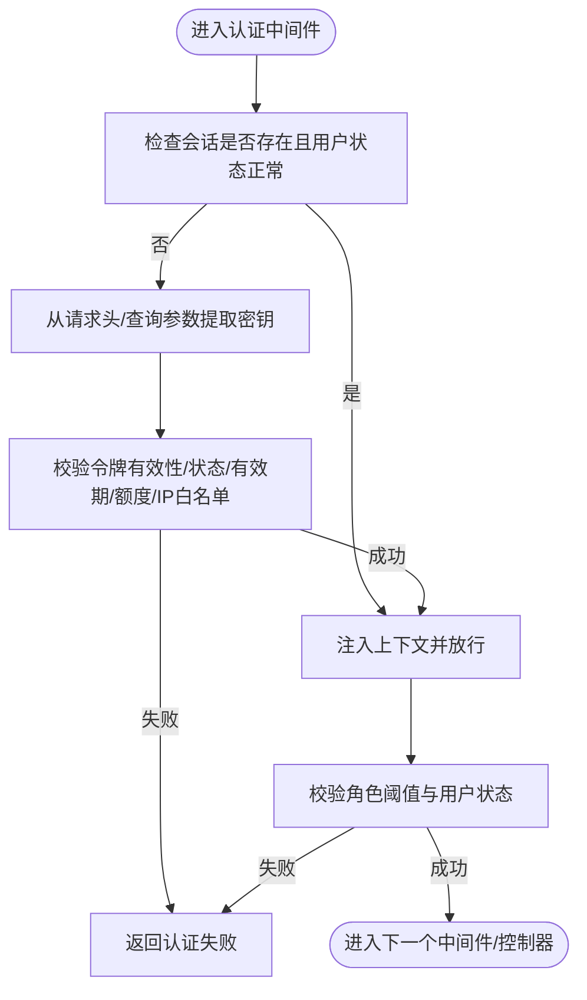
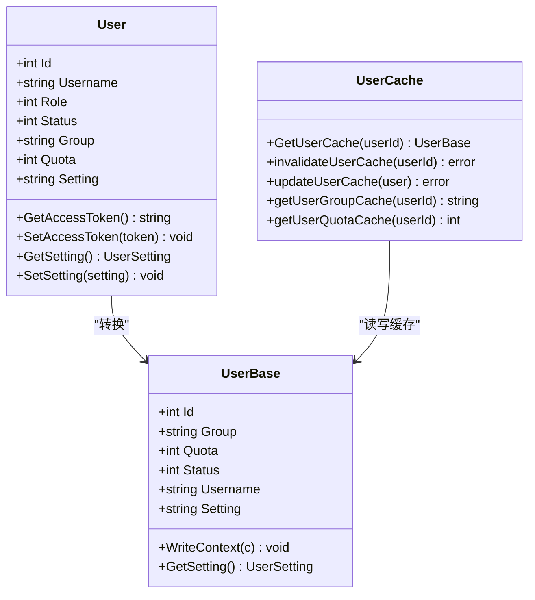
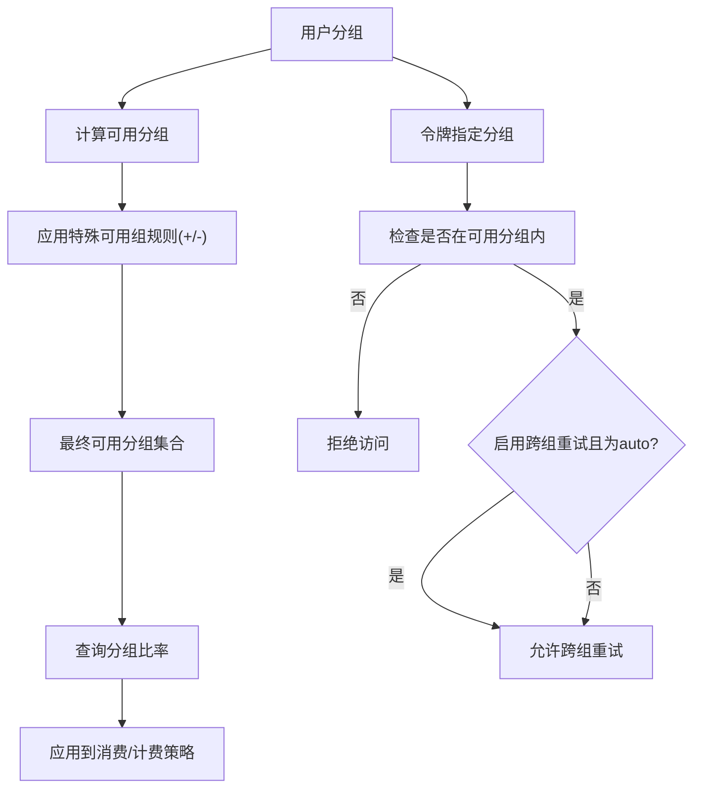
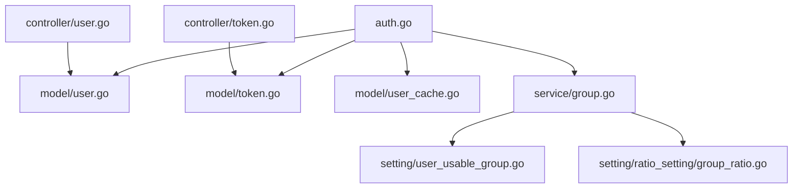

# 权限与角色管理

<cite>
**本文引用的文件**
- [auth.go](file://middleware/auth.go)
- [constants.go](file://common/constants.go)
- [user.go](file://model/user.go)
- [user_cache.go](file://model/user_cache.go)
- [group.go](file://service/group.go)
- [user_usable_group.go](file://setting/user_usable_group.go)
- [group_ratio.go](file://setting/ratio_setting/group_ratio.go)
- [token.go](file://model/token.go)
- [token.go](file://controller/token.go)
- [user.go](file://controller/user.go)
- [custom_oauth_provider.go](file://model/custom_oauth_provider.go)
- [generic.go](file://oauth/generic.go)
- [rate-limit.go](file://middleware/rate-limit.go)
- [rate-limit.go](file://common/rate-limit.go)
- [quota.go](file://common/quota.go)
- [usedata.go](file://model/usedata.go)
- [main.go](file://router/main.go)
</cite>

## 目录
1. [简介](#简介)
2. [项目结构](#项目结构)
3. [核心组件](#核心组件)
4. [架构总览](#架构总览)
5. [详细组件分析](#详细组件分析)
6. [依赖分析](#依赖分析)
7. [性能考虑](#性能考虑)
8. [故障排查指南](#故障排查指南)
9. [结论](#结论)
10. [附录](#附录)

## 简介
本技术文档围绕 New API 的权限与角色管理体系进行深入解析，覆盖用户角色体系（普通用户、管理员、超级管理员）、权限组管理、访问控制机制、角色继承关系、权限验证流程、资源访问控制策略、用户状态管理、权限组切换与跨组重试机制、权限配置选项、角色分配规则与访问策略设置，并提供权限模型示例、API 接口说明与权限验证流程图。同时解释权限缓存机制、权限检查优化与安全边界，帮助开发者正确实现与扩展权限管理功能。

## 项目结构
New API 的权限与角色管理涉及以下关键模块：
- 中间件层：统一认证与授权入口，负责会话/令牌校验、角色判定、用户状态检查与上下文注入。
- 模型层：用户、令牌、分组与配额等核心实体的数据结构与持久化逻辑。
- 服务层：权限组可用性计算、分组比率与特殊可用组处理。
- 设置层：全局可用分组、分组比率与特殊可用组配置。
- 控制器层：面向用户的权限相关接口（如获取自身权限、令牌管理等）。
- 路由层：路由注册与静态资源托管。

图表来源
- [auth.go:36-157](file://middleware/auth.go#L36-L157)
- [user.go:23-53](file://model/user.go#L23-L53)
- [token.go:14-32](file://model/token.go#L14-L32)
- [user_cache.go:16-50](file://model/user_cache.go#L16-L50)
- [group.go:10-37](file://service/group.go#L10-L37)
- [user_usable_group.go:10-25](file://setting/user_usable_group.go#L10-L25)
- [group_ratio.go:12-57](file://setting/ratio_setting/group_ratio.go#L12-L57)
- [user.go:373-425](file://controller/user.go#L373-L425)
- [token.go:167-234](file://controller/token.go#L167-L234)
- [main.go:16-35](file://router/main.go#L16-L35)

章节来源
- [auth.go:36-157](file://middleware/auth.go#L36-L157)
- [user.go:23-53](file://model/user.go#L23-L53)
- [token.go:14-32](file://model/token.go#L14-L32)
- [user_cache.go:16-50](file://model/user_cache.go#L16-L50)
- [group.go:10-37](file://service/group.go#L10-L37)
- [user_usable_group.go:10-25](file://setting/user_usable_group.go#L10-L25)
- [group_ratio.go:12-57](file://setting/ratio_setting/group_ratio.go#L12-L57)
- [user.go:373-425](file://controller/user.go#L373-L425)
- [token.go:167-234](file://controller/token.go#L167-L234)
- [main.go:16-35](file://router/main.go#L16-L35)

## 核心组件
- 角色与权限常量：定义角色等级（访客、普通用户、管理员、超级管理员）与最低权限要求。
- 认证中间件：支持会话与令牌两种认证方式，校验用户身份、角色与状态，并注入上下文。
- 用户模型与缓存：提供用户基本信息、状态、分组与配额的缓存读写，提升权限检查效率。
- 权限组服务：根据用户分组与系统配置，计算用户可用分组集合与分组比率。
- 令牌模型：支持令牌额度、有效期、模型限制、IP 白名单、分组与跨组重试等策略。
- 控制器接口：提供获取自身权限、令牌管理等接口，配合中间件完成权限控制。

章节来源
- [constants.go:141-150](file://common/constants.go#L141-L150)
- [auth.go:36-157](file://middleware/auth.go#L36-L157)
- [user.go:23-53](file://model/user.go#L23-L53)
- [user_cache.go:74-113](file://model/user_cache.go#L74-L113)
- [group.go:10-37](file://service/group.go#L10-L37)
- [token.go:14-32](file://model/token.go#L14-L32)
- [user.go:373-425](file://controller/user.go#L373-L425)
- [token.go:167-234](file://controller/token.go#L167-L234)

## 架构总览
New API 的权限与角色管理采用“中间件前置 + 模型/服务支撑 + 控制器暴露”的分层架构。认证中间件负责统一入口校验，模型层提供用户与令牌的持久化与缓存能力，服务层负责权限组与比率的动态计算，控制器通过接口向外部暴露权限相关能力。

图表来源
- [auth.go:36-157](file://middleware/auth.go#L36-L157)
- [user.go:763-777](file://model/user.go#L763-L777)
- [token.go:188-226](file://model/token.go#L188-L226)
- [group.go:10-37](file://service/group.go#L10-L37)
- [user.go:373-425](file://controller/user.go#L373-L425)

## 详细组件分析

### 角色与权限常量
- 角色等级：访客、普通用户、管理员、超级管理员，具备严格的继承关系与权限阈值。
- 最低权限要求：部分操作需满足特定角色阈值，例如只读查询可放宽至令牌校验。
- 用户状态与令牌状态：用户状态与令牌状态共同决定访问合法性。

章节来源
- [constants.go:141-150](file://common/constants.go#L141-L150)
- [constants.go:188-198](file://common/constants.go#L188-L198)

### 认证中间件（会话与令牌）
- 会话认证：优先检查会话中的用户标识与状态，若无效则进入令牌认证。
- 令牌认证：支持多种来源的密钥提取（WebSocket、Anthropic、Gemini 查询参数等），校验令牌有效性、状态、有效期、额度与 IP 白名单。
- 角色与状态校验：校验角色阈值与用户状态，防止封禁用户访问。
- 上下文注入：将用户 ID、角色、分组、令牌信息等注入到请求上下文，供后续处理使用。

图表来源
- [auth.go:36-157](file://middleware/auth.go#L36-L157)
- [auth.go:276-407](file://middleware/auth.go#L276-L407)

章节来源
- [auth.go:36-157](file://middleware/auth.go#L36-L157)
- [auth.go:276-407](file://middleware/auth.go#L276-L407)

### 用户模型与缓存
- 用户结构：包含角色、状态、分组、配额、设置等字段，支持序列化与设置读取。
- 缓存策略：用户缓存采用 Redis Hash 结构存储，提供异步刷新与字段级更新，减少数据库压力。
- 用户组获取：优先从缓存读取，失败回退数据库，并在成功读取后异步更新缓存。

图表来源
- [user.go:23-53](file://model/user.go#L23-L53)
- [user_cache.go:16-50](file://model/user_cache.go#L16-L50)
- [user_cache.go:74-113](file://model/user_cache.go#L74-L113)

章节来源
- [user.go:23-53](file://model/user.go#L23-L53)
- [user_cache.go:74-113](file://model/user_cache.go#L74-L113)
- [user_cache.go:140-179](file://model/user_cache.go#L140-L179)

### 权限组管理与访问控制
- 可用分组：系统维护可用分组集合，用户实际可用分组由用户分组与系统配置共同决定。
- 特殊可用组：支持对特定用户分组追加或移除某些分组，实现灵活的权限组切换。
- 分组比率：支持用户分组到使用分组的比率映射，以及全局分组比率，用于消费与计费策略。
- 令牌分组与跨组重试：令牌可指定使用分组，若未在可用分组内则拒绝；仅当令牌启用跨组重试且使用分组为 auto 时，允许跨组重试。

图表来源
- [group.go:10-37](file://service/group.go#L10-L37)
- [user_usable_group.go:16-25](file://setting/user_usable_group.go#L16-L25)
- [group_ratio.go:28-33](file://setting/ratio_setting/group_ratio.go#L28-L33)
- [group_ratio.go:93-103](file://setting/ratio_setting/group_ratio.go#L93-L103)
- [token.go:29-30](file://model/token.go#L29-L30)
- [auth.go:384-398](file://middleware/auth.go#L384-L398)

章节来源
- [group.go:10-37](file://service/group.go#L10-L37)
- [user_usable_group.go:16-25](file://setting/user_usable_group.go#L16-L25)
- [group_ratio.go:28-33](file://setting/ratio_setting/group_ratio.go#L28-L33)
- [group_ratio.go:93-103](file://setting/ratio_setting/group_ratio.go#L93-L103)
- [token.go:29-30](file://model/token.go#L29-L30)
- [auth.go:384-398](file://middleware/auth.go#L384-L398)

### 令牌模型与权限检查
- 令牌字段：名称、密钥、状态、有效期、剩余额度、模型限制、IP 白名单、分组、跨组重试等。
- 令牌校验：检查状态、有效期、额度与 IP 白名单，必要时更新状态。
- 上下文注入：将令牌相关信息注入上下文，供后续处理使用。

章节来源
- [token.go:14-32](file://model/token.go#L14-L32)
- [token.go:188-226](file://model/token.go#L188-L226)
- [auth.go:409-439](file://middleware/auth.go#L409-L439)

### 用户控制器与权限接口
- 获取自身权限：根据用户角色计算并返回权限信息，确保前端权限控制的安全性。
- 用户管理：支持用户更新、删除等操作，严格校验调用者角色不得低于被操作者角色。

章节来源
- [user.go:373-425](file://controller/user.go#L373-L425)
- [user.go:544-585](file://controller/user.go#L544-L585)

### 令牌控制器与权限接口
- 令牌管理：支持创建、查询、更新、删除、批量删除与批量导出密钥等操作，严格校验用户令牌数量上限与字段范围。
- 令牌额度与使用：提供额度查询与使用详情接口，支持无限额度与模型限制。

章节来源
- [token.go:167-234](file://controller/token.go#L167-L234)
- [token.go:118-165](file://controller/token.go#L118-L165)

### 访问策略与跨组重试机制
- 访问策略：令牌可指定分组与跨组重试策略，仅当令牌启用跨组重试且使用分组为 auto 时，允许跨组重试。
- 资源访问控制：若令牌分组不在用户可用分组集合内，则直接拒绝访问。

章节来源
- [token.go:29-30](file://model/token.go#L29-L30)
- [auth.go:384-398](file://middleware/auth.go#L384-L398)

### 权限模型示例
- 角色继承关系：超级管理员 > 管理员 > 普通用户 > 访客。
- 权限组切换：通过系统配置对特定用户分组追加或移除分组，实现细粒度权限控制。
- 跨组重试：仅在令牌启用跨组重试且使用分组为 auto 时生效。

章节来源
- [constants.go:141-150](file://common/constants.go#L141-L150)
- [group.go:10-37](file://service/group.go#L10-L37)
- [token.go:29-30](file://model/token.go#L29-L30)

## 依赖分析
- 中间件依赖：认证中间件依赖用户模型、令牌模型、用户缓存与权限组服务。
- 服务依赖：权限组服务依赖可用分组设置与分组比率设置。
- 控制器依赖：控制器依赖模型与服务，结合中间件完成权限控制。

图表来源
- [auth.go:36-157](file://middleware/auth.go#L36-L157)
- [user.go:23-53](file://model/user.go#L23-L53)
- [token.go:14-32](file://model/token.go#L14-L32)
- [user_cache.go:74-113](file://model/user_cache.go#L74-L113)
- [group.go:10-37](file://service/group.go#L10-L37)
- [user_usable_group.go:16-25](file://setting/user_usable_group.go#L16-L25)
- [group_ratio.go:93-103](file://setting/ratio_setting/group_ratio.go#L93-L103)
- [user.go:373-425](file://controller/user.go#L373-L425)
- [token.go:167-234](file://controller/token.go#L167-L234)

章节来源
- [auth.go:36-157](file://middleware/auth.go#L36-L157)
- [group.go:10-37](file://service/group.go#L10-L37)
- [user_usable_group.go:16-25](file://setting/user_usable_group.go#L16-L25)
- [group_ratio.go:93-103](file://setting/ratio_setting/group_ratio.go#L93-L103)
- [user.go:373-425](file://controller/user.go#L373-L425)
- [token.go:167-234](file://controller/token.go#L167-L234)

## 性能考虑
- 缓存优先：用户信息与令牌信息优先从缓存读取，失败回退数据库，并异步更新缓存，降低数据库压力。
- 速率限制：支持全局 Web/API 速率限制与关键接口速率限制，可按用户 ID 或 IP 进行限流。
- 内存限流：在未启用 Redis 时，使用内存限流器，具备过期清理与并发安全。
- 额度统计：使用内存缓存聚合额度数据，减少数据库写入频率。

章节来源
- [user_cache.go:74-113](file://model/user_cache.go#L74-L113)
- [rate-limit.go:67-151](file://middleware/rate-limit.go#L67-L151)
- [rate-limit.go:1-70](file://common/rate-limit.go#L1-L70)
- [usedata.go:34-65](file://model/usedata.go#L34-L65)

## 故障排查指南
- 认证失败：检查会话/令牌是否有效、角色阈值是否满足、用户状态是否被封禁。
- 令牌无效：检查令牌状态、有效期、额度与 IP 白名单配置。
- 权限组不可用：确认令牌分组是否在用户可用分组集合内，特殊可用组规则是否正确配置。
- 速率限制触发：检查全局或用户级速率限制配置，确认限流键与时间窗口设置。
- 缓存异常：检查 Redis 连接与键空间，确认缓存更新与过期策略。

章节来源
- [auth.go:36-157](file://middleware/auth.go#L36-L157)
- [token.go:188-226](file://model/token.go#L188-L226)
- [group.go:10-37](file://service/group.go#L10-L37)
- [rate-limit.go:67-151](file://middleware/rate-limit.go#L67-L151)

## 结论
New API 的权限与角色管理通过中间件统一入口、模型与缓存高效支撑、服务层灵活配置与控制器清晰暴露，构建了安全、可扩展、高性能的权限体系。开发者应遵循角色继承关系与权限阈值，合理配置权限组与分组比率，利用缓存与速率限制优化性能，并在出现异常时依据中间件与模型的错误路径快速定位问题。

## 附录

### API 接口说明（摘要）
- 获取自身权限：返回基于角色的权限信息，确保前端权限控制的安全性。
- 令牌管理：支持创建、查询、更新、删除、批量删除与批量导出密钥等操作。
- 令牌额度与使用：提供额度查询与使用详情接口。

章节来源
- [user.go:373-425](file://controller/user.go#L373-L425)
- [token.go:167-234](file://controller/token.go#L167-L234)
- [token.go:118-165](file://controller/token.go#L118-L165)

### 权限配置选项与访问策略设置
- 角色阈值：普通用户、管理员、超级管理员的访问阈值。
- 权限组：系统可用分组与特殊可用组规则。
- 分组比率：用户分组到使用分组的比率映射。
- 令牌策略：令牌分组、跨组重试、模型限制与 IP 白名单。

章节来源
- [constants.go:141-150](file://common/constants.go#L141-L150)
- [user_usable_group.go:16-25](file://setting/user_usable_group.go#L16-L25)
- [group_ratio.go:93-103](file://setting/ratio_setting/group_ratio.go#L93-L103)
- [token.go:29-30](file://model/token.go#L29-L30)