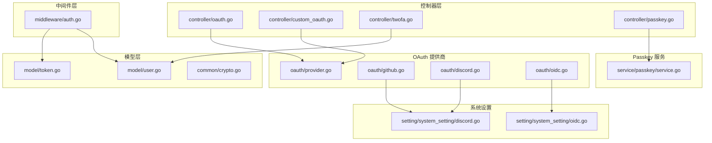
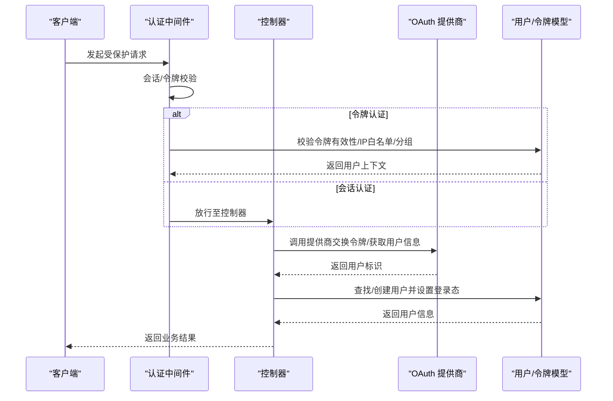
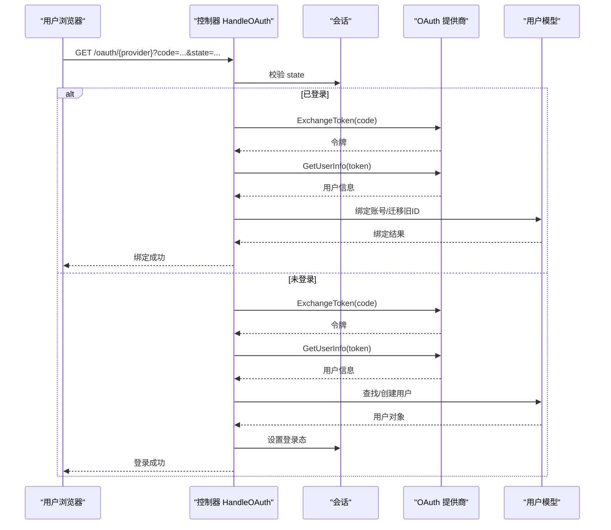
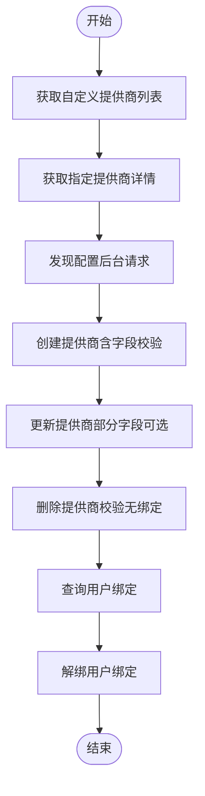
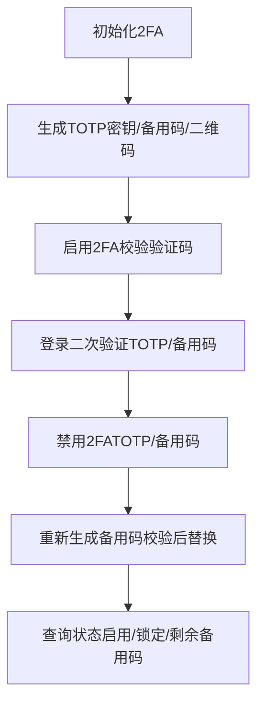
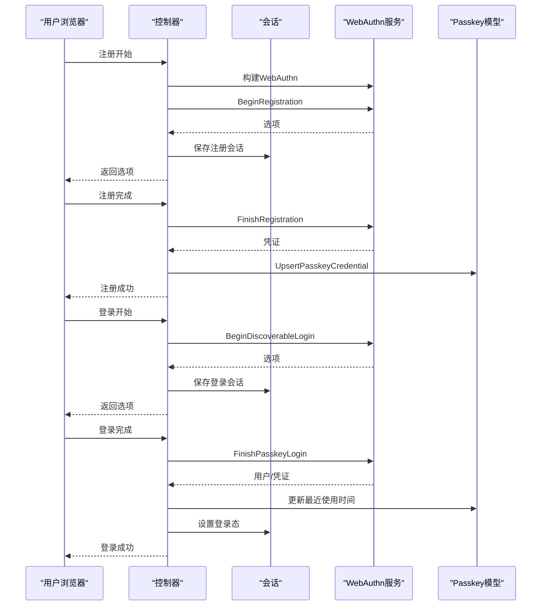
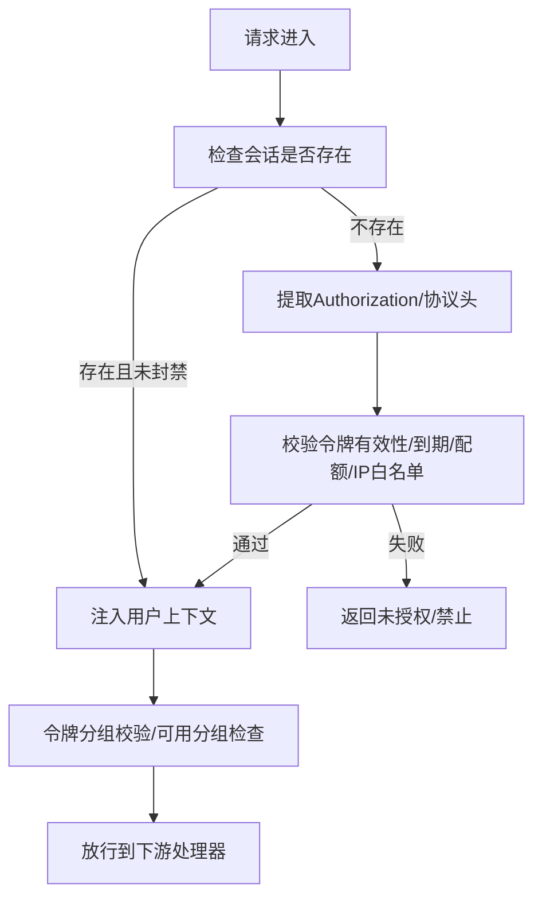
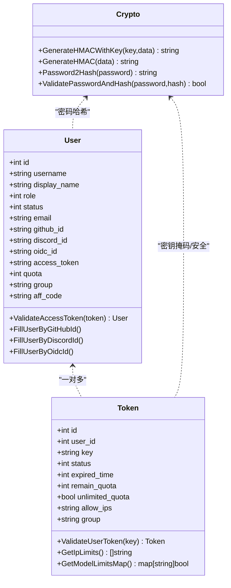
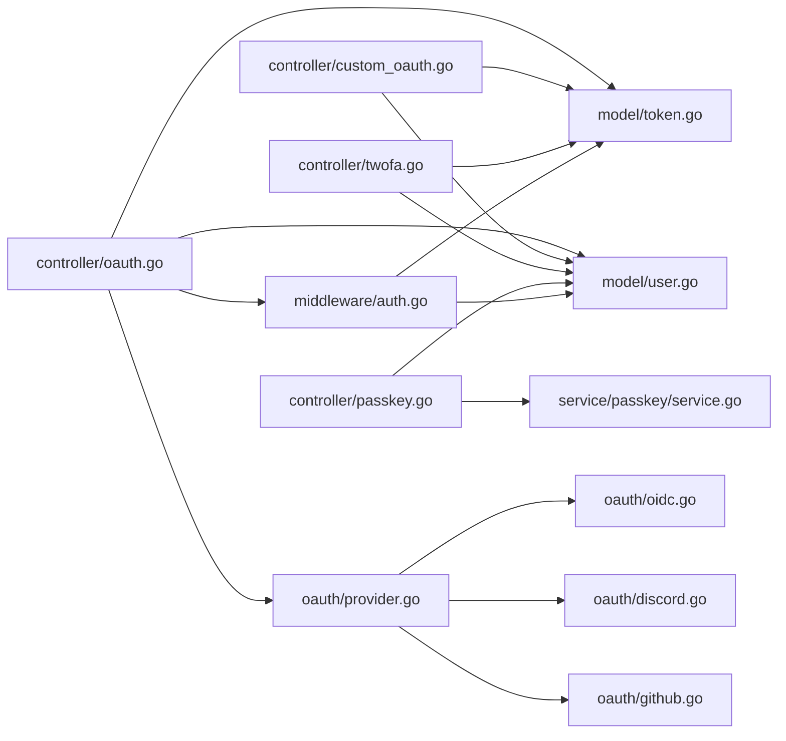

# 认证与授权

<cite>
**本文引用的文件**
- [controller/oauth.go](file://controller/oauth.go)
- [controller/custom_oauth.go](file://controller/custom_oauth.go)
- [controller/twofa.go](file://controller/twofa.go)
- [controller/passkey.go](file://controller/passkey.go)
- [middleware/auth.go](file://middleware/auth.go)
- [oauth/provider.go](file://oauth/provider.go)
- [oauth/github.go](file://oauth/github.go)
- [oauth/discord.go](file://oauth/discord.go)
- [oauth/oidc.go](file://oauth/oidc.go)
- [model/user.go](file://model/user.go)
- [model/token.go](file://model/token.go)
- [common/crypto.go](file://common/crypto.go)
- [setting/system_setting/oidc.go](file://setting/system_setting/oidc.go)
- [setting/system_setting/discord.go](file://setting/system_setting/discord.go)
- [service/passkey/service.go](file://service/passkey/service.go)
</cite>

## 目录
1. [简介](#简介)
2. [项目结构](#项目结构)
3. [核心组件](#核心组件)
4. [架构总览](#架构总览)
5. [详细组件分析](#详细组件分析)
6. [依赖分析](#依赖分析)
7. [性能考虑](#性能考虑)
8. [故障排查指南](#故障排查指南)
9. [结论](#结论)
10. [附录](#附录)

## 简介
本技术文档面向 New API 的认证与授权系统，围绕以下主题进行深入解析：
- JWT 令牌机制：访问令牌与用户令牌的设计、校验与上下文注入。
- OAuth 集成方案：GitHub、Discord、OIDC 以及自定义 OAuth 提供商的对接流程与配置。
- 多因素认证（MFA）：基于 TOTP 的 2FA 流程与备用码管理。
- 会话与登录：会话状态、登录态维护与跨组件登录流程。
- 权限与角色控制：用户角色、分组与令牌分组策略。
- 安全最佳实践：CSRF 防护、令牌刷新策略、IP 白名单、审计日志与敏感信息处理。

## 项目结构
认证与授权相关代码主要分布在以下模块：
- 控制器层：处理 OAuth 回调、自定义 OAuth 管理、2FA、Passkey 登录等入口。
- 中间件层：统一的用户认证、令牌认证、只读令牌认证与权限拦截。
- OAuth 提供商：抽象接口与具体实现（GitHub、Discord、OIDC）。
- 模型层：用户模型、令牌模型与常用加密工具。
- 系统设置：OIDC、Discord 等提供商的运行时配置。
- Passkey 服务：WebAuthn 配置与会话管理。

图表来源
- [controller/oauth.go:1-363](file://controller/oauth.go#L1-L363)
- [controller/custom_oauth.go:1-585](file://controller/custom_oauth.go#L1-L585)
- [controller/twofa.go:1-555](file://controller/twofa.go#L1-L555)
- [controller/passkey.go:1-507](file://controller/passkey.go#L1-L507)
- [middleware/auth.go:1-440](file://middleware/auth.go#L1-L440)
- [oauth/provider.go:1-37](file://oauth/provider.go#L1-L37)
- [oauth/github.go:1-179](file://oauth/github.go#L1-L179)
- [oauth/discord.go:1-173](file://oauth/discord.go#L1-L173)
- [oauth/oidc.go:1-178](file://oauth/oidc.go#L1-L178)
- [model/user.go:1-800](file://model/user.go#L1-L800)
- [model/token.go:1-483](file://model/token.go#L1-L483)
- [common/crypto.go:1-33](file://common/crypto.go#L1-L33)
- [setting/system_setting/oidc.go:1-26](file://setting/system_setting/oidc.go#L1-L26)
- [setting/system_setting/discord.go:1-22](file://setting/system_setting/discord.go#L1-L22)
- [service/passkey/service.go:1-178](file://service/passkey/service.go#L1-L178)

章节来源
- [controller/oauth.go:1-363](file://controller/oauth.go#L1-L363)
- [middleware/auth.go:1-440](file://middleware/auth.go#L1-L440)

## 核心组件
- OAuth 抽象与实现
  - Provider 接口定义了提供商名称、启用状态、授权码换取令牌、获取用户信息、用户 ID 占用检查、填充用户与设置用户 ID 前缀等能力。
  - 内置提供商：GitHub、Discord、OIDC，均通过系统设置动态启用。
- 用户与令牌模型
  - 用户模型包含角色、状态、分组、多平台绑定 ID、访问令牌等字段；提供访问令牌校验方法。
  - 令牌模型包含用户 ID、密钥、状态、到期时间、剩余配额、模型限制、IP 白名单、分组与跨分组重试等字段；提供令牌校验、IP 限制检查与上下文注入。
- 认证中间件
  - 支持会话认证与令牌认证双通道；支持只读令牌认证；支持 WebSocket 与特定协议头的令牌提取；支持 IP 白名单与分组切换。
- 2FA（TOTP）
  - 初始化、启用、禁用、备用码生成与验证；登录阶段二次验证；管理员强制禁用。
- Passkey（WebAuthn）
  - 注册、登录、验证、删除与状态查询；会话键管理与 RP/Origin 解析。
- 自定义 OAuth
  - 提供商的增删改查、发现配置、用户绑定查询与解绑。

章节来源
- [oauth/provider.go:1-37](file://oauth/provider.go#L1-L37)
- [oauth/github.go:1-179](file://oauth/github.go#L1-L179)
- [oauth/discord.go:1-173](file://oauth/discord.go#L1-L173)
- [oauth/oidc.go:1-178](file://oauth/oidc.go#L1-L178)
- [model/user.go:1-800](file://model/user.go#L1-L800)
- [model/token.go:1-483](file://model/token.go#L1-L483)
- [middleware/auth.go:1-440](file://middleware/auth.go#L1-L440)
- [controller/twofa.go:1-555](file://controller/twofa.go#L1-L555)
- [controller/passkey.go:1-507](file://controller/passkey.go#L1-L507)
- [controller/custom_oauth.go:1-585](file://controller/custom_oauth.go#L1-L585)

## 架构总览
New API 的认证与授权采用“中间件 + 控制器 + 模型 + 提供商”的分层设计：
- 中间件负责统一鉴权与上下文注入；
- 控制器负责业务流程编排（OAuth 回调、2FA、Passkey、自定义 OAuth 管理）；
- 模型负责数据持久化与业务规则；
- OAuth 提供商负责与外部身份源交互；
- 系统设置负责运行时可配置项。

图表来源
- [middleware/auth.go:192-407](file://middleware/auth.go#L192-L407)
- [controller/oauth.go:44-128](file://controller/oauth.go#L44-L128)
- [oauth/github.go:48-103](file://oauth/github.go#L48-L103)
- [oauth/discord.go:49-108](file://oauth/discord.go#L49-L108)
- [oauth/oidc.go:51-110](file://oauth/oidc.go#L51-L110)
- [model/user.go:763-777](file://model/user.go#L763-L777)
- [model/token.go:188-226](file://model/token.go#L188-L226)

## 详细组件分析

### OAuth 回调与登录流程
- CSRF 保护：生成并存储 state，回调时比对 session 中的 state。
- 绑定流程：若会话中存在用户名，则进入“绑定”流程，防止重复绑定与迁移旧 ID。
- 提供商启用检查：仅当提供商启用时才允许回调。
- 错误处理：对提供商返回的错误进行本地化提示。
- 用户查找/创建：优先按新 ID 匹配，其次兼容旧 ID；注册开关控制是否允许新用户创建；邀请码与奖励逻辑在事务完成后执行。
- 登录态设置：设置会话并完成登录。

图表来源
- [controller/oauth.go:22-128](file://controller/oauth.go#L22-L128)
- [controller/oauth.go:130-196](file://controller/oauth.go#L130-L196)
- [controller/oauth.go:198-331](file://controller/oauth.go#L198-L331)

章节来源
- [controller/oauth.go:1-363](file://controller/oauth.go#L1-L363)

### 自定义 OAuth 提供商管理
- 列表与详情：返回不含敏感字段的响应体。
- 发现配置：通过后台请求 OIDC 发现文档，支持超时与状态码校验。
- 创建/更新：校验 slug 冲突（不可与内置提供商冲突），支持部分字段更新。
- 删除：需确认无用户绑定方可删除。
- 用户绑定查询与解绑：支持管理员场景下的越权检查。

图表来源
- [controller/custom_oauth.go:72-112](file://controller/custom_oauth.go#L72-L112)
- [controller/custom_oauth.go:141-211](file://controller/custom_oauth.go#L141-L211)
- [controller/custom_oauth.go:213-267](file://controller/custom_oauth.go#L213-L267)
- [controller/custom_oauth.go:291-400](file://controller/custom_oauth.go#L291-L400)
- [controller/custom_oauth.go:402-442](file://controller/custom_oauth.go#L402-L442)
- [controller/custom_oauth.go:468-520](file://controller/custom_oauth.go#L468-L520)
- [controller/custom_oauth.go:522-584](file://controller/custom_oauth.go#L522-L584)

章节来源
- [controller/custom_oauth.go:1-585](file://controller/custom_oauth.go#L1-L585)

### 2FA（TOTP）与备用码
- 初始化：生成 TOTP 密钥、备用码与二维码数据，记录待启用状态。
- 启用：校验一次性验证码，启用后写入启用状态。
- 禁用：支持 TOTP 与备用码验证，成功后禁用并清理记录。
- 查询状态：返回启用状态、锁定状态与剩余备用码数量。
- 重新生成备用码：验证后替换备用码集合。
- 登录二次验证：从会话中取出待验证用户，验证后清理会话并完成登录。
- 管理员强制禁用与统计。

图表来源
- [controller/twofa.go:34-135](file://controller/twofa.go#L34-L135)
- [controller/twofa.go:137-202](file://controller/twofa.go#L137-L202)
- [controller/twofa.go:204-274](file://controller/twofa.go#L204-L274)
- [controller/twofa.go:276-310](file://controller/twofa.go#L276-L310)
- [controller/twofa.go:312-396](file://controller/twofa.go#L312-L396)
- [controller/twofa.go:398-487](file://controller/twofa.go#L398-L487)
- [controller/twofa.go:489-555](file://controller/twofa.go#L489-L555)

章节来源
- [controller/twofa.go:1-555](file://controller/twofa.go#L1-L555)

### Passkey（WebAuthn）登录
- 注册：构建 WebAuthn 实例，生成注册选项，保存会话，完成注册后写入凭证。
- 登录：构建登录选项，完成登录后更新凭证最近使用时间并设置登录态。
- 验证：对已绑定用户进行二次验证，更新最近使用时间。
- 删除与状态：支持删除绑定与查询状态。
- 会话键：注册、登录、验证分别使用独立会话键，避免混淆。
- RP/Origin 解析：支持显式配置与自动推导，HTTPS 强制与不安全 Origin 校验。

图表来源
- [controller/passkey.go:21-79](file://controller/passkey.go#L21-L79)
- [controller/passkey.go:81-142](file://controller/passkey.go#L81-L142)
- [controller/passkey.go:203-236](file://controller/passkey.go#L203-L236)
- [controller/passkey.go:238-327](file://controller/passkey.go#L238-L327)
- [controller/passkey.go:365-417](file://controller/passkey.go#L365-L417)
- [controller/passkey.go:419-486](file://controller/passkey.go#L419-L486)
- [service/passkey/service.go:25-80](file://service/passkey/service.go#L25-L80)
- [service/passkey/service.go:82-129](file://service/passkey/service.go#L82-L129)
- [service/passkey/service.go:131-178](file://service/passkey/service.go#L131-L178)

章节来源
- [controller/passkey.go:1-507](file://controller/passkey.go#L1-L507)
- [service/passkey/service.go:1-178](file://service/passkey/service.go#L1-L178)

### 认证中间件与令牌策略
- 会话认证：从会话中读取用户名、角色、ID、状态，校验封禁状态与最低角色。
- 令牌认证：支持多种来源与协议头（Bearer、WebSocket 协议头、Anthropic/X-Google API Key 等），提取主密钥并校验令牌有效性、到期、配额与 IP 白名单。
- 只读令牌认证：宽松模式，仅校验令牌存在性与用户封禁状态。
- 上下文注入：将用户 ID、令牌信息、分组、模型限制等注入到请求上下文。
- 分组与跨分组重试：令牌可指定分组，校验是否在可用分组内与比率配置中。

图表来源
- [middleware/auth.go:192-407](file://middleware/auth.go#L192-L407)
- [middleware/auth.go:214-274](file://middleware/auth.go#L214-L274)
- [middleware/auth.go:376-406](file://middleware/auth.go#L376-L406)
- [model/token.go:188-226](file://model/token.go#L188-L226)
- [model/token.go:59-79](file://model/token.go#L59-L79)

章节来源
- [middleware/auth.go:1-440](file://middleware/auth.go#L1-L440)
- [model/token.go:1-483](file://model/token.go#L1-L483)

### 用户与令牌模型
- 用户模型
  - 字段：用户名、显示名、角色、状态、邮箱、各平台绑定 ID、访问令牌、配额、分组、邀请码与奖励等。
  - 方法：访问令牌校验、按绑定 ID 填充用户、插入/更新、清理绑定、角色判断等。
- 令牌模型
  - 字段：用户 ID、密钥、状态、到期时间、剩余配额、模型限制、IP 白名单、分组、跨分组重试等。
  - 方法：令牌校验、IP 白名单解析、模型限制映射、配额增减、批量删除等。
- 加密工具
  - HMAC 与密码哈希（bcrypt）。

图表来源
- [model/user.go:23-53](file://model/user.go#L23-L53)
- [model/user.go:763-777](file://model/user.go#L763-L777)
- [model/token.go:14-32](file://model/token.go#L14-L32)
- [model/token.go:188-226](file://model/token.go#L188-L226)
- [model/token.go:59-79](file://model/token.go#L59-L79)
- [common/crypto.go:11-32](file://common/crypto.go#L11-L32)

章节来源
- [model/user.go:1-800](file://model/user.go#L1-L800)
- [model/token.go:1-483](file://model/token.go#L1-L483)
- [common/crypto.go:1-33](file://common/crypto.go#L1-L33)

## 依赖分析
- 控制器依赖中间件与 OAuth 提供商；OAuth 提供商依赖系统设置与网络请求；控制器还依赖模型层进行用户与令牌操作。
- 中间件依赖模型层进行令牌与用户状态校验，并向下游注入上下文。
- 自定义 OAuth 控制器依赖模型层的提供商 CRUD 与绑定管理。
- Passkey 控制器依赖 Passkey 服务进行 WebAuthn 配置与会话管理。

图表来源
- [controller/oauth.go:1-363](file://controller/oauth.go#L1-L363)
- [middleware/auth.go:1-440](file://middleware/auth.go#L1-L440)
- [oauth/provider.go:1-37](file://oauth/provider.go#L1-L37)
- [oauth/github.go:1-179](file://oauth/github.go#L1-L179)
- [oauth/discord.go:1-173](file://oauth/discord.go#L1-L173)
- [oauth/oidc.go:1-178](file://oauth/oidc.go#L1-L178)
- [model/user.go:1-800](file://model/user.go#L1-L800)
- [model/token.go:1-483](file://model/token.go#L1-L483)
- [controller/custom_oauth.go:1-585](file://controller/custom_oauth.go#L1-L585)
- [controller/twofa.go:1-555](file://controller/twofa.go#L1-L555)
- [controller/passkey.go:1-507](file://controller/passkey.go#L1-L507)
- [service/passkey/service.go:1-178](file://service/passkey/service.go#L1-L178)

章节来源
- [controller/oauth.go:1-363](file://controller/oauth.go#L1-L363)
- [controller/custom_oauth.go:1-585](file://controller/custom_oauth.go#L1-L585)
- [controller/twofa.go:1-555](file://controller/twofa.go#L1-L555)
- [controller/passkey.go:1-507](file://controller/passkey.go#L1-L507)
- [middleware/auth.go:1-440](file://middleware/auth.go#L1-L440)
- [oauth/provider.go:1-37](file://oauth/provider.go#L1-L37)
- [oauth/github.go:1-179](file://oauth/github.go#L1-L179)
- [oauth/discord.go:1-173](file://oauth/discord.go#L1-L173)
- [oauth/oidc.go:1-178](file://oauth/oidc.go#L1-L178)
- [model/user.go:1-800](file://model/user.go#L1-L800)
- [model/token.go:1-483](file://model/token.go#L1-L483)
- [service/passkey/service.go:1-178](file://service/passkey/service.go#L1-L178)

## 性能考虑
- 缓存与批处理：令牌配额变更支持异步缓存更新与批处理队列，降低数据库压力。
- Redis 集成：用户状态、配额与令牌缓存可选启用，减少数据库读取。
- IP 白名单解析：令牌 IP 限制采用 CIDR 列表快速匹配，避免复杂正则。
- 会话与登录：登录态设置与上下文注入在中间件层完成，避免重复查询。
- OAuth 回调：CSRF state 存储于会话，避免额外数据库开销。

[本节为通用指导，无需列出具体文件来源]

## 故障排查指南
- OAuth 回调失败
  - 检查 state 校验与会话保存；确认提供商启用状态；查看错误消息国际化键。
  - 参考路径：[controller/oauth.go:22-41](file://controller/oauth.go#L22-L41)，[controller/oauth.go:44-128](file://controller/oauth.go#L44-L128)
- 用户被封禁
  - 中间件与令牌校验均会拒绝封禁用户访问；检查用户状态与令牌状态。
  - 参考路径：[middleware/auth.go:123-129](file://middleware/auth.go#L123-L129)，[middleware/auth.go:374-378](file://middleware/auth.go#L374-L378)
- 令牌无效或过期
  - 校验令牌存在性、到期时间、剩余配额与 IP 白名单；必要时更新令牌状态。
  - 参考路径：[model/token.go:188-226](file://model/token.go#L188-L226)，[middleware/auth.go:351-365](file://middleware/auth.go#L351-L365)
- 2FA 验证失败
  - 检查验证码格式、TOTP 与备用码验证；确认会话中的待验证用户是否存在。
  - 参考路径：[controller/twofa.go:398-487](file://controller/twofa.go#L398-L487)，[controller/twofa.go:171-187](file://controller/twofa.go#L171-L187)
- Passkey 登录异常
  - 检查 RP/Origin 解析、HTTPS 强制与会话键；确认凭证最近使用时间更新。
  - 参考路径：[service/passkey/service.go:82-129](file://service/passkey/service.go#L82-L129)，[controller/passkey.go:253-327](file://controller/passkey.go#L253-L327)

章节来源
- [controller/oauth.go:1-363](file://controller/oauth.go#L1-L363)
- [middleware/auth.go:1-440](file://middleware/auth.go#L1-L440)
- [model/token.go:1-483](file://model/token.go#L1-L483)
- [controller/twofa.go:1-555](file://controller/twofa.go#L1-L555)
- [controller/passkey.go:1-507](file://controller/passkey.go#L1-L507)
- [service/passkey/service.go:1-178](file://service/passkey/service.go#L1-L178)

## 结论
New API 的认证与授权体系通过清晰的分层设计与丰富的安全特性，实现了：
- 多种登录方式的统一接入（OAuth、2FA、Passkey、令牌）；
- 严格的令牌与会话校验、IP 白名单与分组策略；
- 易扩展的自定义 OAuth 提供商管理；
- 完备的审计与日志记录能力。

开发者可基于现有中间件与控制器快速扩展新的认证方式与权限策略，同时遵循安全最佳实践以保障系统稳定与安全。

[本节为总结性内容，无需列出具体文件来源]

## 附录

### 配置示例与要点
- OIDC 配置
  - 字段：启用开关、客户端 ID/Secret、Well-Known、授权/令牌/用户信息端点。
  - 参考路径：[setting/system_setting/oidc.go:5-13](file://setting/system_setting/oidc.go#L5-L13)
- Discord 配置
  - 字段：启用开关、客户端 ID/Secret。
  - 参考路径：[setting/system_setting/discord.go:5-9](file://setting/system_setting/discord.go#L5-L9)
- 自定义 OAuth
  - 关键字段：名称、Slug、图标、启用、客户端凭据、端点、作用域、字段映射、认证样式、访问策略与拒绝消息。
  - 参考路径：[controller/custom_oauth.go:114-134](file://controller/custom_oauth.go#L114-L134)，[controller/custom_oauth.go:233-252](file://controller/custom_oauth.go#L233-L252)
- Passkey
  - RP/Origin 解析、HTTPS 强制、UserVerification、AttachmentPreference、会话键管理。
  - 参考路径：[service/passkey/service.go:25-80](file://service/passkey/service.go#L25-L80)，[service/passkey/service.go:82-129](file://service/passkey/service.go#L82-L129)

### API 接口说明（摘要）
- OAuth
  - 生成 state：GET /oauth/state
  - 回调处理：GET /oauth/{provider}
  - 绑定账户：GET /oauth/{provider}（会话中存在用户名时）
- 自定义 OAuth
  - 列表：GET /api/custom-oauth/providers
  - 详情：GET /api/custom-oauth/provider/{id}
  - 发现配置：POST /api/custom-oauth/discovery
  - 创建：POST /api/custom-oauth/providers
  - 更新：PUT /api/custom-oauth/providers/{id}
  - 删除：DELETE /api/custom-oauth/providers/{id}
  - 用户绑定：GET /api/custom-oauth/bindings
  - 解绑：DELETE /api/custom-oauth/bindings/{provider_id}
- 2FA
  - 初始化：POST /api/2fa/setup
  - 启用：POST /api/2fa/enable
  - 禁用：POST /api/2fa/disable
  - 查询状态：GET /api/2fa/status
  - 重新生成备用码：POST /api/2fa/regenerate-backup-codes
  - 登录二次验证：POST /api/2fa/verify-login
  - 管理员强制禁用：POST /api/admin/2fa/disable/{id}
- Passkey
  - 注册开始：POST /api/passkey/register-begin
  - 注册完成：POST /api/passkey/register-finish
  - 登录开始：POST /api/passkey/login-begin
  - 登录完成：POST /api/passkey/login-finish
  - 验证开始：POST /api/passkey/verify-begin
  - 验证完成：POST /api/passkey/verify-finish
  - 删除：POST /api/passkey/delete
  - 状态：GET /api/passkey/status
  - 管理员重置：POST /api/admin/passkey/reset/{id}

章节来源
- [controller/oauth.go:22-41](file://controller/oauth.go#L22-L41)
- [controller/oauth.go:44-128](file://controller/oauth.go#L44-L128)
- [controller/custom_oauth.go:72-112](file://controller/custom_oauth.go#L72-L112)
- [controller/custom_oauth.go:141-211](file://controller/custom_oauth.go#L141-L211)
- [controller/custom_oauth.go:213-267](file://controller/custom_oauth.go#L213-L267)
- [controller/custom_oauth.go:291-400](file://controller/custom_oauth.go#L291-L400)
- [controller/custom_oauth.go:402-442](file://controller/custom_oauth.go#L402-L442)
- [controller/custom_oauth.go:468-520](file://controller/custom_oauth.go#L468-L520)
- [controller/custom_oauth.go:522-584](file://controller/custom_oauth.go#L522-L584)
- [controller/twofa.go:34-135](file://controller/twofa.go#L34-L135)
- [controller/twofa.go:137-202](file://controller/twofa.go#L137-L202)
- [controller/twofa.go:204-274](file://controller/twofa.go#L204-L274)
- [controller/twofa.go:276-310](file://controller/twofa.go#L276-L310)
- [controller/twofa.go:312-396](file://controller/twofa.go#L312-L396)
- [controller/twofa.go:398-487](file://controller/twofa.go#L398-L487)
- [controller/twofa.go:504-555](file://controller/twofa.go#L504-L555)
- [controller/passkey.go:21-79](file://controller/passkey.go#L21-L79)
- [controller/passkey.go:81-142](file://controller/passkey.go#L81-L142)
- [controller/passkey.go:203-236](file://controller/passkey.go#L203-L236)
- [controller/passkey.go:238-327](file://controller/passkey.go#L238-L327)
- [controller/passkey.go:365-417](file://controller/passkey.go#L365-L417)
- [controller/passkey.go:419-486](file://controller/passkey.go#L419-L486)

### 安全注意事项
- CSRF 防护：OAuth 回调严格校验 state，防止跨站请求伪造。
- 令牌安全：令牌密钥掩码显示、IP 白名单、到期与配额控制、只读令牌宽松模式仅用于查询接口。
- 敏感信息：用户模型中涉及敏感字段（如密码、访问令牌）不应直接暴露；登录态设置时应清理敏感字段。
- 会话管理：Passkey 与 OAuth 使用独立会话键，避免会话混淆；登录完成后及时清理临时会话。
- 第三方集成：OIDC/Discord/GitHub 等提供商启用开关与端点配置需谨慎，确保 HTTPS 与 Origin 正确。

章节来源
- [controller/oauth.go:22-41](file://controller/oauth.go#L22-L41)
- [controller/oauth.go:44-128](file://controller/oauth.go#L44-L128)
- [middleware/auth.go:192-407](file://middleware/auth.go#L192-L407)
- [model/user.go:21-22](file://model/user.go#L21-L22)
- [service/passkey/service.go:82-129](file://service/passkey/service.go#L82-L129)