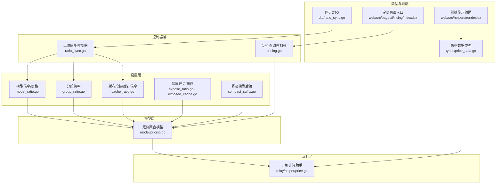
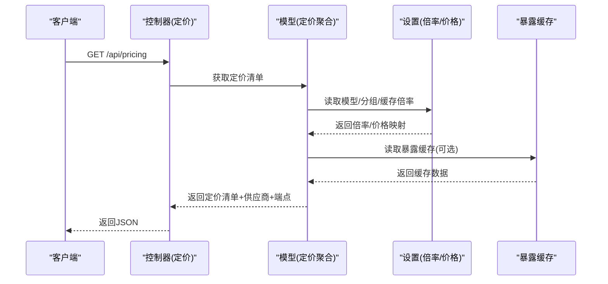
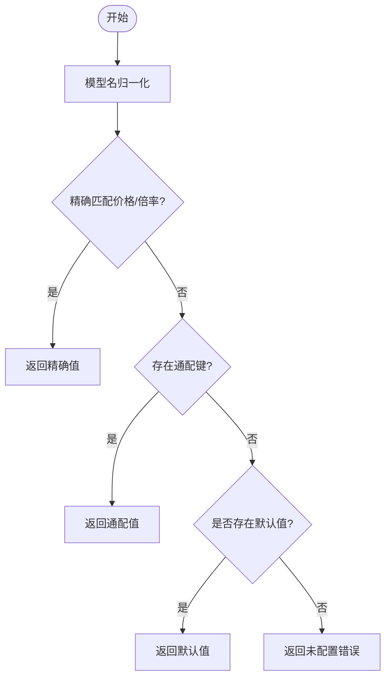
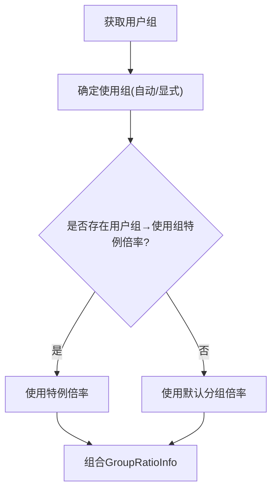
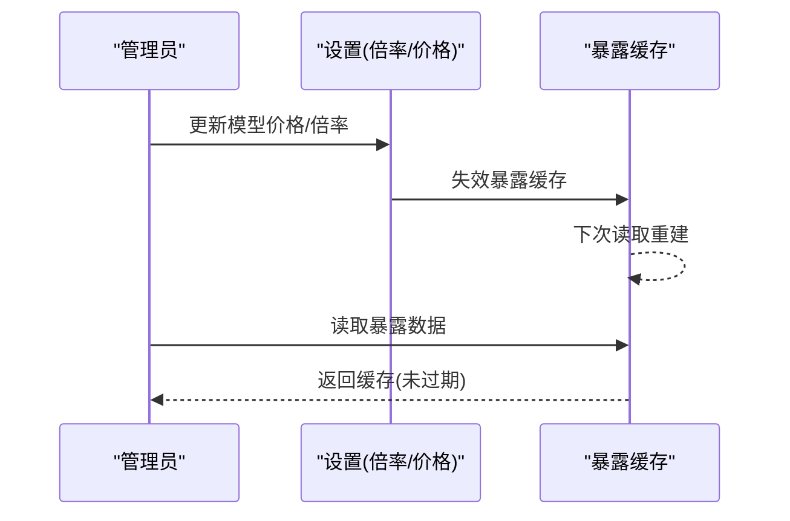
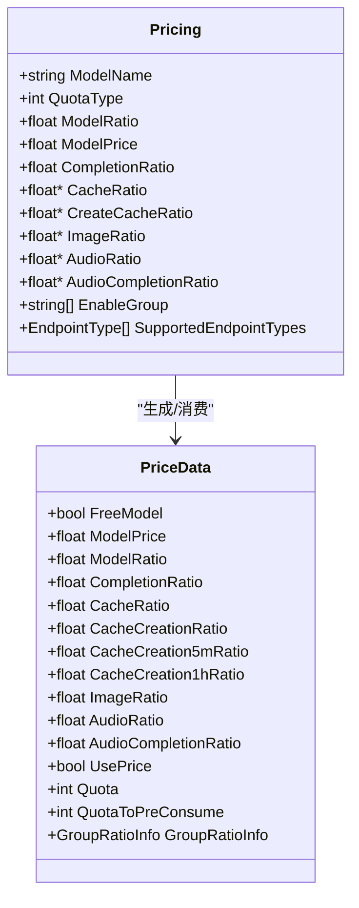
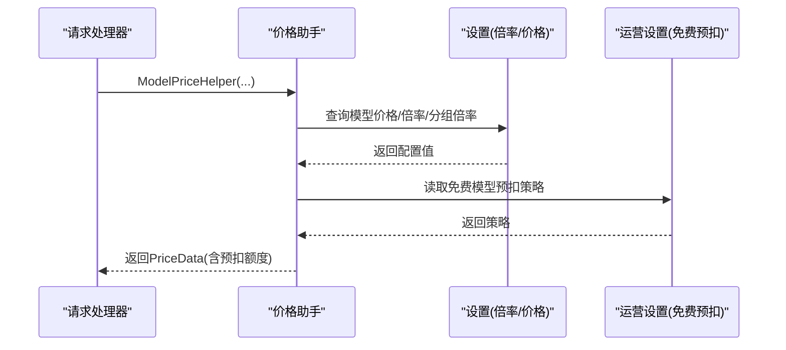
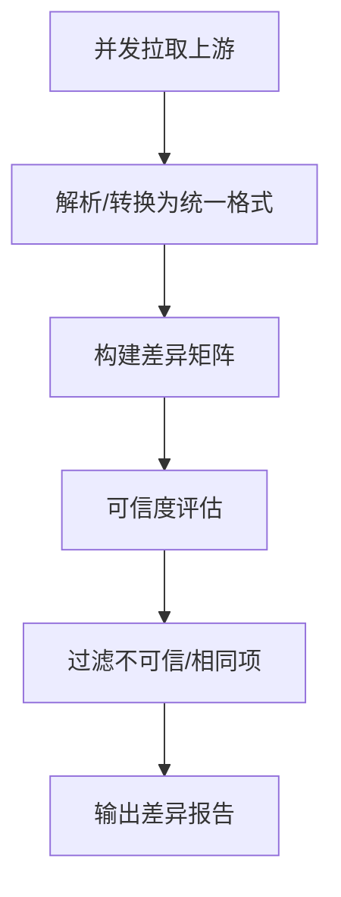
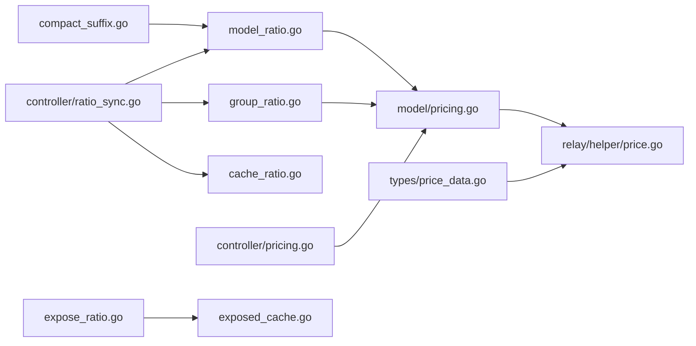

# 价格配置

<cite>
**本文引用的文件**
- [model_ratio.go](file://setting/ratio_setting/model_ratio.go)
- [group_ratio.go](file://setting/ratio_setting/group_ratio.go)
- [expose_ratio.go](file://setting/ratio_setting/expose_ratio.go)
- [cache_ratio.go](file://setting/ratio_setting/cache_ratio.go)
- [exposed_cache.go](file://setting/ratio_setting/exposed_cache.go)
- [compact_suffix.go](file://setting/ratio_setting/compact_suffix.go)
- [ratio_sync.go](file://controller/ratio_sync.go)
- [pricing.go](file://controller/pricing.go)
- [pricing.go](file://model/pricing.go)
- [price.go](file://relay/helper/price.go)
- [price_data.go](file://types/price_data.go)
- [pricing.go](file://web/src/pages/Pricing/index.jsx)
- [render.jsx](file://web/src/helpers/render.jsx)
- [ratio_sync.go](file://dto/ratio_sync.go)
</cite>

## 目录
1. [简介](#简介)
2. [项目结构](#项目结构)
3. [核心组件](#核心组件)
4. [架构总览](#架构总览)
5. [详细组件分析](#详细组件分析)
6. [依赖分析](#依赖分析)
7. [性能考虑](#性能考虑)
8. [故障排查指南](#故障排查指南)
9. [结论](#结论)
10. [附录](#附录)

## 简介
本技术文档聚焦 New API 的价格配置系统，系统化阐述价格比率的层级结构（模型价格配置、用户组价格配置、暴露价格配置）、价格缓存与同步机制、实时价格更新流程、价格计算规则、汇率处理与精度控制、配置参数与示例、价格继承与冲突解决策略、价格验证规则，以及扩展与自定义价格计算逻辑的方法。目标是帮助开发者与运维人员快速理解并高效维护价格体系。

## 项目结构
围绕价格配置的关键模块分布如下：
- 定价设置层：模型倍率/价格、分组倍率、缓存倍率、音频/图像等专项倍率，以及暴露开关与缓存。
- 控制器层：对外提供价格查询、上游同步差异对比、重置默认倍率等接口。
- 模型层：聚合模型可用端点、供应商、启用分组与计费类型，构建前端可读的定价清单。
- 中间件/助手层：在请求处理链路中注入与计算价格数据，决定预扣额度与计费方式。
- 前端层：展示定价页面与倍率显示逻辑。

图表来源
- [model_ratio.go](file://setting/ratio_setting/model_ratio.go)
- [group_ratio.go](file://setting/ratio_setting/group_ratio.go)
- [cache_ratio.go](file://setting/ratio_setting/cache_ratio.go)
- [expose_ratio.go](file://setting/ratio_setting/expose_ratio.go)
- [exposed_cache.go](file://setting/ratio_setting/exposed_cache.go)
- [compact_suffix.go](file://setting/ratio_setting/compact_suffix.go)
- [pricing.go](file://controller/pricing.go)
- [ratio_sync.go](file://controller/ratio_sync.go)
- [pricing.go](file://model/pricing.go)
- [price.go](file://relay/helper/price.go)
- [price_data.go](file://types/price_data.go)
- [pricing.go](file://web/src/pages/Pricing/index.jsx)
- [render.jsx](file://web/src/helpers/render.jsx)
- [ratio_sync.go](file://dto/ratio_sync.go)

章节来源
- [model_ratio.go](file://setting/ratio_setting/model_ratio.go)
- [group_ratio.go](file://setting/ratio_setting/group_ratio.go)
- [cache_ratio.go](file://setting/ratio_setting/cache_ratio.go)
- [expose_ratio.go](file://setting/ratio_setting/expose_ratio.go)
- [exposed_cache.go](file://setting/ratio_setting/exposed_cache.go)
- [compact_suffix.go](file://setting/ratio_setting/compact_suffix.go)
- [pricing.go](file://controller/pricing.go)
- [ratio_sync.go](file://controller/ratio_sync.go)
- [pricing.go](file://model/pricing.go)
- [price.go](file://relay/helper/price.go)
- [price_data.go](file://types/price_data.go)
- [pricing.go](file://web/src/pages/Pricing/index.jsx)
- [render.jsx](file://web/src/helpers/render.jsx)
- [ratio_sync.go](file://dto/ratio_sync.go)

## 核心组件
- 模型价格与倍率配置：支持按模型名精确匹配、通配键与紧凑模型后缀，内置默认价格与倍率映射，支持运行时 JSON 更新与失效通知。
- 用户组价格配置：支持默认分组倍率与“用户组→使用组”的特例倍率，结合用户自动分组实现灵活的倍率叠加。
- 暴露价格配置：通过原子布尔开关控制对外暴露缓存的启用，配合 TTL 缓存降低重复计算与网络开销。
- 专项倍率：图像、音频、缓存读取与创建等专项倍率独立配置，便于精细化成本控制。
- 定价聚合模型：整合渠道能力、模型元数据、供应商信息、端点支持类型，生成前端可用的定价清单。
- 价格计算助手：在请求处理过程中，依据模型价格/倍率、分组倍率、免费模型预扣策略等，计算预扣额度与最终计费方式。
- 上游同步控制器：批量拉取上游渠道的定价配置，进行差异比对、可信度评估与冲突消解，输出可操作的差异报告。

章节来源
- [model_ratio.go](file://setting/ratio_setting/model_ratio.go)
- [group_ratio.go](file://setting/ratio_setting/group_ratio.go)
- [expose_ratio.go](file://setting/ratio_setting/expose_ratio.go)
- [exposed_cache.go](file://setting/ratio_setting/exposed_cache.go)
- [cache_ratio.go](file://setting/ratio_setting/cache_ratio.go)
- [pricing.go](file://model/pricing.go)
- [price.go](file://relay/helper/price.go)
- [pricing.go](file://controller/pricing.go)
- [ratio_sync.go](file://controller/ratio_sync.go)

## 架构总览
New API 的价格配置采用“设置层→控制器层→模型层→助手层→前端层”的分层设计。设置层负责基础数据与缓存；控制器层提供外部接口与同步能力；模型层聚合与缓存定价清单；助手层在请求链路中注入价格数据；前端层负责展示与交互。

图表来源
- [pricing.go](file://controller/pricing.go)
- [pricing.go](file://model/pricing.go)
- [model_ratio.go](file://setting/ratio_setting/model_ratio.go)
- [exposed_cache.go](file://setting/ratio_setting/exposed_cache.go)

## 详细组件分析

### 组件A：模型价格与倍率配置
- 层级结构
  - 模型价格：按模型名精确匹配，支持紧凑模型通配键与默认价格回退。
  - 模型倍率：内置大量模型默认倍率，支持按“思考预算”模型名归一化，提供硬编码倍率与可配置倍率的混合策略。
  - 专项倍率：图像、音频、音频补全、缓存读取与创建等倍率独立配置。
- 关键行为
  - JSON 更新：支持通过 JSON 字符串更新模型价格/倍率/专项倍率，并在更新后使暴露缓存失效。
  - 命名归一化：对特定前缀与含“思考预算”的模型名进行归一化，统一计价口径。
  - 默认值与回退：当精确匹配失败时，优先使用默认价格/倍率，再回退到通用默认值。
- 性能与一致性
  - 使用读写映射与拷贝读取，避免锁竞争；暴露缓存提供短期 TTL 缓存，降低重复构建成本。

图表来源
- [model_ratio.go](file://setting/ratio_setting/model_ratio.go)

章节来源
- [model_ratio.go](file://setting/ratio_setting/model_ratio.go)
- [compact_suffix.go](file://setting/ratio_setting/compact_suffix.go)

### 组件B：用户组价格配置
- 层级结构
  - 默认分组倍率：如 default/vip/svip。
  - 用户组→使用组特例倍率：允许为某用户组在特定使用组下设置不同倍率，实现更细粒度的差异化定价。
  - 自动分组：根据上下文动态选择使用组，与特例倍率叠加。
- 关键行为
  - 查询顺序：优先特例倍率，否则回退到默认分组倍率。
  - 与前端显示联动：前端根据是否命中特例倍率切换“专属倍率/分组倍率”标签。

图表来源
- [group_ratio.go](file://setting/ratio_setting/group_ratio.go)
- [price.go](file://relay/helper/price.go)
- [render.jsx](file://web/src/helpers/render.jsx)

章节来源
- [group_ratio.go](file://setting/ratio_setting/group_ratio.go)
- [price.go](file://relay/helper/price.go)
- [render.jsx](file://web/src/helpers/render.jsx)

### 组件C：暴露价格配置与缓存
- 层级结构
  - 暴露开关：通过原子布尔控制是否启用对外暴露缓存。
  - 暴露缓存：聚合模型倍率、完成倍率、缓存倍率、创建缓存倍率、模型价格，带 TTL，避免频繁重建。
- 关键行为
  - 失效策略：设置更新后主动失效暴露缓存，确保下次读取时重建。
  - 并发安全：使用原子值与互斥锁，保证并发读写一致性。

图表来源
- [expose_ratio.go](file://setting/ratio_setting/expose_ratio.go)
- [exposed_cache.go](file://setting/ratio_setting/exposed_cache.go)
- [model_ratio.go](file://setting/ratio_setting/model_ratio.go)

章节来源
- [expose_ratio.go](file://setting/ratio_setting/expose_ratio.go)
- [exposed_cache.go](file://setting/ratio_setting/exposed_cache.go)

### 组件D：定价聚合模型与前端展示
- 聚合逻辑
  - 合并渠道能力、模型元数据、供应商信息、端点支持类型，生成前端可用的定价清单。
  - 根据模型是否配置价格决定计费类型（按次/按量），并填充专项倍率字段。
  - 缓存启用分组与计费类型映射，提升高并发查询性能。
- 前端展示
  - 定价页面入口组件引入模型定价表格布局。
  - 显示模式切换：按价格或按倍率，受显示偏好与模型价格存在与否影响。

图表来源
- [pricing.go](file://model/pricing.go)
- [price_data.go](file://types/price_data.go)

章节来源
- [pricing.go](file://model/pricing.go)
- [price_data.go](file://types/price_data.go)
- [pricing.go](file://web/src/pages/Pricing/index.jsx)

### 组件E：价格计算与预扣策略
- 计算规则
  - 按次计费：模型价格 × 配额单位 × 分组倍率；若启用免费模型预扣策略且分组倍率为 0 或模型价格为 0，则预扣为 0。
  - 按量计费：模型倍率 × 分组倍率；预扣额度为预消费令牌数（提示词+最大输出+固定预扣）乘以倍率；若倍率为 0，则预扣为 0。
  - 专项倍率：图像、音频、缓存读取与创建等倍率在计算中单独体现。
- 实时更新流程
  - 请求进入后，助手层根据模型名与用户设置查询价格/倍率，构造 PriceData 并注入到请求上下文，供后续计费与日志使用。

图表来源
- [price.go](file://relay/helper/price.go)
- [model_ratio.go](file://setting/ratio_setting/model_ratio.go)
- [group_ratio.go](file://setting/ratio_setting/group_ratio.go)

章节来源
- [price.go](file://relay/helper/price.go)
- [model_ratio.go](file://setting/ratio_setting/model_ratio.go)
- [group_ratio.go](file://setting/ratio_setting/group_ratio.go)

### 组件F：上游同步与差异对比
- 同步策略
  - 支持多上游渠道并发拉取，限制最大并发与响应体大小，超时与重试保障稳定性。
  - 自动识别上游接口格式（/api/ratio_config 与 /api/pricing），并对 OpenRouter 与 models.dev 特殊转换。
- 差异对比
  - 构建本地与各上游的差异矩阵，标注“same/数值/缺失”，并基于可信度（如特定模型的倍率组合）过滤噪声。
  - 冲突消解：当上游同时提供 model_ratio 与 completion_ratio 且均为默认值时，视为不可信，避免误判。
- 输出
  - 返回差异报告与测试结果，指导人工核对与批量应用。

图表来源
- [ratio_sync.go](file://controller/ratio_sync.go)
- [ratio_sync.go](file://dto/ratio_sync.go)

章节来源
- [ratio_sync.go](file://controller/ratio_sync.go)
- [ratio_sync.go](file://dto/ratio_sync.go)

## 依赖分析
- 设置层依赖
  - 模型倍率/价格依赖运营设置与常量（如配额单位、汇率常量）。
  - 分组倍率依赖全局配置注册中心，支持热更新。
  - 暴露缓存依赖时间与互斥锁，确保线程安全。
- 控制器层依赖
  - 定价控制器依赖模型层与设置层；同步控制器依赖 HTTP 客户端、上游 DTO 与解析工具。
- 模型层依赖
  - 定价聚合依赖渠道能力、模型元数据、供应商映射与端点信息。
- 助手层依赖
  - 价格助手依赖设置层与运营设置，结合请求上下文与令牌统计计算预扣额度。

图表来源
- [model_ratio.go](file://setting/ratio_setting/model_ratio.go)
- [group_ratio.go](file://setting/ratio_setting/group_ratio.go)
- [expose_ratio.go](file://setting/ratio_setting/expose_ratio.go)
- [exposed_cache.go](file://setting/ratio_setting/exposed_cache.go)
- [compact_suffix.go](file://setting/ratio_setting/compact_suffix.go)
- [pricing.go](file://controller/pricing.go)
- [ratio_sync.go](file://controller/ratio_sync.go)
- [cache_ratio.go](file://setting/ratio_setting/cache_ratio.go)
- [pricing.go](file://model/pricing.go)
- [price.go](file://relay/helper/price.go)
- [price_data.go](file://types/price_data.go)

章节来源
- [model_ratio.go](file://setting/ratio_setting/model_ratio.go)
- [group_ratio.go](file://setting/ratio_setting/group_ratio.go)
- [expose_ratio.go](file://setting/ratio_setting/expose_ratio.go)
- [exposed_cache.go](file://setting/ratio_setting/exposed_cache.go)
- [compact_suffix.go](file://setting/ratio_setting/compact_suffix.go)
- [pricing.go](file://controller/pricing.go)
- [ratio_sync.go](file://controller/ratio_sync.go)
- [cache_ratio.go](file://setting/ratio_setting/cache_ratio.go)
- [pricing.go](file://model/pricing.go)
- [price.go](file://relay/helper/price.go)
- [price_data.go](file://types/price_data.go)

## 性能考虑
- 缓存与并发
  - 暴露缓存提供 30 秒 TTL，显著降低重复构建成本；并发读取通过互斥锁保护重建过程。
  - 定价聚合模型缓存启用分组与计费类型映射，避免每次查询重复计算。
- 并发拉取
  - 上游同步控制器限制最大并发与响应体大小，超时与指数退避重试，提升稳定性与吞吐。
- 精度与四舍五入
  - 上游转换与本地倍率均保留至微小精度，避免累计误差导致的显著偏差。

## 故障排查指南
- 模型价格未配置
  - 现象：按次计费模型未配置价格，或按量计费模型未配置倍率且未允许未设置模型。
  - 排查：检查模型价格/倍率配置；确认用户设置是否允许未设置模型；查看运营设置中的免费模型预扣策略。
- 上游同步失败
  - 现象：差异报告中出现大量错误或空数据。
  - 排查：检查上游 BaseURL/Endpoint 是否正确；确认认证头（如 OpenRouter Bearer）；查看超时与重试日志。
- 倍率不一致
  - 现象：本地与上游倍率存在差异。
  - 排查：关注可信度标记；核对模型名归一化与通配键；必要时手动修正本地配置。
- 前端显示异常
  - 现象：倍率显示为“分组倍率”而非“专属倍率”。
  - 排查：确认用户组→使用组特例倍率是否生效；检查前端显示辅助逻辑。

章节来源
- [price.go](file://relay/helper/price.go)
- [ratio_sync.go](file://controller/ratio_sync.go)
- [render.jsx](file://web/src/helpers/render.jsx)

## 结论
New API 的价格配置系统通过清晰的层级结构与完善的缓存/同步机制，实现了从模型价格、分组倍率到专项倍率的全面覆盖。借助暴露缓存与并发拉取策略，系统在保证数据一致性的同时提升了性能与可维护性。建议在生产环境中结合上游同步差异报告定期校准配置，并通过前端显示辅助与运营策略优化用户体验与成本控制。

## 附录

### 价格配置参数说明
- 模型价格配置
  - 键：模型名（支持通配与紧凑模型后缀）
  - 值：按次计费单价（美元）
  - 默认回退：若未配置，可回退到默认价格映射
- 模型倍率配置
  - 键：模型名（支持通配与归一化）
  - 值：按量计费倍率（以 1:500 的汇率基准）
  - 默认回退：若未配置，使用内置默认倍率
- 分组倍率配置
  - 键：分组名（如 default/vip/svip）
  - 值：倍率系数（≥0）
- 用户组→使用组特例倍率
  - 键：用户组→使用组
  - 值：倍率系数（-1 表示未命中）
- 专项倍率
  - 图像倍率、音频倍率、音频补全倍率、缓存读取倍率、缓存创建倍率
- 暴露配置
  - 开关：启用/禁用对外暴露缓存
  - TTL：30 秒

章节来源
- [model_ratio.go](file://setting/ratio_setting/model_ratio.go)
- [group_ratio.go](file://setting/ratio_setting/group_ratio.go)
- [cache_ratio.go](file://setting/ratio_setting/cache_ratio.go)
- [expose_ratio.go](file://setting/ratio_setting/expose_ratio.go)
- [exposed_cache.go](file://setting/ratio_setting/exposed_cache.go)

### 价格计算规则与精度控制
- 计费类型判定
  - 若配置了模型价格：按次计费
  - 否则：按量计费
- 预扣额度
  - 按次计费：价格 × 配额单位 × 分组倍率；若倍率为 0 或价格为 0 且禁用免费预扣，则预扣为 0
  - 按量计费：模型倍率 × 分组倍率；预扣额度为预消费令牌数乘以倍率；若倍率为 0，则预扣为 0
- 精度控制
  - 上游转换与本地倍率均保留至微小精度，避免累计误差

章节来源
- [price.go](file://relay/helper/price.go)
- [model_ratio.go](file://setting/ratio_setting/model_ratio.go)
- [group_ratio.go](file://setting/ratio_setting/group_ratio.go)

### 价格继承机制与冲突解决
- 继承机制
  - 模型名归一化：将带“思考预算”的模型名统一到通配键，减少重复配置
  - 通配键：支持“*”后缀的紧凑模型键，作为通用倍率回退
- 冲突解决
  - 上游差异：优先可信度高的上游；当同时提供 model_ratio 与 completion_ratio 且均为默认值时，视为不可信
  - 本地优先：本地已配置的值优先于上游差异报告中的“same”

章节来源
- [model_ratio.go](file://setting/ratio_setting/model_ratio.go)
- [compact_suffix.go](file://setting/ratio_setting/compact_suffix.go)
- [ratio_sync.go](file://controller/ratio_sync.go)

### 价格验证规则
- 分组倍率验证：倍率必须 ≥0
- 模型价格/倍率更新：通过 JSON 更新时进行解析与回调失效，确保一致性
- 上游数据校验：Content-Type 与响应体大小限制，避免异常响应

章节来源
- [group_ratio.go](file://setting/ratio_setting/group_ratio.go)
- [model_ratio.go](file://setting/ratio_setting/model_ratio.go)
- [ratio_sync.go](file://controller/ratio_sync.go)

### 价格配置示例与调整指南
- 示例场景
  - 为新模型配置价格：在模型价格映射中添加键值对
  - 调整分组倍率：修改分组倍率映射，影响该分组用户的整体计费
  - 启用特例倍率：为用户组在特定使用组下设置不同倍率
- 调整步骤
  - 通过控制器接口更新 JSON 配置
  - 观察暴露缓存失效与重建
  - 使用上游同步差异报告核对一致性

章节来源
- [pricing.go](file://controller/pricing.go)
- [model_ratio.go](file://setting/ratio_setting/model_ratio.go)
- [group_ratio.go](file://setting/ratio_setting/group_ratio.go)
- [exposed_cache.go](file://setting/ratio_setting/exposed_cache.go)
- [ratio_sync.go](file://controller/ratio_sync.go)

### 扩展与自定义价格计算逻辑
- 新增专项倍率
  - 在对应倍率映射中新增键值，或通过 JSON 更新接口导入
- 自定义倍率归一化
  - 在模型名归一化函数中增加新的前缀/通配规则
- 自定义显示逻辑
  - 在前端显示辅助中扩展“显示模式”判断与标签切换逻辑

章节来源
- [cache_ratio.go](file://setting/ratio_setting/cache_ratio.go)
- [model_ratio.go](file://setting/ratio_setting/model_ratio.go)
- [render.jsx](file://web/src/helpers/render.jsx)