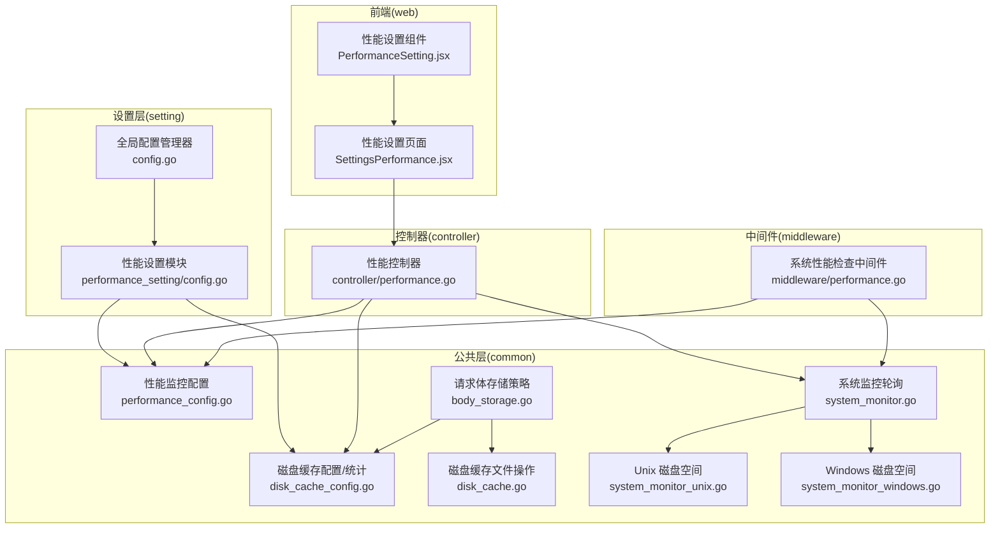
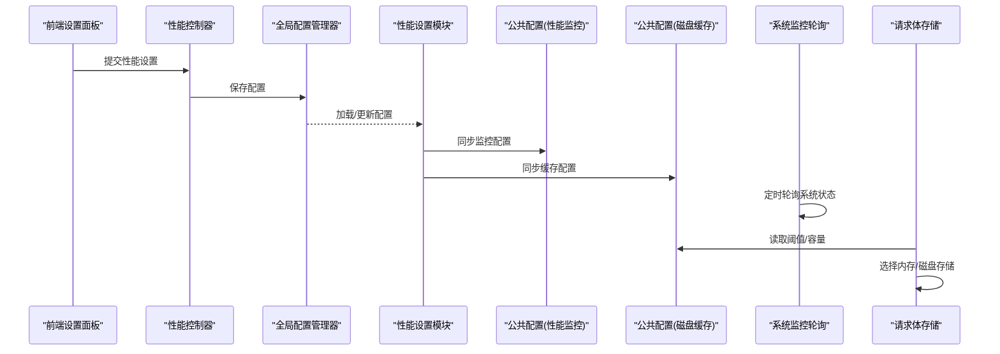
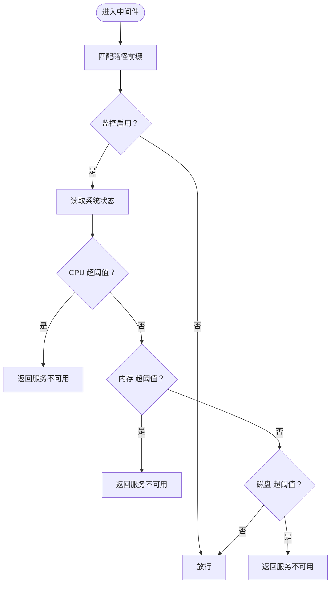
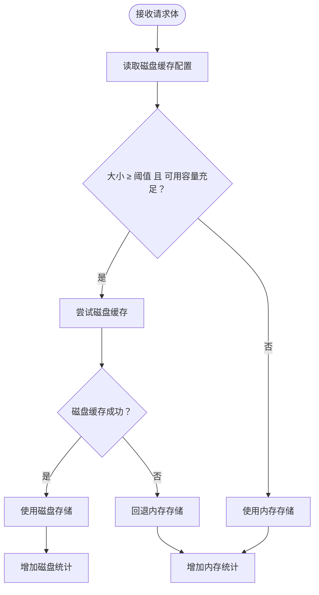
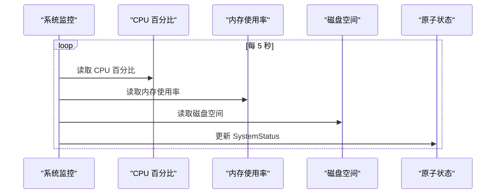
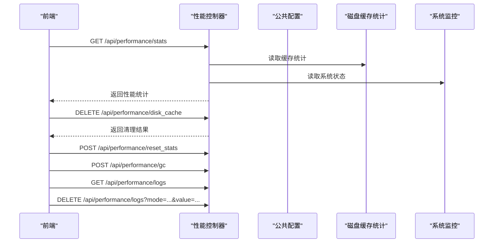
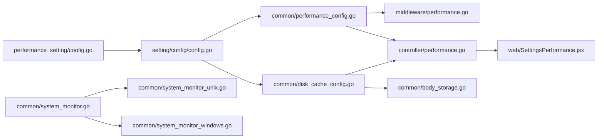

# 性能配置

<cite>
**本文引用的文件**
- [performance_config.go](file://common/performance_config.go)
- [disk_cache_config.go](file://common/disk_cache_config.go)
- [disk_cache.go](file://common/disk_cache.go)
- [system_monitor.go](file://common/system_monitor.go)
- [system_monitor_unix.go](file://common/system_monitor_unix.go)
- [system_monitor_windows.go](file://common/system_monitor_windows.go)
- [body_storage.go](file://common/body_storage.go)
- [config.go](file://setting/config/config.go)
- [config.go](file://setting/performance_setting/config.go)
- [performance.go](file://controller/performance.go)
- [performance.go](file://middleware/performance.go)
- [SettingsPerformance.jsx](file://web/src/pages/Setting/Performance/SettingsPerformance.jsx)
- [PerformanceSetting.jsx](file://web/src/components/settings/PerformanceSetting.jsx)
</cite>

## 目录
1. [简介](#简介)
2. [项目结构](#项目结构)
3. [核心组件](#核心组件)
4. [架构总览](#架构总览)
5. [详细组件分析](#详细组件分析)
6. [依赖分析](#依赖分析)
7. [性能考量](#性能考量)
8. [故障排查指南](#故障排查指南)
9. [结论](#结论)
10. [附录](#附录)

## 简介
本技术文档聚焦于 New API 的性能配置系统，系统性阐述性能监控、资源管理与动态调整机制。重点覆盖以下方面：
- 性能监控配置：CPU/内存/磁盘阈值与中间件拦截策略
- 资源管理策略：磁盘缓存（以磁盘换内存）、缓存统计与清理
- 性能指标采集：系统状态轮询、内存统计、磁盘空间统计
- 阈值与优化：如何通过阈值保护系统稳定，以及磁盘缓存对内存压力的缓解
- 动态调整与监控：配置热更新、管理端接口与前端可视化面板
- 扩展与自定义：如何扩展监控指标与自定义性能监控

## 项目结构
性能配置系统横跨后端 Go 代码与前端 Web 界面，主要分布如下：
- 后端公共层（common）：性能监控配置、磁盘缓存配置与统计、系统状态轮询、请求体存储策略
- 设置层（setting）：全局配置管理器与性能设置模块（performance_setting）
- 控制器（controller）：性能统计与运维操作接口
- 中间件（middleware）：基于阈值的请求拦截
- 前端（web）：性能设置与监控面板

**图表来源**
- [performance_config.go:1-34](file://common/performance_config.go#L1-L34)
- [disk_cache_config.go:1-178](file://common/disk_cache_config.go#L1-L178)
- [disk_cache.go:1-177](file://common/disk_cache.go#L1-L177)
- [system_monitor.go:1-82](file://common/system_monitor.go#L1-L82)
- [system_monitor_unix.go:1-38](file://common/system_monitor_unix.go#L1-L38)
- [system_monitor_windows.go:1-51](file://common/system_monitor_windows.go#L1-L51)
- [body_storage.go:1-316](file://common/body_storage.go#L1-L316)
- [config.go:1-298](file://setting/config/config.go#L1-L298)
- [config.go:1-86](file://setting/performance_setting/config.go#L1-L86)
- [performance.go:1-386](file://controller/performance.go#L1-L386)
- [performance.go:1-72](file://middleware/performance.go#L1-L72)
- [SettingsPerformance.jsx:1-737](file://web/src/pages/Setting/Performance/SettingsPerformance.jsx#L1-L737)
- [PerformanceSetting.jsx:1-81](file://web/src/components/settings/PerformanceSetting.jsx#L1-L81)

**章节来源**
- [performance_config.go:1-34](file://common/performance_config.go#L1-L34)
- [disk_cache_config.go:1-178](file://common/disk_cache_config.go#L1-L178)
- [disk_cache.go:1-177](file://common/disk_cache.go#L1-L177)
- [system_monitor.go:1-82](file://common/system_monitor.go#L1-L82)
- [system_monitor_unix.go:1-38](file://common/system_monitor_unix.go#L1-L38)
- [system_monitor_windows.go:1-51](file://common/system_monitor_windows.go#L1-L51)
- [body_storage.go:1-316](file://common/body_storage.go#L1-L316)
- [config.go:1-298](file://setting/config/config.go#L1-L298)
- [config.go:1-86](file://setting/performance_setting/config.go#L1-L86)
- [performance.go:1-386](file://controller/performance.go#L1-L386)
- [performance.go:1-72](file://middleware/performance.go#L1-L72)
- [SettingsPerformance.jsx:1-737](file://web/src/pages/Setting/Performance/SettingsPerformance.jsx#L1-L737)
- [PerformanceSetting.jsx:1-81](file://web/src/components/settings/PerformanceSetting.jsx#L1-L81)

## 核心组件
- 性能监控配置（PerformanceMonitorConfig）
  - 字段：启用开关、CPU/内存/磁盘阈值
  - 默认值：启用；CPU/内存阈值较高，磁盘阈值略低
  - 线程安全：通过原子值存储与读取
- 磁盘缓存配置与统计（DiskCacheConfig/DiskCacheStats）
  - 字段：启用开关、阈值（MB）、最大容量（MB）、缓存目录
  - 统计：活跃磁盘文件数、当前磁盘使用量、活跃内存缓冲数、当前内存使用量、命中次数、阈值与上限
  - 线程安全：统计使用原子计数器，配置使用互斥锁
- 系统监控轮询（SystemStatus）
  - 定时轮询 CPU/内存/磁盘使用率，缓存到原子值
  - 平台差异：Unix/Linux/macOS 使用 Statfs，Windows 使用 GetDiskFreeSpaceEx
- 请求体存储策略（BodyStorage）
  - 根据大小与阈值自动选择内存或磁盘存储，失败时内存回退
  - 提供磁盘/内存两种实现，统一接口与生命周期管理
- 全局配置管理器（ConfigManager）
  - 注册/导出/导入配置模块，支持从数据库加载与保存
- 性能设置模块（performance_setting）
  - 将性能设置注册到全局配置管理器，并同步到公共层
- 控制器与中间件
  - 控制器：提供性能统计、清理磁盘缓存、重置统计、强制 GC、日志清理等接口
  - 中间件：在特定路径前缀上进行系统性能检查，超过阈值则拒绝请求
- 前端设置面板
  - 提供磁盘缓存与性能监控的配置入口，展示缓存使用、内存统计、磁盘空间与日志信息

**章节来源**
- [performance_config.go:5-33](file://common/performance_config.go#L5-L33)
- [disk_cache_config.go:8-177](file://common/disk_cache_config.go#L8-L177)
- [system_monitor.go:23-81](file://common/system_monitor.go#L23-L81)
- [system_monitor_unix.go:11-37](file://common/system_monitor_unix.go#L11-L37)
- [system_monitor_windows.go:11-50](file://common/system_monitor_windows.go#L11-L50)
- [body_storage.go:13-316](file://common/body_storage.go#L13-L316)
- [config.go:13-298](file://setting/config/config.go#L13-L298)
- [config.go:8-85](file://setting/performance_setting/config.go#L8-L85)
- [performance.go:19-386](file://controller/performance.go#L19-L386)
- [performance.go:13-71](file://middleware/performance.go#L13-L71)
- [SettingsPerformance.jsx:61-737](file://web/src/pages/Setting/Performance/SettingsPerformance.jsx#L61-L737)
- [PerformanceSetting.jsx:25-81](file://web/src/components/settings/PerformanceSetting.jsx#L25-L81)

## 架构总览
性能配置系统的运行流程如下：
- 配置层：performance_setting 将性能设置注册到全局配置管理器，并同步到 common 层的配置与统计
- 监控层：system_monitor 后台定时轮询系统状态，缓存到原子值
- 存储层：body_storage 根据阈值与可用容量选择内存或磁盘存储
- 控制层：controller 提供性能统计与运维接口；middleware 在请求进入时根据阈值进行拦截
- 展示层：前端设置面板读取与提交配置，展示性能统计与日志信息

**图表来源**
- [config.go:41-90](file://setting/config/config.go#L41-L90)
- [config.go:49-75](file://setting/performance_setting/config.go#L49-L75)
- [performance_config.go:25-33](file://common/performance_config.go#L25-L33)
- [disk_cache_config.go:29-41](file://common/disk_cache_config.go#L29-L41)
- [system_monitor.go:36-76](file://common/system_monitor.go#L36-L76)
- [body_storage.go:240-303](file://common/body_storage.go#L240-L303)

## 详细组件分析

### 性能监控配置与中间件拦截
- 配置结构：包含启用开关与 CPU/内存/磁盘阈值
- 默认行为：启用监控，阈值偏保守，避免误杀
- 中间件逻辑：对特定路径前缀进行拦截，读取当前系统状态，若任一指标超阈值则返回服务不可用错误并终止请求
- 适用场景：Relay 接口的稳定性保护，防止系统过载

**图表来源**
- [performance.go:13-71](file://middleware/performance.go#L13-L71)
- [system_monitor.go:78-81](file://common/system_monitor.go#L78-L81)

**章节来源**
- [performance_config.go:5-33](file://common/performance_config.go#L5-L33)
- [performance.go:13-71](file://middleware/performance.go#L13-L71)
- [system_monitor.go:36-81](file://common/system_monitor.go#L36-L81)

### 磁盘缓存配置与请求体存储策略
- 配置项：启用开关、阈值（MB）、最大容量（MB）、缓存目录
- 存储策略：当请求体大小超过阈值且可用容量允许时，优先使用磁盘缓存；失败时回退到内存
- 统计与清理：活跃文件数、当前使用量、命中次数；支持清理不活跃缓存文件与重置统计
- 平台差异：磁盘空间统计在 Unix 与 Windows 下分别实现

**图表来源**
- [body_storage.go:240-303](file://common/body_storage.go#L240-L303)
- [disk_cache_config.go:169-177](file://common/disk_cache_config.go#L169-L177)
- [disk_cache.go:166-177](file://common/disk_cache.go#L166-L177)

**章节来源**
- [config.go:8-40](file://setting/performance_setting/config.go#L8-L40)
- [disk_cache_config.go:8-177](file://common/disk_cache_config.go#L8-L177)
- [disk_cache.go:1-177](file://common/disk_cache.go#L1-L177)
- [body_storage.go:1-316](file://common/body_storage.go#L1-L316)
- [system_monitor_unix.go:11-37](file://common/system_monitor_unix.go#L11-L37)
- [system_monitor_windows.go:11-50](file://common/system_monitor_windows.go#L11-L50)

### 系统监控轮询与磁盘空间统计
- 轮询策略：后台 goroutine 每 5 秒读取一次 CPU/内存/磁盘使用率，缓存到原子值
- 磁盘空间：根据缓存目录路径获取磁盘空间信息（平台差异实现）
- 用途：中间件与控制器均依赖该缓存值，避免频繁系统调用

**图表来源**
- [system_monitor.go:36-76](file://common/system_monitor.go#L36-L76)
- [system_monitor_unix.go:11-37](file://common/system_monitor_unix.go#L11-L37)
- [system_monitor_windows.go:11-50](file://common/system_monitor_windows.go#L11-L50)

**章节来源**
- [system_monitor.go:1-82](file://common/system_monitor.go#L1-L82)
- [system_monitor_unix.go:1-38](file://common/system_monitor_unix.go#L1-L38)
- [system_monitor_windows.go:1-51](file://common/system_monitor_windows.go#L1-L51)

### 控制器与前端性能面板
- 控制器接口：
  - 获取性能统计：包含缓存统计、内存统计、磁盘缓存目录信息、磁盘空间信息与配置信息
  - 清理不活跃磁盘缓存、重置统计、强制 GC
  - 日志文件列表与清理（按数量或天数）
- 前端设置面板：
  - 提供磁盘缓存与性能监控配置项
  - 实时展示缓存使用、内存统计、磁盘空间与日志信息
  - 支持保存配置、刷新统计、清理缓存、重置统计、执行 GC、清理日志

**图表来源**
- [performance.go:82-386](file://controller/performance.go#L82-L386)
- [SettingsPerformance.jsx:125-238](file://web/src/pages/Setting/Performance/SettingsPerformance.jsx#L125-L238)

**章节来源**
- [performance.go:1-386](file://controller/performance.go#L1-L386)
- [SettingsPerformance.jsx:1-737](file://web/src/pages/Setting/Performance/SettingsPerformance.jsx#L1-L737)
- [PerformanceSetting.jsx:1-81](file://web/src/components/settings/PerformanceSetting.jsx#L1-L81)

## 依赖分析
- 组件耦合
  - performance_setting 依赖 setting/config 的全局配置管理器，负责将性能设置同步到 common 层
  - common 层的磁盘缓存与性能监控配置被 controller、middleware 与前端共同依赖
  - system_monitor 依赖第三方库获取 CPU/内存使用率，并根据平台差异实现磁盘空间统计
- 外部依赖
  - gopsutil：CPU/内存使用率采集
  - 平台 API：Unix 的 Statfs、Windows 的 GetDiskFreeSpaceEx
- 循环依赖
  - 未发现循环依赖；各模块职责清晰，通过公共层进行解耦

**图表来源**
- [config.go:1-298](file://setting/config/config.go#L1-L298)
- [config.go:1-86](file://setting/performance_setting/config.go#L1-L86)
- [performance_config.go:1-34](file://common/performance_config.go#L1-L34)
- [disk_cache_config.go:1-178](file://common/disk_cache_config.go#L1-L178)
- [system_monitor.go:1-82](file://common/system_monitor.go#L1-L82)
- [system_monitor_unix.go:1-38](file://common/system_monitor_unix.go#L1-L38)
- [system_monitor_windows.go:1-51](file://common/system_monitor_windows.go#L1-L51)
- [body_storage.go:1-316](file://common/body_storage.go#L1-L316)
- [performance.go:1-72](file://middleware/performance.go#L1-L72)
- [performance.go:1-386](file://controller/performance.go#L1-L386)
- [SettingsPerformance.jsx:1-737](file://web/src/pages/Setting/Performance/SettingsPerformance.jsx#L1-L737)

**章节来源**
- [config.go:1-298](file://setting/config/config.go#L1-L298)
- [config.go:1-86](file://setting/performance_setting/config.go#L1-L86)
- [performance_config.go:1-34](file://common/performance_config.go#L1-L34)
- [disk_cache_config.go:1-178](file://common/disk_cache_config.go#L1-L178)
- [system_monitor.go:1-82](file://common/system_monitor.go#L1-L82)
- [system_monitor_unix.go:1-38](file://common/system_monitor_unix.go#L1-L38)
- [system_monitor_windows.go:1-51](file://common/system_monitor_windows.go#L1-L51)
- [body_storage.go:1-316](file://common/body_storage.go#L1-L316)
- [performance.go:1-72](file://middleware/performance.go#L1-L72)
- [performance.go:1-386](file://controller/performance.go#L1-L386)
- [SettingsPerformance.jsx:1-737](file://web/src/pages/Setting/Performance/SettingsPerformance.jsx#L1-L737)

## 性能考量
- 监控轮询频率与开销
  - 系统监控每 5 秒轮询一次，CPU 百分比首次调用可能不稳定，但后续会趋于稳定
  - 建议在高负载场景下适当提高轮询间隔，减少系统调用频率
- 磁盘缓存对内存压力的缓解
  - 通过阈值与最大容量限制，避免大请求导致内存峰值过高
  - 建议在 SSD 环境下启用磁盘缓存，提升 IO 性能
- 统计与清理
  - 缓存统计采用原子计数器，避免锁竞争
  - 支持清理不活跃缓存文件与重置统计，便于运维与容量规划
- 中间件拦截策略
  - 对特定路径前缀进行拦截，避免对非 Relay 接口产生影响
  - 阈值设置应结合业务流量与硬件配置进行调优

[本节为通用性能讨论，不直接分析具体文件]

## 故障排查指南
- 系统过载拦截
  - 现象：请求返回服务不可用，提示 CPU/内存/磁盘超阈值
  - 排查：查看系统监控轮询状态与阈值配置，确认是否误报或阈值过低
- 磁盘缓存异常
  - 现象：磁盘缓存创建失败，回退到内存存储
  - 排查：检查缓存目录权限、磁盘空间与可用容量，确认阈值与最大容量设置合理
- 统计不一致
  - 现象：缓存统计与实际磁盘占用不一致
  - 排查：使用“同步统计”或“重置统计”接口修正，必要时手动清理缓存目录
- 前端设置无法保存
  - 现象：保存失败或未生效
  - 排查：确认全局配置管理器已正确加载配置，检查网络与权限

**章节来源**
- [performance.go:40-71](file://middleware/performance.go#L40-L71)
- [body_storage.go:240-303](file://common/body_storage.go#L240-L303)
- [disk_cache_config.go:158-167](file://common/disk_cache_config.go#L158-L167)
- [performance.go:142-176](file://controller/performance.go#L142-L176)

## 结论
New API 的性能配置系统通过“配置层 → 监控层 → 存储层 → 控制层 → 展示层”的完整链路，实现了对 CPU/内存/磁盘的动态监控与保护，并通过磁盘缓存有效缓解内存压力。系统具备良好的线程安全与平台兼容性，配合前端可视化面板与运维接口，能够满足生产环境下的性能治理需求。

[本节为总结性内容，不直接分析具体文件]

## 附录

### 参数说明与调优指南
- 性能监控配置
  - 字段：启用开关、CPU/内存/磁盘阈值
  - 建议：CPU/内存阈值可设为 80%-90%，磁盘阈值略低以预留空间
- 磁盘缓存配置
  - 字段：启用开关、阈值（MB）、最大容量（MB）、缓存目录
  - 建议：阈值根据平均请求体大小设置，最大容量不超过磁盘可用空间的 50%
- 调优步骤
  - 通过前端面板观察缓存命中率与内存使用趋势
  - 逐步降低阈值或增大最大容量，观察系统稳定性与资源占用
  - 在高并发场景下适当提高监控轮询间隔，减少系统调用

**章节来源**
- [config.go:8-40](file://setting/performance_setting/config.go#L8-L40)
- [performance_config.go:5-33](file://common/performance_config.go#L5-L33)
- [SettingsPerformance.jsx:257-399](file://web/src/pages/Setting/Performance/SettingsPerformance.jsx#L257-L399)

### 动态调整与配置效果监控
- 动态调整
  - 通过前端面板保存配置，performance_setting 自动同步到 common 层
  - 配置变更立即生效，无需重启服务
- 效果监控
  - 使用性能统计接口查看缓存使用、内存统计与磁盘空间
  - 定期清理不活跃缓存与日志，维持系统健康状态

**章节来源**
- [config.go:41-90](file://setting/config/config.go#L41-L90)
- [config.go:49-75](file://setting/performance_setting/config.go#L49-L75)
- [performance.go:82-176](file://controller/performance.go#L82-L176)
- [SettingsPerformance.jsx:125-238](file://web/src/pages/Setting/Performance/SettingsPerformance.jsx#L125-L238)

### 扩展与自定义
- 扩展监控指标
  - 在 common 层新增指标结构与采集逻辑，更新 system_monitor 与控制器输出
- 自定义性能监控指标
  - 在 controller 层新增接口，聚合业务指标并与系统指标联动
- 前端扩展
  - 在 SettingsPerformance.jsx 中新增表单项与展示区域，支持更多配置与可视化

**章节来源**
- [system_monitor.go:23-81](file://common/system_monitor.go#L23-L81)
- [performance.go:19-140](file://controller/performance.go#L19-L140)
- [SettingsPerformance.jsx:61-737](file://web/src/pages/Setting/Performance/SettingsPerformance.jsx#L61-L737)