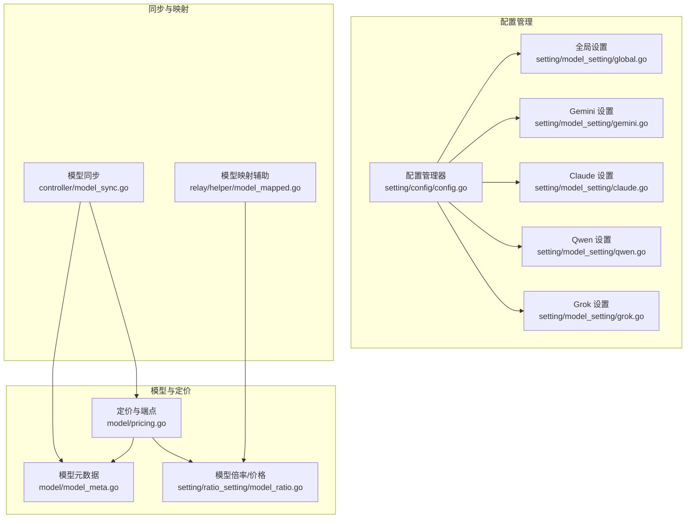
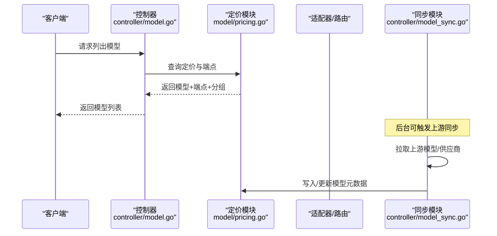
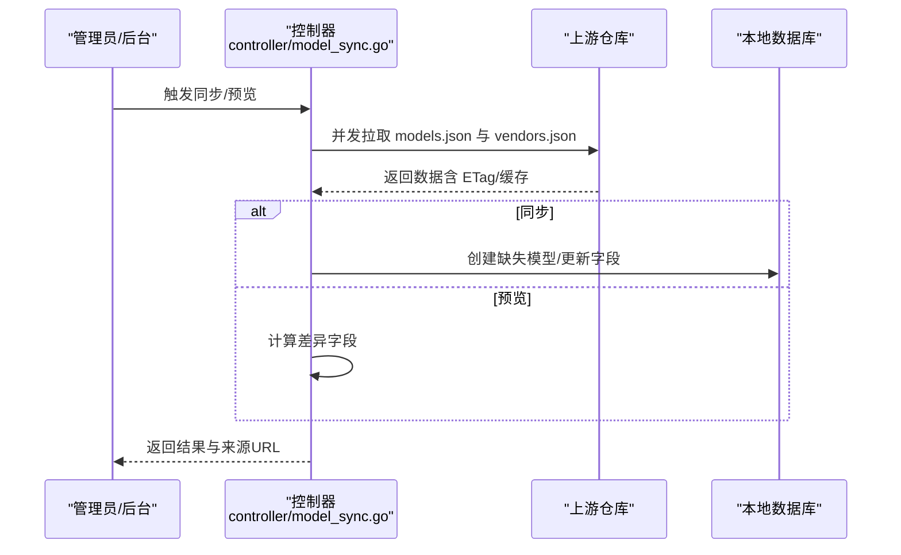
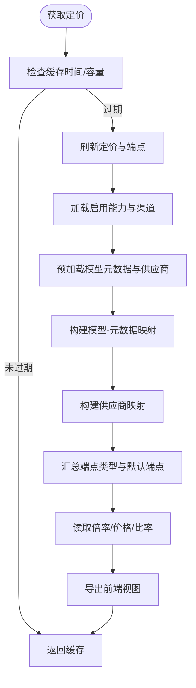
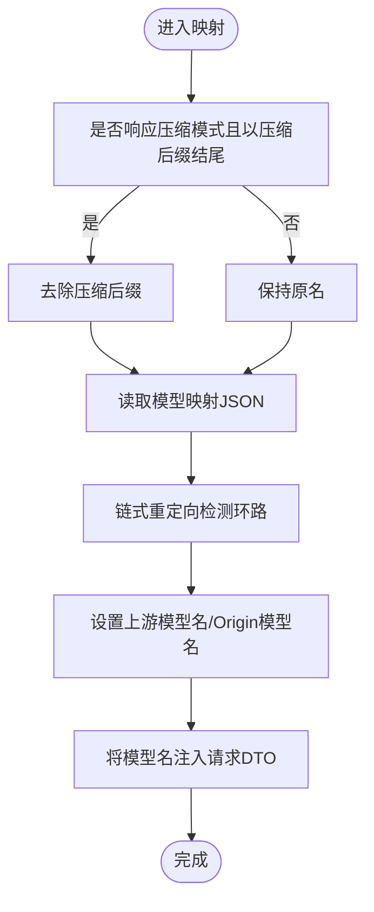
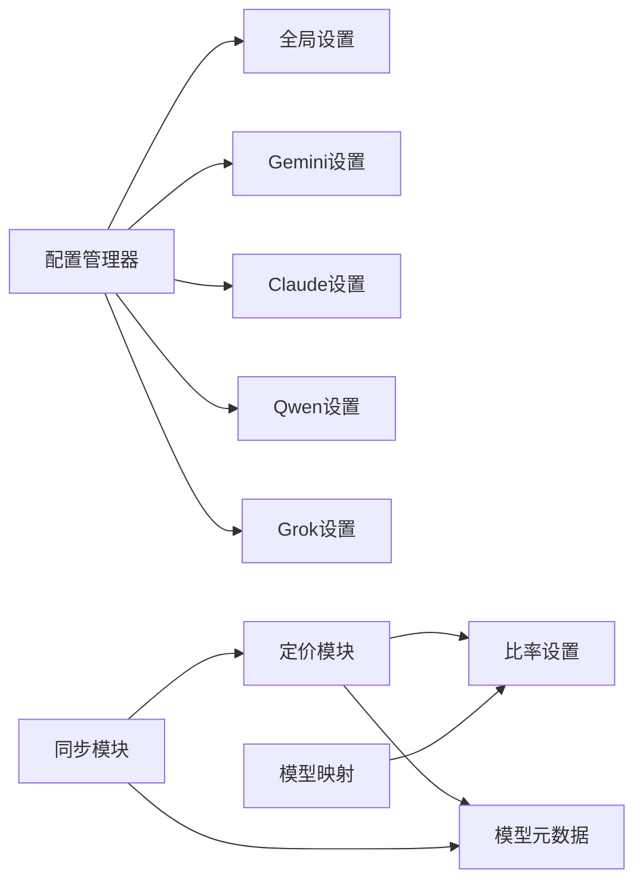

# 模型配置

<cite>
**本文档引用的文件**
- [setting/model_setting/global.go](file://setting/model_setting/global.go)
- [setting/model_setting/gemini.go](file://setting/model_setting/gemini.go)
- [setting/model_setting/claude.go](file://setting/model_setting/claude.go)
- [setting/model_setting/qwen.go](file://setting/model_setting/qwen.go)
- [setting/model_setting/grok.go](file://setting/model_setting/grok.go)
- [setting/config/config.go](file://setting/config/config.go)
- [controller/model_sync.go](file://controller/model_sync.go)
- [model/pricing.go](file://model/pricing.go)
- [relay/helper/model_mapped.go](file://relay/helper/model_mapped.go)
- [dto/openai_request.go](file://dto/openai_request.go)
- [model/model_meta.go](file://model/model_meta.go)
- [controller/model.go](file://controller/model.go)
- [setting/ratio_setting/model_ratio.go](file://setting/ratio_setting/model_ratio.go)
- [setting/console_setting/validation.go](file://setting/console_setting/validation.go)
</cite>

## 目录
1. [简介](#简介)
2. [项目结构](#项目结构)
3. [核心组件](#核心组件)
4. [架构总览](#架构总览)
5. [详细组件分析](#详细组件分析)
6. [依赖分析](#依赖分析)
7. [性能考虑](#性能考虑)
8. [故障排查指南](#故障排查指南)
9. [结论](#结论)
10. [附录](#附录)

## 简介
本文件面向 New API 的模型配置系统，系统性阐述模型设置的层次结构与工作机制，包括：
- 全局模型配置（PassThroughRequestEnabled、ThinkingModelBlacklist、ChatCompletionsToResponses 策略）
- 特定厂商模型配置（Gemini 安全与版本策略、Claude 请求头与默认 MaxTokens、Qwen 图像模型同步、Grok 违规扣费）
- 模型映射机制与响应压缩适配
- 价格配置与行为规则（倍率/价格、端点类型、音频/图像比率）
- 模型启用/禁用控制、参数覆盖与兼容性处理
- 模型同步机制、配置验证与错误恢复策略
- 模型扩展指南与自定义模型配置开发方法

## 项目结构
New API 的模型配置体系由“配置管理器 + 各厂商模型设置 + 模型同步 + 价格与端点规则 + 请求映射”构成，采用模块化注册与统一导出/导入的配置管理方式。



图示来源
- [setting/config/config.go:13-298](file://setting/config/config.go#L13-L298)
- [setting/model_setting/global.go:35-80](file://setting/model_setting/global.go#L35-L80)
- [setting/model_setting/gemini.go:8-77](file://setting/model_setting/gemini.go#L8-L77)
- [setting/model_setting/claude.go:17-90](file://setting/model_setting/claude.go#L17-L90)
- [setting/model_setting/qwen.go:10-52](file://setting/model_setting/qwen.go#L10-L52)
- [setting/model_setting/grok.go:6-25](file://setting/model_setting/grok.go#L6-L25)
- [model/pricing.go:17-347](file://model/pricing.go#L17-L347)
- [model/model_meta.go:23-161](file://model/model_meta.go#L23-L161)
- [setting/ratio_setting/model_ratio.go:18-735](file://setting/ratio_setting/model_ratio.go#L18-L735)
- [controller/model_sync.go:265-469](file://controller/model_sync.go#L265-L469)
- [relay/helper/model_mapped.go:16-82](file://relay/helper/model_mapped.go#L16-L82)

章节来源
- [setting/config/config.go:13-298](file://setting/config/config.go#L13-L298)
- [controller/model_sync.go:265-469](file://controller/model_sync.go#L265-L469)
- [model/pricing.go:17-347](file://model/pricing.go#L17-L347)
- [relay/helper/model_mapped.go:16-82](file://relay/helper/model_mapped.go#L16-L82)

## 核心组件
- 配置管理器（ConfigManager）
  - 提供注册、读取、从数据库加载、保存到数据库、导出全部配置等能力
  - 通过反射实现结构体与键值映射的序列化/反序列化
- 全局模型设置（GlobalSettings）
  - PassThroughRequestEnabled：是否透传请求
  - ThinkingModelBlacklist：思考类模型黑名单（保留 thinking/-nothinking/-low/-high/-medium 后缀）
  - ChatCompletionsToResponsesPolicy：聊天转响应策略（按通道/类型/模式匹配）
- 厂商模型设置
  - Gemini：安全策略、版本策略、图像模型支持、思考适配器、函数调用签名等
  - Claude：请求头合并、默认 MaxTokens、思考适配器
  - Qwen：图像模型同步白名单
  - Grok：违规扣费开关与金额
- 模型同步（SyncUpstreamModels/SyncUpstreamPreview）
  - 从上游拉取模型与供应商元数据，增量创建或可选覆盖
  - 支持 ETag 缓存、重试、超时、IPv4/IPv6 回退
- 定价与端点（Pricing）
  - 汇总模型启用分组、端点类型、供应商信息
  - 依据倍率/价格与比率设置生成前端可用的定价视图
- 模型映射（ModelMappedHelper）
  - 支持链式模型重定向，避免环路，兼容响应压缩模式

章节来源
- [setting/config/config.go:13-298](file://setting/config/config.go#L13-L298)
- [setting/model_setting/global.go:35-80](file://setting/model_setting/global.go#L35-L80)
- [setting/model_setting/gemini.go:8-77](file://setting/model_setting/gemini.go#L8-L77)
- [setting/model_setting/claude.go:17-90](file://setting/model_setting/claude.go#L17-L90)
- [setting/model_setting/qwen.go:10-52](file://setting/model_setting/qwen.go#L10-L52)
- [setting/model_setting/grok.go:6-25](file://setting/model_setting/grok.go#L6-L25)
- [controller/model_sync.go:265-469](file://controller/model_sync.go#L265-L469)
- [model/pricing.go:17-347](file://model/pricing.go#L17-L347)
- [relay/helper/model_mapped.go:16-82](file://relay/helper/model_mapped.go#L16-L82)

## 架构总览
New API 的模型配置系统采用“配置中心 + 厂商适配 + 同步与映射 + 定价与端点”的分层设计。配置管理器负责集中注册与持久化；各厂商设置模块提供差异化行为；同步模块负责与上游保持一致；定价模块负责消费侧展示与计费；映射模块负责请求转发前的模型名转换。



图示来源
- [controller/model.go:112-241](file://controller/model.go#L112-L241)
- [model/pricing.go:63-104](file://model/pricing.go#L63-L104)
- [controller/model_sync.go:265-469](file://controller/model_sync.go#L265-L469)

## 详细组件分析

### 配置管理器（ConfigManager）
- 注册机制：init 中各模块将自身设置注册到全局配置管理器
- 数据持久化：LoadFromDB/SaveToDB 支持从数据库读取/写回配置
- 类型安全：通过反射与 JSON 序列化处理复杂类型（map/slice/struct），并兼容数值字符串

```mermaid
classDiagram
class ConfigManager {
+Register(name, config)
+Get(name) interface{}
+LoadFromDB(options) error
+SaveToDB(updateFunc) error
+ExportAllConfigs() map[string]string
}
class GlobalSettings {
+PassThroughRequestEnabled bool
+ThinkingModelBlacklist []string
+ChatCompletionsToResponsesPolicy
}
class GeminiSettings {
+SafetySettings map[string]string
+VersionSettings map[string]string
+SupportedImagineModels []string
+ThinkingAdapterEnabled bool
}
class ClaudeSettings {
+HeadersSettings map[string]map[string][]string
+DefaultMaxTokens map[string]int
+WriteHeaders(originModel, httpHeader)
+GetDefaultMaxTokens(model) int
}
class QwenSettings {
+SyncImageModels []string
+IsSyncImageModel(model) bool
}
class GrokSettings {
+ViolationDeductionEnabled bool
+ViolationDeductionAmount float64
}
ConfigManager --> GlobalSettings : "注册"
ConfigManager --> GeminiSettings : "注册"
ConfigManager --> ClaudeSettings : "注册"
ConfigManager --> QwenSettings : "注册"
ConfigManager --> GrokSettings : "注册"
```

图示来源
- [setting/config/config.go:13-298](file://setting/config/config.go#L13-L298)
- [setting/model_setting/global.go:35-80](file://setting/model_setting/global.go#L35-L80)
- [setting/model_setting/gemini.go:8-77](file://setting/model_setting/gemini.go#L8-L77)
- [setting/model_setting/claude.go:17-90](file://setting/model_setting/claude.go#L17-L90)
- [setting/model_setting/qwen.go:10-52](file://setting/model_setting/qwen.go#L10-L52)
- [setting/model_setting/grok.go:6-25](file://setting/model_setting/grok.go#L6-L25)

章节来源
- [setting/config/config.go:13-298](file://setting/config/config.go#L13-L298)

### 全局模型设置（GlobalSettings）
- PassThroughRequestEnabled：影响请求透传策略
- ThinkingModelBlacklist：用于判断是否保留模型名中的 thinking/-nothinking/-low/-high/-medium 后缀
- ChatCompletionsToResponsesPolicy：按通道/类型/模式匹配决定是否启用聊天转响应

章节来源
- [setting/model_setting/global.go:35-80](file://setting/model_setting/global.go#L35-L80)

### 厂商模型设置

#### Gemini 设置（GeminiSettings）
- SafetySettings/VersionSettings：按模型键或默认键选择安全级别与 API 版本
- SupportedImagineModels：图像生成模型白名单
- ThinkingAdapterEnabled/BudgetTokensPercentage：思考适配器开关与预算占比
- FunctionCallThoughtSignatureEnabled/RemoveFunctionResponseIdEnabled：函数调用行为控制

章节来源
- [setting/model_setting/gemini.go:8-77](file://setting/model_setting/gemini.go#L8-L77)

#### Claude 设置（ClaudeSettings）
- HeadersSettings：按模型键合并 HTTP 请求头，去重与规范化
- DefaultMaxTokens：默认最大输出令牌数，支持“default”键兜底
- 思考适配器与预算占比

章节来源
- [setting/model_setting/claude.go:17-90](file://setting/model_setting/claude.go#L17-L90)

#### Qwen 设置（QwenSettings）
- SyncImageModels：图像相关模型同步白名单
- IsSyncImageModel：判断模型是否属于同步范围

章节来源
- [setting/model_setting/qwen.go:10-52](file://setting/model_setting/qwen.go#L10-L52)

#### Grok 设置（GrokSettings）
- ViolationDeductionEnabled/ViolationDeductionAmount：违规扣费策略

章节来源
- [setting/model_setting/grok.go:6-25](file://setting/model_setting/grok.go#L6-L25)

### 模型同步机制（SyncUpstreamModels/SyncUpstreamPreview）
- 并发拉取上游模型与供应商，支持 ETag 条件请求与缓存
- 仅创建缺失模型，可选覆盖已有模型字段（描述、图标、标签、供应商、命名规则、状态）
- 预览模式计算本地与上游的差异字段，便于人工确认



图示来源
- [controller/model_sync.go:265-469](file://controller/model_sync.go#L265-L469)
- [controller/model_sync.go:498-634](file://controller/model_sync.go#L498-L634)

章节来源
- [controller/model_sync.go:265-469](file://controller/model_sync.go#L265-L469)
- [controller/model_sync.go:498-634](file://controller/model_sync.go#L498-L634)

### 定价与端点（Pricing）
- 定价来源：优先使用价格（billing mode=price），否则使用倍率（billing mode=ratio）
- 端点类型：基于渠道能力与模型自定义端点覆盖
- 供应商映射：构建前端友好供应商列表
- 缓存：1 分钟内复用，高并发读取



图示来源
- [model/pricing.go:63-341](file://model/pricing.go#L63-L341)

章节来源
- [model/pricing.go:63-341](file://model/pricing.go#L63-L341)

### 模型映射与响应压缩适配（ModelMappedHelper）
- 支持链式模型重定向，检测环路并报错
- 在响应压缩模式下，自动为上游模型名附加/剥离压缩后缀
- 将最终上游模型名注入请求 DTO



图示来源
- [relay/helper/model_mapped.go:16-82](file://relay/helper/model_mapped.go#L16-L82)

章节来源
- [relay/helper/model_mapped.go:16-82](file://relay/helper/model_mapped.go#L16-L82)

### 价格配置与行为规则（倍率/价格/端点）
- 倍率/价格映射：默认值覆盖与动态更新，支持 JSON 字符串导入
- 端点类型：按渠道能力与模型自定义端点覆盖
- 音频/图像比率：独立配置与条件判断
- 思考预算模型归一：对 gemini-2.5 系列与 gpt-4-gizmo 等进行通配处理

章节来源
- [setting/ratio_setting/model_ratio.go:18-735](file://setting/ratio_setting/model_ratio.go#L18-L735)
- [model/pricing.go:205-274](file://model/pricing.go#L205-L274)

### 模型启用/禁用控制、参数覆盖与兼容性
- 模型启用/禁用：Status 字段控制，定价模块过滤禁用模型
- 命名规则：精确/前缀/包含/后缀，用于模型匹配与端点覆盖
- 参数覆盖：模型自定义端点覆盖默认端点，支持 path/method
- 兼容性：当上游缺失或本地禁用官方同步时跳过覆盖

章节来源
- [model/model_meta.go:11-44](file://model/model_meta.go#L11-L44)
- [controller/model_sync.go:393-451](file://controller/model_sync.go#L393-L451)
- [model/pricing.go:237-274](file://model/pricing.go#L237-L274)

### 配置验证与错误恢复
- 控制台设置验证：URL 格式、危险内容、长度限制、颜色合法性等
- 模型映射校验：前端提示缺失模型，支持自动补齐
- 同步错误处理：重试、超时、缓存命中、ETag 304

章节来源
- [setting/console_setting/validation.go:62-305](file://setting/console_setting/validation.go#L62-L305)
- [controller/model_sync.go:133-235](file://controller/model_sync.go#L133-L235)

## 依赖分析
- 配置模块间耦合度低，通过 ConfigManager 解耦
- 厂商设置模块独立，仅依赖配置管理器注册
- 定价模块依赖渠道能力、模型元数据与比率设置
- 同步模块依赖数据库与上游服务，具备缓存与重试机制
- 映射模块依赖比率设置的压缩后缀常量



图示来源
- [setting/config/config.go:13-298](file://setting/config/config.go#L13-L298)
- [model/pricing.go:17-347](file://model/pricing.go#L17-L347)
- [controller/model_sync.go:265-469](file://controller/model_sync.go#L265-L469)
- [relay/helper/model_mapped.go:16-82](file://relay/helper/model_mapped.go#L16-L82)

章节来源
- [setting/config/config.go:13-298](file://setting/config/config.go#L13-L298)
- [model/pricing.go:17-347](file://model/pricing.go#L17-L347)
- [controller/model_sync.go:265-469](file://controller/model_sync.go#L265-L469)
- [relay/helper/model_mapped.go:16-82](file://relay/helper/model_mapped.go#L16-L82)

## 性能考虑
- 定价缓存：1 分钟内复用，降低高并发下的数据库与计算压力
- 同步缓存：ETag 与内存缓存，减少上游请求与解析开销
- 反射序列化：仅在配置导入/导出时使用，避免运行时频繁反射
- 端点映射：默认端点与自定义端点合并，避免重复扫描

## 故障排查指南
- 模型映射循环：出现环路将直接报错，检查 model_mapping JSON 键值链
- 透传请求异常：检查全局设置中的 PassThroughRequestEnabled
- Claude 请求头缺失：确认 HeadersSettings 中是否存在对应模型键
- Qwen 图像模型未同步：确认模型名是否在 SyncImageModels 白名单中
- 定价未显示：检查模型是否启用、状态是否为 1，以及倍率/价格是否配置
- 同步失败：查看上游 URL、网络环境、ETag 缓存与重试日志

章节来源
- [relay/helper/model_mapped.go:44-56](file://relay/helper/model_mapped.go#L44-L56)
- [setting/model_setting/global.go:36-43](file://setting/model_setting/global.go#L36-L43)
- [setting/model_setting/claude.go:51-63](file://setting/model_setting/claude.go#L51-L63)
- [setting/model_setting/qwen.go:44-51](file://setting/model_setting/qwen.go#L44-L51)
- [model/pricing.go:286-289](file://model/pricing.go#L286-L289)
- [controller/model_sync.go:133-235](file://controller/model_sync.go#L133-L235)

## 结论
New API 的模型配置系统通过统一的配置管理器与模块化厂商设置，实现了灵活的全局与局部配置能力；结合模型同步、定价与端点规则、映射与压缩适配，满足多厂商、多场景的模型管理需求。建议在生产环境中：
- 使用配置管理器进行集中治理与持久化
- 通过同步模块定期与上游保持一致
- 严格校验模型映射与控制台设置
- 基于倍率/价格策略与端点覆盖实现精细化运营

## 附录

### 配置层次与字段说明
- 全局设置（GlobalSettings）
  - PassThroughRequestEnabled：布尔，是否透传请求
  - ThinkingModelBlacklist：字符串数组，保留思考后缀的模型名
  - ChatCompletionsToResponsesPolicy：结构体，按通道/类型/模式启用策略
- Gemini 设置（GeminiSettings）
  - safety_settings：映射，按模型键或默认键选择安全级别
  - version_settings：映射，按模型键或默认键选择 API 版本
  - supported_imagine_models：字符串数组，图像生成模型白名单
  - thinking_adapter_enabled：布尔，开启思考适配器
  - thinking_adapter_budget_tokens_percentage：浮点，预算占比
  - function_call_thought_signature_enabled：布尔，函数调用签名
  - remove_function_response_id_enabled：布尔，移除函数响应 ID
- Claude 设置（ClaudeSettings）
  - model_headers_settings：嵌套映射，按模型键合并请求头
  - default_max_tokens：映射，按模型键或默认键设置最大输出令牌
  - thinking_adapter_enabled：布尔，开启思考适配器
  - thinking_adapter_budget_tokens_percentage：浮点，预算占比
- Qwen 设置（QwenSettings）
  - sync_image_models：字符串数组，图像相关模型同步白名单
- Grok 设置（GrokSettings）
  - violation_deduction_enabled：布尔，违规扣费开关
  - violation_deduction_amount：浮点，违规扣费金额

章节来源
- [setting/model_setting/global.go:35-80](file://setting/model_setting/global.go#L35-L80)
- [setting/model_setting/gemini.go:8-77](file://setting/model_setting/gemini.go#L8-L77)
- [setting/model_setting/claude.go:17-90](file://setting/model_setting/claude.go#L17-L90)
- [setting/model_setting/qwen.go:10-52](file://setting/model_setting/qwen.go#L10-L52)
- [setting/model_setting/grok.go:6-25](file://setting/model_setting/grok.go#L6-L25)

### 模型同步流程（概要）
- 仅创建缺失模型，避免覆盖本地已配置项
- 可选覆盖字段：描述、图标、标签、供应商、命名规则、状态
- 预览模式：计算本地与上游差异，便于人工确认

章节来源
- [controller/model_sync.go:265-469](file://controller/model_sync.go#L265-L469)
- [controller/model_sync.go:498-634](file://controller/model_sync.go#L498-L634)

### 配置验证要点
- 控制台设置（API信息/公告/FAQ/UptimeKuma分组）：URL 格式、长度、颜色、危险内容
- 模型映射：JSON 格式、键值有效性、缺失模型提示

章节来源
- [setting/console_setting/validation.go:62-305](file://setting/console_setting/validation.go#L62-L305)