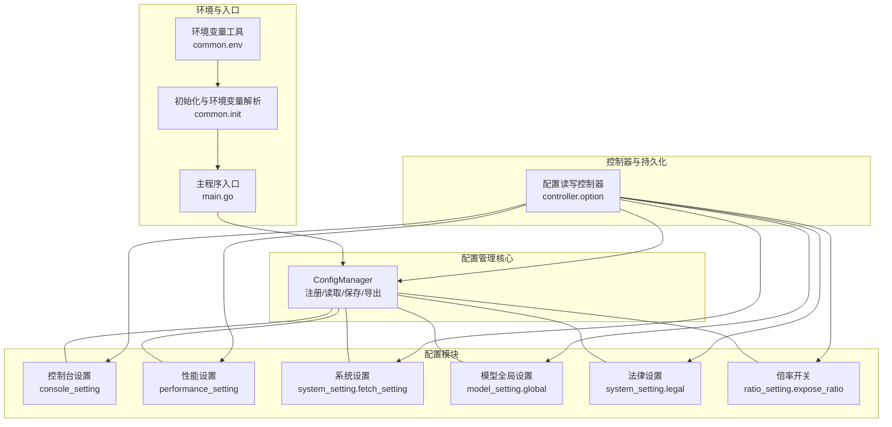
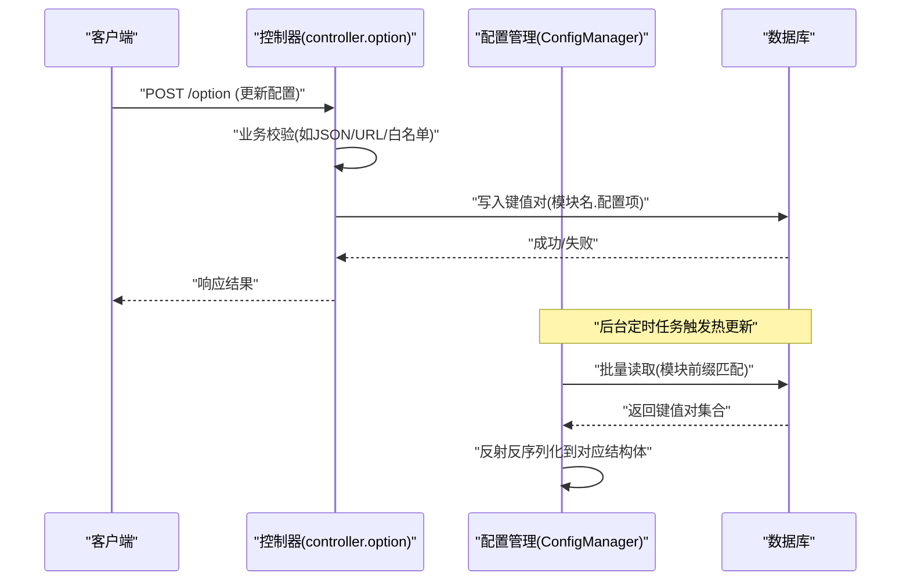
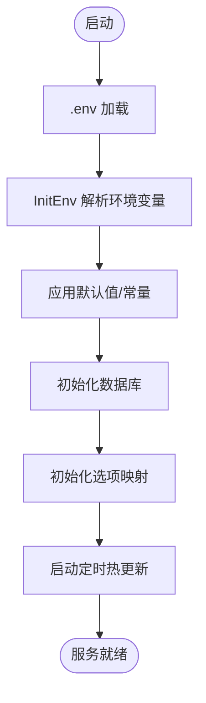
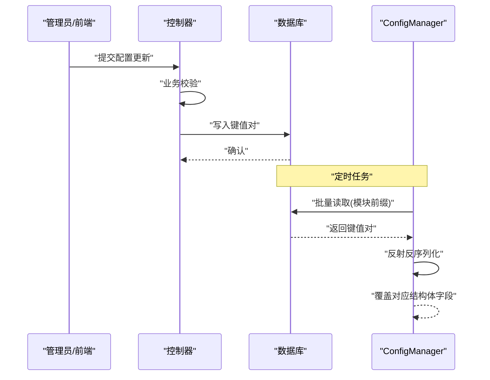
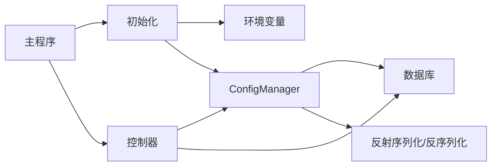

# 系统配置

<cite>
**本文引用的文件**
- [setting/config/config.go](file://setting/config/config.go)
- [common/env.go](file://common/env.go)
- [common/init.go](file://common/init.go)
- [controller/option.go](file://controller/option.go)
- [setting/console_setting/config.go](file://setting/console_setting/config.go)
- [setting/console_setting/validation.go](file://setting/console_setting/validation.go)
- [setting/performance_setting/config.go](file://setting/performance_setting/config.go)
- [setting/system_setting/fetch_setting.go](file://setting/system_setting/fetch_setting.go)
- [setting/system_setting/legal.go](file://setting/system_setting/legal.go)
- [setting/model_setting/global.go](file://setting/model_setting/global.go)
- [setting/ratio_setting/expose_ratio.go](file://setting/ratio_setting/expose_ratio.go)
- [main.go](file://main.go)
</cite>

## 目录
1. [简介](#简介)
2. [项目结构](#项目结构)
3. [核心组件](#核心组件)
4. [架构总览](#架构总览)
5. [详细组件分析](#详细组件分析)
6. [依赖分析](#依赖分析)
7. [性能考量](#性能考量)
8. [故障排查指南](#故障排查指南)
9. [结论](#结论)
10. [附录](#附录)

## 简介
本文件面向 New API 的系统配置模块，围绕 ConfigManager 的设计与实现展开，系统性阐述配置注册、加载、保存与导出机制；解析环境变量管理、配置文件解析与动态配置更新流程；覆盖配置优先级处理、配置验证规则与错误处理策略；并提供配置示例、配置项说明与最佳实践，解释热更新机制、并发安全与性能优化要点，帮助开发者理解并扩展系统的配置管理能力。

## 项目结构
配置子系统由以下关键部分组成：
- 配置管理核心：统一注册、读取、持久化与导出配置
- 配置模块：按功能域划分的具体配置结构体及默认值
- 环境变量与常量：启动时从环境变量与 .env 文件加载基础配置
- 控制器：对外暴露配置读取与更新接口，并执行校验
- 热更新：后台定时拉取数据库配置并应用



图表来源
- [setting/config/config.go:13-298](file://setting/config/config.go#L13-L298)
- [setting/console_setting/config.go:1-39](file://setting/console_setting/config.go#L1-L39)
- [setting/performance_setting/config.go:1-86](file://setting/performance_setting/config.go#L1-L86)
- [setting/system_setting/fetch_setting.go:1-35](file://setting/system_setting/fetch_setting.go#L1-L35)
- [setting/model_setting/global.go:1-80](file://setting/model_setting/global.go#L1-L80)
- [setting/system_setting/legal.go:1-21](file://setting/system_setting/legal.go#L1-L21)
- [setting/ratio_setting/expose_ratio.go:1-18](file://setting/ratio_setting/expose_ratio.go#L1-L18)
- [common/env.go:1-39](file://common/env.go#L1-L39)
- [common/init.go:1-181](file://common/init.go#L1-L181)
- [controller/option.go:1-311](file://controller/option.go#L1-L311)
- [main.go:1-317](file://main.go#L1-L317)

章节来源
- [setting/config/config.go:13-298](file://setting/config/config.go#L13-L298)
- [common/env.go:1-39](file://common/env.go#L1-L39)
- [common/init.go:1-181](file://common/init.go#L1-L181)
- [controller/option.go:1-311](file://controller/option.go#L1-L311)
- [main.go:1-317](file://main.go#L1-L317)

## 核心组件
- ConfigManager：集中式配置管理器，负责配置注册、并发安全访问、从数据库加载、保存到数据库、导出为扁平映射等。
- 配置模块：各功能域配置结构体（如控制台、性能、系统、模型全局、法律等），在各自包的 init 中注册到全局配置管理器。
- 环境变量与常量：通过 common 包在启动阶段解析环境变量与 .env，设置运行期默认值与行为开关。
- 控制器：提供配置读取与更新接口，执行业务侧校验（如 JSON 结构、URL、白名单/黑名单等）。
- 热更新：后台定时从数据库拉取配置并应用，实现动态配置更新。

章节来源
- [setting/config/config.go:13-298](file://setting/config/config.go#L13-L298)
- [setting/console_setting/config.go:1-39](file://setting/console_setting/config.go#L1-L39)
- [setting/performance_setting/config.go:1-86](file://setting/performance_setting/config.go#L1-L86)
- [setting/system_setting/fetch_setting.go:1-35](file://setting/system_setting/fetch_setting.go#L1-L35)
- [setting/model_setting/global.go:1-80](file://setting/model_setting/global.go#L1-L80)
- [setting/system_setting/legal.go:1-21](file://setting/system_setting/legal.go#L1-L21)
- [setting/ratio_setting/expose_ratio.go:1-18](file://setting/ratio_setting/expose_ratio.go#L1-L18)
- [common/env.go:1-39](file://common/env.go#L1-L39)
- [common/init.go:1-181](file://common/init.go#L1-L181)
- [controller/option.go:1-311](file://controller/option.go#L1-L311)
- [main.go:1-317](file://main.go#L1-L317)

## 架构总览
ConfigManager 作为枢纽，将各配置模块以“模块名.配置项”的键空间组织，提供统一的读写与持久化接口。环境变量在启动阶段解析并影响初始状态，随后数据库中的配置可热更新覆盖。控制器负责对外暴露配置读写 API 并执行业务校验，最终通过 ConfigManager 完成配置的序列化/反序列化与持久化。



图表来源
- [controller/option.go:105-311](file://controller/option.go#L105-L311)
- [setting/config/config.go:41-90](file://setting/config/config.go#L41-L90)

## 详细组件分析

### ConfigManager 设计与实现
- 注册与并发安全
  - 通过 Register(name, config) 将配置模块注册到内部映射，使用互斥锁保护并发读写。
  - Get(name) 提供只读访问，LoadFromDB/SaveToDB/ExportAllConfigs 在内部持有相应读写锁。
- 加载与保存
  - LoadFromDB：按模块前缀收集数据库键值对，使用反射将字符串值反序列化到结构体字段，兼容布尔、整数、浮点、JSON 序列化复杂类型与指针类型。
  - SaveToDB：使用反射遍历结构体字段，将值序列化为字符串写回数据库，复杂类型采用 JSON 序列化。
- 导出
  - ExportAllConfigs：将所有已注册配置导出为扁平映射，键格式为“模块名.配置项”，便于前端或外部系统消费。
- 类型处理与兼容性
  - 支持字符串、布尔、整数、浮点、指针、切片、映射、结构体等；对不支持的类型跳过。
  - 对整数/无符号整数兼容浮点字符串（如 "2.000000"）转换为整数。
  - 指针类型支持 "null" 字符串反序列化为零值。

```mermaid
classDiagram
class ConfigManager {
-configs map[string]interface{}
-mutex RWMutex
+Register(name string, config interface{})
+Get(name string) interface{}
+LoadFromDB(options map[string]string) error
+SaveToDB(updateFunc func(key, value string) error) error
+ExportAllConfigs() map[string]string
}
class ConsoleSetting {
+ApiInfo string
+UptimeKumaGroups string
+Announcements string
+FAQ string
+ApiInfoEnabled bool
+UptimeKumaEnabled bool
+AnnouncementsEnabled bool
+FAQEnabled bool
}
class PerformanceSetting {
+DiskCacheEnabled bool
+DiskCacheThresholdMB int
+DiskCacheMaxSizeMB int
+DiskCachePath string
+MonitorEnabled bool
+MonitorCPUThreshold int
+MonitorMemoryThreshold int
+MonitorDiskThreshold int
}
class FetchSetting {
+EnableSSRFProtection bool
+AllowPrivateIp bool
+DomainFilterMode bool
+IpFilterMode bool
+DomainList []string
+IpList []string
+AllowedPorts []string
+ApplyIPFilterForDomain bool
}
class GlobalSettings {
+PassThroughRequestEnabled bool
+ThinkingModelBlacklist []string
+ChatCompletionsToResponsesPolicy Policy
}
class LegalSettings {
+UserAgreement string
+PrivacyPolicy string
}
ConfigManager --> ConsoleSetting : "注册/管理"
ConfigManager --> PerformanceSetting : "注册/管理"
ConfigManager --> FetchSetting : "注册/管理"
ConfigManager --> GlobalSettings : "注册/管理"
ConfigManager --> LegalSettings : "注册/管理"
```

图表来源
- [setting/config/config.go:13-298](file://setting/config/config.go#L13-L298)
- [setting/console_setting/config.go:5-39](file://setting/console_setting/config.go#L5-L39)
- [setting/performance_setting/config.go:8-69](file://setting/performance_setting/config.go#L8-L69)
- [setting/system_setting/fetch_setting.go:5-34](file://setting/system_setting/fetch_setting.go#L5-L34)
- [setting/model_setting/global.go:35-64](file://setting/model_setting/global.go#L35-L64)
- [setting/system_setting/legal.go:5-21](file://setting/system_setting/legal.go#L5-L21)

章节来源
- [setting/config/config.go:13-298](file://setting/config/config.go#L13-L298)

### 环境变量管理与初始化
- 环境变量工具
  - 提供 GetEnvOrDefault、GetEnvOrDefaultString、GetEnvOrDefaultBool，统一解析失败时使用默认值并记录系统日志。
- 初始化流程
  - main.InitResources 中加载 .env，调用 common.InitEnv 解析环境变量与常量，设置端口、日志目录、TLS、限流、请求体大小、任务轮询等。
  - 启动时根据环境变量决定调试模式、pprof、缓存与监控等行为。



图表来源
- [main.go:242-317](file://main.go#L242-L317)
- [common/init.go:31-181](file://common/init.go#L31-L181)
- [common/env.go:9-38](file://common/env.go#L9-L38)

章节来源
- [main.go:242-317](file://main.go#L242-L317)
- [common/init.go:31-181](file://common/init.go#L31-L181)
- [common/env.go:9-38](file://common/env.go#L9-L38)

### 配置文件解析与动态更新流程
- 控制器层
  - GetOptions 返回当前配置快照（过滤敏感键），并计算 CompletionRatioMeta。
  - UpdateOption 接收单个配置项更新请求，执行业务校验（如 JSON 结构、URL、白名单/黑名单、状态码范围等），再写入数据库。
- 热更新
  - 后台定时任务从数据库批量读取配置，按模块前缀匹配，调用 ConfigManager.LoadFromDB 完成反序列化与覆盖。



图表来源
- [controller/option.go:63-311](file://controller/option.go#L63-L311)
- [setting/config/config.go:41-90](file://setting/config/config.go#L41-L90)

章节来源
- [controller/option.go:63-311](file://controller/option.go#L63-L311)
- [setting/config/config.go:41-90](file://setting/config/config.go#L41-L90)

### 配置优先级与一致性
- 优先级顺序（高到低）
  1) 运行时热更新（数据库键值对）：覆盖默认值与环境变量解析后的状态。
  2) 环境变量与 .env：启动时解析，设定初始默认值与行为开关。
  3) 默认值：各配置模块定义的默认值。
- 一致性保障
  - 反射序列化/反序列化确保结构体字段与数据库键值对一一对应。
  - 键命名遵循“模块名.配置项”，避免冲突。
  - 并发安全：读写分离锁，读多写少场景下读锁提升吞吐。

章节来源
- [setting/config/config.go:41-90](file://setting/config/config.go#L41-L90)
- [common/init.go:31-181](file://common/init.go#L31-L181)

### 配置验证规则与错误处理
- 控制器侧校验
  - JSON 结构校验：如 ApiInfo、Announcements、FAQ、UptimeKumaGroups 等，检查数组长度、必填字段、URL 格式、危险内容过滤等。
  - URL 校验：正则与 net/url 解析双重校验，限制长度。
  - 危险内容过滤：禁止脚本与事件注入关键字。
  - 其他：OAuth 开关依赖必要凭据存在性检查；倍率与状态码范围解析等。
- 错误处理
  - 校验失败返回明确错误信息；数据库写入失败通过统一错误包装返回。
  - 反序列化失败时跳过该字段，避免整体配置更新失败。

章节来源
- [controller/option.go:105-311](file://controller/option.go#L105-L311)
- [setting/console_setting/validation.go:62-305](file://setting/console_setting/validation.go#L62-L305)

### 配置示例与配置项说明
- 控制台设置（console_setting）
  - 键前缀：console_setting.*
  - 关键项：ApiInfo、UptimeKumaGroups、Announcements、FAQ、面板开关等
  - 示例用途：控制台 API 信息展示、系统公告、FAQ、Uptime Kuma 分组等
- 性能设置（performance_setting）
  - 键前缀：performance_setting.*
  - 关键项：磁盘缓存开关、阈值、最大容量、路径；性能监控开关与阈值
  - 示例用途：内存与磁盘缓存策略、CPU/内存/磁盘监控告警
- 系统设置（system_setting.fetch_setting）
  - 键前缀：fetch_setting.*
  - 关键项：SSRF 防护、私有 IP 允许、域名/IP 过滤模式、允许端口、域名/IP 过滤联动
  - 示例用途：对外请求的安全策略
- 模型全局设置（model_setting.global）
  - 键前缀：global.*
  - 关键项：请求直通开关、思考类模型黑名单、聊天转响应策略
  - 示例用途：统一的模型行为策略
- 法律设置（system_setting.legal）
  - 键前缀：legal.*
  - 关键项：用户协议、隐私政策
  - 示例用途：合规展示内容
- 倍率开关（ratio_setting.expose_ratio）
  - 键前缀：ratio_setting.*
  - 关键项：倍率外显开关
  - 示例用途：控制倍率信息对外可见性

章节来源
- [setting/console_setting/config.go:5-39](file://setting/console_setting/config.go#L5-L39)
- [setting/performance_setting/config.go:8-69](file://setting/performance_setting/config.go#L8-L69)
- [setting/system_setting/fetch_setting.go:5-34](file://setting/system_setting/fetch_setting.go#L5-L34)
- [setting/model_setting/global.go:35-64](file://setting/model_setting/global.go#L35-L64)
- [setting/system_setting/legal.go:5-21](file://setting/system_setting/legal.go#L5-L21)
- [setting/ratio_setting/expose_ratio.go:5-18](file://setting/ratio_setting/expose_ratio.go#L5-L18)

### 最佳实践指南
- 配置注册
  - 在各配置模块的 init 中注册到 GlobalConfig，确保启动即生效。
- 键命名规范
  - 使用“模块名.配置项”格式，避免键冲突；仅使用小写字母、数字、下划线。
- 类型选择
  - 复杂结构使用 JSON 序列化；布尔/数值使用字符串存储，保持一致性。
- 校验前置
  - 所有对外更新接口必须在控制器层执行业务校验，减少脏数据进入数据库。
- 热更新频率
  - 根据业务需求调整 SyncFrequency，平衡实时性与数据库压力。
- 并发安全
  - 读多写少场景优先使用只读锁；批量更新时使用写锁，缩短临界区。

章节来源
- [setting/config/config.go:27-90](file://setting/config/config.go#L27-L90)
- [controller/option.go:105-311](file://controller/option.go#L105-L311)
- [common/init.go:100-127](file://common/init.go#L100-L127)

## 依赖分析
- 模块耦合
  - ConfigManager 仅依赖标准库与 common 包，低耦合、高内聚。
  - 各配置模块通过 init 注册，彼此独立，避免循环依赖。
- 外部依赖
  - 数据库：键值对持久化；定时任务：批量读取与写入。
  - Gin：控制器层提供 HTTP 接口。
- 潜在风险
  - 反射性能：大规模配置导出/导入时注意性能开销；可通过批量处理与缓存优化。
  - 键冲突：严格遵循“模块名.配置项”命名，避免跨模块键重名。



图表来源
- [setting/config/config.go:13-298](file://setting/config/config.go#L13-L298)
- [controller/option.go:105-311](file://controller/option.go#L105-L311)
- [common/init.go:31-181](file://common/init.go#L31-L181)
- [main.go:242-317](file://main.go#L242-L317)

章节来源
- [setting/config/config.go:13-298](file://setting/config/config.go#L13-L298)
- [controller/option.go:105-311](file://controller/option.go#L105-L311)
- [common/init.go:31-181](file://common/init.go#L31-L181)
- [main.go:242-317](file://main.go#L242-L317)

## 性能考量
- 并发读写
  - 读写锁分离，读多写少场景下显著降低锁竞争。
- 反射序列化
  - 对于大型结构体，建议在导出/导入时进行分批处理，避免一次性反射带来的开销。
- 批量持久化
  - SaveToDB 与 LoadFromDB 采用批量键值对处理，减少多次往返。
- 热更新频率
  - 合理设置 SyncFrequency，避免过于频繁的数据库扫描与反序列化。
- 缓存与预热
  - 对热点配置可增加本地缓存层，结合写扩散策略减少读放大。

## 故障排查指南
- 环境变量解析失败
  - 现象：默认值被使用，系统日志出现解析错误提示。
  - 排查：检查 .env 或进程环境变量格式与类型，确认可解析。
- 配置更新失败
  - 现象：控制器返回错误信息。
  - 排查：核对键前缀与模块名一致；检查 JSON 结构、URL 格式、白名单/黑名单规则。
- 热更新未生效
  - 现象：重启后配置恢复默认。
  - 排查：确认定时任务正常运行；检查数据库中键值对是否存在；核对模块前缀匹配逻辑。
- 反序列化异常
  - 现象：部分字段未更新。
  - 排查：检查字段类型与字符串值是否匹配；复杂类型需确保 JSON 可解析。

章节来源
- [common/env.go:9-38](file://common/env.go#L9-L38)
- [controller/option.go:105-311](file://controller/option.go#L105-L311)
- [setting/config/config.go:164-265](file://setting/config/config.go#L164-L265)

## 结论
ConfigManager 以统一的注册、并发安全、反射序列化与持久化能力为核心，构建了灵活、可扩展的系统配置体系。配合严格的业务校验与热更新机制，实现了从环境变量到数据库的完整配置生命周期管理。通过规范的键命名、类型选择与最佳实践，开发者可以高效地扩展新配置模块并安全地进行动态更新。

## 附录
- 热更新机制
  - 后台 goroutine 定时调用 model.SyncOptions，按模块前缀从数据库批量读取键值对，交由 ConfigManager 反序列化并覆盖对应结构体字段。
- 并发安全保证
  - 读写锁分离，读操作共享锁，写操作独占锁；ExportAllConfigs 与 SaveToDB 使用读锁，LoadFromDB 使用写锁。
- 性能优化建议
  - 批量处理导出/导入；对热点配置增加本地缓存；合理设置热更新频率；避免在高频路径上进行复杂反射。

章节来源
- [main.go:93-95](file://main.go#L93-L95)
- [setting/config/config.go:27-90](file://setting/config/config.go#L27-L90)
- [setting/config/config.go:277-297](file://setting/config/config.go#L277-L297)