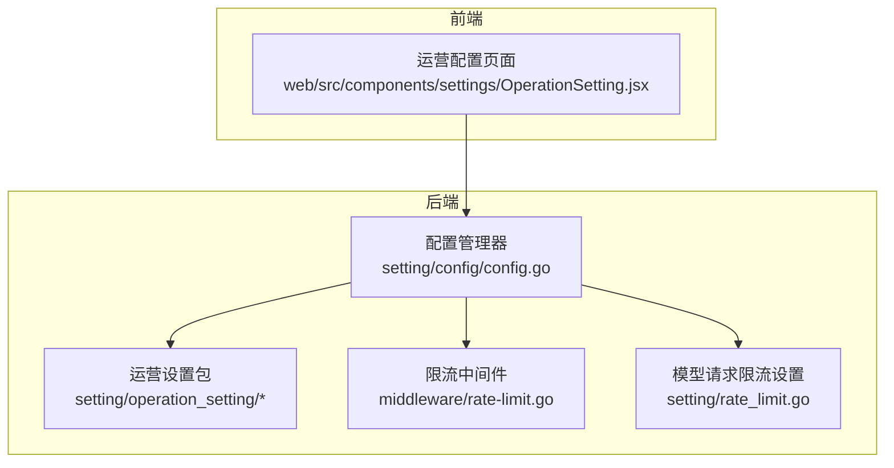
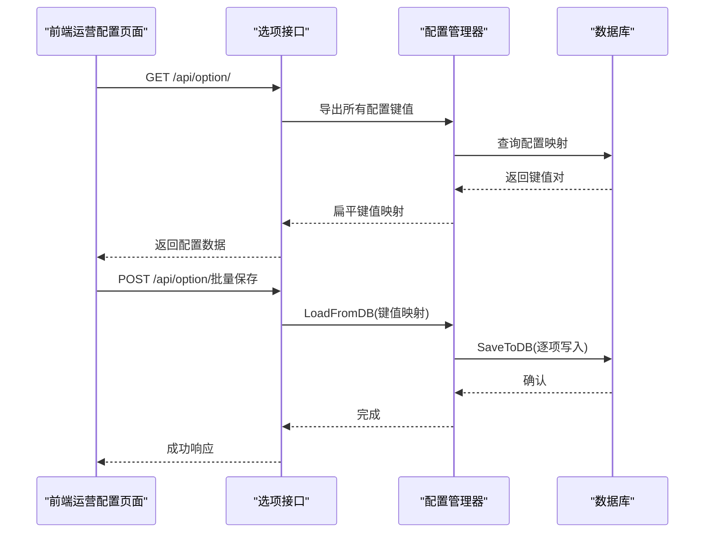
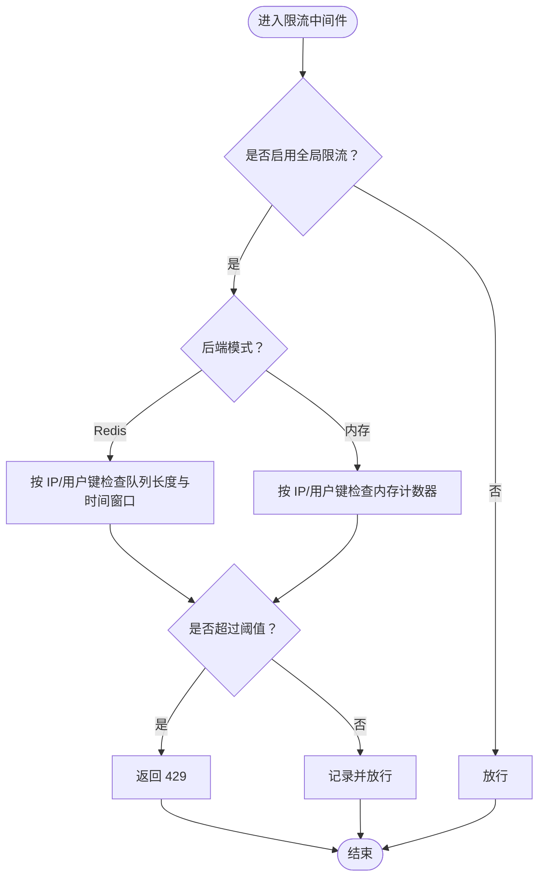
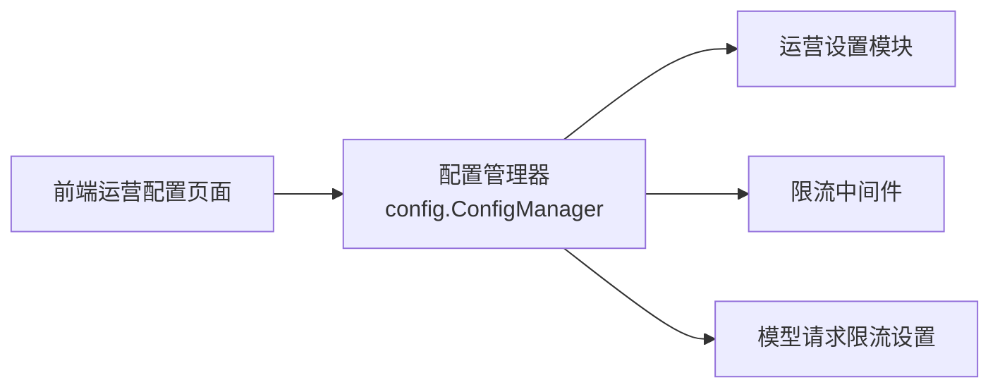

# 运营配置

<cite>
**本文引用的文件**
- [operation_setting.go](file://setting/operation_setting/operation_setting.go)
- [general_setting.go](file://setting/operation_setting/general_setting.go)
- [checkin_setting.go](file://setting/operation_setting/checkin_setting.go)
- [quota_setting.go](file://setting/operation_setting/quota_setting.go)
- [token_setting.go](file://setting/operation_setting/token_setting.go)
- [channel_affinity_setting.go](file://setting/operation_setting/channel_affinity_setting.go)
- [monitor_setting.go](file://setting/operation_setting/monitor_setting.go)
- [payment_setting.go](file://setting/operation_setting/payment_setting.go)
- [tools.go](file://setting/operation_setting/tools.go)
- [config.go](file://setting/config/config.go)
- [rate_limit.go](file://middleware/rate-limit.go)
- [rate_limit_setting.go](file://setting/rate_limit.go)
- [OperationSetting.jsx](file://web/src/components/settings/OperationSetting.jsx)
</cite>

## 目录
1. [简介](#简介)
2. [项目结构](#项目结构)
3. [核心组件](#核心组件)
4. [架构总览](#架构总览)
5. [详细组件分析](#详细组件分析)
6. [依赖分析](#依赖分析)
7. [性能考虑](#性能考虑)
8. [故障排查指南](#故障排查指南)
9. [结论](#结论)
10. [附录](#附录)

## 简介
本文件面向 New API 的“运营配置系统”，系统性阐述运营设置的分类管理与实现机制，覆盖通用设置、签到设置、配额设置、限流设置、通道亲和性规则、监控与自动处置、支付配置等。文档重点解释配置的注册、持久化、读取、生效与动态调整流程，并给出参数说明、配置模板、优先级与冲突处理建议、以及扩展与自定义规则的开发方法。

## 项目结构
运营配置主要由后端 Go 包中的“运营设置包”与“配置管理器”组成，并通过中间件与服务层落地到运行时行为；前端通过统一的运营配置页面进行可视化编辑与持久化。

图表来源
- [config.go:13-90](file://setting/config/config.go#L13-L90)
- [OperationSetting.jsx:32-84](file://web/src/components/settings/OperationSetting.jsx#L32-L84)
- [rate_limit.go:90-117](file://middleware/rate-limit.go#L90-L117)
- [rate_limit_setting.go:12-17](file://setting/rate_limit.go#L12-L17)

章节来源
- [config.go:13-90](file://setting/config/config.go#L13-L90)
- [OperationSetting.jsx:32-84](file://web/src/components/settings/OperationSetting.jsx#L32-L84)

## 核心组件
- 配置管理器：统一注册、导出、导入、持久化配置模块，支持并发安全读写。
- 运营设置包：包含通用设置、签到设置、配额设置、令牌设置、通道亲和性、监控设置、支付设置等子模块。
- 限流中间件：基于内存或 Redis 实现的全局/用户/特定场景限流策略。
- 模型请求限流设置：按组维度的请求总量/成功量阈值配置与校验。
- 前端运营配置页面：提供统一入口，拉取/保存配置键值对，驱动后端配置生效。

章节来源
- [config.go:13-90](file://setting/config/config.go#L13-L90)
- [rate_limit.go:90-117](file://middleware/rate-limit.go#L90-L117)
- [rate_limit_setting.go:12-17](file://setting/rate_limit.go#L12-L17)
- [OperationSetting.jsx:32-84](file://web/src/components/settings/OperationSetting.jsx#L32-L84)

## 架构总览
运营配置的生命周期：前端页面读取后端选项接口，后端通过配置管理器导出键值对；用户修改后提交保存，后端将键值对写回数据库；系统启动或定时任务触发时，配置管理器从数据库加载到内存；运行时中间件与服务层根据当前内存配置执行相应策略。

图表来源
- [config.go:41-90](file://setting/config/config.go#L41-L90)
- [OperationSetting.jsx:88-105](file://web/src/components/settings/OperationSetting.jsx#L88-L105)

## 详细组件分析

### 通用设置（GeneralSetting）
- 作用：站点通用运营参数，如文档链接、心跳间隔、额度展示类型（美元/人民币/TOKENS/CUSTOM）、自定义货币符号与汇率。
- 关键点：
  - 额度展示类型切换影响前端显示与换算逻辑。
  - 自定义货币需同时提供符号与汇率。
  - 提供便捷查询函数：是否货币展示、是否人民币展示、获取符号、获取汇率换算系数。
- 生效机制：通过配置管理器注册，前端页面直接读取并渲染；保存后落库并在下次导出时生效。

章节来源
- [general_setting.go:13-92](file://setting/operation_setting/general_setting.go#L13-L92)
- [config.go:35-38](file://setting/config/config.go#L35-L38)

### 签到设置（CheckinSetting）
- 作用：控制签到功能开关与奖励额度区间。
- 关键点：
  - 开关控制是否允许签到。
  - 奖励区间用于随机发放额度。
- 生效机制：注册到配置管理器；前端页面读取 enabled/min/max 并可修改保存。

章节来源
- [checkin_setting.go:6-38](file://setting/operation_setting/checkin_setting.go#L6-L38)
- [config.go:19-22](file://setting/config/config.go#L19-L22)

### 配额设置（QuotaSetting）
- 作用：免费模型是否启用“预扣费”策略。
- 关键点：
  - 预扣费可降低实际计费前的资源占用风险。
- 生效机制：注册到配置管理器；前端页面读取并可修改保存。

章节来源
- [quota_setting.go:5-22](file://setting/operation_setting/quota_setting.go#L5-L22)
- [config.go:14-17](file://setting/config/config.go#L14-L17)

### 令牌设置（TokenSetting）
- 作用：限制每个用户的令牌数量上限，防止滥用。
- 关键点：
  - 通过 MaxUserTokens 控制上限。
- 生效机制：注册到配置管理器；前端页面读取并可修改保存。

章节来源
- [token_setting.go:6-29](file://setting/operation_setting/token_setting.go#L6-L29)
- [config.go:15-18](file://setting/config/config.go#L15-L18)

### 通道亲和性设置（ChannelAffinitySetting）
- 作用：基于请求特征（模型正则、路径正则、UA 包含、键来源等）建立通道亲和性规则，支持参数覆盖模板（如透传头部）与 TTL。
- 关键点：
  - 规则包含名称、匹配条件、键来源、正则、TTL、参数覆盖模板、重试策略、包含信息标记等。
  - 内置默认规则示例（如 Codex CLI、Claude CLI），便于追踪与调试。
- 生效机制：注册到配置管理器；运行时根据规则匹配请求并应用参数覆盖模板。

章节来源
- [channel_affinity_setting.go:11-122](file://setting/operation_setting/channel_affinity_setting.go#L11-L122)
- [config.go:115-117](file://setting/config/config.go#L115-L117)

### 监控设置（MonitorSetting）
- 作用：自动测试通道的开关与周期；可通过环境变量覆盖默认周期。
- 关键点：
  - AutoTestChannelEnabled 控制开关。
  - AutoTestChannelMinutes 控制周期（分钟）。
  - 支持通过 CHANNEL_TEST_FREQUENCY 环境变量动态启用与赋值。
- 生效机制：注册到配置管理器；GetMonitorSetting 在读取时检查环境变量并覆盖默认值。

章节来源
- [monitor_setting.go:10-36](file://setting/operation_setting/monitor_setting.go#L10-L36)
- [config.go:21-24](file://setting/config/config.go#L21-L24)

### 支付设置（PaymentSetting）
- 作用：充值金额选项与折扣映射。
- 关键点：
  - AmountOptions：可选充值金额列表。
  - AmountDiscount：金额到折扣的映射（如 100 对应 0.9 表示 9 折）。
- 生效机制：注册到配置管理器；前端页面读取并可修改保存。

章节来源
- [payment_setting.go:5-24](file://setting/operation_setting/payment_setting.go#L5-L24)
- [config.go:16-19](file://setting/config/config.go#L16-L19)

### 运营规则工具（运营定价与图片价格等）
- 作用：提供运营侧定价常量与查询函数，如网页搜索、文件搜索、Gemini 音频输入、GPT 图像生成等价格查询。
- 关键点：
  - 按模型类型与规格返回单价，用于前端展示或计费参考。
- 生效机制：常量与函数直接被调用，无需注册到配置管理器。

章节来源
- [tools.go:5-111](file://setting/operation_setting/tools.go#L5-L111)

### 限流与速率限制
- 全局/关键/下载/上传限流中间件：支持内存或 Redis 后端，按客户端 IP 或用户 ID 限流。
- 搜索限流：按用户维度限流，可配置开关、次数与周期。
- 模型请求限流设置：按组维度配置请求总量与成功量阈值，提供 JSON 字符串互转与校验。

图表来源
- [rate_limit.go:21-88](file://middleware/rate-limit.go#L21-L88)
- [rate_limit_setting.go:12-17](file://setting/rate_limit.go#L12-L17)

章节来源
- [rate_limit.go:90-117](file://middleware/rate-limit.go#L90-L117)
- [rate_limit_setting.go:19-36](file://setting/rate_limit.go#L19-L36)

### 前端运营配置页面
- 作用：统一的运营配置入口，聚合额度、通用、敏感词、日志、监控、签到、令牌等设置项。
- 关键点：
  - 通过 /api/option/ 拉取与保存配置键值对。
  - 输入项命名遵循“模块名.配置项”的扁平键规范，与后端配置管理器导出格式一致。
- 生效机制：读取时合并后端返回的键值；保存时将表单键值对批量写回后端。

章节来源
- [OperationSetting.jsx:32-84](file://web/src/components/settings/OperationSetting.jsx#L32-L84)
- [OperationSetting.jsx:88-120](file://web/src/components/settings/OperationSetting.jsx#L88-L120)

## 依赖分析
- 配置管理器依赖反射与 JSON 序列化，确保任意结构体可导出/导入为键值对。
- 运营设置包通过 init() 注册自身到全局配置管理器，形成松耦合。
- 中间件与服务层在运行时读取配置，实现“配置即策略”。

图表来源
- [config.go:13-32](file://setting/config/config.go#L13-L32)
- [OperationSetting.jsx:88-105](file://web/src/components/settings/OperationSetting.jsx#L88-L105)

章节来源
- [config.go:13-32](file://setting/config/config.go#L13-L32)

## 性能考虑
- 配置读取：配置管理器采用读写锁保护，导出/导入为 O(N)（N 为结构体字段数），复杂度可控。
- 限流：内存模式下为 O(1) 操作；Redis 模式涉及网络往返，建议合理设置过期时间与窗口大小。
- 并发：配置管理器与模型请求限流均提供读写锁保护，避免竞态。

## 故障排查指南
- 配置未生效
  - 检查前端是否正确提交了“模块名.配置项”键。
  - 确认后端配置管理器已从数据库加载并导出。
  - 查看系统日志是否存在配置更新错误。
- 限流异常
  - 若使用 Redis 模式，确认 Redis 连接正常且键空间未被清理。
  - 检查限流键过期时间与窗口设置是否合理。
- 监控设置未按预期工作
  - 确认环境变量 CHANNEL_TEST_FREQUENCY 是否正确设置为正整数。
  - 检查监控设置的开关与周期是否被覆盖。

章节来源
- [config.go:41-68](file://setting/config/config.go#L41-L68)
- [monitor_setting.go:27-33](file://setting/operation_setting/monitor_setting.go#L27-L33)
- [rate_limit.go:21-65](file://middleware/rate-limit.go#L21-L65)

## 结论
运营配置系统以“配置管理器”为核心，将各类运营设置模块化注册与持久化，配合前端统一入口实现可视化配置与动态生效。限流中间件与模型请求限流设置进一步将运营策略落实到运行时行为。通过明确的键命名规范与严格的配置校验，系统具备良好的可维护性与扩展性。

## 附录

### 配置分类与参数说明
- 通用设置（general_setting.*）
  - docs_link：文档链接
  - ping_interval_enabled：是否启用心跳间隔
  - ping_interval_seconds：心跳间隔秒数
  - quota_display_type：额度展示类型（USD/CNY/TOKENS/CUSTOM）
  - custom_currency_symbol：自定义货币符号（CUSTOM 时生效）
  - custom_currency_exchange_rate：自定义货币兑美元汇率（CUSTOM 时生效）

- 签到设置（checkin_setting.*）
  - enabled：是否启用签到
  - min_quota：最小奖励额度
  - max_quota：最大奖励额度

- 配额设置（quota_setting.*）
  - enable_free_model_pre_consume：是否对免费模型启用预扣费

- 令牌设置（token_setting.*）
  - max_user_tokens：每用户最大令牌数量

- 监控设置（monitor_setting.*）
  - auto_test_channel_enabled：是否启用自动测试通道
  - auto_test_channel_minutes：自动测试周期（分钟）

- 支付设置（payment_setting.*）
  - amount_options：充值金额选项列表
  - amount_discount：金额到折扣映射

- 通道亲和性设置（channel_affinity_setting.*）
  - enabled：是否启用通道亲和性
  - switch_on_success：成功时是否切换
  - max_entries：最大条目数
  - default_ttl_seconds：默认 TTL（秒）
  - rules：规则数组（含名称、模型/路径正则、UA 包含、键来源、正则、TTL、参数覆盖模板、跳过重试、包含信息标记等）

- 限流设置（middleware/rate-limit.go 与 setting/rate_limit.go）
  - 全局/关键/下载/上传限流：按 IP 或用户限流
  - 搜索限流：按用户限流
  - 模型请求限流：按组维度的请求总量/成功量阈值

章节来源
- [general_setting.go:13-23](file://setting/operation_setting/general_setting.go#L13-L23)
- [checkin_setting.go:6-10](file://setting/operation_setting/checkin_setting.go#L6-L10)
- [quota_setting.go:5-7](file://setting/operation_setting/quota_setting.go#L5-L7)
- [token_setting.go:6-8](file://setting/operation_setting/token_setting.go#L6-L8)
- [monitor_setting.go:10-13](file://setting/operation_setting/monitor_setting.go#L10-L13)
- [payment_setting.go:5-8](file://setting/operation_setting/payment_setting.go#L5-L8)
- [channel_affinity_setting.go:30-36](file://setting/operation_setting/channel_affinity_setting.go#L30-L36)
- [rate_limit.go:90-117](file://middleware/rate-limit.go#L90-L117)
- [rate_limit_setting.go:12-17](file://setting/rate_limit.go#L12-L17)

### 配置优先级与冲突处理
- 键命名规范：模块名.配置项，保证唯一性与可读性。
- 环境变量覆盖：监控设置支持通过环境变量覆盖默认周期。
- 类型兼容：配置管理器在解析时对整型/浮点字符串做兼容处理，避免因存储格式差异导致的解析失败。
- 校验与约束：模型请求限流设置提供 JSON 校验，禁止负值与超界值。

章节来源
- [monitor_setting.go:27-33](file://setting/operation_setting/monitor_setting.go#L27-L33)
- [config.go:212-233](file://setting/config/config.go#L212-L233)
- [rate_limit_setting.go:53-69](file://setting/rate_limit.go#L53-L69)

### 配置验证机制
- 配置导出/导入：通过反射与 JSON 序列化，自动处理复杂类型与指针类型。
- 模型请求限流：提供 JSON 字符串校验函数，确保数值范围合法。

章节来源
- [config.go:93-162](file://setting/config/config.go#L93-L162)
- [config.go:164-265](file://setting/config/config.go#L164-L265)
- [rate_limit_setting.go:53-69](file://setting/rate_limit.go#L53-L69)

### 配置模板与示例
- 通用设置模板
  - 文档链接：https://docs.newapi.pro
  - 心跳间隔：禁用或设置秒数
  - 额度展示类型：USD/CNY/TOKENS/CUSTOM
  - 自定义货币：设置符号与汇率

- 签到设置模板
  - enabled：false
  - min_quota：1000
  - max_quota：10000

- 配额设置模板
  - enable_free_model_pre_consume：true

- 令牌设置模板
  - max_user_tokens：1000

- 监控设置模板
  - auto_test_channel_enabled：false
  - auto_test_channel_minutes：10

- 支付设置模板
  - amount_options：[10, 20, 50, 100, 200, 500]
  - amount_discount：空映射

- 通道亲和性设置模板
  - enabled：true
  - switch_on_success：true
  - max_entries：100000
  - default_ttl_seconds：3600
  - rules：包含名称、模型/路径正则、UA 包含、键来源、正则、TTL、参数覆盖模板、跳过重试、包含信息标记等

章节来源
- [general_setting.go:26-33](file://setting/operation_setting/general_setting.go#L26-L33)
- [checkin_setting.go:13-17](file://setting/operation_setting/checkin_setting.go#L13-L17)
- [quota_setting.go:10-12](file://setting/operation_setting/quota_setting.go#L10-L12)
- [token_setting.go:11-13](file://setting/operation_setting/token_setting.go#L11-L13)
- [monitor_setting.go:16-19](file://setting/operation_setting/monitor_setting.go#L16-L19)
- [payment_setting.go:11-14](file://setting/operation_setting/payment_setting.go#L11-L14)
- [channel_affinity_setting.go:76-113](file://setting/operation_setting/channel_affinity_setting.go#L76-L113)

### 扩展指南与自定义规则开发
- 新增运营设置模块
  - 定义结构体与默认值，使用 init() 注册到配置管理器。
  - 在前端页面新增对应设置卡片，键命名遵循“模块名.配置项”。
  - 通过 /api/option/ 接口完成读取与保存。
- 自定义通道亲和性规则
  - 在 rules 数组中追加新规则，设置匹配条件与参数覆盖模板。
  - 如需透传头部，可复用内置模板构建函数。
- 自定义限流策略
  - 在中间件层新增工厂函数，选择 IP 或用户维度限流。
  - 在设置层新增阈值与周期配置，并提供校验函数。
- 验证与回归
  - 使用配置管理器导出/导入流程验证键值一致性。
  - 对新增规则进行边界测试（如空正则、超大 TTL、非法模板）。

章节来源
- [channel_affinity_setting.go:62-74](file://setting/operation_setting/channel_affinity_setting.go#L62-L74)
- [rate_limit.go:76-88](file://middleware/rate-limit.go#L76-L88)
- [config.go:27-32](file://setting/config/config.go#L27-L32)