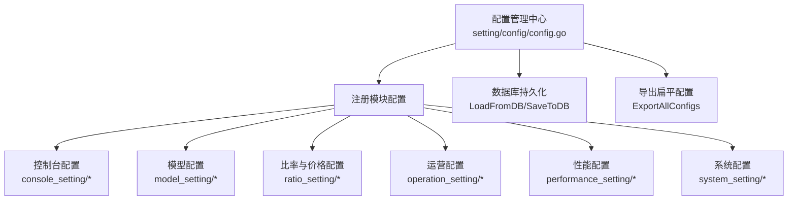
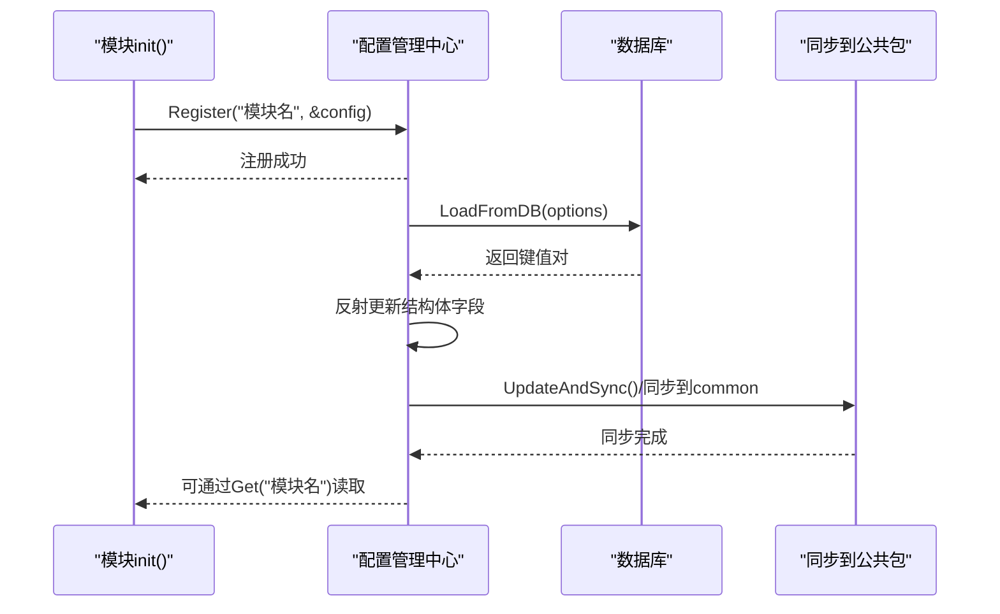
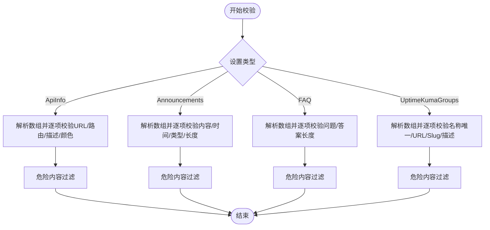
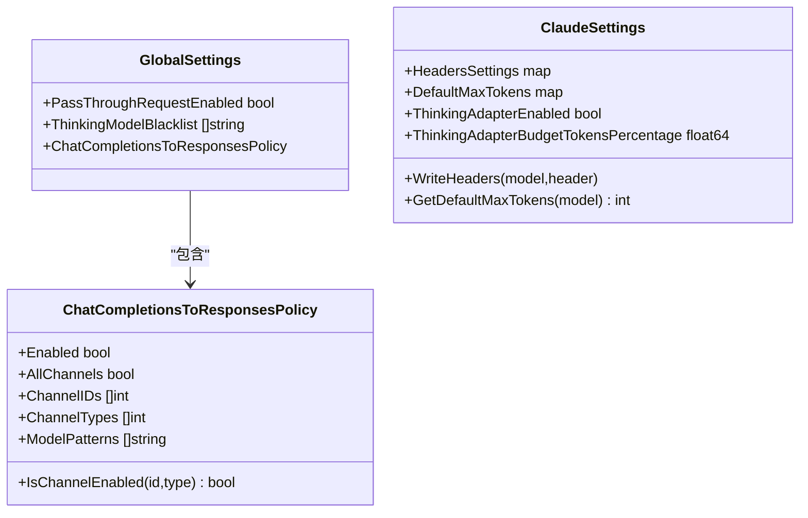
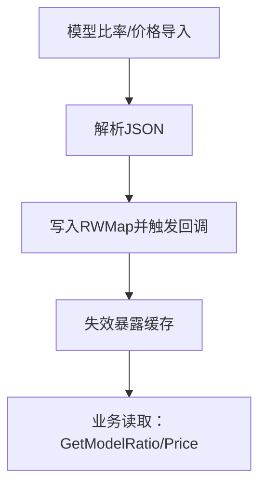
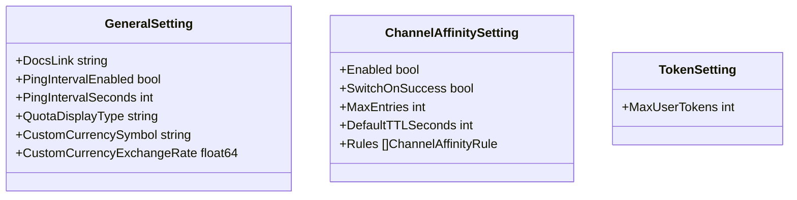
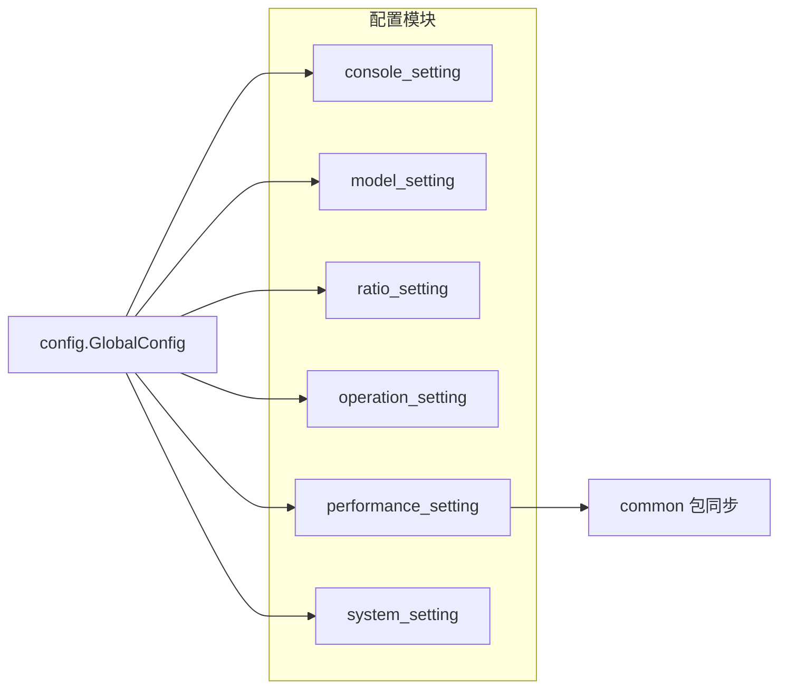

# 配置管理

<cite>
**本文引用的文件**
- [setting/config/config.go](file://setting/config/config.go)
- [common/env.go](file://common/env.go)
- [constant/env.go](file://constant/env.go)
- [setting/console_setting/config.go](file://setting/console_setting/config.go)
- [setting/console_setting/validation.go](file://setting/console_setting/validation.go)
- [setting/model_setting/global.go](file://setting/model_setting/global.go)
- [setting/model_setting/claude.go](file://setting/model_setting/claude.go)
- [setting/ratio_setting/model_ratio.go](file://setting/ratio_setting/model_ratio.go)
- [setting/ratio_setting/group_ratio.go](file://setting/ratio_setting/group_ratio.go)
- [setting/ratio_setting/expose_ratio.go](file://setting/ratio_setting/expose_ratio.go)
- [setting/operation_setting/general_setting.go](file://setting/operation_setting/general_setting.go)
- [setting/operation_setting/channel_affinity_setting.go](file://setting/operation_setting/channel_affinity_setting.go)
- [setting/operation_setting/token_setting.go](file://setting/operation_setting/token_setting.go)
- [setting/performance_setting/config.go](file://setting/performance_setting/config.go)
- [setting/system_setting/fetch_setting.go](file://setting/system_setting/fetch_setting.go)
</cite>

## 目录
1. [简介](#简介)
2. [项目结构](#项目结构)
3. [核心组件](#核心组件)
4. [架构总览](#架构总览)
5. [详细组件分析](#详细组件分析)
6. [依赖分析](#依赖分析)
7. [性能考量](#性能考量)
8. [故障排查指南](#故障排查指南)
9. [结论](#结论)
10. [附录](#附录)

## 简介
本文件面向 New API 的配置管理系统，系统性阐述配置结构、环境变量管理、动态配置机制与热更新流程；深入解析模型配置、价格与倍率配置、行为设置与安全策略；覆盖配置文件格式、校验与默认值处理；提供配置扩展指南、自定义配置项开发方法与最佳实践，并解释配置优先级、合并策略与安全性考虑。

## 项目结构
配置管理由“统一配置中心 + 多模块配置 + 动态持久化”三层组成：
- 统一配置中心：集中注册、读取、导出与持久化配置
- 模块配置：按功能域划分（控制台、模型、比率、运营、性能、系统等）
- 动态持久化：从数据库加载/保存，支持热更新



**图表来源**
- [setting/config/config.go:13-298](file://setting/config/config.go#L13-L298)

**章节来源**
- [setting/config/config.go:13-298](file://setting/config/config.go#L13-L298)

## 核心组件
- 配置管理中心（ConfigManager）
  - 提供注册、获取、从数据库加载、保存到数据库、导出全部配置等能力
  - 通过反射实现结构体与键值映射的序列化/反序列化
- 环境变量工具（common/env.go）
  - 提供整数、字符串、布尔型的环境变量读取与默认值处理
- 常量环境变量（constant/env.go）
  - 定义运行期常量环境变量（如流式超时、媒体令牌开关、任务限制等）

**章节来源**
- [setting/config/config.go:13-298](file://setting/config/config.go#L13-L298)
- [common/env.go:1-39](file://common/env.go#L1-L39)
- [constant/env.go:1-27](file://constant/env.go#L1-L27)

## 架构总览
配置生命周期：初始化注册 → 运行期读取 → 数据库持久化 → 热更新同步 → 导出/暴露



**图表来源**
- [setting/config/config.go:27-90](file://setting/config/config.go#L27-L90)
- [setting/performance_setting/config.go:42-75](file://setting/performance_setting/config.go#L42-L75)

## 详细组件分析

### 统一配置管理中心（ConfigManager）
- 职责
  - 注册配置模块（键为模块名，值为结构体指针）
  - 从数据库批量加载键值对并反序列化到对应模块
  - 将结构体序列化为键值对保存到数据库
  - 导出为扁平键值映射（模块名.配置项）
- 关键点
  - 使用互斥锁保证并发安全
  - 通过 JSON 标签或字段名映射键名
  - 支持复杂类型（结构体、切片、映射）的 JSON 序列化/反序列化
  - 指针类型支持 nil 序列化为 "null" 并可反序列化回零值

```mermaid
classDiagram
class ConfigManager {
+Register(name, config)
+Get(name) interface{}
+LoadFromDB(options map[string]string) error
+SaveToDB(updateFunc) error
+ExportAllConfigs() map[string]string
-configs map[string]interface{}
-mutex
}
class ConsoleSetting
class GlobalSettings
class PerformanceSetting
class GeneralSetting
class FetchSetting
ConfigManager --> ConsoleSetting : "注册/读取"
ConfigManager --> GlobalSettings : "注册/读取"
ConfigManager --> PerformanceSetting : "注册/读取"
ConfigManager --> GeneralSetting : "注册/读取"
ConfigManager --> FetchSetting : "注册/读取"
```

**图表来源**
- [setting/config/config.go:13-298](file://setting/config/config.go#L13-L298)
- [setting/console_setting/config.go:5-39](file://setting/console_setting/config.go#L5-L39)
- [setting/model_setting/global.go:35-64](file://setting/model_setting/global.go#L35-L64)
- [setting/performance_setting/config.go:9-69](file://setting/performance_setting/config.go#L9-L69)
- [setting/operation_setting/general_setting.go:13-42](file://setting/operation_setting/general_setting.go#L13-L42)
- [setting/system_setting/fetch_setting.go:5-34](file://setting/system_setting/fetch_setting.go#L5-L34)

**章节来源**
- [setting/config/config.go:13-298](file://setting/config/config.go#L13-L298)

### 环境变量与常量环境
- 环境变量工具
  - 提供整数、字符串、布尔型的默认值读取与错误日志记录
- 常量环境变量
  - 定义运行期常量（如流式超时、媒体令牌、任务限制、可信重定向域等）

**章节来源**
- [common/env.go:1-39](file://common/env.go#L1-L39)
- [constant/env.go:1-27](file://constant/env.go#L1-L27)

### 控制台配置（ConsoleSetting）
- 结构与默认值
  - 包含 API 信息、Uptime Kuma 分组、公告、FAQ 等面板开关与数据
  - 默认全部启用，面板数据为空
- 校验规则
  - JSON 数组格式校验
  - URL 格式与解析校验
  - 危险内容过滤（脚本、事件等）
  - 字段长度限制与颜色合法性检查
  - 公告发布时间格式与类型枚举校验
  - Uptime Kuma 分组名称唯一性、URL 合法性、Slug 格式与危险内容过滤



**图表来源**
- [setting/console_setting/validation.go:62-300](file://setting/console_setting/validation.go#L62-L300)

**章节来源**
- [setting/console_setting/config.go:5-39](file://setting/console_setting/config.go#L5-L39)
- [setting/console_setting/validation.go:62-300](file://setting/console_setting/validation.go#L62-L300)

### 模型配置（GlobalSettings、ClaudeSettings）
- GlobalSettings
  - 请求透传开关、思维模型黑名单、聊天转响应策略（按通道/类型/模型模式）
  - 黑名单用于决定是否保留特定后缀（如 thinking/nothinking 等）
- ClaudeSettings
  - 模型级请求头写入、默认最大上下文长度、思维适配器开关与预算占比



**图表来源**
- [setting/model_setting/global.go:10-79](file://setting/model_setting/global.go#L10-L79)
- [setting/model_setting/claude.go:17-89](file://setting/model_setting/claude.go#L17-L89)

**章节来源**
- [setting/model_setting/global.go:10-79](file://setting/model_setting/global.go#L10-L79)
- [setting/model_setting/claude.go:17-89](file://setting/model_setting/claude.go#L17-L89)

### 比率与价格配置（ModelRatio、GroupRatio、Exposure）
- 模型比率与价格
  - 默认映射表覆盖主流模型（含 gpt-4o、o1/o3/o4、claude、gemini、ERNIE、360GPT 等）
  - 支持 JSON 字符串导入/导出，热更新后失效暴露缓存
  - 提供“压缩模型通配符”与“思考预算模型”处理逻辑
- 用户组比率
  - 支持按用户组与使用组的双层比率映射
  - 提供 JSON 校验（非负数）
- 暴露开关
  - 提供“是否暴露比率”的原子开关，配合导出接口使用



**图表来源**
- [setting/ratio_setting/model_ratio.go:337-420](file://setting/ratio_setting/model_ratio.go#L337-L420)
- [setting/ratio_setting/group_ratio.go:80-111](file://setting/ratio_setting/group_ratio.go#L80-L111)
- [setting/ratio_setting/expose_ratio.go:11-17](file://setting/ratio_setting/expose_ratio.go#L11-L17)

**章节来源**
- [setting/ratio_setting/model_ratio.go:26-346](file://setting/ratio_setting/model_ratio.go#L26-L346)
- [setting/ratio_setting/group_ratio.go:12-111](file://setting/ratio_setting/group_ratio.go#L12-L111)
- [setting/ratio_setting/expose_ratio.go:11-17](file://setting/ratio_setting/expose_ratio.go#L11-L17)

### 运营配置（GeneralSetting、ChannelAffinitySetting、TokenSetting）
- GeneralSetting
  - 文档链接、心跳间隔、额度展示类型（USD/CNY/TOKENS/CUSTOM）、自定义货币符号与汇率
- ChannelAffinitySetting
  - 通道亲和规则：按模型/路径正则、UA 包含、键来源（上下文/JSON 路径）、TTL、参数覆盖模板、重试策略、包含信息开关
- TokenSetting
  - 每用户最大令牌数量



**图表来源**
- [setting/operation_setting/general_setting.go:13-92](file://setting/operation_setting/general_setting.go#L13-L92)
- [setting/operation_setting/channel_affinity_setting.go:30-121](file://setting/operation_setting/channel_affinity_setting.go#L30-L121)
- [setting/operation_setting/token_setting.go:6-29](file://setting/operation_setting/token_setting.go#L6-L29)

**章节来源**
- [setting/operation_setting/general_setting.go:13-92](file://setting/operation_setting/general_setting.go#L13-L92)
- [setting/operation_setting/channel_affinity_setting.go:30-121](file://setting/operation_setting/channel_affinity_setting.go#L30-L121)
- [setting/operation_setting/token_setting.go:6-29](file://setting/operation_setting/token_setting.go#L6-L29)

### 性能配置（PerformanceSetting）
- 磁盘缓存：开关、阈值、最大容量、路径
- 性能监控：CPU/内存/磁盘阈值
- 同步机制：注册时同步到 common 包，热更新后通过 UpdateAndSync 同步

**章节来源**
- [setting/performance_setting/config.go:9-86](file://setting/performance_setting/config.go#L9-L86)

### 系统配置（FetchSetting）
- SSRF 防护、私网 IP 允许、域名/IP 过滤模式（白名单/黑名单）、允许端口列表、对域名启用 IP 过滤（实验性）

**章节来源**
- [setting/system_setting/fetch_setting.go:5-35](file://setting/system_setting/fetch_setting.go#L5-L35)

## 依赖分析
- 模块注册与耦合
  - 所有配置模块在 init 中向 GlobalConfig 注册，形成弱耦合、高内聚
  - ConfigManager 仅依赖反射与 JSON，不直接依赖具体模块
- 动态持久化
  - 通过键前缀“模块名.”区分配置域，避免冲突
  - 保存时将结构体序列化为键值对，加载时按前缀筛选并反序列化
- 同步与热更新
  - 性能配置在注册时同步到 common 包，热更新后需显式调用 UpdateAndSync



**图表来源**
- [setting/config/config.go:27-39](file://setting/config/config.go#L27-L39)
- [setting/performance_setting/config.go:42-64](file://setting/performance_setting/config.go#L42-L64)

**章节来源**
- [setting/config/config.go:27-39](file://setting/config/config.go#L27-L39)
- [setting/performance_setting/config.go:42-64](file://setting/performance_setting/config.go#L42-L64)

## 性能考量
- 反射与序列化
  - 反射遍历结构体字段带来一定开销，建议在高频路径避免频繁序列化
- 键值映射
  - 扁平键值映射便于数据库存储与检索，但需注意键名长度与前缀规范
- 缓存与暴露
  - 比率/价格热更新后应失效暴露缓存，避免脏读
- 并发安全
  - 读多写少场景下，读写锁提升并发性能；写入时整体加锁，避免竞态

[本节为通用指导，无需列出章节来源]

## 故障排查指南
- 配置加载失败
  - 检查键前缀是否与模块名一致
  - 校验 JSON 格式与字段类型是否匹配
- 环境变量解析异常
  - 确认环境变量值可被解析为目标类型；错误会回退到默认值并记录系统日志
- 控制台配置校验失败
  - 按校验规则修正 URL、长度、颜色、危险内容与数组格式
- 比率/价格导入失败
  - 确保 JSON 结构正确且数值合法；导入后检查暴露缓存是否失效
- 性能配置不同步
  - 确认热更新后调用 UpdateAndSync 同步到 common 包

**章节来源**
- [setting/config/config.go:42-68](file://setting/config/config.go#L42-L68)
- [common/env.go:9-38](file://common/env.go#L9-L38)
- [setting/console_setting/validation.go:62-300](file://setting/console_setting/validation.go#L62-L300)
- [setting/ratio_setting/model_ratio.go:356-358](file://setting/ratio_setting/model_ratio.go#L356-L358)
- [setting/performance_setting/config.go:73-75](file://setting/performance_setting/config.go#L73-L75)

## 结论
New API 的配置管理体系以统一配置中心为核心，结合模块化配置与动态持久化，实现了灵活、可扩展、可热更新的配置能力。通过严格的校验与默认值策略，保障了配置的安全性与稳定性；通过暴露开关与缓存失效机制，兼顾了性能与一致性。开发者可据此快速扩展新配置项并安全地集成到系统中。

[本节为总结，无需列出章节来源]

## 附录

### 配置文件格式与示例（说明性）
- 键命名规范
  - 使用“模块名.配置项”形式，模块名与配置项均来自结构体字段的 JSON 标签或字段名
- 类型映射
  - 字符串/布尔/整数/浮点数：直接序列化为字符串
  - 指针类型：nil 序列化为 "null"，非 nil 序列化为其值
  - 复杂类型（结构体/切片/映射）：使用 JSON 序列化
- 示例（概念性）
  - 模块键：console_setting.api_info_enabled
  - 值：true
  - 模块键：ratio_setting.model_ratio_setting
  - 值："{\"gpt-4o\":1.25,...}"

**章节来源**
- [setting/config/config.go:93-162](file://setting/config/config.go#L93-L162)
- [setting/config/config.go:165-265](file://setting/config/config.go#L165-L265)

### 配置验证与默认值处理
- 控制台配置
  - JSON 数组解析、URL 正则、危险内容过滤、长度与颜色校验、公告时间格式与类型枚举
- 比率/价格
  - JSON 校验、非负数约束、压缩模型通配符与思考预算模型处理
- 系统配置
  - SSRF 防护、域名/IP 过滤模式、允许端口列表

**章节来源**
- [setting/console_setting/validation.go:25-300](file://setting/console_setting/validation.go#L25-L300)
- [setting/ratio_setting/group_ratio.go:113-125](file://setting/ratio_setting/group_ratio.go#L113-L125)
- [setting/system_setting/fetch_setting.go:16-25](file://setting/system_setting/fetch_setting.go#L16-L25)

### 配置扩展指南
- 新增模块配置步骤
  - 定义结构体（含 JSON 标签），在 init 中调用 GlobalConfig.Register 注册
  - 如需与公共包同步，提供 UpdateAndSync 函数并在热更新后调用
  - 若涉及复杂类型，确保可 JSON 序列化
- 自定义配置项开发
  - 选择合适的数据结构（基础类型/映射/切片/结构体）
  - 在结构体标签中明确键名，必要时提供默认值
  - 如需校验，新增校验函数并在导入时调用
- 热更新机制
  - 通过 LoadFromDB/SaveToDB 实现数据库持久化
  - 导出时使用 ExportAllConfigs 获取扁平键值映射
  - 暴露缓存失效：在导入回调中调用失效函数

**章节来源**
- [setting/config/config.go:27-90](file://setting/config/config.go#L27-L90)
- [setting/performance_setting/config.go:73-75](file://setting/performance_setting/config.go#L73-L75)
- [setting/ratio_setting/model_ratio.go:356-358](file://setting/ratio_setting/model_ratio.go#L356-L358)

### 配置优先级、合并策略与安全性
- 优先级
  - 环境变量 > 数据库配置 > 默认值
- 合并策略
  - 映射类配置采用“全量替换”，导入时清空旧值再写入新值
  - 布尔/数值/字符串等基础类型直接覆盖
- 安全性
  - 控制台配置严格校验 URL、长度、颜色与危险内容
  - SSRF 防护与域名/IP 过滤模式降低网络风险
  - 指针类型序列化为 "null"，避免遗漏字段导致的不可预期行为

**章节来源**
- [common/env.go:9-38](file://common/env.go#L9-L38)
- [setting/console_setting/validation.go:33-51](file://setting/console_setting/validation.go#L33-L51)
- [setting/system_setting/fetch_setting.go:16-25](file://setting/system_setting/fetch_setting.go#L16-L25)